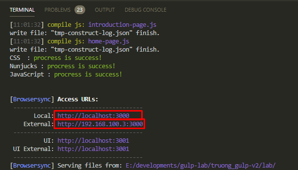

# G-Lax (Relax with Gulp)

### Introdution:
You know about Gulp ? The module bundler for patterns and technicals [[more information]](https://gulpjs.com/)
You're using Webpack / Rollup ... to create a Frontend static module bundler system, That's the best choice. But have you wondered what happend going when you make it with Gulp ? hmmm ... Why not ?..

So today, we'll relax with gulp to see how Gulp work as a bundler for (Nunjuck, Sass, Javascript, Vue). Let's go !!!

#### Step 1
You need pull the project GLax from [[gitlab]]()

#### Step 2
Go to <mark>glax</mark> folder run <mark>npm install</mark>

#### Step 3
Open your coding editor, at terminal panel, try typing <mark>npm run dev:temp</mark> wait a moment, and then you'll see finish message with lightgreen color
- Click to <mark>http://localhost:xxx</mark> to open product webpage in local
- Click to <mark>http://x.x.x.x:xxx</mark> to open product webpage in external local, and you can use this address id to open in your smartphone browser
<br>



<u>NOTE</u>
Beside the <mark>npm run dev:temp</mark> syntax, often use to build project in dev enviroment (with template Nunjuck), You can use another syntax to build project just in dev but without template (Only css and js) or production enviroment.

- <mark>npm run dev</mark> - build project in dev enviroment without template.
- <mark>npm run prod</mark> - build project in production enviroment.

And...Finish ! Just a few step, you can see the total view of how G-Lax project bundler work. But if you want to create project of yourself with <span style="display:inline-block">G-Lax</span>, then you can readmore about the structure static folders and files below.

### Nunjuck structure (you can refer to demo of home-page template) [[Nunjuck]](https://mozilla.github.io/nunjucks/)

src
|__ njk
<br/>&nbsp;&nbsp;&nbsp;&nbsp;&nbsp;&nbsp;|__ <mark>_layout.njk</mark> (A standard form to render HTML)
<br/>&nbsp;&nbsp;&nbsp;&nbsp;&nbsp;&nbsp;|__ <mark>_demo.nj</mark> (A Demo file will teach you how to create template with nunjuck at basic)
<br/>&nbsp;&nbsp;&nbsp;&nbsp;&nbsp;&nbsp;|__ <mark>template</mark> (A folder that include files used to create special layouts)
<br/>&nbsp;&nbsp;&nbsp;&nbsp;&nbsp;&nbsp;|__ <mark>partial</mark> (A folder that include files used to create special sections for each template)
<br/>&nbsp;&nbsp;&nbsp;&nbsp;&nbsp;&nbsp;|__ <mark>component</mark> (A folder that include files used to create global component for each template / section)

### Sass structure (you can refer to demo of home-page partial) [[Sass]](https://sass-lang.com/)

src
|__ scss
<br/>&nbsp;&nbsp;&nbsp;&nbsp;&nbsp;&nbsp;|__ <mark>vendor.scss</mark> (A file that include <mark>_base.scss</mark> and global style)
<br/>&nbsp;&nbsp;&nbsp;&nbsp;&nbsp;&nbsp;|__ <mark>_var.scss</mark> (A file that include general variables for style)
<br/>&nbsp;&nbsp;&nbsp;&nbsp;&nbsp;&nbsp;|__ <mark>_base.scss</mark> (A file that include all of basic style)
<br/>&nbsp;&nbsp;&nbsp;&nbsp;&nbsp;&nbsp;|__ <mark>var</mark> (A folder that include special variable files)
<br/>&nbsp;&nbsp;&nbsp;&nbsp;&nbsp;&nbsp;|__ <mark>partial</mark> (A folder that include special style files used to create global component for each template / section)
<br/>&nbsp;&nbsp;&nbsp;&nbsp;&nbsp;&nbsp;|__ <mark>mixin</mark> (A folder that include [mixin](https://sass-lang.com/documentation/at-rules/mixin) files of sass)
<br/>&nbsp;&nbsp;&nbsp;&nbsp;&nbsp;&nbsp;|__ <mark>function</mark> (A folder that include [function](https://sass-lang.com/documentation/at-rules/function) files of sass)
<br/>&nbsp;&nbsp;&nbsp;&nbsp;&nbsp;&nbsp;|__ <mark>lib</mark> (A folder that include lib files of the third party)
<br/>&nbsp;&nbsp;&nbsp;&nbsp;&nbsp;&nbsp;|__ <mark>layout</mark> (A folder that include files that setup basic style for layout)

### Javascript structure (you can refer to demo of home-page partial) [[Javascript]](https://developer.mozilla.org/en-US/docs/Web/JavaScript)

src
|__ js
<br/>&nbsp;&nbsp;&nbsp;&nbsp;&nbsp;&nbsp;|__ <mark>vendor.js</mark> (A file that include all of original init for running javascript of project)
<br/>&nbsp;&nbsp;&nbsp;&nbsp;&nbsp;&nbsp;|__ <mark>partial</mark> (A folder that include javascript and vue files for each special template)
<br/>&nbsp;&nbsp;&nbsp;&nbsp;&nbsp;&nbsp;|__ <mark>lib</mark> (A folder that include javascript files of third party)
<br/>&nbsp;&nbsp;&nbsp;&nbsp;&nbsp;&nbsp;|__ <mark>base</mark> (A folder that include javascript files, which used to define common information)

### DummyData structure

src
|__ dummy-data
<br/>&nbsp;&nbsp;&nbsp;&nbsp;&nbsp;&nbsp;|__ <mark>data-store</mark> (A folder that include all of dummy data files, which used to define dummy data quicky for render process)

---

<u>NOTE</u>
All of structure above are based a few Design System, Design Pattern that you can refer to
- [Nunjuck design layout pattern](https://css-tricks.com/component-led-design-patterns-nunjucks-grunt/?fbclid=IwAR2DQUKbQU73EKzF7fTigl0QPwwtUTaFLUGhW2VLy3IXmazEGZ--dQ-yJE8)
- [Design System for style structure](https://uifreebies.net/blog/12-design-systems-you-must-know)

```
WebBooking_Structure
├─ .editorconfig
├─ .eslintrc
├─ .git
│  ├─ COMMIT_EDITMSG
│  ├─ FETCH_HEAD
│  ├─ HEAD
│  ├─ ORIG_HEAD
│  ├─ config
│  ├─ description
│  ├─ hooks
│  │  ├─ applypatch-msg.sample
│  │  ├─ commit-msg.sample
│  │  ├─ fsmonitor-watchman.sample
│  │  ├─ post-update.sample
│  │  ├─ pre-applypatch.sample
│  │  ├─ pre-commit.sample
│  │  ├─ pre-merge-commit.sample
│  │  ├─ pre-push.sample
│  │  ├─ pre-rebase.sample
│  │  ├─ pre-receive.sample
│  │  ├─ prepare-commit-msg.sample
│  │  └─ update.sample
│  ├─ index
│  ├─ info
│  │  └─ exclude
│  ├─ objects
│  │  ├─ 00
│  │  │  ├─ 0d14a9c707aedc6bad71be019303858cfe8648
│  │  │  ├─ 0d7c0198dc452eb74113f816386fd71a4fe241
│  │  │  ├─ 0e1f8ba9659fae1dfe1d6ea99777a49dfcef15
│  │  │  ├─ 144f3dd7d178af1bb31dad223a2a764c65b655
│  │  │  ├─ 17ee5808fb8c6fd556d69a5e8b4d168d475be0
│  │  │  ├─ 1f41c6cea6744acc072c0d63cec20105dcbc1f
│  │  │  ├─ 21903dff6b97767370def244cc11bba992dd01
│  │  │  ├─ 2b0355d323ee3fa84d24d99dc6e83bef64d5f3
│  │  │  ├─ 3b56941fcb4c8b8f422b12e553bba900a16c3c
│  │  │  ├─ 3c6b9893663984c0d43d52c62542f0a5faeac7
│  │  │  ├─ 43a1e8fbf93959f6bafb1ca9f3ec9e86096a4b
│  │  │  ├─ 5562109c0d1c1e3b7b808cc4430f150e365e04
│  │  │  ├─ 637704d43054961830257d26d80fbe78d26320
│  │  │  ├─ 6738eb06f393c9fcf2aec083d98aa6543cc567
│  │  │  ├─ 71d5f246ca14f8b8dadfb30ab524b803837bba
│  │  │  ├─ 7ed17ef997acb3834d1313a3baac45fd820785
│  │  │  ├─ 7edf3fc5752294e5d5663622333093590af9c8
│  │  │  ├─ 88f14c79aac28be4a5335da89b9136734b2adb
│  │  │  ├─ 8b2bebb0f6426766d28cddf04b9ba23fc7e9e8
│  │  │  ├─ 8c326e4dae888e061ae0a31eadeaabfff376bd
│  │  │  ├─ 96ea1766a4712115fbf7e40fc24ae75426d52c
│  │  │  ├─ ad08d26da152fdeb99c9cd029b2c8005706bae
│  │  │  ├─ ad13775deedfe1bca112bfbe615d28edd1fdb0
│  │  │  ├─ b2f70dd7436e0281f792fa296a4f5ef57ee7bc
│  │  │  ├─ b5a5377fc0c69253d12430ff0ba52bde6e2d86
│  │  │  ├─ bbfa827d283ea5dfb74a814462df487130e2f6
│  │  │  └─ f3c46f438bdd48fb7cfbd02c699b87ad473fbe
│  │  ├─ 01
│  │  │  ├─ 0b915f9f48e54606b93586cbe23dc8a35991b2
│  │  │  ├─ 0f6bd1dfe41edee7d90613d1663f1dd21f2266
│  │  │  ├─ 2a0a4d0754bebc57a1c8f69cca0aff1adefe32
│  │  │  ├─ 379eb83e3117608410250328e7a615a366cd77
│  │  │  ├─ 40c7804f90025b2971afcd12a902dab58b8f21
│  │  │  ├─ 52cba5cfde0725a49541309c68b00202375d29
│  │  │  ├─ 699b54baf2c6c2f079a319441a84febe96d38e
│  │  │  ├─ 7375514f1aa9926529e52c7cc3db8c2e8d5665
│  │  │  ├─ 7773d042b21720407ca224ac475290acc57e1b
│  │  │  ├─ 7cdc626ec0478e038be472a66a439b495c8b36
│  │  │  ├─ 807055a8f26fc96d59f013ebab2d1732bec93c
│  │  │  ├─ 8c40ff3eb12c7c972b9762a8316f04db2aa4b0
│  │  │  ├─ 8e0996c562a9cd6c4619fe886fb65eadd4181d
│  │  │  ├─ 8f9885ef111262f8aed46650b74e333fbcabb2
│  │  │  ├─ 900670aad996b2bcfc142a2231be26a1722042
│  │  │  ├─ 99e0a2ef3165d176ddd9b1bf16d84af4e84f9e
│  │  │  ├─ 9ff36665d9e4ebce12de3a01011ca723604a9d
│  │  │  ├─ a705d0580fcc5c8383ba2e4008a4ee7d874d4f
│  │  │  ├─ ac3c980631020719d110fd475b3544e72fd9fd
│  │  │  ├─ b1c7bd2bce6ee3b30f62c361b8bd202ae629ff
│  │  │  ├─ b5dfe7cd3c1e6478b01ba90d51831778ceda15
│  │  │  ├─ bfd698ee78e59020b7dee7190d9e6360b5ab0b
│  │  │  ├─ dbb534ce1578c53a293ad8748555b66fa17d62
│  │  │  ├─ e331166537dcb9358f88414e65b9ea883aa711
│  │  │  ├─ ed33f97dc64d3bfd02b6254264207bd3a5a442
│  │  │  └─ f63233cc31c6cf028ab0a09c7d65f4590a1fe1
│  │  ├─ 02
│  │  │  ├─ 0fb63568abf175cfb3a5ab746c675db52c0861
│  │  │  ├─ 108ace12719fb8b4dc7a3d7b517f452a26d4fe
│  │  │  ├─ 1c135ec2012d60aea2f9c2131cfd5e3b7c7a8a
│  │  │  ├─ 1ec0e55cd55ad61fc74d00de5197648b0670dc
│  │  │  ├─ 2a532abd36e22a4111e6d41b9741d3b842bf22
│  │  │  ├─ 2de1fc388c2df7306a36c87ff5bc191b89da0d
│  │  │  ├─ 2fda72daf136aae07f68cb8c19c6e54c368db0
│  │  │  ├─ 3360489acc502c537dfe32f7d551b418e1e670
│  │  │  ├─ 3de07cdbcf5f9323e9a36d811cd245e35a324f
│  │  │  ├─ 414de8a310002d15bc7a367248ab3d2d6b8e07
│  │  │  ├─ 57fde1ad32dbf26caa37ba05abc77e2eefc5ca
│  │  │  ├─ 5aeb2f7046ac71dfe88a85b9c5b36bd0d6ccf4
│  │  │  ├─ 70f45232ec69651e283d8d6d3d6079cf12c2d6
│  │  │  ├─ 7efbc18f1f4af956e2c303f3da4f1a47cc8cf9
│  │  │  ├─ 9f44d1ffc7c64f7e458273fa62cee96f8be032
│  │  │  ├─ ac05f8127a204078a3f3db433e6dd3474b95b2
│  │  │  ├─ b561aa707065631d80c526793347a07566a1a6
│  │  │  ├─ b75f5b106f55e86726a7aec315aad150c53884
│  │  │  ├─ c6954b6f116f1d18bf9d02ed6f80bf1c394b56
│  │  │  ├─ db6bf41ce47d339d40b0e7fe89986f05a780ae
│  │  │  └─ f9f0df5400b4edd22685df8e0b2f0523fdc94f
│  │  ├─ 03
│  │  │  ├─ 1a52dfa99c278b5dc71f700cacc6357a89edfe
│  │  │  ├─ 1e9c4227a605cab4e1602af2a7dc01ab80ef11
│  │  │  ├─ 2b326b59778571456625de10b6f69e2d7b26e7
│  │  │  ├─ 2cb1b1733305243469f0b90ae1e8e91d184391
│  │  │  ├─ 451b75fea0c30fcff9f8df110a5e7598defbb2
│  │  │  ├─ 4b45d7253fec271524d328c72ab55a20f83ede
│  │  │  ├─ 4c39df606915e2002729eb8c2ade3389a787d4
│  │  │  ├─ 5367e013ac92cd09d9a439178fd99c93a0f337
│  │  │  ├─ 5fc6fa3d49760e2eb0f2f927da39f209190c13
│  │  │  ├─ 61e39b134089a5dfcfef775ef286dc8ab55f41
│  │  │  ├─ 7122da1ba87f924b5814a9f6e9243d15a9c905
│  │  │  ├─ 76b490e6ca82ee0855e2be7ef6f1ed8fd8c0a9
│  │  │  ├─ 844f15f16b12734675cd06746fc04a79a7e692
│  │  │  ├─ 91f84f6e04b088f8464bf32c47ec409db87f5a
│  │  │  ├─ 9c4cbebed887abbffcd02a2fc5b41b3dbeb4cc
│  │  │  ├─ a48656c4e233bf759efeb652c969bd7c348b8e
│  │  │  ├─ ad5f6dfab41b29ed3104d5900687c83e2828d0
│  │  │  ├─ b03cac5cba5610daada4593c2d107d61c0ec72
│  │  │  ├─ b11a883d46237cbd374327f6cacc397c4f2312
│  │  │  ├─ c9970ccda40b98f5172e9e2f3de1b4bb7ab8b2
│  │  │  ├─ d2ebc630065d3bd08fb478734a7500fe2f27eb
│  │  │  ├─ db03f2db030cb1021454f93c111b31d7bdd640
│  │  │  ├─ e0fa34d1435f441911dff6239d3d8d6bead951
│  │  │  ├─ e637bfb942c549faeb471d64ffbe28b612d0c5
│  │  │  ├─ eda066abf52f7a5d030b934d24d8b70e3042fe
│  │  │  ├─ f07d0acb6c0936bd002c5212d51c1ef8ef34c8
│  │  │  ├─ f5091d90d3f460ed5d29a2357727e9a23e0b0b
│  │  │  └─ f72de6d1069086193cc4279bb10960b7ca1005
│  │  ├─ 04
│  │  │  ├─ 036b03b6a7cd8ff059cc5c3e9bc395743ae714
│  │  │  ├─ 1bdd5dcfbcd8247f232755f1af12a05c19cf22
│  │  │  ├─ 1cf8e2c386a27d22c3354d76473fb832b474e9
│  │  │  ├─ 24df8289d8b0b56a9ab15f129af992e26504e9
│  │  │  ├─ 2941b23587b89b60f029582853072636c80d95
│  │  │  ├─ 393b1324c98bc9a301b31941f1dac1444a1e2c
│  │  │  ├─ 52e9492e73631206a3acaa10c7eb8407fd0018
│  │  │  ├─ 55b283a3d779c512d9dc0d5298338cacd23176
│  │  │  ├─ 59fb030f8996e0baa0ed656f97eba526cf106b
│  │  │  ├─ 64aaeeaaad6c0394e8339a1681f1bca4b2453f
│  │  │  ├─ 64d1b14a90b8a21ef0e3bb8eb165a8c00ae263
│  │  │  ├─ 67065ab5c602de2d6769e1757f18c75cb7eb57
│  │  │  ├─ 71d8e83a7b05be9f014e35fde1867b6c8e1b77
│  │  │  ├─ 7efda8a8f417c9e535ccbe1655dd6dd6402e7a
│  │  │  ├─ 99ea3f7777c711a6c11139451fec86c25a2505
│  │  │  ├─ a89c5d89fe9f0a68389659b371e5c658270537
│  │  │  ├─ afe10ce1953f6b7fa206ee58fc16bdb2593cef
│  │  │  ├─ c31d3cee8f51531d6e2b04a7cde9d04e8b452f
│  │  │  ├─ c69a693aecf92f661fc37fcb0a56f0534e107c
│  │  │  ├─ e6e862682cbe3ca8171b314fdfb16863b7ed6f
│  │  │  ├─ e94c5bc0e137577fc1774dc09931f5a6cb73ba
│  │  │  ├─ f5bf75c5e74e2924c2f253d09315e069565102
│  │  │  ├─ fa57b5c80cfde0d717049cd8dc1420a099b76c
│  │  │  ├─ fc6867568ba2ec5ae119a1a18495a31c781315
│  │  │  └─ fc7ff33debcaec8ecaa98a3506e6cad28d1ad7
│  │  ├─ 05
│  │  │  ├─ 2399ad7db7e48e4217fbc44be492a9e6e67fd7
│  │  │  ├─ 2562c0bd3875b168b3933aace3349346b3ac00
│  │  │  ├─ 274a9239c0dc7f3036241d7b54b91b5bcd897d
│  │  │  ├─ 2b37ab1a8ae8702ff53e4431172129f8adeb3c
│  │  │  ├─ 334854f9f43493e48ae29f0ae3d2cd3bac4c8b
│  │  │  ├─ 343865b3bac87eae7d790cd64bfad79b3b119a
│  │  │  ├─ 46c095f5e502b20f3e5730e3eb19bbc31b6002
│  │  │  ├─ 4bf234a69e4e637779e8a39ec827f129091499
│  │  │  ├─ 56bcf9dd599bab4f405e73adfbbe06ce0e41bc
│  │  │  ├─ 56e9ab31194a9e85261b577eaca1f2f45232d2
│  │  │  ├─ 57197fc676ad2f44d16d694c4bc96e95379cd8
│  │  │  ├─ 634c5281254ad1ee85eb820f71fda066d1ac18
│  │  │  ├─ 6c5a1dc0291e891061444816796a7449d087a1
│  │  │  ├─ 854d32523b32a77fcf39794e8eccfbc05c22cf
│  │  │  ├─ 8f889f2d15a505c9dcb9f8981a6825ecab4e9e
│  │  │  ├─ 9332b94a329edf5476cd4895d3423603a245ee
│  │  │  ├─ 946420b3ce307ee6d18dc3643bc3ba5e88d22a
│  │  │  ├─ 954960bca6379eff6fef36bc7dcb752a593298
│  │  │  ├─ a5930c9584ce94c97efa79b973f126f3598461
│  │  │  ├─ b7977733a4db7c1b893db0dcbf547408d7be35
│  │  │  ├─ b9a8bac677e2862e8705a0da61a4ac5aa83ebe
│  │  │  ├─ bb80b7373e39eb80b52fc4bf477e5788765c7d
│  │  │  ├─ bfece30ada2242b831051871c1b5d86459d1e5
│  │  │  ├─ e3404e32f2a3126721a1a1f20e3dc8d2e38981
│  │  │  ├─ ea5a78666cb19f3654f35ca5bd716123dbabd2
│  │  │  ├─ ef24962abe580146b6a660c48021edaf4e7760
│  │  │  └─ f4eea0ccc234fde858114b972194cc3de3c41d
│  │  ├─ 06
│  │  │  ├─ 00660bae8055132606c475d9d028f45ac5cf70
│  │  │  ├─ 051c754166e7e1ab199ac74a7574c779e67d9d
│  │  │  ├─ 05c381e9cd690ac7d1c68cbf97767e7bb5c16f
│  │  │  ├─ 1589dbc2d95ffc869f2594e46dd83cc684581d
│  │  │  ├─ 1f2cf9ca8b2086cae00f820d59b4a505ed898a
│  │  │  ├─ 4e4874ea2fab77565be524eb9eaa0c9f3b6653
│  │  │  ├─ 64fd4cf6a6515027b5f000cc923438212ec25d
│  │  │  ├─ 69467f4b162854ceddea34db30fa829b6bdaa8
│  │  │  ├─ 795aa61d5b73c96e7e06b031193b48ee9e5f40
│  │  │  ├─ 7d6abdc9f8c2cb1cec5ccd00d630ef8472fcc0
│  │  │  ├─ 96f7cf5bd6c8251258a83be95182d33509e0e3
│  │  │  ├─ 97dbd9d75340100cfc2e4d72213a978f350f20
│  │  │  ├─ a08d0e5f98850306d964a262c3b4486bee634e
│  │  │  ├─ b3039bb74b94731704cf25de30ba65ac6403c3
│  │  │  ├─ b3c982cab90f4bc4ab61be77816ff45d13c8fc
│  │  │  ├─ bc192ce5dbabf77eee7dc27e04e97e8fd1196e
│  │  │  ├─ bfba74609246a325da440d7c2a577aac36bc03
│  │  │  ├─ ded7ae079615ad98226c264d9464806ed3392e
│  │  │  ├─ e02f64238df1b9872ec9ca0e809bee04931140
│  │  │  ├─ e1e80c0e3fe49ec0948be195493a5feff7016c
│  │  │  ├─ e348f700628ba8e5b21a503313896affad458b
│  │  │  ├─ e603e133ca639ebc97395e41c0e34cdf3ec18b
│  │  │  ├─ f174f14951f4b17d9c9085eeb74be0419e7e9d
│  │  │  └─ fa3edc31edd8fade8e4fdb65792b0d651375ad
│  │  ├─ 07
│  │  │  ├─ 141bf188498393553491d5819332296ad0fffe
│  │  │  ├─ 1a4211e5a99515ccedb4e527ec915569f342ba
│  │  │  ├─ 20a15ad01c5580df566d2f112b8b2964222af2
│  │  │  ├─ 29545bb814b7ce787a81fee5e798d1e4952d05
│  │  │  ├─ 3f3e1245e18cd41943f833c862edaae313b573
│  │  │  ├─ 4f198f3a51d69c3aac0f71596d4cb41182e834
│  │  │  ├─ 50b0e5f43c778d3dc086fface87a41e88c213f
│  │  │  ├─ 522ccc8f522a380373da7f3ed90fb944726ffd
│  │  │  ├─ 5a17c6fad6dd1480cc6accabb384fcb94de4d8
│  │  │  ├─ 6b1d3950033e043cdc84aa750830f0080c9fdf
│  │  │  ├─ 71750b3f86f14503cbc72dfe5e760d07887969
│  │  │  ├─ 789d92b9cdffa405c9bdcf5ae185fdfa3d718b
│  │  │  ├─ 7d04e181134dce7799c196a67be87d26492e10
│  │  │  ├─ 7fa347119efde66217c17da176a62d4f9d40af
│  │  │  ├─ 7fa575ecd0be822bcc4eb981abcd7113a5fb55
│  │  │  ├─ 7fe68f08955da7ed3f3f0f5e14ae8f7349b880
│  │  │  ├─ 86fdd3b0c9665a4a584e634e6a5a93f1c90988
│  │  │  ├─ 891761bf8f9044a319978969252a7fbfcb6c2f
│  │  │  ├─ 9defabc89060e5a0037ab011541b157980e671
│  │  │  ├─ 9e94ec1557e636dd7fb4c30addd0d56c95cdb9
│  │  │  ├─ 9f5ae4c43e71e7b086cfe5a4fe1d431d676f0d
│  │  │  ├─ a063208530288ea66d37f3e2c6ab23a1da12ae
│  │  │  ├─ a06b93015d6b66640e050dc819c39929cb93f9
│  │  │  ├─ a0bdb4b680df4bf971ee7aa9893f7ed8ab1e9a
│  │  │  ├─ a0e6600dc2a6ced8066ebbcade5ecfa49b397a
│  │  │  ├─ ac73f6cd125e22808b88605f738894a7eaa596
│  │  │  ├─ b2a7e88e58a40c237bb32c92601f7cba365079
│  │  │  ├─ b3a265d0c4e47835bb35c03fdc32ace2e2cd1e
│  │  │  ├─ b54e49feb24171117e816e9de50e0773072901
│  │  │  ├─ c8003f8b88ceff16f4f11111e0b71825d133da
│  │  │  ├─ cbbc03f0722aaf5d9659bd243d8602c7b2dadb
│  │  │  ├─ d9d6cac0f57bd3650e32ecd724e5a7655e380b
│  │  │  ├─ dfa312730a56dc34477c409f80f93e71b43d72
│  │  │  ├─ ebc6eb1efbbfed1a19dc614ec144200151b2bb
│  │  │  ├─ f02416446d32f1f633917a15264bb4c607977e
│  │  │  ├─ f693271f72d9c16246589207e9c7a9449a5bea
│  │  │  └─ f94263e44f98e6b6eb293fd2e7904d52b763e7
│  │  ├─ 08
│  │  │  ├─ 01a03bb3be202fafc8ef41273bae277670eefe
│  │  │  ├─ 0417cecd7735350f84de7495e2d24cfad2a1ae
│  │  │  ├─ 14b7a8afdf1807c96e1421bf059f90e8ca0626
│  │  │  ├─ 259acb5120f98451c6c82041f771fa0e52cc8f
│  │  │  ├─ 2800769b8bce1c61072991014e681c0f494342
│  │  │  ├─ 336d099155cfe618d41ad6da8fcc0b5705f8af
│  │  │  ├─ 353dbdd2d102b42885273cc5d5a71c3635db99
│  │  │  ├─ 42ade505f77f8d0bd3834188445f760f018b53
│  │  │  ├─ 42de012beba05252f3e50dc57c8d71bb74ba87
│  │  │  ├─ 4598e7b6a3956d8a51f9e6f0ff29edaeef5a02
│  │  │  ├─ 4ad2fc4feeb41e020672506a57cfbbd0f45556
│  │  │  ├─ 5736f9807c197f3466979e923f94289a0bc117
│  │  │  ├─ 5d93c64395991e1db359d1fbee2fdd9a9e78ce
│  │  │  ├─ 641bd6e81b6c0d8f8d4d479265d62d43e33e50
│  │  │  ├─ 68a8b02ef86cad490f9da83c9051d8364b75fa
│  │  │  ├─ 6b2f254b80b27dbd174fe54785947e7c15f5d1
│  │  │  ├─ 6b825c01bcbb2edee4e29bc2193e553ed1b02f
│  │  │  ├─ 6cb606962bc691c52636500495b0cc42b2b751
│  │  │  ├─ 6ceb96116643ec3c31a7c0f82b2a57f66ab986
│  │  │  ├─ 6f1d8d2e33e741474b2b8b60dcfbcca919779b
│  │  │  ├─ 720ccb875c1ad8c876bb72116ab0a7b9300a8f
│  │  │  ├─ 81f6204165809e89eace1892fa9fa4d383b355
│  │  │  ├─ 9067a8b0af20ac3890421585184f47ef3991a7
│  │  │  ├─ a103f1e3eabb8ce43ce3feb6a3efda425a11cc
│  │  │  ├─ c0aeffb1fdbac0f176f9ce43693603a5e71e59
│  │  │  ├─ c3f8c0cc2f0174554ae74cd8a81a400ad35f41
│  │  │  ├─ c939a3483130c5b0ff6fff413e9cfbe84ebe67
│  │  │  ├─ cbdbfd60efe700627f06624f96f6e339bcf757
│  │  │  ├─ e0a1ab966424fbb0a16a7c8f1212ef2eec3dfa
│  │  │  ├─ e0ed7cd4ff09e58b6abeecdef03f7232893286
│  │  │  ├─ f3686f82145ba8f75bba5354f615bb10d8044d
│  │  │  ├─ f44b9c30333285b4294906644989d689c4883d
│  │  │  ├─ f843038cc97505c3509a33a85fa44f93f5ce04
│  │  │  └─ fa73e19ffabde2d129aec6b36667b119cc656d
│  │  ├─ 09
│  │  │  ├─ 00f71c58d68bdcb41f2667067d63e27e7c7d9d
│  │  │  ├─ 1d02fa06fb4a2660b0d4ee49a5f68681793968
│  │  │  ├─ 4d17fc40cd719244002d712c077ad5bed03181
│  │  │  ├─ 60cc52b12b8df4a187592b4fd50aff2d03e08a
│  │  │  ├─ 68e3c0fd454202e000994a6d0956e2421d9729
│  │  │  ├─ 6f9c8c7cd04e74b58e428b534eeb648d3f557c
│  │  │  ├─ 7568e947be7230604ba7d14f0c749d724f21b8
│  │  │  ├─ 7766398ec9be2d65cd3f9a9dbe458908493d40
│  │  │  ├─ 93112642b856707db90749bd1563bc7df94aad
│  │  │  ├─ cf90325339a75ad07ab722960b957e40ac79a2
│  │  │  ├─ fbe85d7b2c9ab2c2f7ab2c70bec1669c12acbf
│  │  │  └─ fe6a643a216680945406c9291a855e0a3297ef
│  │  ├─ 0a
│  │  │  ├─ 006895763e65a5ee662c9d7cfc73ce07dde1ff
│  │  │  ├─ 008b4645cb3e3d74674e70e7c22809b395660e
│  │  │  ├─ 02115f9bfe6410448f60328322644bc2386b71
│  │  │  ├─ 07d3cea015f81c4f7f539f50f364aad7604d2c
│  │  │  ├─ 0b7ea45dea4238190ee68aad8035b3a4d147d5
│  │  │  ├─ 2da5ed27d6051eb9525f661cdfa2f7a6c4444a
│  │  │  ├─ 36149bd8488d8f87cd4236cab80eb561611b82
│  │  │  ├─ 3ec19816dc88e2554900d71cb8aeaa294bb2d2
│  │  │  ├─ 494587164540978673f585600a2cdf6ada554b
│  │  │  ├─ 4ed4c65b2b49c7dd35247bd19db82d5a85954d
│  │  │  ├─ 51b4093b7e525ff541668373a4a7019416da70
│  │  │  ├─ 6dce7c40571a732d8357ac671cc763569ae556
│  │  │  ├─ 83e4f91211adabfb58dbed9e0c2cd13ecc3a71
│  │  │  ├─ 85bb5907beae56dfa284bd8da41e86ccc6d27e
│  │  │  ├─ 9561c85fece84f1c407970a3df55c1f3cd8c21
│  │  │  ├─ a7580b513b381fb499a5a0c649e6d0ce1564b8
│  │  │  ├─ ac0f8ff70e8d6e1bf05e3df073aa7e00d176e9
│  │  │  ├─ af532d75d5771cb8c648eea8a6ba4c4a26a97e
│  │  │  ├─ bae2f691bd49eb346768430c3018977f2ae684
│  │  │  ├─ c7f88c2394cd9fe69de596255e6439e3fa2c26
│  │  │  ├─ d0b895e2c3346b494591c0a5a830e3c7810d14
│  │  │  ├─ d1c522f736b022d15a007dd1d742f73e83a72a
│  │  │  ├─ d1e4600171dc2c1a0be5bd7c2b25ac76cdf785
│  │  │  ├─ d33e2c7dc4e3a3346e78d6b446164bf3019440
│  │  │  ├─ d3b2848fbb214e56249dfaff6c0c8d1efec24f
│  │  │  ├─ e4f50c38714f1b1e32eade3f835393ef11872a
│  │  │  ├─ e5a3406a8878fbd566fdfcf0144eab46d383ac
│  │  │  ├─ e98c9d4ffd6689a60e37e7d3c8df4088c332da
│  │  │  ├─ f0f5f889186422cdb231a0d6d139128fa7dfb0
│  │  │  └─ ff19d50061488096c87df33aa95e1cec71bc8c
│  │  ├─ 0b
│  │  │  ├─ 13f1117f398710d3685895148240bce59a5cf0
│  │  │  ├─ 203df50511a73649eb7e5d2c821976216721f7
│  │  │  ├─ 274aad165ff781ad7441d4de2d8eeae70b19c0
│  │  │  ├─ 4efb46a43ea2b6174eb9fad6152a814d985c2b
│  │  │  ├─ 5600e5967abc694eecf2ba922b85d3faafc4a7
│  │  │  ├─ 5974e217dd3c3300525ce3a6b0667be8d3530c
│  │  │  ├─ 5c3b77b5b940af6efa390d7d477e8464af426f
│  │  │  ├─ 692d8800b20424c4d5c0cf8a9e183a51d834ea
│  │  │  ├─ 8a662fa21b66ba2fd5fb1861b703bd402cc5ef
│  │  │  ├─ 937f75a209648fb350d944dd71eba798605c1f
│  │  │  ├─ 96fef5b18353963b049a5742d77110f0d3219b
│  │  │  ├─ 9f9b2dca03e5e747a6efab4ad85b3c884248a5
│  │  │  ├─ a789f7b5204b96964b1fa71335a770febe8517
│  │  │  ├─ bc742a14d2a94eb3551c003f0af04503a610aa
│  │  │  ├─ d435370f50ad759ef1a063abf7d392c689ccdd
│  │  │  └─ ea7c439995423b23772a18398dc8f014205e40
│  │  ├─ 0c
│  │  │  ├─ 010b94bc1256dc063dc805e621697da0e15f3c
│  │  │  ├─ 1667bc937e6ee2e08e326002ade154908b6c9e
│  │  │  ├─ 17bac93af7b058fb38611f1afcb41cc995996c
│  │  │  ├─ 29f15b4239440fdfa5462cb83519e1a05662a9
│  │  │  ├─ 36a8ccf9a79f2bcb7e8952f4399ce5e20a217f
│  │  │  ├─ 36ab223bfa9b804890186890eee5fd8cc246ea
│  │  │  ├─ 492ce5fbd54e162f2815438a66d03ecc6431db
│  │  │  ├─ 579e7aca14b64a92e08fd8b39a6080a8074130
│  │  │  ├─ 6a7445e687af4ec5530daf9e1dcd17e1764392
│  │  │  ├─ 9342f1a613c7b4968bbb7ef838e7cb161041cc
│  │  │  ├─ 9e0b19e58436e9c83985f4eea1202b0721bdc5
│  │  │  ├─ acb03fc78c40c806abebf221ea0b344d3c9eef
│  │  │  ├─ cbb4cdede8b458961778f665365efbd9761008
│  │  │  ├─ d0d2ad779cd0842da2c27c2e78cf3ad798860c
│  │  │  ├─ e10e4c79007847d5f6f77b74fa1025c3f40913
│  │  │  ├─ e2d53465cb4caa4ace1801827b87c084ca0e0d
│  │  │  ├─ f0d6cee2a81d69f578a4ab80c2428557f6041a
│  │  │  └─ f3a7107e3fcf37c0bc88d6e6e3593509bd321e
│  │  ├─ 0d
│  │  │  ├─ 09e313695e0fa0ca96ed947fe7e6d879e2f7dc
│  │  │  ├─ 117582ebd8a3a075ad77afc13c9db2b3caeefe
│  │  │  ├─ 11b9863a8a45c4c8d2c9f7cdf12f50713962f2
│  │  │  ├─ 122fff8de463e630fa77c816872e19a11cba1e
│  │  │  ├─ 124ef71a7d6accc1e9c70c7932d4dac86fbe50
│  │  │  ├─ 1c1772752610e12e90aafc2f91928c306e451a
│  │  │  ├─ 2f9e4551fa65bc83b20e802e81b6499a156fd3
│  │  │  ├─ 3011bdcbe8c147727a0c3c14340717914d4187
│  │  │  ├─ 306adb6e7a9c9133f236c67a8f0d616eb2cdad
│  │  │  ├─ 3c215b26ee66fb1573fc64b3757787e1f7f6c1
│  │  │  ├─ 3c896cbc16261811d74f802514565eff3fd8ff
│  │  │  ├─ 3ee973572e9f312d435e324f91b6261d840fc7
│  │  │  ├─ 41ddf8f12700ac1b62cf20fe543a521f7f5059
│  │  │  ├─ 483504a63a8d7dfca1382d36c649eb5971b5b3
│  │  │  ├─ 4e743d1e9b1bb5ce8afd1dc9800c30b611a252
│  │  │  ├─ 5618dcc2a5ea1a7aef50761809ec031faa3586
│  │  │  ├─ 5dee9a2d39fba2d1d487a62bb8b432738f832b
│  │  │  ├─ 67586c339edf791ed728d1b7238de8f04e67a0
│  │  │  ├─ 6ffa639c28b19b061c176fc99288a52f988883
│  │  │  ├─ 7b02e1d353cc27e08f71a6d90b36d38ddb28d4
│  │  │  ├─ 83b8e492409a22bb20a82b74112216683cd394
│  │  │  ├─ 848b4546e39e0d3e604ea4f3da975871da12d3
│  │  │  ├─ 91c4076a87b2a921953df252dd49d3ccda57b2
│  │  │  ├─ 92eca1f6ced52cc9046876923cc0cdde5fe4f3
│  │  │  ├─ 93b0a2baa468f7553adb0af49cb3c1ab57178d
│  │  │  ├─ a283394708ef54898aec70e8242c1fdb4411b3
│  │  │  ├─ ad4cc43fed8c2544283681ef5c82d5020a0d54
│  │  │  ├─ adaf02411e6f19d49b36a618c4be7c96f21fa8
│  │  │  ├─ ce3816bf1faaf4fbc5de8a108514bd82eeee62
│  │  │  ├─ ed5e98d9807cac318570f1397bf2666aa8aa63
│  │  │  ├─ f00ac19b0619e055a963a7872b45e27f4da0bd
│  │  │  └─ fa36d5d1ec0777f60d3a4821b61db2aa8dc739
│  │  ├─ 0e
│  │  │  ├─ 0435a0b3610cada1fa735fda299777e256f71b
│  │  │  ├─ 239e3d2b3133a5889b8e3b4c4a6e9a640a9c5f
│  │  │  ├─ 36abe4e86c533e720985d1ec93b9a902780abf
│  │  │  ├─ 5b1691426c48c9f010345b840479fdd5df0e71
│  │  │  ├─ 6dd6849a8fc5851c1994892d3447dfb39f0595
│  │  │  ├─ 728c7e76ef70d75ce9934c117c482dbaf0853d
│  │  │  ├─ 76291de49639d45bab406ae49a467e8c1ed6bf
│  │  │  ├─ 7c7e5cd9016073344b335813655d076acd961c
│  │  │  ├─ 8c3955193ac4406293f418dbd4e9f1ae9b9bd4
│  │  │  ├─ af3395a20052c5643e669866d1d14cc9d29deb
│  │  │  ├─ b007f6e316985f26f2ebda55619404bb054885
│  │  │  ├─ bcae8717a81872a591a49291febc4712b684bc
│  │  │  ├─ c9aae61d7529e32026ada99e1d1b6c4753c4a2
│  │  │  ├─ cf97671bd317d694e1baf5b841b59dc56eae9a
│  │  │  ├─ d0225d993e7210f1c14dcc1ee27bde5dce4df8
│  │  │  ├─ d2649fbad1d85c9cfdbb736b8f9124481e9aa7
│  │  │  ├─ d86994d43c4c57dd8a730e4abbd5de0f45ee09
│  │  │  ├─ ec4380cf8193b51c87c225e745f934cc99c3c2
│  │  │  ├─ f0d5706270ac35afdb1cecd50551b5f6a5d0aa
│  │  │  ├─ f174edbdb562cb291a6591cd298c8c3d4770b9
│  │  │  └─ fea00cc675b56b5210e55720d7acb3fafad269
│  │  ├─ 0f
│  │  │  ├─ 14b5d1820b8c1619b5d79f56ed345bac4b0803
│  │  │  ├─ 244d5ee768d74a4b32735b9386d70b81b4c8ba
│  │  │  ├─ 33ce53f4e439df21be72fbc8f0a4a3876ecb9a
│  │  │  ├─ 460143079703e9c49c2c361c0680fab87e2dd7
│  │  │  ├─ 5132d240975e778d7a580a1e3b4c6fd04f2362
│  │  │  ├─ 54ec31f23c31b57aefc117e238523d53f5a2d2
│  │  │  ├─ 55f42583282e19e3eae3598f9bf1d68b1ad710
│  │  │  ├─ 5df4525b8c68d6470aa9d6e7c417a982446243
│  │  │  ├─ 5fb756c2c7ee0f32529cf1d471b3b03b978a66
│  │  │  ├─ 6a89d23acbc2d61f704f1994217b6a3d09d7a3
│  │  │  ├─ 8031ec7373baf5507aae314e940b11b7a4b2b2
│  │  │  ├─ 90e6d557799c43351fd5faa12b415b7ef7fde5
│  │  │  ├─ 98cb1b41d6c2959d4da187cf95590a5ce17963
│  │  │  ├─ a201b54cf799c2d97c930b1635eef7707f1b2e
│  │  │  ├─ a63be13b4699765b9b4e60cdeeed06f052d073
│  │  │  ├─ aec0653e1de92495d2f0fb6f6a8f37c3204e0a
│  │  │  ├─ b468fb0ebc84a01ebf01412ab3398181b5a126
│  │  │  ├─ b900c9dc6c26a7a77a9c7cdf49a9c035cf906d
│  │  │  ├─ d847562989bd7bf4ff10c3a5394a0944f522eb
│  │  │  ├─ e1b1826427b301373be075a0a4948f080886a0
│  │  │  ├─ e3bcbed16ddc0925289c0286c27786afa6ad8e
│  │  │  ├─ f538333e26f1a2e5edd17de08ddf38769112ab
│  │  │  └─ fa1d1dd231bf63a3aaf4b93c9476b76aaa6733
│  │  ├─ 10
│  │  │  ├─ 05ac8deb7909292667982132fd1a7c9a3ed78f
│  │  │  ├─ 09092724935ca148361442509e49a16339de76
│  │  │  ├─ 0ddf7090255ebb160bb173c84e5256c1e3dd45
│  │  │  ├─ 208d1b52a5af7d9580b6c425d5f1762c48f1dc
│  │  │  ├─ 294fbdcd0a54e27e0ee328685bf5cdc7e86943
│  │  │  ├─ 29798aa74cadb19e43371fbf30cf69dee6a83a
│  │  │  ├─ 2b5e4ddf997476e8bac06c2743a022bb82feec
│  │  │  ├─ 2e8f6e9007e51dea14526d18c1c0b9d9723dc6
│  │  │  ├─ 397627cdaf043bccd03dac82e255505e7b359d
│  │  │  ├─ 4ad4edf77dd9377010c4456942571562a15fe5
│  │  │  ├─ 540eabdaa9375a83c2e1398d523ba233ec448e
│  │  │  ├─ 584dda65f18b4e4c34d92045aaa6505c434f04
│  │  │  ├─ 5f381575a14caf8e3b9516c6c7298d8da54d98
│  │  │  ├─ 688bd15313c9d4f9705ed81987a37b3088f2f3
│  │  │  ├─ 69c54ecba68f57b078d445c7f6cc96c4b8ad1a
│  │  │  ├─ 716c9e998da836a52c1b125bca15ff01818d3b
│  │  │  ├─ 756283bf0cbbf6642fe0179cb0f812246f53fa
│  │  │  ├─ 77c5130b3980b4180d3a564ff36ff9fe814beb
│  │  │  ├─ 7db1fae34e50dff7897f864e5caef79d8387cb
│  │  │  ├─ 8723a3441a544ac9c81e4e9fec7d0033a1bb8d
│  │  │  ├─ a9a9568174d4dd88dd2d6b4d0b281dcbfba37f
│  │  │  ├─ accdf68fd8c5491e146b5d2ab95258c8737cca
│  │  │  ├─ b04ed34e0b39990f071e53ed3198101879f59f
│  │  │  ├─ b0bc066ff99d9b3cb0ed4305534818a973a112
│  │  │  ├─ b67dd7604dc541b93586de47127a38bb38bab7
│  │  │  ├─ b7c64270c7b60cf2b1b004472bd8196ebc1f46
│  │  │  ├─ ce0a59ddf988b9899a723852cc440ec5991a37
│  │  │  ├─ d50b81974dac9e49dd904bec51e88541a4515e
│  │  │  ├─ d5e090db8d8dd61e5855872776588413612212
│  │  │  ├─ df1c3fde85ff0f7f88eaebb4045c0301c83316
│  │  │  ├─ e16854b7f8f6f4ae5461c3324839e85d7fa59c
│  │  │  ├─ e80b7e60ddea37a24b199c28a7602e5cf16199
│  │  │  └─ fe96be6af25d79f7b52ccd4d809d3fff6f8098
│  │  ├─ 11
│  │  │  ├─ 042dd11da351d0465336421c5e2d6f4fa94841
│  │  │  ├─ 09ad5fda640129884f827b8af2ffe49f4548d5
│  │  │  ├─ 12ef33625dfb79f6ac4a80a9f954797eda3ca3
│  │  │  ├─ 191ef5fa0fc7c5faa440cd6ce11d10fff57f84
│  │  │  ├─ 1b18c6ecc069fb5d03278c569f18710863256e
│  │  │  ├─ 25efd8597943ccf47e7409cab792fd38c76487
│  │  │  ├─ 2b8f7290874bc7e492914fb68b2babcea11cd3
│  │  │  ├─ 300796e2de91fafec70d86cacf0db5c7e3ee21
│  │  │  ├─ 32522191c9b35b8e36e3a53fab2a2a3938e5ca
│  │  │  ├─ 3de71dae58943dc5c239d1e447a1b985475f26
│  │  │  ├─ 409db92fd179317cb5f60a97bdd75bc5d4925d
│  │  │  ├─ 509264a4ce01af576b2722102b6aff4505f7b0
│  │  │  ├─ 626ac45047629dc6c3ebe9a2b63d33909e5305
│  │  │  ├─ 87f91cef7f0474b3ff387ab9cccdf99d5bff76
│  │  │  ├─ a08ea5adc01a20c70f91f5e44458b94905fbce
│  │  │  ├─ a0f38cd25e21f7c1d78ee9eec14e3a28d9e474
│  │  │  ├─ a35a4b5c197310659cac75937b87a4a0c1b062
│  │  │  ├─ a583439aba1e1397220d8c7861ed46da173b41
│  │  │  ├─ acbc7ecaf805e4fd6d8f3b0f38b13f880c7af8
│  │  │  ├─ b867df3642c733b3e279097ea5d3742e0ff988
│  │  │  ├─ c1a736deb6ae9cf550293ded5f1c043a93347e
│  │  │  ├─ c60fdae194daec709034fdfefc6205f43a2210
│  │  │  ├─ c897a56b43682cdbf92ea7d2e8d0c7f16c6e1d
│  │  │  ├─ daf0ab88028e9ae3315cfdb557d98e9cccdf5d
│  │  │  ├─ e59534cdb6bcc373f5d3ee11c5816f6092e3d9
│  │  │  ├─ ebd595f598d01e5e58672e4b23f38a063c319d
│  │  │  ├─ fb1c7ac36a2326691d7b28407bc525754694ad
│  │  │  ├─ fc86516d9877133459814c857829a2d6a268cb
│  │  │  └─ fec1c0165637cdaecf579272af280cb4f5e6b3
│  │  ├─ 12
│  │  │  ├─ 068807009e55015f19d4fa65bc796b32446b43
│  │  │  ├─ 08308893af694aad6755c918cea9dff3950775
│  │  │  ├─ 0da7fa93b8ba43a137a47cc31b561d8644f9fe
│  │  │  ├─ 1459b996ffea90c947ff183c27b39b65ab953b
│  │  │  ├─ 198de9c97dcd142b5fc1113b9fab3197890d99
│  │  │  ├─ 1c0ba671878e4ceb3f2eebda7c59340c5b2338
│  │  │  ├─ 280333dae59032c5b91fde71ac916b3f659188
│  │  │  ├─ 49a7e3ad30a1d119297994242027a68b9fab27
│  │  │  ├─ 4e47960d696df054bb349b7c0a3d488890868e
│  │  │  ├─ 52d22145897a7f8de221a5720ea9d1ee266a67
│  │  │  ├─ 5f1d885a12b0549310b1b33c93ffcc4df30e31
│  │  │  ├─ 69101ba04e2e4528d54a388bd0430d92853bbb
│  │  │  ├─ 6b6a902d2d4d3fe02ad1e9e2265cd3f5ca9a4c
│  │  │  ├─ 737e846f73b283149a205ea456947fe16ca0a9
│  │  │  ├─ 775610eb71738f0ad8e844aeda78d88f702f11
│  │  │  ├─ 92e2813b6b4856c590dde8240eb223e14bc05e
│  │  │  ├─ 9b410c2360a81c13b1f026aebaaf29e21eb4f5
│  │  │  ├─ 9b8eff2b0dcb1cdddbbba359654021aba04982
│  │  │  ├─ aefda397254a423b73b4c0c46bee58e5e4911f
│  │  │  ├─ b5dee860aa6ccc1dee84c9f1b8399a263c0696
│  │  │  ├─ cf3b507bc4f61831b0473797ea9a8700312449
│  │  │  ├─ d57beb7f9245e9eb3eb24b78d2df84f01ebb72
│  │  │  ├─ e0932e65f4ebaa41bc27e64422662e8a0bf578
│  │  │  ├─ eb29b5c0058ece7326c4cd5067c9c8f60923fe
│  │  │  └─ fd81b3c6b544ff942d772b879b20379984d07f
│  │  ├─ 13
│  │  │  ├─ 082e784d4dc079386450880bf2105ae621fffd
│  │  │  ├─ 09117757138afbabb9519687e9d940e50e85b7
│  │  │  ├─ 0e19f3e934c5cddaf002633a000de1a6498853
│  │  │  ├─ 2544464c2a0b48924fffe304d86f50e0eab8ed
│  │  │  ├─ 299910d23d194531847fc6cff413113a96fa79
│  │  │  ├─ 5d3876a7f33eb363a81bec6c104f2743707f6a
│  │  │  ├─ 7021d01e961c72a94c3eec453873e13e011352
│  │  │  ├─ 756a95ef502251c3b63b86a317654e4494eef9
│  │  │  ├─ 7df4667c01a94f19215e635760d61dae1fad89
│  │  │  ├─ 8a7bf6e4b5436cc80952b95960a1116c8f5068
│  │  │  ├─ 99c1b4e31df63d1910a22e26f2f67184682713
│  │  │  ├─ a2daf370ceb0b704dc359dffa593cd9ab53ab6
│  │  │  ├─ b6a67d560c67832017e8770a2c72952c76bd1e
│  │  │  ├─ b70b46e46df99eb99db9cbf66f35203cf9bb72
│  │  │  ├─ beb4265872a0fa959c5db0091b382a1cd9ad5b
│  │  │  ├─ cd15cae004977b147ddfc669ff65acdb9d5713
│  │  │  ├─ d9d3c1a51cbfd32e08a04ea6bd81076c2f0b25
│  │  │  ├─ e7eb91a114e70b70b42bcf296f11814ed6232b
│  │  │  ├─ ea9a59c7cf1d54c0ce2dddacc5aee9f796fa92
│  │  │  └─ f22eb898b1b5cc8fd57766de6944fb213c6478
│  │  ├─ 14
│  │  │  ├─ 032180ca0838ea1168baf19feb9c8e6b154434
│  │  │  ├─ 0432f9ce790f919a2080497f3656d6f418fa3f
│  │  │  ├─ 1779413c7dc91164809fb1962b714f4fd64a58
│  │  │  ├─ 17fbeff0e8f132ece28ec058c3cd95eb2cb55c
│  │  │  ├─ 183c79596efe06091165061cbfe3856c19e2c0
│  │  │  ├─ 416e05d6fb4863e258ab4772352a68a8c1af61
│  │  │  ├─ 458fe3a0b5670ab74ec47f9de490acbad44f8d
│  │  │  ├─ 52c084c840ec737fd6847241bc0a8cca9b527f
│  │  │  ├─ 53a6d4b23cd4fef6d8f86162a91196eccdff98
│  │  │  ├─ 53b02f5ece4ee31866fe0fde1510c4d127a499
│  │  │  ├─ 61592f3c1a26cc4ca2cda2e9c5466124669edd
│  │  │  ├─ 68489a58aeae53e908e0d3febaec790e1027a4
│  │  │  ├─ 707b0529a47011c3269dfc611d49d5ab37928e
│  │  │  ├─ 822c287b0d386529a44b89fd8da594bef80802
│  │  │  ├─ 844928159aa93306555ce90b631afe75c69894
│  │  │  ├─ 8ea840f6c12cfdab65e59e61059b35d857e250
│  │  │  ├─ 90a196e4c1a0b399344727511213335f2f1680
│  │  │  ├─ 925f9e36ea424605aeea8d2b3a0a1bdebe58c7
│  │  │  ├─ 97214d1319f2295769d2729d79139f4b2f811d
│  │  │  ├─ 99e9606a2f8d03207bfcf89c629ef8cc42dd67
│  │  │  ├─ 9ff91245cd3187ab4ec535432fba844cbe3faa
│  │  │  ├─ a2a5b3a59f4dcc32eafd138be29ee65991c5da
│  │  │  ├─ a5ae3ad1d33ddbb7f050c1142ae04a23dbc7fe
│  │  │  ├─ a7f49d448f97d7a8e15e620d3a2cdeab047575
│  │  │  ├─ aab5b77a81f4afb1ceb6a9495f341dbe18d343
│  │  │  ├─ d1720ce1177aa4f8220d7e890cd5640ce95db1
│  │  │  ├─ daeb01ba34501771370263fa2ee725e980e5ba
│  │  │  ├─ e4c4706e3bfd1d15f30bbe69378edd3a558261
│  │  │  ├─ ecba7504ec29b8eae922f0e696eb9afb3fb793
│  │  │  └─ fb9709c8dac6aecef41c6b88d11eb556a28571
│  │  ├─ 15
│  │  │  ├─ 0a6e7236ef4f20fedf41b32b05b78d1ef5630a
│  │  │  ├─ 0b4e8a6ba3af977e3cbb3192600f06df6d136f
│  │  │  ├─ 174bb553f1964098ede41598ff0450dfdb6d44
│  │  │  ├─ 17750978e4fadb7febd2c598ebf70a2b0017a5
│  │  │  ├─ 37bcbc4f76d3d72addbb68a1197739e5e8c7d1
│  │  │  ├─ 38f0fc39276225d060dd6cf5faec2af73596ee
│  │  │  ├─ 44bbfc8bc3107d8f1248268961a1b11492a462
│  │  │  ├─ 7aa0e53fa9e0dc14ba936dd26f385f958961fc
│  │  │  ├─ 7e08d8da26ec21b2232d367023da124f9fa162
│  │  │  ├─ b511d5a4eb157ade6779a5ea8a07ebfa46d69c
│  │  │  ├─ b6a5d418d1cbd1ba374a0123b7c69f41757f0a
│  │  │  ├─ b8ebf726556de9cce53e7279dddd0b951285bd
│  │  │  ├─ bbce395b9315160b3f6157ae9bb85e8b3ea0bb
│  │  │  ├─ d5ddf5b0ec3a393ae901b98b45683a0123ba61
│  │  │  ├─ e4c3981dbc9f878f6ccd3d9fa5fcd59dd091e9
│  │  │  ├─ e4d2e5daef38f2718a29ec4a35d1bf1a5d8e03
│  │  │  └─ fdd8b049dac0828f9e0e0c7884a9c8ff4d14bd
│  │  ├─ 16
│  │  │  ├─ 008ae583561260b95cd4add2a1a0d514903d96
│  │  │  ├─ 03a6bb8fd23894e0bacf72d94e3b44a5868c36
│  │  │  ├─ 0df59e785eac1ca6dc5dbca2887e5d70401975
│  │  │  ├─ 2339e256b09921dbf2aa767322973517552208
│  │  │  ├─ 269f9d8bbad8a312cae478cb9b381cf5df49d7
│  │  │  ├─ 3fe99548b38e975cc55474f2e6ddf2e78246b6
│  │  │  ├─ 4b51010d05eb57d5edb4d743e91c59b3c70d8b
│  │  │  ├─ 539639df63b4e2257a25c863d67d3576a6a2c4
│  │  │  ├─ 5dd1bfbcc4438bc519aa10f01b0d8b3105d221
│  │  │  ├─ 5e0765bafaa390b3f09eb8aee6bc1354928a1f
│  │  │  ├─ 66ba21cee160e46b6cb8c181fda51fecc1534b
│  │  │  ├─ 68942d2d767e3c7da81dd453a7205ef67292a3
│  │  │  ├─ 7279079f3a5e906fe22b8d372bf5e5b285ee37
│  │  │  ├─ 821484ad6ec730aa34da3a3458abcd6a6830b6
│  │  │  ├─ 8eddec5dc33cbb3700b229fd0fc543a1d7dc95
│  │  │  ├─ 996dcf0e4cd419febac94af268e807ddf8a14e
│  │  │  ├─ acbdbf5e1f6597d21e499957f770a7b812e285
│  │  │  ├─ ad6a96cfd152132efb69ffc24ab2ec896b66b9
│  │  │  ├─ adafb6a64abc3c97e8d5782de0a2d4732aa5b9
│  │  │  ├─ b3339f5f6c508b24d91e5cd58cf588405c0a91
│  │  │  ├─ cfb8213e3831f96d42bd2d36ed73884300c449
│  │  │  ├─ de59763aec408e4644a9cd9acf41e881d3c061
│  │  │  ├─ ec0f067c0d655dfc08dfa51606ee3a39befb2a
│  │  │  ├─ f733b991667963639fa7f9ac8264178762f946
│  │  │  └─ fa6200891cfd7ddb7854aadea912c0b8d44c23
│  │  ├─ 17
│  │  │  ├─ 03d7f53ed98f0a2c58f4334850f3f0cf74d2b8
│  │  │  ├─ 0fe7de48a1fb3d3b58cb6bd4a54c65357367df
│  │  │  ├─ 2a6be658a667352a917cf19ba14fb67c6abd10
│  │  │  ├─ 32eca8223a2aefc2bbb02128f74b4689edb040
│  │  │  ├─ 39a91d1609df484116069e401f405cc1cc79db
│  │  │  ├─ 3ac67c38243de0fd3a9a19b8909d575ed8b41d
│  │  │  ├─ 3ad3290a886367d071f59035d654251da3fc80
│  │  │  ├─ 4833bc944465bc76c32061888709ee99f0b98d
│  │  │  ├─ 4bbad44eda93bd23f125f43ceceebc9bc6c9f0
│  │  │  ├─ 5427feb66bcbbe75b5f2a5304db0d02a96ee7d
│  │  │  ├─ 5a7868884e24a2e7324f9fae11512c533e3cc1
│  │  │  ├─ 5dff4afeb8f6b95c87fb442ae72c99a770e0f6
│  │  │  ├─ 70a9a2a59e9adde1ad34c61fa630f555eac1f3
│  │  │  ├─ 762ae909fa7c981dfee5a0e1f6fe7ab5d55e16
│  │  │  ├─ 8c5af3e1a995fef507145d415f8ebecba7d874
│  │  │  ├─ a7466b78d8bce361eef344de20721bcd2bb88e
│  │  │  ├─ abbed0b7db2a7fa3e1763dc79a4e84c974ede7
│  │  │  ├─ b62693367977fae932f538b2de8b78687873e5
│  │  │  ├─ c027a31740a4204b7574fbcbe4453df0ce21af
│  │  │  ├─ cd2b2b0a8cf572cbb25cc0fa83f28123fd1c62
│  │  │  ├─ d2b8873e47340c505c53970daf6ab16eb3f41b
│  │  │  ├─ d7f7b858a9adbd2890bf2099230787366493a8
│  │  │  ├─ d92e84ff88f02003991f1be2be05d4a493c317
│  │  │  ├─ db8f42256ef56168176ebfe0a2aa4a2c078275
│  │  │  ├─ efe9fcf523da15e1a652eb0087078642bbcbbf
│  │  │  ├─ f5f3c394c634eedeb37ac4cc619dc7007ca179
│  │  │  └─ fc221a40c6ba33f3d4949d4b02e6cfd6dab63c
│  │  ├─ 18
│  │  │  ├─ 0216a0c2b71c0451e2a81ea1aa369de6acd169
│  │  │  ├─ 053485c228ea1d801243c698f7dcc6289ec916
│  │  │  ├─ 1a2a7171476b476abc25cc5f6bd0e8d31ebe4d
│  │  │  ├─ 23557cc0a49b445602b7925af7619f04aaf25a
│  │  │  ├─ 3350af1128e07d32cf28ddb74ea41ea4695a43
│  │  │  ├─ 45e272a9833ab2b3a90240539aef8cd4105bbf
│  │  │  ├─ 5656fae162b8a921b5a9969bf390cd71e3d40b
│  │  │  ├─ 5ea89a95f8a239a823ce78863e774d093f103d
│  │  │  ├─ 68be507f29017b7b0c0b4c78ba49ec6fb3ca4a
│  │  │  ├─ 6be5e411dbbeceab3c46d291ac67f0ea4074ea
│  │  │  ├─ 6f60a8a4e24b63cbee303169b1f50c5d34d713
│  │  │  ├─ 77130468715e8ffc75e596c1d77c2dd1305879
│  │  │  ├─ 80bec222f85452873bec628d8ac73b7b0d9df9
│  │  │  ├─ 83ffcefca6367a4f2b0b5d94992abf5c48337a
│  │  │  ├─ 88c44691dea5e0aeda48caf5960cd92f5c6fce
│  │  │  ├─ 9807b11f086d04002f1a14da896f91dd24b91c
│  │  │  ├─ aeeac2aa2d4f457867b39d28517478a4ddc3be
│  │  │  ├─ bca286c82269bf2ab074a88f21718f6dc983ef
│  │  │  ├─ c3ccc88d38224857947816c6cbb92232ee2b14
│  │  │  ├─ d0333a0c28281fd3b523bedc86253023fe9606
│  │  │  ├─ e321fbbe4b48aa1cb1f32666e9709f75b8d196
│  │  │  ├─ e6838585926f0e6023709cd7c51a7dd053c6a4
│  │  │  └─ f551c5176a06a3048b7e7f8daf1ea7e69a4a25
│  │  ├─ 19
│  │  │  ├─ 131ed2bd98351c8c87a3549510f6fa8f02cdcd
│  │  │  ├─ 1966c8acdba2c2ac96286dc930f71f725fc2d4
│  │  │  ├─ 1e6ab4faf2e3f060e57d72c038f8ea7a0e1b95
│  │  │  ├─ 209cc6ce615f06f3dceac8ec3a9c0f66b2dce3
│  │  │  ├─ 2daff873995df5adda4d28d880ede265b6b0ea
│  │  │  ├─ 2ffb79cb5ba8dd082d33ee19989e5fc6916bc2
│  │  │  ├─ 302af0e8f1219d4dbd80ac0c25beebec21d8ad
│  │  │  ├─ 390a8d46da14a33529780dde0b699ab1c18ccf
│  │  │  ├─ 455ab6d455b26c44606d7bcef3548b9d80b4c4
│  │  │  ├─ 4e01375c5ff58771f57a71430089560cab0c5b
│  │  │  ├─ 58bb42ef8bf8ffcda014996189a773408c900f
│  │  │  ├─ 58db4d458dc48d21ad333bd8abddc7bda126c0
│  │  │  ├─ 5a991c3a10d27eba409499cff7be85acb2e0f5
│  │  │  ├─ 5d62a4a45dba1b50c1833a46b3f67f50381e79
│  │  │  ├─ 7bf7dcc259561329781cfe59d0eb2aba3632a3
│  │  │  ├─ 840f594163f5e071c7f10729c12fe3c8822184
│  │  │  ├─ 85ec19fca1406bf8bbf86fa76869e6646b4f2f
│  │  │  ├─ 8e1518ae7d5be2c4b8474e50fabc9a0ca3afa0
│  │  │  ├─ 9af667ad86add20c099712a0d126010b827b76
│  │  │  ├─ ad9bd566d001d04ac3436d8e6e34888fa9523f
│  │  │  ├─ b05701155688e031414d5b86d881166acb9abb
│  │  │  ├─ b2727b4737e8d4871035a87aafcaab8785acf2
│  │  │  ├─ b79bd411dca0d9985606b0ab9fc2978fbe9005
│  │  │  ├─ c1eb01b9ecc05f7d288b3e59d6d138175c57af
│  │  │  ├─ d6a12f6cedeb695c150219ba92c5ed227bc530
│  │  │  ├─ da20571d1a33c9939a79839adda4c7dc63d08c
│  │  │  ├─ e885dfb74433accd77c1d8888c114485e691d9
│  │  │  ├─ ef76f6878e70c8ac4ef5b3399117cf09728294
│  │  │  └─ fc52cf1a6904bff12ca74af47b3022d11bbef4
│  │  ├─ 1a
│  │  │  ├─ 05c9114c3bbe22f143a74a9835501e88048cc4
│  │  │  ├─ 06552ea5e07a5e04119af6df91d475963efadf
│  │  │  ├─ 0728537e45e46eaabe317180650ba015c768bb
│  │  │  ├─ 0e693582951c4a6e04032f9823e5a3f28f9b27
│  │  │  ├─ 16ddfe24d66a6df7f76777dd19991ca83d1aa3
│  │  │  ├─ 332d220c5ba8d5b435d212e4cb64aecaf3b361
│  │  │  ├─ 366852ad870ea209e6c2425613787537100224
│  │  │  ├─ 6639ebc8d852fb3a915ebcbd496674d27bff63
│  │  │  ├─ 67e1bd7289ad21fe103083d3e9369c78281eae
│  │  │  ├─ 7fb1d3cca5979f069b5427e3212d4861d33b4d
│  │  │  ├─ 8671700971a2fa6763ee37ece7d88b7c9c0092
│  │  │  ├─ 90ad3451b40c9a7811d5d176e7fdfa1c04e2a5
│  │  │  ├─ 93cf85aff159c0902fa7bd9f8dcc9a61f22c10
│  │  │  ├─ 9912164efec2d76fbfa22826b068104a4d3cf4
│  │  │  ├─ 9a1b9511ce8dffa38e2a61c788f0921a76095f
│  │  │  ├─ a0d4771d07d4729e73db21dd99058e701930bf
│  │  │  ├─ a21de1323e50053bcf8cb3fee7755a8e156f12
│  │  │  ├─ aa89482069aa1ced16f1ddb505d66121431308
│  │  │  ├─ b99bf0dfa23758e42572d71acd17085d748928
│  │  │  ├─ ba9a44cb1192f43472027a8999d96feed372f5
│  │  │  ├─ c295b50aa53a2807a743fa27d949015bfe4a5a
│  │  │  ├─ c57d739385d215bfa354c8b19fe1a0e91da414
│  │  │  ├─ c58bfe6d92ce3448266e3c6d4c23154a0ff34b
│  │  │  ├─ cb0763b0413de162182f8d7df989665cfba0ea
│  │  │  ├─ d1e9192c18dfc18c558511b6f4e96cd7ec9c52
│  │  │  ├─ f91186780e91e3c9614985f413e362daa75556
│  │  │  └─ f9945a322bda4839c21f4e6365ceae2749cfa4
│  │  ├─ 1b
│  │  │  ├─ 0155714157d77b5874e7b3e47579576b5fafb5
│  │  │  ├─ 028fd89b5662860b5ffcdc0c26de714b689587
│  │  │  ├─ 0314ab946d7f924825f0c196c70c7ca2119e9e
│  │  │  ├─ 0477ab77736383898224ce66497945c7d98f72
│  │  │  ├─ 0a04aad508bbd204da7cf402064208885629c5
│  │  │  ├─ 0a42207df1207d11bc765531c7f768c63a1345
│  │  │  ├─ 111aa3ac758755cc911156fcc57e42af6f601d
│  │  │  ├─ 2ab109fff4a2bce18cf635fdd001574d2e383d
│  │  │  ├─ 37bede1f5b19f0be1cc1e4a9d14c52a64792c5
│  │  │  ├─ 3e3213a7c3422bf6d463d7e2829cdc08c714ee
│  │  │  ├─ 4e1b5bbe3baaca509a4a434457fad6e3586b94
│  │  │  ├─ 5fdd733e7243c22cf85b06618289e1cbdb9b25
│  │  │  ├─ 6c5b9a1da361a7ae34bd7525be187e36346251
│  │  │  ├─ 6e27bd81db0b697a412eb316e9b6f19382eb38
│  │  │  ├─ 6f5b64cc4b8dc78086c40c1cb6f317b7cb1671
│  │  │  ├─ 6fef497fbf4b76dfafec7a37c17d39192c69e8
│  │  │  ├─ 70d90ba01dc5a0823039e65a394e50e308955b
│  │  │  ├─ 8417c3223f8beeb62ccc27af75313f35653b4c
│  │  │  ├─ 8d6e7b9f7a9e8c4009231d39c9c516b1c2a2be
│  │  │  ├─ 9139a0acf7c2c4e9b8766184b3ddda9ae40253
│  │  │  ├─ ae2ade98e64463b7d31d83a5a969e403643ba9
│  │  │  ├─ c30399a8a445ed7db327b32586b3feaac52a74
│  │  │  ├─ d1467911949bb7a9a74b80fa8c2d741634a55b
│  │  │  ├─ f0bc5d62ca5f5b4b7dea07df8ebcf2820d2a70
│  │  │  └─ f9f63e538696879429a33a3dd248b4435bf1ea
│  │  ├─ 1c
│  │  │  ├─ 1f66db46498ba427d6ca4038736114f21f53c7
│  │  │  ├─ 262ee33f0217c94b962082940df39d2bd7f4f1
│  │  │  ├─ 268d38ad7b84a7f0c9c0a07691f22e3440dbd7
│  │  │  ├─ 47bda10b197e086af46bb0a7f4307711693ac9
│  │  │  ├─ 4e76361942222996cb643b36a4f2980e3b41b0
│  │  │  ├─ 5c974bb07d43f8eb705321e98b6934d6df0b2c
│  │  │  ├─ 786e2b0443a8944512e59d4f3bd5dfb9a5c53b
│  │  │  ├─ 78e74d2d562d57ab3bdfd5ce58080ed1085ace
│  │  │  ├─ 7ca36b7a79cac902895b263fdee57c9506f387
│  │  │  ├─ 8444733ef5ead9e271dcc2a6d2cc7eedd0a1e1
│  │  │  ├─ 87779f23a8f4dbc7ff7f35848c8d06b8803af9
│  │  │  ├─ 884623221b861c485077b2c53cdbc6b206eab3
│  │  │  ├─ 88565223b3de0deebc0548436f7d0a4267ff41
│  │  │  ├─ 956381cec1636d96f3bec68f6b98da01f5a4f8
│  │  │  ├─ a19205cc396da065c3df5d0f9c832683d4cb69
│  │  │  ├─ a23ffdb2285580b584bd3d1cd688e2aba9d376
│  │  │  ├─ a36241497c3dc06ee9d895f1d60ffc2e1f4bb2
│  │  │  ├─ ade0d62b08b7eb7dfa3fa2e0f02e91794feeb9
│  │  │  ├─ ba19ff3ebf7f9d0310ed96276a655804021f64
│  │  │  ├─ beb42186ee5ee8ab5e6f789d03d949e63f9956
│  │  │  ├─ cd1e7e61db6103cf1a7806bf8ae62d0ca3f17a
│  │  │  ├─ d438f82bcb82af476151e044ca2c4f27aa3b5d
│  │  │  ├─ dc9f2e65f8e44d46208fc0ca05a1965cc24fb6
│  │  │  ├─ e07569a9a6c240fc7f1d9553f2644a8a302903
│  │  │  ├─ e1289003a4b071b3431187755f93cc55bc7949
│  │  │  ├─ eec8235f7683afa693ceaf0ad29b72e90d87cb
│  │  │  └─ fe929c28ecd3ead0f4fc0f1f0b1e2f37d45764
│  │  ├─ 1d
│  │  │  ├─ 05f6a5e0b5a3b4e18c29d784518b1eae100d29
│  │  │  ├─ 18b685237c526b5dad87392f24b0416e9edeb7
│  │  │  ├─ 2045966a2c464e19fc12a673208a8e1f90e77b
│  │  │  ├─ 2768b165f39e234ea4ff523e649b1f7868220e
│  │  │  ├─ 3708d0b339e2bd6317e8f7047ce0fc88aac179
│  │  │  ├─ 44d7ab823b3d746b0f6c2bd8930b77e03c6da6
│  │  │  ├─ 5a77e0f45ba58f5c980f45a1b97f93820f1911
│  │  │  ├─ 5ea051cdd25d236aeaf439b536f3ff3eaea5ae
│  │  │  ├─ 678a3e0f3a71c8f305afcda1bb0bb5eeb44f1f
│  │  │  ├─ 6a25d4840374338f5e43475f2772434d616b0c
│  │  │  ├─ 742ed9b63792d0200c10d62d7fe7de45542835
│  │  │  ├─ 87c269e7cda721f2108ab637b722959e7aa840
│  │  │  ├─ 88c0bde57cb68bf808f44f104b1002413f036e
│  │  │  ├─ 8d97607dcff08ce22495a882580ed8fd272b77
│  │  │  ├─ a724a6175873d67d91f004ecc21d65eb7f2185
│  │  │  ├─ a9778a56f6f95cb1081ff385613a2757ae7e64
│  │  │  ├─ b101b26718007439fa0142d0808c5662690073
│  │  │  ├─ b1a238c82a31929afbab21eb182669b3d2562b
│  │  │  ├─ b84b83f9eb82e15d0991e4c06ecaf2fe4e04c0
│  │  │  ├─ bdd2f96b9f4bbbe6871593575796bcfb74647a
│  │  │  ├─ c2d90af70311fc9c47ee6f59de45910f1ce20b
│  │  │  ├─ c41b07489cc91ab8612c8b17db3fe23cfb467b
│  │  │  ├─ d577b6fd8e5fe91abe2da8688dc3473e1c8452
│  │  │  ├─ d7d83b87e5ad09508f47bf5c0ae5b2fbeeec89
│  │  │  ├─ db00af0b21c5b1b78882a513592cae4ba0d750
│  │  │  ├─ e5e6285a1af2253cdc0a3c4fd37d5f156654a3
│  │  │  ├─ ee6f639c958964a40b420eb78676c7ac96ca2c
│  │  │  ├─ f8f0d0f2e7ec8fe9ff5a76e6b9f449372eae11
│  │  │  └─ fd73de557ce8a2ebf13a4ea7fc31fa0d4ba395
│  │  ├─ 1e
│  │  │  ├─ 03a2c79b943cd81b0250376828cffce986c06d
│  │  │  ├─ 13ad1b9a3fd3b247b1506b9e23ed666a690866
│  │  │  ├─ 235f37eae03a7c38031311970dadaa9796631e
│  │  │  ├─ 2853c9bb789aaa04cca8fba5e2c3951ddc49af
│  │  │  ├─ 2dd20d0518ef925a57da8351244e452e10238c
│  │  │  ├─ 31adb02181e9ba5861680a048c25230da499a0
│  │  │  ├─ 3618ec711db749cd146e36faf1bfd5843f4e98
│  │  │  ├─ 3a39727346533ddca32154aca60382517ecba9
│  │  │  ├─ 3a86781560ea55c4ba3b0dcbfc853ca20917f6
│  │  │  ├─ 3cb04c3b6ae293df5e036c984a105d8bf011a4
│  │  │  ├─ 3cd2370867c7a5419af87157a62dbdf2f4304d
│  │  │  ├─ 3e4b45422525f77efd867cb2ba969217bbb550
│  │  │  ├─ 6488c60d5de6e6fdf6147e714c935b5d9ca7db
│  │  │  ├─ 6aa0f18cecb0e84bcc92b6f16f192ed3359d1f
│  │  │  ├─ 6f4d75e1a24a76a3fe48b5e267625ffa160bdd
│  │  │  ├─ 72116b184d4e653bbe25b871c52e4bad3a5f46
│  │  │  ├─ 72702dc6bfa274c47d6251d6482fd4a6465031
│  │  │  ├─ 7d52ea01c7f40d6841fc219284e624a06c6057
│  │  │  ├─ 822308746186906f9de7a1038593d7cd52967c
│  │  │  ├─ 83fce94caf4b51baf3350b8e6c1b96b8a5bfaa
│  │  │  ├─ 9aa175e16a29e1bb6e0f53d2d5eb9f52627eeb
│  │  │  ├─ 9f465ad6d3c6677ffe13f828287ae94e2e6dcc
│  │  │  ├─ a0fcc98a0b2ea3693d765814c49340ef177b4f
│  │  │  ├─ b2c99a8962c951de1b1ffd4bee90a8e624b57f
│  │  │  ├─ b8e857a27e68394b143528acc9709de7e3fb93
│  │  │  ├─ d065cb4e71a6b01aa0c9507f0c497f1bc541c6
│  │  │  ├─ d0b0553dec8d38dd34375ab79b9767b1ef268a
│  │  │  ├─ d1a067e209db7c4da944635d29347ec6353f2e
│  │  │  ├─ d604352db045d73468346e85bde015f3ee3876
│  │  │  ├─ d949807d7fd32dd117c7b5859483617a613dc9
│  │  │  ├─ db793c005cdd602d200832bb72dbf4c16a2e36
│  │  │  └─ f31b89ee918112afd2c73cfa393d0693d6ca1b
│  │  ├─ 1f
│  │  │  ├─ 0b65f32494a53cbaa380963399bde64a094589
│  │  │  ├─ 11f0ffd68541e1d467a70076f48685e0b0c447
│  │  │  ├─ 140718f2681c1279ba9173cff210a17952b31b
│  │  │  ├─ 168fcf225816202096270d63e8469165697fc1
│  │  │  ├─ 1e15b3748ecf29168e5fa3a3d3ce5733a6fda6
│  │  │  ├─ 27e4b1d4fb918021ab9b8e5ac218ac2efcd513
│  │  │  ├─ 30063156fb2b928b2afd39edd36f26c54f899f
│  │  │  ├─ 351da322913dad1d7ed213b9855664ddecc5be
│  │  │  ├─ 51d56e6440d3c443813cc39b6dad4e4c34a042
│  │  │  ├─ 57e5a8f56a80ae64fbc5bb8026076f4df8e8de
│  │  │  ├─ 685d8c3313bfee6a4a46a4912a927c24d94dec
│  │  │  ├─ 74a225a548ccbd076408817eb65a360c6288d7
│  │  │  ├─ 7c7854462d8ad25287d0e18000710c1062fb75
│  │  │  ├─ 81cea1559d710db9eeb7aa43e5f1684588c829
│  │  │  ├─ 8967a82a6346fc1da3d785c59d392519649e4b
│  │  │  ├─ 935e4dd23489577eda97f796ad585f4d3c3fb0
│  │  │  ├─ 9576e13023f6a5742f75e28eeb2f7ac5bc1a16
│  │  │  ├─ 97822d1bd939791235352555a991268e1b64b3
│  │  │  ├─ a1bcecbf372fafb6b2e203f6656a33eb0e260c
│  │  │  ├─ a56bf10f193faf4d79463072d3d12204e1d40e
│  │  │  ├─ aa4168e2b68142ebc225a58c10ac8be6d13c82
│  │  │  ├─ acd2d3f77ea4fd21ff820cc30607a3a8d2ab59
│  │  │  ├─ b72a0b74aebdaa98d1f4db05e4fd3561bd3208
│  │  │  ├─ c040c240537e2043bc8253adbbe8c0fecee8b2
│  │  │  ├─ c7c391832eebb3dae4e6429e3a71da11850ddb
│  │  │  ├─ d4200dd35fd5bd4177d818a6f350ad7ce0674b
│  │  │  ├─ d84db4d58ec666b7b30e56509880888a557337
│  │  │  └─ deaf7e1935f5baddcafd92dc3a7a0560b21aaf
│  │  ├─ 20
│  │  │  ├─ 0451cb4d93d97010b28af5789e740ddaa46bff
│  │  │  ├─ 0521a3a8ada94a48f459ae7d000728bb860d5d
│  │  │  ├─ 07c9f6f79fb44ae016003acbdd4986451a5950
│  │  │  ├─ 1a8f24ee28a1f57fa997b997f8ae790f880891
│  │  │  ├─ 373634e791b3e4590e2241f8c1d1cc36760c12
│  │  │  ├─ 4419c55d7f2660738102ee597147a125061335
│  │  │  ├─ 44c803e0a620248c80f31319e3e82993cd910d
│  │  │  ├─ 4a5016a5dfcf051779c94e27aa5c4ee4483335
│  │  │  ├─ 4fc555243f66dabf0e104b1b713af6618f754a
│  │  │  ├─ 55b450e460ca4915abce8e0d768b7b40fb95b2
│  │  │  ├─ 5c4d4fbd266f68464353d469e5985b4307b0d6
│  │  │  ├─ 62a0be52165f63b9bc87111f866e59b4f23211
│  │  │  ├─ 69e6c000c5f44873cdecfa1ad1a122a63121f3
│  │  │  ├─ 6c642ee66b803ed9ffc26662bde255449de352
│  │  │  ├─ 6cbf924a38d9e6e4943d0d238943366d81ee0e
│  │  │  ├─ 6d67b3255c7fc0510c63419b108892773a4167
│  │  │  ├─ 6f985c0c0d9f568a24b4d80178f0dc7701b435
│  │  │  ├─ 7aa2b756f8ee3381d39888b5a44a14b6699abb
│  │  │  ├─ 7f6d768cd373b31a3e9d5199a4ef8f8e21464f
│  │  │  ├─ 8258168c9099586976d46536582bf945b57460
│  │  │  ├─ 9b7933a6eb3a54a187850f826ab4472e2260e6
│  │  │  ├─ aacc3cb418f8487e12505a265cfbfb8fde1cc5
│  │  │  ├─ b61cd519aa4d430f691773e74f33b9002169b4
│  │  │  ├─ badd583ea63f9585da71334ade56d8d7eb4761
│  │  │  ├─ c010ecafe91632d737d010502930b3a9ff0e5f
│  │  │  ├─ ce058ce85bb3bad40fa5e7791de12e3209aaf2
│  │  │  ├─ e967e16df3f446d0547b60f1b75712ab37bd84
│  │  │  └─ ea615792b1653ad2fc311c5d2c6cf86475d8a2
│  │  ├─ 21
│  │  │  ├─ 02c837a93f9b614756090b0099c5230b47c3ed
│  │  │  ├─ 141fe04183d13ec84271b06bb53e3cc556d0a0
│  │  │  ├─ 1d4bddab2d73925f11f02b197ab771c0e5f3c6
│  │  │  ├─ 1de12bfaa5f5b9b1f710d25a34c40b9c616d53
│  │  │  ├─ 1ef1c7aa1d5fc08ce0f377aade36d44461ed8f
│  │  │  ├─ 253521eb70b0dea905e444fb71e7912ca70558
│  │  │  ├─ 30b4fb5ce92711903f50438a2ada6a13459a3b
│  │  │  ├─ 336de74f2826fd9c882f2014677bbe83f49cdb
│  │  │  ├─ 3f1555244b926c7ba3e3b1bc17cf55d858ac4f
│  │  │  ├─ 4cfa2c803acf0c87a6cd13df037f2f55eb32b9
│  │  │  ├─ 57c9ace0aa58ca6dd6f83fc651594d02d01ab9
│  │  │  ├─ 5e9de5560fcef1c3e08c723584c09c0ac964d8
│  │  │  ├─ 67263b3fef3aaaba848ba0c311e37a8228613b
│  │  │  ├─ 705a24bc41ab43dba298fecea9d5fa324933be
│  │  │  ├─ 781251a4c418867bc4d197199abfc7e13cad88
│  │  │  ├─ 7ed2ed6a7b174d8ee7d7b2fb6f003fe384d714
│  │  │  ├─ 852281acbd64aa97ba688a3bfe9a72e83b74b6
│  │  │  ├─ a5f43a963710982560d6551b8520eeb6758668
│  │  │  ├─ c82758b05a62fae18440a832b663f2771cffc6
│  │  │  ├─ d0e823d2b9fc2c35dcc86a5d72ed1a5669c64b
│  │  │  ├─ e67016ab2883af189f961c544544bb14309946
│  │  │  ├─ f003289070b057fc6fbc62487314c6b6d3acf9
│  │  │  ├─ f0b8cffa4ea160a6e3d59d2a97be58e33eb3ab
│  │  │  └─ fc64bdae9c8670c80fb32907a4850a444dcfbd
│  │  ├─ 22
│  │  │  ├─ 02c4a2e894897d3b23d4171921247eedfaed79
│  │  │  ├─ 0e1a663798db459668f6d70373965f175887f6
│  │  │  ├─ 1684a58f14d6f78a4151f383278ff03f23b070
│  │  │  ├─ 1be60d2aca084e22510782551613c988f7d29f
│  │  │  ├─ 24aef61445389a42ade24390d57e4e4a6b7a53
│  │  │  ├─ 3063cb2775b2f49b08626a7edba6485ff8bd55
│  │  │  ├─ 38208a2d19b284e7dd948657e831b1a83596eb
│  │  │  ├─ 3a0d560081cbe1668c83675098dab45106c34f
│  │  │  ├─ 4604f1e01f4bb3c356da56a8658c11c49743d0
│  │  │  ├─ 4a01036ef991a8b835163e2465e470742c0f8c
│  │  │  ├─ 571153dda2fde8e5d9a6858f379cfbc183eea8
│  │  │  ├─ 5c9ba9b13e32c8606f8c4b972e18077d78d160
│  │  │  ├─ 5ee2b375ca09d1f9454d60421a9d56125f0f37
│  │  │  ├─ 788e01ca2b85b77c0a6efc17c2106875f6fc31
│  │  │  ├─ 7f2450a2f2b49327e311aede2d80136445c2cb
│  │  │  ├─ 9bbb4fa6ac875cc48581c680a80866561c9b6b
│  │  │  ├─ a22bb23bf07a0030e693de43210700166bbe87
│  │  │  ├─ a563579d5ec727f5fcf160ef2d08bf9c023d6c
│  │  │  ├─ b63aed2d509e29127f929b5ca6e302a8b4104d
│  │  │  ├─ cf1987c72c429a2041bf4362c13f516fa7411f
│  │  │  ├─ ddbd4595ee8fb10ea9ec7ed229f0731e79a0e8
│  │  │  ├─ f421a53457a06fda74a6961f493dabacb90a11
│  │  │  └─ ff75a675a0bd4f4d5d77f698e1304500a18179
│  │  ├─ 23
│  │  │  ├─ 0de240feae7f9b1171619ae8f276ce731341a2
│  │  │  ├─ 230860c40e688ab46e236b30412923ee65e0e3
│  │  │  ├─ 2501a2e47b2343d60a84c432e576a518b6847c
│  │  │  ├─ 2b5000477d050c7e459c833b8bf445fef3bbea
│  │  │  ├─ 2ffb85b528c79e80865a221b9e8707952232b9
│  │  │  ├─ 31d8d0644e3da1ffe074c445b25dbe805a7e3f
│  │  │  ├─ 32bfc8adfb75bf132898679159d6ba85785736
│  │  │  ├─ 43ca2b6ed7755ead775ec5b529b01e36a879c9
│  │  │  ├─ 6151b9c1ea650fac92c61e80d0a1b321396313
│  │  │  ├─ 73ed8236b56a9451420720b96f3ed323c4e47a
│  │  │  ├─ 7453e9876ef5dc108b582fc09285ae12e752d7
│  │  │  ├─ 7b2a7b16e9c04c1b2c53c596e89452f1110609
│  │  │  ├─ 7b9050ab22982c6792c8d5c41ae5c549b7c7f0
│  │  │  ├─ 82b35e2f9661c4f141f6e8525e966f4882af7e
│  │  │  ├─ 8b1bab3bdd39743ca467a8a74655070f4338be
│  │  │  ├─ 935cfad3403ae52ae0b85e7353fa9e42d7814f
│  │  │  ├─ 9d2ab69b5d947b24f17684b630ddab7f09ffc8
│  │  │  ├─ af7360b543e84f65c0465e88ccb0c72d6b03a5
│  │  │  ├─ c300b796d378e9f277d91f3c070f0b441e7f72
│  │  │  ├─ c6464306e9cd4e13413ea5a8e1ede3db0d0464
│  │  │  ├─ de06ab3efc13fd78a5e9ae0cd54be83023b4bd
│  │  │  ├─ e99244d6d7779bafd6decfb74606c5af04324f
│  │  │  ├─ ecdaf6a8e5efbcf84c771c7bd813df9e46cd7c
│  │  │  └─ f40c8f93dd1e63aa694c7d7bdff97d49560e93
│  │  ├─ 24
│  │  │  ├─ 0905d5c7cfab303c11bebc889c4ec4b69be6db
│  │  │  ├─ 0dd4a01d338a15aa176ff2e74ae36b9a2c027c
│  │  │  ├─ 1a5dd99a802fd3b482a38362d927ae8a67f056
│  │  │  ├─ 1b405fa7fcea39c6977490432c76be30cd6859
│  │  │  ├─ 20ca2b0fc16b5d413db388c239639356f2b21f
│  │  │  ├─ 247e4afdc6ad4891c1f21706cf920b1e188e4d
│  │  │  ├─ 2fda7857039559b766c04ccf2db26642cb6604
│  │  │  ├─ 371a9828d351fd09d8e56c9f5c5ea2fd37165f
│  │  │  ├─ 57ab684ee5596816a31fc047194808bc08d22d
│  │  │  ├─ 5c3eb1db6a9cfca930aa7b98993395a54f7ceb
│  │  │  ├─ 5ef0a287493e3770063ac7b58b66c109ee7a74
│  │  │  ├─ 6ce9c96159dac21a1fa75e59e2f24e9613d08e
│  │  │  ├─ 7b8f992d43e06e596fcf2e7b3b5d2d2436fa77
│  │  │  ├─ 880a4ec47f9293b4b0d84b3fb9391bd6a11638
│  │  │  ├─ 8afcd7c51818c55ecbbfee2eb453cf0e3c7052
│  │  │  ├─ 91d2bf5744bb8caf09a59e199a6823669a7621
│  │  │  ├─ 98f91a913612b57edbdf89331fcd6f88d1c2a1
│  │  │  ├─ b64d061abaeae2eae9d7ded01239882f2d33fa
│  │  │  ├─ ca6c0820bac804324581af7604b3389cbdb756
│  │  │  ├─ de78fa8f25f727e9f25bf7d5b2e4d86281bd9b
│  │  │  └─ e55c690c6f1066fc9d4983e7f1ef32a0c6368a
│  │  ├─ 25
│  │  │  ├─ 01a0bc0be7775c72f60fa34a57b2730fb72b1a
│  │  │  ├─ 0a4d0a35a87058e45aee6e10c60ea00ca91129
│  │  │  ├─ 17a1f45bce5fd9d74c79026887414f100ea0f4
│  │  │  ├─ 1c5c45618e9f11be6ec0011d781592581cde83
│  │  │  ├─ 2d0e6bf0b8f9045e0092f276f71bed1643f9b5
│  │  │  ├─ 2e96fd923c32821a2f4e8ba894009f373c28e6
│  │  │  ├─ 31d578602764bacdd296dac162de94e934ebb4
│  │  │  ├─ 42877f75d318c2b8c291b4d4733425a2a21e3b
│  │  │  ├─ 4f667cfc1161be8d5c6bfea24099fb4d4fc6c7
│  │  │  ├─ 5b1a87ef1448c91883b4f7841d57eb28e6743b
│  │  │  ├─ 69d208d71125268e3e979c47947a2c85fb740d
│  │  │  ├─ 8f36c9030ba07695051edf9827880f96fd0f9f
│  │  │  ├─ 982e727c023e583b24db34d461ebba697262b3
│  │  │  ├─ 9a1d3d108808b3ba359058748b6d4ce1f2bbc2
│  │  │  ├─ a5bf5a5d7c6612e8ffb3b7b6915d779d300727
│  │  │  ├─ a9168d84dc062049ee4ddd4087ec1b34c9f4d3
│  │  │  ├─ ab1cfe0842db76df860ec043bf69500eb78b87
│  │  │  ├─ ac6012bb7707a2d5f295aafc7bf63a3f627ff0
│  │  │  ├─ b016d81d1f990ff2781c8850ecce3ab7688c28
│  │  │  ├─ b18e36b36c30b1f88c80f6ecae051c48827e0b
│  │  │  ├─ bb23a4a5422f73695ffa20e469053b9dd44afb
│  │  │  ├─ ccb14be5984b20b7e539494336f91f67c4c998
│  │  │  ├─ d66b881340d76fb7780507a8b9ec42d4e36ac7
│  │  │  ├─ d8041d1ea59d1fc76fd033e3b0e5a648b9fcee
│  │  │  ├─ d90602f14570fd6dfa8cd727d83dab5afeaca6
│  │  │  └─ ea2f6773ab40fa893abebf51ee8567df9e4b0b
│  │  ├─ 26
│  │  │  ├─ 0051bf1a27abf28af76df15c84945ea45134d9
│  │  │  ├─ 0a931b4fd7360eb25330d3f19eb2646c0d2045
│  │  │  ├─ 0ceaa6efa9d3b50005059d21655efa25ab0c6f
│  │  │  ├─ 17567f995137acc1ec994a57b11917d7354a23
│  │  │  ├─ 1b13beafb6f59e3e66a247c3c0411891b8e90f
│  │  │  ├─ 2ec576dd2ae9526fd8fecd866681aa3d76f46d
│  │  │  ├─ 611bf3c3f5e29ec0be6f1feeab67cd7ca5dfa3
│  │  │  ├─ 624be8a19a9b2528eb198ec671f46731c7a9f7
│  │  │  ├─ 755b7cf8e0476611ee9a262187c6417f944e83
│  │  │  ├─ 9356e4620204565199c0b10b6202b21a0d3aac
│  │  │  ├─ 948edddb6816cc425696d73f3375fd605bc8c0
│  │  │  ├─ 95c91ddd9f2dfc4a960598ada5ce1382e23067
│  │  │  ├─ 99bf70644bfa3cc1bf564a70340eba01a79c59
│  │  │  ├─ 9b49f9a32f35510b98685547149f6ba4b01a81
│  │  │  ├─ 9f98c93ce9b94f7959b60b5c32c85bcb93ae0e
│  │  │  ├─ a0f8c514f6eb1bd056faee4dea28e60533bc14
│  │  │  ├─ a92c8dc7a83628fb89d20d6edc3d2388fea1e1
│  │  │  ├─ b21cf165b47050a254c5a64af3bb059fbc02b1
│  │  │  ├─ c39fa6824f1509c7b5006cbab92b4b9a5e2ba4
│  │  │  ├─ cb1001bcac9ee4900809ffd9d0b772691455f7
│  │  │  ├─ d25e9f23304aed71da108b4792afaa9af27934
│  │  │  ├─ d735253c4b72d4a7d1821c1a5358e61af85872
│  │  │  ├─ df5de5a90f0bc407da1a36278721b0344112fc
│  │  │  ├─ f5ef4211211133a904f9e014a1a66158be38e9
│  │  │  └─ f91ff24736889edc330b496777ffa28740e9f6
│  │  ├─ 27
│  │  │  ├─ 0da5f30eda3573924aa513c4ec2b283fc248ec
│  │  │  ├─ 0e76e785aa1f965bf8349984a621bd6edd29ad
│  │  │  ├─ 0ee64cc2c0915a961e3fedaa20bbc8bb357488
│  │  │  ├─ 1636734dcece7b207968625762f4034baf2a77
│  │  │  ├─ 21de3fe012e24c7b61a8d7e6b683e36a477e44
│  │  │  ├─ 2a3c0b9d33af59c89bd4438fe8279b7bc03d43
│  │  │  ├─ 343a2e1aa971ed10be14dde4ca8b5eaf2c2b95
│  │  │  ├─ 35e988a6b68addc4a7b31f803b1523fe567b86
│  │  │  ├─ 38b2090eea4ad9ef2bf834b7aa45d11d441abb
│  │  │  ├─ 39a9dc2f93a32a851584b0ae0ebe087c0a0cc5
│  │  │  ├─ 499d5a4b4ff7481ba81cb2c40017272eecbb40
│  │  │  ├─ 4c5657d2d7973587037fee40e207989b530471
│  │  │  ├─ 53c4dc130bfcb56e792f67ba20f6318dab00a9
│  │  │  ├─ 64d16fbaf1743f3016239241759c096d8448e7
│  │  │  ├─ 66589f5947b3fff02ce24295c50e8656b279d0
│  │  │  ├─ 7a2aed860cb4569da6cde7731a8ff04d43e34b
│  │  │  ├─ 81f9f751f43c4e3c20576c95d4bb4b2508146b
│  │  │  ├─ 86152051aeb80a82d1185af49ad2478a76448f
│  │  │  ├─ 868c49772b26c51865b747667ce7c4722a7e28
│  │  │  ├─ 97e01eb530bbaf0de702d1fe6cb9abd266e1ef
│  │  │  ├─ a7f550f0f132c62324eeff5f4f4a2370e1a7fc
│  │  │  ├─ abbe1ecc567288b0b61cc2c1c68d8ff920bb60
│  │  │  ├─ bcd9e6327f3ec4d6b8a619786e39cf96f14d33
│  │  │  ├─ c3a79e05dd6caf7c21a1e8eee7697cdb251b49
│  │  │  ├─ d14ecb5a2bb0d237b627bd101dc7cd4c3d471c
│  │  │  ├─ d3b7617f7d94bfbe3e0936472b2be838f92777
│  │  │  ├─ ec9a37aa3d6965547a5c273527e9dfc6061ea3
│  │  │  ├─ f1e6e93d85cdfcb53a958fb662eceb99a04ef1
│  │  │  └─ ff87e663eac1cfe8adb5c903f627f8522ccb58
│  │  ├─ 28
│  │  │  ├─ 0ee62775caa7c22fb0b2f01ceb1511c589ff54
│  │  │  ├─ 1616082e72157298e92f895c81ae32890bfe64
│  │  │  ├─ 17ea6da2cd7d15c87815911862719116446c45
│  │  │  ├─ 199baad39fc30c06643e9410b820a2447d66ed
│  │  │  ├─ 25539526b944e38ec2efc5644a60ca7d1733ed
│  │  │  ├─ 258234c3cb967a503d1e8f43f8352b25e399d7
│  │  │  ├─ 2e0464313e57b39367bf5e604fd30b85df0fca
│  │  │  ├─ 35dc766bd96fa1dba0b4b812dfadb2ecd8f492
│  │  │  ├─ 46d17262a8bfc467ea67d23be092f107f21a4a
│  │  │  ├─ 48d726fea40d14e04e61c46485a84983aefeb6
│  │  │  ├─ 5d0f002fd6794260e2a470e8878de0e6b31e38
│  │  │  ├─ 5f07d3e0fd72d2ec1a6f9a5ab1a844865cbb58
│  │  │  ├─ 601d5e3e9adb1f294bf41ebe78efde874a2acf
│  │  │  ├─ 81997ed66c0fb00c4aecc538e55763b362995d
│  │  │  ├─ 8713bd6a8bd03dadffef331ac6b995d687f75c
│  │  │  ├─ 939f41b6190e0231f23cfb00ddd6b848b5a410
│  │  │  ├─ 9700822d5b868769af1b78558ae5fa942c6e54
│  │  │  ├─ bd142b92d7e0da6f85b85dd8e5724093d5371b
│  │  │  ├─ bd7e1dc6c1bc7c9094e5aabeec008b16ce5bff
│  │  │  ├─ cf5ee63306e1dc4f9b0e628b652b7d9adffd06
│  │  │  ├─ cfac5daa33b08210eb13c765277b59240db064
│  │  │  ├─ d6a52a7f76b8375a8440bbe86383efb2466910
│  │  │  ├─ dcc97c7368e1304dc5200db3d88c718e0f90bd
│  │  │  ├─ deeb7355f9876adef97db80c423a0290fa67d5
│  │  │  ├─ efd1ad3fc0819982ec912fe07706f1e95889f0
│  │  │  ├─ f90e19d9c59655be64c1565e5f70e1c5b8ca80
│  │  │  └─ f91fe591335ad9a8c5b0a11d8e5fb4653c5bd6
│  │  ├─ 29
│  │  │  ├─ 0805bfd5195af568801c25e178e4cc3d073f5f
│  │  │  ├─ 1501c54d88f4bcf987388eb3d3a0e60cb7bf77
│  │  │  ├─ 1ae8b656a9d14f917b0cc98660f945acbfe723
│  │  │  ├─ 1eda25af58f0d7c0d2bc0a71578259da6b17c4
│  │  │  ├─ 2385d8aec6d31ca6813c4bd39de047dae83f91
│  │  │  ├─ 25c90de2445fa2377fc515c2700cd0c29be7fc
│  │  │  ├─ 3064ba61974a307b8d268a104ef6967c4e5827
│  │  │  ├─ 3335c0e8b8198646055040163ef910b1a9d460
│  │  │  ├─ 33803d2ba7cda987d500b1f8fe98ef50c95659
│  │  │  ├─ 483b0a06a0d3b1e43d00a475ac52a02e6914f3
│  │  │  ├─ 4fe0d983d74641f05c65fef460086f36525977
│  │  │  ├─ 5cc085df30743410c448c2a3a9cc377f396f36
│  │  │  ├─ 66148d1e64f5bc63afb4e3bb17d0901171742d
│  │  │  ├─ 75defe0e0fde9c85067525f85a6ddbc0624e8c
│  │  │  ├─ 781b36cb9c8eb4b67350ac11d6474bd192fa99
│  │  │  ├─ 7f246c201822d11d0685c7c28a4511f9e087e7
│  │  │  ├─ 815d7ec216179e95dbaaf1a727a16e8463ab9d
│  │  │  ├─ 9d6ace64a03a51ceb2d7e16352b3f4333b5581
│  │  │  ├─ 9fd8e8879bdfb645e29d6902bbf7b722a23446
│  │  │  ├─ c32f3caf3224a1a15f373a5289009874602277
│  │  │  ├─ c9324fb9bd73a268b9fc7c908a9b66751d58bd
│  │  │  ├─ dfab5f0f0271119dd630b983f442102c50afad
│  │  │  ├─ f3352bab1ba8cb667a1793e45872622756bb4a
│  │  │  └─ fcb075063655314d491c2862a956ad227da367
│  │  ├─ 2a
│  │  │  ├─ 0d038ccc5c1db661671865c6305287d78e9efb
│  │  │  ├─ 0ec8004ad607bbb7aa4e8669c35d65bdf48a1f
│  │  │  ├─ 19b029d4321f999ae84b162758ccc53900e9e6
│  │  │  ├─ 2fccc225cf5fbe52224261455ad79332383d2d
│  │  │  ├─ 43a7ae1527c22de8ec69bde71bbe642ad7c9bd
│  │  │  ├─ 4914aa4d2a56b67f8b17d8495e66d7c1b38ba0
│  │  │  ├─ 562d471aedebd098842b581735cf24866f01eb
│  │  │  ├─ 65d38123ae9272008782366583d49cf3aff3d4
│  │  │  ├─ 682104b3d39901759091e3890bd0f810eee19c
│  │  │  ├─ 6c659b4649b6f2989d01708437b940cf8629f3
│  │  │  ├─ 782ae4617e564ccd9197549704168f7989394e
│  │  │  ├─ 7daca4eddecdf716cdef0ac2693f0062e791e6
│  │  │  ├─ 842226223d59498a49170b54388e8cb3ba44bd
│  │  │  ├─ 85ce70ae45031b9409ac7284a3f2b48f18df0c
│  │  │  ├─ 89dce78edd52af032d4ae2c9ac4dbe60ce6a6c
│  │  │  ├─ 917a7efa8c9bc6b5958245b71a69e1362b8d3a
│  │  │  ├─ a983f030d71232a158d8c1512d8c84918abe56
│  │  │  ├─ aba07ac83f23c60495669d9ee7af745fad83f9
│  │  │  ├─ b4846719f8ab922a89da5cb460f9c29352a19c
│  │  │  ├─ beab044adc96ce0d9d2bedf5ca76bacf6e13f1
│  │  │  ├─ db6794785a9fecc3c019783146fd878e69795b
│  │  │  ├─ f6cdfedc99665afadae4eb955add4caa3023f7
│  │  │  └─ fa64fc3f5234922bb4d4063dbe6ea0a65ae3f8
│  │  ├─ 2b
│  │  │  ├─ 0d303c4217296855cc1103fb2fff2b56c51b0f
│  │  │  ├─ 0e00846f896363f44460d36e4d714508814074
│  │  │  ├─ 13cbdb7819ae45e0b11f6abd0e4053159fbc67
│  │  │  ├─ 1be32d175019e28db34a770606d6229fed1fda
│  │  │  ├─ 22e64d9b1731dcc303d21b66aaa417d97dfa9b
│  │  │  ├─ 2c04eb2e8d7123aee4f7efec758ee7c2ac0c6a
│  │  │  ├─ 2d66ff69cbeb0eea69bc6c3ea4a4ff5d035514
│  │  │  ├─ 419d35de701538da096e431b9919fed298b925
│  │  │  ├─ 5575acb7ec3e3d9df19ac93e1b0da31ea765a5
│  │  │  ├─ 6678ac334a1a0cea3dd4b481328a84daa12433
│  │  │  ├─ 830ecdecaf4890172039cb7b31962236318fb7
│  │  │  ├─ 839f6d3574095aabed6b244ce0984a49cd907a
│  │  │  ├─ 846fa15d6674e46ce3fc6055639908c089a63d
│  │  │  ├─ 8955638f3ab848219c15589bb715f7717cf1ef
│  │  │  ├─ 956bcd729d8d6fd33fd01e6bb0ee813e644fc6
│  │  │  ├─ ab11b7cb2528bb78f8ac2f9d98ec73d0bb209f
│  │  │  ├─ b0676a0ccd38568c938202d39c1861d550285d
│  │  │  ├─ b5aca1b8d9f1dfa8b25aba72c813189d2ac138
│  │  │  ├─ d0801989aaa37d40d4ea46bd00814757cf5192
│  │  │  ├─ db465d6a4d8b1ab245553db73b6515c59685b5
│  │  │  ├─ efd8b6e333f87eefcceff8fe634644ade8995b
│  │  │  └─ f52bda249bb956ade1439e510b099472936464
│  │  ├─ 2c
│  │  │  ├─ 0688eb6f9ea775d5aa418540fbefa188817439
│  │  │  ├─ 0ae45aa846a24d8924aa17c75af0581b751b46
│  │  │  ├─ 465a0493da6585612950d5d8b5e09769ea9f4f
│  │  │  ├─ 4c4ceedfe6440a8a801e76be511adb9bfc367a
│  │  │  ├─ 4f0a0a6dffc5134969e4f5e7392daa590988fd
│  │  │  ├─ 4f7bc4561c7aa4c4c7513d12f291fc8a25288b
│  │  │  ├─ 58bdc481fbfbdabd0721b5e04d6a594872ca82
│  │  │  ├─ 5ebf7b9fb7cfe1c45ef88235512d89c824bae2
│  │  │  ├─ 62c3f70a03efa44c51f787ee634596af74d241
│  │  │  ├─ 6d6fc9654f7086b75febf81cab8d31218315f3
│  │  │  ├─ 72a964aed1a73683995b360bd9aecd919df303
│  │  │  ├─ 75b13983e28d40860d5125acc9279d51556506
│  │  │  ├─ 7dc850c531d4789daa9bc410740e0bc51ac57b
│  │  │  ├─ 7e8f20b39edc2960e4d957050822f7e9f62666
│  │  │  ├─ 87b93f6e7dbde895d421560926fc46cb6b749e
│  │  │  ├─ 8fec615d10cd73771cbfa83e51d7f5ba194061
│  │  │  ├─ 9da3e3a87923634bccb7c1af50f1e202fb7226
│  │  │  ├─ a184cc682cf31560120a4e65cc253eedeec42a
│  │  │  ├─ a3f35102a95f7cba3a540a6786a28ba848907c
│  │  │  ├─ aa1febc017430094acae8a41c4107d8888d340
│  │  │  ├─ ac2798a97c1ef6a5a4f7d43cd1e13f0f182bda
│  │  │  ├─ b06c52516c12cf4041823f4984ba10ee4da7f5
│  │  │  ├─ b302093674ac5dd55dce361d22118ae2f4d83c
│  │  │  ├─ cdd00aa8c8bd3f93e86f1002cd5ea5907e8e32
│  │  │  ├─ ce0723deb71cd84311aab4ea7f43da2c8f2b1b
│  │  │  ├─ d44c942ebe3c45df33fbba76faf49e6021a855
│  │  │  ├─ e2299e08040ca8a4987551300191f8dffb37a0
│  │  │  ├─ e9f3b3e1cb9c5794962cc5f635358b39f5ee29
│  │  │  ├─ f81493e9369ab1f0bc5820928351ed981ad8f4
│  │  │  ├─ fea75443d38099797e2e0cd0a4bd570597c808
│  │  │  └─ ffc221e3c6addbb5d877d3dde3c02bd4168c7d
│  │  ├─ 2d
│  │  │  ├─ 129909587685106fe1d2d876f9d515f4cb2d69
│  │  │  ├─ 140edb45cbce3bd413e767371680d4d548fa85
│  │  │  ├─ 21918315aa07e2058b605ca73c70e6392a70b4
│  │  │  ├─ 4f70445a1a1749f671f999a4e75644afc3e055
│  │  │  ├─ 60453e663a77ab60e4258803e4adb8b7eb7a7e
│  │  │  ├─ 6b43dfab5fa065cdb94cd2ac580178e9525a81
│  │  │  ├─ 777f63c61bd696144805fa11edafa8592ae0e1
│  │  │  ├─ 78e89637a42922e94e904b8b093aa06b015514
│  │  │  ├─ 7baa914ede5af92b2c966ae0dd0cc1c600bcd9
│  │  │  ├─ 7d0d7648416fe9e06d0ef2bcf16c83090fbdee
│  │  │  ├─ 9f917c154c833facd5dae65334b658203d0fe4
│  │  │  ├─ a6b62b7023c98f012c5d87784a90655eca9be8
│  │  │  ├─ c56793c1cba49e1021f5a94b80cc650d6fa3e6
│  │  │  ├─ c5947d7de11d85c7ab7c75b5c1251df5e6c317
│  │  │  ├─ ddfcb84227fd6e399b32a2eda31d9cd35a78e0
│  │  │  ├─ ec1e4c45c050952a8c925930e89c0f3aff7d63
│  │  │  ├─ ed0e93519b526b3eb919c28d0bdc0fb8f06a0f
│  │  │  └─ f33f1709e9fa881b5545bcce12e71076721b61
│  │  ├─ 2e
│  │  │  ├─ 0f983917ca9e1c6d9c565019376d404b555874
│  │  │  ├─ 11ec57d2022fea695b22b54979e8b689db2d15
│  │  │  ├─ 3983e3fc1714503e6faa6e44498b166da13393
│  │  │  ├─ 3e0b8a2df04380a828288eae7a71a6d9b600c1
│  │  │  ├─ 530a23946695b77977bde8cab51093f2372776
│  │  │  ├─ 5fc0a1d94b69aeb211e834e8cc40623be99b07
│  │  │  ├─ 662c2139cfe903ac9ff652a3cd42688e8d30d8
│  │  │  ├─ 6773f5a10a6cf771d9630b7b453653b7ef3210
│  │  │  ├─ 6d334f342b1a897ea180fb1cdf49b40c08e6ce
│  │  │  ├─ 722ea756fc4ba673b37b0b6d0b74cd480dd41a
│  │  │  ├─ 7d428753cc5bef24956a92a8017632699ae1dc
│  │  │  ├─ 898c9aba44dc3686ee3da98fc68bd15909aa0e
│  │  │  ├─ 8dc665f30cf35f35fae7ad6ac5456c32ec8077
│  │  │  ├─ 9415880b741d34b98c8c60f00b9e63dd675e66
│  │  │  ├─ 9a253efb094d850dcd8206db036c0fb7a79026
│  │  │  ├─ 9ca63c04d82a1555ddf78d0ca7ed11267d8845
│  │  │  ├─ a0c6b9a1e02d30be9ae7db4ba3d5ece669e923
│  │  │  ├─ b4bf6fc63dd6b400ae8b8ba55469f0987ca718
│  │  │  ├─ bac32f6401e75d64c7449bc5fd2adf5f5252f2
│  │  │  ├─ be9bb47510660dccec8ac5de70a328127071fa
│  │  │  ├─ c67990c963023103f124d8147f73bec84e4c4c
│  │  │  ├─ cfbc398e9385bf314dd31804ea7bca7d360543
│  │  │  ├─ d2336675707fbc3e9dacb52326540598d5ee14
│  │  │  ├─ d59f8523d4cfbf5b0f2b973c03d5c3250de341
│  │  │  └─ e4e34f7bf1319ccb87fda9bdca214058615435
│  │  ├─ 2f
│  │  │  ├─ 0bf8c7d119217813c5fcae67ed0a5785a33972
│  │  │  ├─ 0eb2f039cf0503aaa70a187d8ab174ca8ecda5
│  │  │  ├─ 18a6e671aa3a309a0e35750069a06c662d39e0
│  │  │  ├─ 19400df4e3ddafa971eb6df9093dc4d40810f2
│  │  │  ├─ 194959e0866c589320ba9f116fd3f103cc5015
│  │  │  ├─ 1af20c519e8cb1604f773ea45340cc1da43729
│  │  │  ├─ 1c5f62647176a367734347e6f88c723b83d987
│  │  │  ├─ 209e1950ce2602a001ba17bfe98053cf0a1a3b
│  │  │  ├─ 223f123aea76521f88b394f345c47a86b5a889
│  │  │  ├─ 260b12fd4e7499f4d34739080b288963d486ae
│  │  │  ├─ 40952abc33ade1ca45e0cf594a7a2c73117907
│  │  │  ├─ 4beb5fd50c1cc578d3037184871557433d5000
│  │  │  ├─ 5679bef2ab6ba4fd8cdd41f84bf37e0337324f
│  │  │  ├─ 709c9b6d92eedf3659936d2f0bb75d5dbc39a9
│  │  │  ├─ 80243d23ad8601a1ab106328b2725655c7bc73
│  │  │  ├─ 830dfdc5cfc8de0e93fcccea8441cd9ba0ec24
│  │  │  ├─ 99b6c5bff7d6729dca438244ca79a63cc1da2d
│  │  │  ├─ b4f410ae1be044b1aa62044b9df4bacacedfbb
│  │  │  ├─ b87cf27b481fefee86eb007c852b618136af93
│  │  │  ├─ c705ad615188e84160be6c5fb9b113da569b60
│  │  │  ├─ d16370007567ca6848c9fe57c79813e7500d1b
│  │  │  ├─ d655dac7892de0b2d7c508c5a7949c2ca489df
│  │  │  ├─ e5d4e5ea75434159aeeade04210c456555e696
│  │  │  ├─ fb9a2487e0074a5435f79375a91bc84a1b6a4b
│  │  │  └─ fd8cafce838f40fcf128ae7b1a70d0bda1578f
│  │  ├─ 30
│  │  │  ├─ 0e3b0bc0274fb136e43b9a608f6217149a149c
│  │  │  ├─ 132c89a256f458e4e5189948993c89be5634db
│  │  │  ├─ 172805c755c6037c9624a78d3d197784937f57
│  │  │  ├─ 1bb4d186f785e1a8367f4d66ee7d315235db24
│  │  │  ├─ 1f3a2ac0660e4eef49834d92f7fc4329d5ebff
│  │  │  ├─ 266baafd2f44d50c87c2452f2e322a5b4cb6cf
│  │  │  ├─ 2b1d1e5bf3a4b7f1138709a98dfe035af206a5
│  │  │  ├─ 33515d619bed70a3a70ae55d13548064b7fced
│  │  │  ├─ 35dc6322546e25e8ea7c5912188d686a5e571f
│  │  │  ├─ 57268565de6b3fb577f91bf83dff6003d9a1fc
│  │  │  ├─ 5b050a7485087569652063f476277936f2f86d
│  │  │  ├─ 5b29854294582de6f824b1be91f4dfe84e244b
│  │  │  ├─ 64dfa3b26b466f3021adff16b2d496ee9488e2
│  │  │  ├─ 68321b961f8f84824b2e8048cfc34e55a942d9
│  │  │  ├─ 6f50a68736b535bbee2e4937480f555675566f
│  │  │  ├─ 7181cc181025dc10d9b913087b681ffd256580
│  │  │  ├─ 90bbbb5fb53886af551c91dea2a6a63dd7a0ac
│  │  │  ├─ b131411cf9d9eb3c4d1f46c1f29b758cbe1acb
│  │  │  ├─ b96188a7e9d114d6314eb21d08413207dad0dc
│  │  │  ├─ bcdf2ae4f61fe4b0f7e3a1c7feeab1762a48cb
│  │  │  ├─ d607cacbe5eb1a0b34f0628c29b925ff7a1a9d
│  │  │  ├─ d9b5291320ec8ee73f6b35e4e4c001d1007e19
│  │  │  ├─ da4f9ebaf0684967029372cb0853e1e644e227
│  │  │  ├─ e1592fc781d445731b23b4834703f70008436e
│  │  │  └─ e42cfd08ec6137896ce6c37a90669856582f9b
│  │  ├─ 31
│  │  │  ├─ 02fd4cfc335db7c489abe7390369e9b5fa5e8a
│  │  │  ├─ 28900e24a7cedd259bf7a48df0afcc5fbafbe6
│  │  │  ├─ 2ce01fa2e58217dfe35acab1bb4bacc23b6fbc
│  │  │  ├─ 33b5711f2556e393d7c150fbba929228ec7d97
│  │  │  ├─ 33d81684e0faff318851232748792e789acfd9
│  │  │  ├─ 34d53a5286741deebdd198b6361f67e7cc5f2d
│  │  │  ├─ 3fbfb4c45705016d060c64cf08984aba0f78bd
│  │  │  ├─ 53ba199846de1466dc4870fe17a37cce4445e4
│  │  │  ├─ 55e3b7b505fc8a6fee588f7dcc57e04054a16e
│  │  │  ├─ 628a92e3f3b0d084d18bd059f27b680f57ab44
│  │  │  ├─ 63eff641ea40a3ccdf9f2a781703e10e1b357b
│  │  │  ├─ 69aaf171ec09ac2a9781685fd81a320f5ca7c5
│  │  │  ├─ 7110d47d8f782ef5f08d5d53162269778d6a23
│  │  │  ├─ 7b4d04993ecc7996523a580d4cfae7aba22bfd
│  │  │  ├─ 92bc32eb987d93bd03cbc4286aa76423f719e5
│  │  │  ├─ 92be0b69af5e272627ee236acac2e6fc92afaf
│  │  │  ├─ b2290bb6ac8a3d5431b3d62f47424e3833ae2b
│  │  │  ├─ c9576b1d8e6bdef8177e4676ff985ad25aaa2f
│  │  │  ├─ cc551232d5480e84affdb92f5e15203ede2c3b
│  │  │  ├─ cfb2530871b73676a00974a450a6355d747eba
│  │  │  ├─ d376a44ff7e913d05ad98084e76818d8b30666
│  │  │  └─ e64fffe102f0c9322aad6f9954e88f3d29cae8
│  │  ├─ 32
│  │  │  ├─ 058a511130d70eaf686a053034609025c02f61
│  │  │  ├─ 05dd0caeda1ad6525323cf73e3700a9e4d4149
│  │  │  ├─ 0fc981e4358eb73cfc28cad53ebbb372c6b429
│  │  │  ├─ 140b80c78ba52ea09140974e84caba460e9582
│  │  │  ├─ 1af7b1e8bbeaab6515127ff87324662d3204cf
│  │  │  ├─ 1c4b9bce5e65f6f049918fcc3fcdc8a04c2c44
│  │  │  ├─ 226c2a740188fad5dec37c92119fddd165f26d
│  │  │  ├─ 250bcc4b34104417c3f1338bc7448a7568c769
│  │  │  ├─ 2b94d1154e180ba0a18b31373d33906bb584f2
│  │  │  ├─ 3079b2c2226e619e024964a8257356a3184f7c
│  │  │  ├─ 3becdd11ae8b273d34191d5ca21e51b47d086f
│  │  │  ├─ 3de3cdca8ceed2cf7adeb9851b313d97997f1b
│  │  │  ├─ 56586791c0d70490cdc17392b18822d1e6ac22
│  │  │  ├─ 6d0be980e85839a97f04a096164ccfc8d75cfa
│  │  │  ├─ 7699b59b9f0d210d88022e834c3c35d40c98f2
│  │  │  ├─ 79a6055703486498cab46cc6c47bada000e3fd
│  │  │  ├─ 7e3c5eeea802575846b8b9d60d6497c80fefc9
│  │  │  ├─ 852054e448792bf1c68fa833c8ab9a8ea44eb0
│  │  │  ├─ 90b14cafb58b5d47aec48b3fdcdd1d96bc92c3
│  │  │  ├─ 95fc29d1904147dc32c8c40e44eaf9c57416da
│  │  │  ├─ bc47e7121ae25cf8406ca3662d968f4e91f467
│  │  │  ├─ c1e09bd4b4a4bab4de15eddd32fe7b03987563
│  │  │  ├─ cec2c45b70585fcbd4634374ce65a6d9e4b58f
│  │  │  ├─ cf7074099c4fe6c07bd29075ba21fc51e8fa7c
│  │  │  ├─ d30143f9ea3610f99867c71437a8f493ca9795
│  │  │  └─ de83fe825ace5aab556a6bd641cde39e482e29
│  │  ├─ 33
│  │  │  ├─ 1174d30d0a450f609a78361d84ac7d75c0c9cc
│  │  │  ├─ 1d84071b4cbd34ef17a2ce0f7335210de396af
│  │  │  ├─ 272557b051e69579f94adfc44390a4690ce143
│  │  │  ├─ 29cebb2169ee699d601685184fd427fe62d4f5
│  │  │  ├─ 379241fdde9a80eb70c00e07e5047af41e9d7b
│  │  │  ├─ 48a3136016182d7639393740482dbb7a90bc1e
│  │  │  ├─ 53c407fac60830b97c196e1b763e1bbe481d00
│  │  │  ├─ 667a5ad7edeeda8a88b59003ffa5d4275ed05a
│  │  │  ├─ 7698945d2fe9d63fb9c3dd581d3f870e5ad11f
│  │  │  ├─ 7b6d389edc04f9353e6afcf9200e8fe1cad97a
│  │  │  ├─ 7e7895cf1281935e7f31642b02c6b995122c9d
│  │  │  ├─ 84ef3ae468358560c9810e1e7535ce11713bee
│  │  │  ├─ 8a26aa769caf9200441c56c5b4a211a96fb591
│  │  │  ├─ 8afde7563d4d0a144d20774a5497865f811380
│  │  │  ├─ 8f12b2715f73800d0f4048844f6281446bd170
│  │  │  ├─ ae3391c902c014498128e0f0ca123c74c06840
│  │  │  ├─ b0ef21a84a5c8d179dfc9980291058d20b53bb
│  │  │  ├─ b432b23d89195467134387308cf7edeeaa4dfc
│  │  │  ├─ b5af42b4af815853b65889ad90d989c1b64006
│  │  │  ├─ c1336083e03cf0e6a13665940306c1b04802a9
│  │  │  ├─ c9bf4320b52b4dd049ccb10dd406c6f443634d
│  │  │  ├─ ce238f0ae5e4c39d07eb31a76e998a64c42bb3
│  │  │  ├─ d0854c3350ad6fdfa169dea42be601b34a19b9
│  │  │  ├─ db08482876a44d5ad318be0905f77f357ece84
│  │  │  ├─ e413b6d823418d39e24d6a632de3b2fd2a0141
│  │  │  └─ ff75f975fc3e8e7c03dd8012227a07276dcf7f
│  │  ├─ 34
│  │  │  ├─ 08f28fffe633ae6c1399451ddd0fe9696c5726
│  │  │  ├─ 1a140074a759cea81dae9934c2f17f2cd4443c
│  │  │  ├─ 327338d4f6efe0123553d19008504e279f85f1
│  │  │  ├─ 343f190f195db1bc0dbf505e8faa80ad303a58
│  │  │  ├─ 3dc7c02fb68cba184d646a9ddd8cbae5d004c6
│  │  │  ├─ 4b3439569a4813375aa16d7d4500cda72eb3e9
│  │  │  ├─ 54e49c094e77c476450d30b2d94a0188cfc299
│  │  │  ├─ 5c937379b3b857cb19621ccfdcfca3b3a6f118
│  │  │  ├─ 69a62e2ac4b9a92344eeaf370c38ae1efae887
│  │  │  ├─ 6b0bf5276f02a855caec0d541eecb66912e682
│  │  │  ├─ 7bc4ce26ad166d6a07baae31764b8fd2679e6c
│  │  │  ├─ 9245bd536018c8f34f33ed3e9cea4f99068458
│  │  │  ├─ 99894dc580939cc61ebc114d134bff7d866f95
│  │  │  ├─ ab5b9f642d8542d21ed212f84429e14fd6734c
│  │  │  ├─ af9524f5a9516e7afb73eecae330c81d069f72
│  │  │  ├─ b5194d4c80a4cc8da2ea37a6132b2dd1959ad7
│  │  │  ├─ bbf72fef660f7deb67545d490d228822b8edb4
│  │  │  ├─ c2264e3c38a1143c614783f04ef3d6acb18ff1
│  │  │  ├─ d3c409a8bfa211463bd756c78a4417d2e00821
│  │  │  ├─ d46a1a7cb0c7dab24a63054cc1ea0967952939
│  │  │  ├─ d73ea9a4e6ea86e96b2741e3cb984170bae139
│  │  │  ├─ d980c1f215a68f6b4517679bceeab8df97d859
│  │  │  ├─ e454b00a45e725db62aef273f8ff06cf278241
│  │  │  ├─ e917443f748806af05989906898d5aa108da87
│  │  │  ├─ f00b11d889f4baae5d080836237773495accd0
│  │  │  ├─ f849eb459a8b7bd3ae178eec94528c730baac6
│  │  │  ├─ f9740a12d03d3138e82ec754db12a399278ba4
│  │  │  ├─ fa0282c0fb1e544751398757933ea59b16501a
│  │  │  ├─ faed7e3417ed251dc4bf7d251d043f31f89fea
│  │  │  ├─ fb71fbd2416544cd4ef77892c2bc3ebccfbae7
│  │  │  └─ fc562e4cbe42bf9ec77c17fa1b0bce6634155b
│  │  ├─ 35
│  │  │  ├─ 0661e740fc5266bdf21ca32ff752e1e3e1d756
│  │  │  ├─ 1636e06bc6da525b149d369ac9feb04ee1e57a
│  │  │  ├─ 2537dc22eb6afe78ed2c63ecbf537334efff98
│  │  │  ├─ 262c1b23245b24536030a88d852ed48615d6fa
│  │  │  ├─ 3b98420b06cbbabb186c55300ce64463036db4
│  │  │  ├─ 3ef5c7cdd60a536eb78fdd46e2a646c0137ed1
│  │  │  ├─ 42eb905b28715444f8e1decafebfe9ba6a00ba
│  │  │  ├─ 47e18370b4c9b7c9b3b7557938f3e177072d69
│  │  │  ├─ 5057f870c56dc5ef87d13d017ce7e54ecc5962
│  │  │  ├─ 522fd5a49818f1be60a235b6ec01128915567c
│  │  │  ├─ 5b1a6eb0fb3a1057dca0987b495266b39f4ed3
│  │  │  ├─ 605dbceb867f1fa4282ed1753c0129e26fee41
│  │  │  ├─ 63d1bc1ef22a94cadb39becf2f148c55803da4
│  │  │  ├─ 6e922ab52b47c8277230dc778f487d7c278393
│  │  │  ├─ 931f346edbbfcb9b99aab8d805b4920ab289e8
│  │  │  ├─ 93384aa1dc6f66f1aa2360e01fb419e3d42f8c
│  │  │  ├─ a398bccca52a024d873a4d52dbc83db97d9f1b
│  │  │  ├─ c18a52d54e85592c48b1659311d55fb7d7cd94
│  │  │  ├─ d57fd5be588a082022cf68fedf04888786c201
│  │  │  ├─ d857d5109662a692cb14743e04764d4f3a0c09
│  │  │  ├─ df0088d19038101f231e735e387b3a0c35fc4a
│  │  │  ├─ e7878fff1819885737441a72c2b98cb579e828
│  │  │  └─ e89686da08c1b22804d290693f7998d4472375
│  │  ├─ 36
│  │  │  ├─ 04ea2a55e342e69cccade19ba2bf8f90855271
│  │  │  ├─ 0ebc8bc456ea63730c2b52d1b21fa2f66188e1
│  │  │  ├─ 1051c024e14cd9d48fffe373862dd09b622bb5
│  │  │  ├─ 3e4f39b46798ac142a88dd31368cb8f83941ab
│  │  │  ├─ 476e0a108f39c83f583a2bdd6b05d1e2bd65d6
│  │  │  ├─ 549c7dfab76bda2803a58c8c4aac991fd683a3
│  │  │  ├─ 551f74f0c184b6c419b3636e918298fe4bcf14
│  │  │  ├─ 76fbfc58c59ba5c88c7f02dd9606f490bb3795
│  │  │  ├─ 7f1b422370cc45b64b9f1c3ec6d3f0fca9369c
│  │  │  ├─ 91e999df7db95a781e45ffdf6d6dcc07c9e0c8
│  │  │  ├─ 99ae50d3bfc2155b1156a3ad452835ae60fcae
│  │  │  ├─ a0dbe2aa013cd98030f0983cd108ae5e2bdfed
│  │  │  ├─ a9b7434b2942214dd5063bc46c9b2e853501e8
│  │  │  ├─ bddde7dfb9d8a802ca13a6d84f542178ace663
│  │  │  ├─ c7623a474ae32acfe246b60f9f0cf8612f6b2e
│  │  │  ├─ cc0070142e236905732b2feb4bdf0da39c7d2e
│  │  │  ├─ cd605c2c9ba78b16cb611061c19f2d019c6cd0
│  │  │  ├─ d4588c3da41bb1933655a50bed22a0af91be9d
│  │  │  ├─ e7ae6d8c3e4a2d23356c4b4e77c19f60adbe97
│  │  │  ├─ e9cbf98851d5cb579d58965e97f4fabeb9b0f7
│  │  │  ├─ ed45b4db567b66ba012e72d257cfcfe1d4c566
│  │  │  └─ fbb946a80b30ea61ae66ba226e0548f47c28c7
│  │  ├─ 37
│  │  │  ├─ 1f9611bd69a9443a8daf84d93aa904a0a708fd
│  │  │  ├─ 23d33937fe3da3f8f2b3acfd78aa9889fc021e
│  │  │  ├─ 24947424bc15c9fd3601e3bbdae679883aac82
│  │  │  ├─ 2a5ec753f826b3865e48d746af4935dd2a90e4
│  │  │  ├─ 39148530ac4bc28e76948978476c5e95772963
│  │  │  ├─ 41a8378db5dd5fcdebeeeb50599219b33d6a32
│  │  │  ├─ 48b2e61684777acb7f687543580848f4d9d5bd
│  │  │  ├─ 51784d98f250313e035c94e5da0d6691f94816
│  │  │  ├─ 52bf44a138c4c6edb17c024e4924b28ec68677
│  │  │  ├─ 570ffc99f5137d74dc22714c13853fc7a15ac6
│  │  │  ├─ 5f10f4882b39d0f50ca4ee6c6c3fa476ca346b
│  │  │  ├─ 61a0a28a27ba3dfdc45f4b0888392563758609
│  │  │  ├─ 70d5327d09ac87955fd3b9e6cb8300c828fc53
│  │  │  ├─ 7acf813adb0c6201ac093f451541928d2dbe13
│  │  │  ├─ 7e3e319ac6e57417f6c418958fbfde028f8441
│  │  │  ├─ 8b5273d8915307a65cd483fdcdd4c043a3da3e
│  │  │  ├─ 8f3439e5acecaf6caa677bdf5931a71d64d22b
│  │  │  ├─ 8fc93ace342acaea525efe52da288a6d66c8a9
│  │  │  ├─ 917545f14e9a208da7220531adff8c32a748ee
│  │  │  ├─ 97aed38cf5b51d767087382ef1e32c49a93afa
│  │  │  ├─ 9f920b7c60665c1be851d651a7eaf9d231096c
│  │  │  ├─ a7d3a7e460b351eac52afc2bb3cdf08cb293d8
│  │  │  ├─ b099312c9b5544318a42b34968c24d7bdc3980
│  │  │  ├─ b4db228e73e6d91cb140df89ea5d771175dfd1
│  │  │  ├─ bff64466afaedccc4e6377900bf015a43412dc
│  │  │  ├─ c1859441eb17a069d689b4a2b4b8edbe7f0725
│  │  │  ├─ cd56172238d53ac5cca99a90d3e8e174e64cba
│  │  │  ├─ d48f4b37acb3b8c5e31960fe645fd5e6aaf8b4
│  │  │  ├─ dd82d2db589fd3fc8a2e4160a7262fdac3f4fb
│  │  │  ├─ e2120727bd644b37b1938e3e209c353218b803
│  │  │  ├─ e27e8ee418c6f647be6c3e234084c88102dd5a
│  │  │  └─ ffabd27ab524d6602bbcb0476d4af1e315492d
│  │  ├─ 38
│  │  │  ├─ 04884708a3d51f91217ce3b0aaa9095ea3b98e
│  │  │  ├─ 19be02cc305baf6b95145280de2ac3b3f34ff2
│  │  │  ├─ 1e554ce4196af43f25d6b5471f0f21f53d382c
│  │  │  ├─ 2e0cdfd72bcf9f1c240630d50b402488bbbf36
│  │  │  ├─ 3636450bf190951d141893b06c083e24c35c21
│  │  │  ├─ 4041311217d0e818bc31c4d9f57ccb7af1cf64
│  │  │  ├─ 52b9a2f1662a2e045739fc85df60dd415c0a69
│  │  │  ├─ 5c538b689ed61aa20592a4a6fc090220e73c20
│  │  │  ├─ 60fdb7c7b5e114a1345a76ac1ac08874a410c3
│  │  │  ├─ 6951af28cf0e0319091ad8b6c6867c1d273b49
│  │  │  ├─ 6df79f084240d851428c45bdf5e2358a7bce18
│  │  │  ├─ 7625239b1b1d1d5797cee390d6a50c09dd5d65
│  │  │  ├─ 7f49d32cc7c4e7e2ff387e2fafcc5bda305285
│  │  │  ├─ 8392a3707cdf61da058a8fe04566aae8d5813d
│  │  │  ├─ 98bec91fab0f2e1cafc2c96ffd4b27c9c3d8c8
│  │  │  ├─ 9f3ddd60be2efcc36519653004b7398c9c1121
│  │  │  ├─ a9420fbcbf62ea60cf2c681cb61fb79a8cf288
│  │  │  ├─ acdfb6668c09c75be90da46e401946cc3bb793
│  │  │  ├─ ad608f16ee9e5d1c77bfe38b7aed86c38d580c
│  │  │  ├─ bf31d4b9f1fa9df6f937223010798951a8af2e
│  │  │  ├─ c9d4b12231d2a8a757c408043f37ee26389773
│  │  │  ├─ ca0a7cc7781f71caa381d8d74ec71f45e18e5f
│  │  │  ├─ d6c77d0449ab84294c0b17d144accaa1686cfd
│  │  │  ├─ deace6d7db8d8c9bb818b027ce1c8da1fc5369
│  │  │  ├─ e87555203c59d89d2d0b8028bc9f2a966b0d66
│  │  │  ├─ eafe0ba118200e55278abf0a44fc619046cf4a
│  │  │  ├─ f129892bb7bddcec587dcff385da99df9941fd
│  │  │  └─ f6614e94f4d7679b5b0ecd5c09b4b30cc5dec5
│  │  ├─ 39
│  │  │  ├─ 0184abb2904413b8307333590fde21f5c9a232
│  │  │  ├─ 0b67a1092f784366d77ece1bcdde8630b98be7
│  │  │  ├─ 2a0a97b1c2f14327113026ec5338cb7aa7f5b6
│  │  │  ├─ 3055e1e4ea3f7b12e4704cc412380980be9430
│  │  │  ├─ 31136d6da028bba576132ed2123ce0e5269c1c
│  │  │  ├─ 444e254ff86e2d711ce856deeb90c84f4d436f
│  │  │  ├─ 5dd19ddc5cb6db17027173fe9525d6e22a6568
│  │  │  ├─ 8275233202fab1f06d700fc61a85f532cd87e0
│  │  │  ├─ 8dad29807633b1436fdeb87a0dce5b5e6717b0
│  │  │  ├─ 95bd33ff6c21b2c3446e78cd85bf96c9d2f58a
│  │  │  ├─ 977a985c53ff329817dee829470c6073b60b7f
│  │  │  ├─ b82064f472d87df262fa9c658b237fbe224a34
│  │  │  ├─ b8e4a0b8f3ec1c358b5c8b40740adb597b77a9
│  │  │  ├─ cbf7a7630a6752dd834d35a1c3771d77c5d875
│  │  │  ├─ eba0d2707738cc7d89a015cebf597e655aadb8
│  │  │  └─ f2c4c441a4c3ceae0a6b99f7867b3a6e491041
│  │  ├─ 3a
│  │  │  ├─ 067a2b74715f3e4167d99b3812f29c51f08583
│  │  │  ├─ 0f6f48e71667b05d3ca64b45311093361212bd
│  │  │  ├─ 129a86bf405bd3e53c0b8444203a4540fe21e4
│  │  │  ├─ 2c61326b1b64bdfb10892eee28e927a890ebd9
│  │  │  ├─ 500cc2894db73da5a98b82d0df4af2cb01213b
│  │  │  ├─ 58a1c150ab77e2be0dc6a74ba871a9f101a16f
│  │  │  ├─ 5d06a33fda9b629b2bac6fcfdcaf5c333ac833
│  │  │  ├─ 5de228cc0f34b452b01877d8953a9e3d65de90
│  │  │  ├─ 5e56f7a64fc33e8c84760352763583e72b1b27
│  │  │  ├─ 68ff2d78090b9d197937f0f6d0a3cae4685964
│  │  │  ├─ 69a8dc24b59694e793085893531826bac9ca3b
│  │  │  ├─ 9a4eee33fc9642920817b347b773bfe5e799fd
│  │  │  ├─ a03cac4289590d2541894d2b141b4319e10ed1
│  │  │  ├─ a29f487c047e0d3ab61f92dbc01220f865c30d
│  │  │  ├─ add9ff1dc83afcf5e192f8792c827ad117799c
│  │  │  ├─ b91654b6154266c7526ef721c956711c1aa707
│  │  │  ├─ bfe8d3e6a65b66ff15ed839e53dfb3269b15bc
│  │  │  ├─ d0f0c03ee5872903386bedad7d706ecb4b3989
│  │  │  ├─ dd573e9fa199c886b7705dbeed6136ae8aab67
│  │  │  ├─ e17be5c4364d35cbbc73bcd5688cf60a064886
│  │  │  ├─ f01ffddb90f9a5fa9503122dfeecd24d2d9040
│  │  │  └─ fdf0e42138a4316e2200c6cd2692b42e728259
│  │  ├─ 3b
│  │  │  ├─ 02160e3d2e82a551e12f3e4373578c632594b2
│  │  │  ├─ 032f356f922c9dae30976166c589365523fd47
│  │  │  ├─ 07d40250b538b66e91582cdd6f71b6e50ddebe
│  │  │  ├─ 17dc4e1586a86b7866f19acb55e65e9b8c6c9a
│  │  │  ├─ 2e233df50c5c68a2894fd3fa9efc0613df4093
│  │  │  ├─ 4a1b2d82830bb30152f0b95d0561549d67b4b4
│  │  │  ├─ 4d7c54b7f95107f87235e5d922533d831b2fa2
│  │  │  ├─ 560bf250ffb640957169a4ec69046a08e08b9b
│  │  │  ├─ 687b3197302ee64166736ae8f7af6ca6145bf3
│  │  │  ├─ 7226c6f0fb4427c261a3500989946e8b3f1d2a
│  │  │  ├─ 7704f2b205bc01a0d6f0156da74174342ccea7
│  │  │  ├─ 78f4f4be67c851939b56112b9ea34322f0f839
│  │  │  ├─ 85cd72984167e1b00a2524164fa7d0a27f7791
│  │  │  ├─ 8d25524e1869470ce0f691dbdea013ba6a47c1
│  │  │  ├─ 93f44bbb74524c1c9beee794f3cd8532133c96
│  │  │  ├─ a5182b0eb13a6d44fe2388355d116e4b2d2fcf
│  │  │  ├─ bf4dd9901bb949cdd184a14cc2f44f472b2175
│  │  │  ├─ ca3dfd5fb86303cd5b9a60ebda49173fc4393b
│  │  │  ├─ da1d89efb3b9accc0ce8441f01924a86c27a69
│  │  │  ├─ e4f648d598a835336a9af5192454f1ac22bc68
│  │  │  ├─ f20239d9d950f9f3f79c9552acd035d35d1d33
│  │  │  ├─ f2c964fac6d075d9c7bc612801db1fe898cf38
│  │  │  ├─ fa029b4d552535976f886f5c38a8c4a0176cbd
│  │  │  └─ fdc92f19988bae22daf6074e18567fb7e89f66
│  │  ├─ 3c
│  │  │  ├─ 04184e5ae240786c5262b4c5ffc511e93922c9
│  │  │  ├─ 0adffb2c47a7dc0f20f02b51c1cbb8024aef69
│  │  │  ├─ 2ad0c4484e42d862c348702fccf058277be3c0
│  │  │  ├─ 4b0156a49dd126bf791e3acbba35d80ce98092
│  │  │  ├─ 5d83a977608a36da56b0adb9639182d3d5c4c8
│  │  │  ├─ 6b1ce7b1ad9ccab02dbbb71096e0c3eabd9d19
│  │  │  ├─ 6fe6006a37d843ac50221f9ff683953502d267
│  │  │  ├─ 8eab5f913a977eda1fdcd7b1342820fc37d6b1
│  │  │  ├─ 9049544c00be775311c64619ab084c1b48bf3b
│  │  │  ├─ a9b7a67db2ea2955480a1db875e09d3c20a6c7
│  │  │  ├─ bcd9bdc087ea2e90e8043a614c47d7110f9725
│  │  │  ├─ c2c53a20f6d2c1273161ed5627326ad43c86c0
│  │  │  ├─ c6b7ce4e64e5b1275649a741bc4ef2150158f8
│  │  │  ├─ d4d8d262207a9b07faaeb3bcbdd90b23e061fe
│  │  │  ├─ d5da56794ae1c94fb0573be3aa3deef560e553
│  │  │  ├─ da300477c66d5c025df087531361e9f9c18904
│  │  │  ├─ da5700d97102ad59e630e42743ca2338ca115a
│  │  │  ├─ e63bb714d8230a8fc5e7d1760b54701bbf4329
│  │  │  ├─ f2a0f0e6f990282a2fbcd391b3e2332e55b6b4
│  │  │  └─ f523bf4301c9fcf9ebd73cf7d187c4758e79f1
│  │  ├─ 3d
│  │  │  ├─ 048f4a63036a1b70cc569015394f042e49e70e
│  │  │  ├─ 095119fce6db576372e2ac55aa4439ecc2a4bc
│  │  │  ├─ 0f1be13dfc0849c0aa490b30d3e59f6c58a7db
│  │  │  ├─ 1024371d4c6c655f1a78cd8260d40b010f2ee7
│  │  │  ├─ 1a986a2c5f815918b1bf8007aa3b9b106e4699
│  │  │  ├─ 1e6dfc3fbf1df9499e528e4c56de77929bcba5
│  │  │  ├─ 32cc840368e89d61372ab7b7cc891490f9387b
│  │  │  ├─ 335085cecfba0404ba2e30b6ca3400a9fff3a0
│  │  │  ├─ 410c162e2024fe72191f5dd4d9362b40ad1ec0
│  │  │  ├─ 49c0b0b1b50b5cf8d4ea09de05ae75e819fb12
│  │  │  ├─ 4eb1a1d85b46d7856b8cd6e84f6b5ed3f74762
│  │  │  ├─ 57af07318bf8e01e113d823aa3582a36ebe76d
│  │  │  ├─ 64d2e38d3b503ee9d7beb028d039b86de04c88
│  │  │  ├─ 7b30d458db41ac385ad84cdf82c3e907e4d1c0
│  │  │  ├─ 97affca8da3d0f60a3cee85525ec176f58895c
│  │  │  ├─ 9f0a56e87aa695cc2c3e1379aed55739faf506
│  │  │  ├─ a0b152de87b0042e0bffe3f7d104dc85199387
│  │  │  ├─ a0bf06076769622b71672d2e8341ca89cd284f
│  │  │  ├─ abb1b273aa0f39cb70f967dbfc67dbb8cbb462
│  │  │  ├─ b2dea8f091cea92c74d435226cb18c1b14b3fc
│  │  │  ├─ c1f9596fb41bdd569fcbeb6fba6c27c112a936
│  │  │  ├─ c63a649c101efd6bd2edba1a50c7fb7b658d9a
│  │  │  ├─ d36c9112cce249760feb57d90bcfe92e3da835
│  │  │  ├─ dba8b8d4c00cf8f3b36141658d348e791fcbc0
│  │  │  ├─ dd8c7e8f49f420497d2d61507e77ec278f2bc1
│  │  │  ├─ e5f2481566b008f246b76c9b686c5e4ca51938
│  │  │  ├─ ec5a2245dd8e380bd05bb518a33c445b0f267b
│  │  │  ├─ f3304e7ddc15a41469fc1841c1580ed23cd1a1
│  │  │  └─ ffadfb2b87439e2c1e48cfe9ef1fea85f2a455
│  │  ├─ 3e
│  │  │  ├─ 0baeb44472ae3eb71b99aa7edf2e5d9770ecea
│  │  │  ├─ 0c0578dcc2b6f93481887ccf08ce07fc61c8c8
│  │  │  ├─ 15a43ef3f629b9caa132cbaf6a3c03bc727baa
│  │  │  ├─ 202d924dd23660b808a1727c128d9f7b8dd380
│  │  │  ├─ 235dce3b5779e113e71c3ee73178bd819d5ef4
│  │  │  ├─ 242a8b69dc61edd769d06c76e14716a34f037f
│  │  │  ├─ 2e1026ffbc90132d07b1b5bafb471ea59fa161
│  │  │  ├─ 34585c2f8bbf4a658a12db1d988cccd3d94c95
│  │  │  ├─ 34b478a2f4fbdb783349eb87789f262cd69392
│  │  │  ├─ 50afefd282e9f24a92ea9b0aaffc09e34c2659
│  │  │  ├─ 527ac8e255bf5ad323c1d1a7a6e3ec05583443
│  │  │  ├─ 7917aeb4c617f79973cb4782c4a110433158a9
│  │  │  ├─ 864f1a310b2610a2481e4bf0f6653b9c1c2efd
│  │  │  ├─ a731ca7cfcd7e8f37a0305a5d23afe4e0cd484
│  │  │  ├─ b1875db1953011f7f33d9ed524c50038a2cfe6
│  │  │  ├─ b44ec5dc1614e9798e92a54a015d452f692feb
│  │  │  ├─ b5a8dd88fe35fbed07d79d77e0f7a677a66fff
│  │  │  ├─ b90933b5e7a94bce45958781aa582a2a05ef59
│  │  │  ├─ b97f5d2dd2384e7817fdfa1d1e83e798ffe6ae
│  │  │  ├─ bae86383262c281f2ae41d8ed580baa490d4fd
│  │  │  ├─ db0f7e0eceaae34c5abc39db6c71681d458aef
│  │  │  ├─ dbc28c28d7b6b3632f38616c72cae2484cc74d
│  │  │  ├─ dcaa481d19c977b89e39ea75cbaeba52831002
│  │  │  └─ e4f209629d969737f527ae4fda3ecc56b439a0
│  │  ├─ 3f
│  │  │  ├─ 115fab2766f59f0f112b93db5b89f1740016d7
│  │  │  ├─ 1232af85e42bf91eab45d70190f9981dcab7f6
│  │  │  ├─ 188b53e7a447fb471a47507417988e38f31e19
│  │  │  ├─ 1cd498622f0414e9bab39c5622513af4f3ece1
│  │  │  ├─ 2c49a01ccec65463995801326c8229b434935d
│  │  │  ├─ 457889f99e08d70a70bb4478ea7b48e8ad07aa
│  │  │  ├─ 4c2e8532028348c81154b30c47dce4efe1a5ec
│  │  │  ├─ 57d966fb8d7e392325905fc446ed8a71c222ad
│  │  │  ├─ 5b1d4a49f74b19645d455a578360360fe30869
│  │  │  ├─ 77cc88bc4350d031c9373be97af1cbd8edcf8f
│  │  │  ├─ 7a07a3cc09a6153c0455a06322f8e71b57da28
│  │  │  ├─ 7a8ce1daf99bded6d9e4a3a725c8a757f7239d
│  │  │  ├─ 82567033839efe6d4357b78eada1cea16364fd
│  │  │  ├─ 84d4cc50af651e50759c1d402647481a57daa0
│  │  │  ├─ 8543838e862518e2d2cc05e25cc836cc6b9cdd
│  │  │  ├─ 92a02191755f56b53b8ddf0473facf11bc38f4
│  │  │  ├─ ac90cb3833c8c5d21c754990eb00db7c62743d
│  │  │  ├─ d23d7e17a21e910fdcd8b3675f3c1122ff6754
│  │  │  ├─ daa0fbf4b6b19bec52c42d9f9f1e6dc00fa525
│  │  │  ├─ e41ac7f30b527c44526bd6c1a9f2faa51e8741
│  │  │  ├─ ed132dc4426c2a63cfc42a620325874e8a0ebf
│  │  │  ├─ f22e2f654e15e69712f3d2e7fcc8c40038637d
│  │  │  ├─ f4c6af055ea7ae8e0bc92f717f1cc9a17f0c69
│  │  │  ├─ f66d9abde86b391e03b70c7087ed0762f29234
│  │  │  └─ f8ac36557fffbaff9a0a16c5a78e173ba4e223
│  │  ├─ 40
│  │  │  ├─ 008dc48b7a8f018d6b270697ae778a387d1ad6
│  │  │  ├─ 01184a1618d86bc7f8c426a658fd675f77ae39
│  │  │  ├─ 1602399d70ba5a453e7086e5824f45b25ef685
│  │  │  ├─ 192956d2ae39ae007ae3b2d53ffde783f05374
│  │  │  ├─ 1db4121f11121432dac1a552095eb1aa2b3d7c
│  │  │  ├─ 1f51a0e98de9e2c2057928a4e73633b650a97d
│  │  │  ├─ 297cf6218564658fc97c8a30076ba0809983ba
│  │  │  ├─ 664e664c402d800bef7ab9a0289b97722d4bd6
│  │  │  ├─ 6c7d5f7cb146d58e67d9404c274c9b7d0be03b
│  │  │  ├─ 72d0059b1ed38df7d122a8d5b14d78dfcd1aa7
│  │  │  ├─ 73b2c9638f21d45455c8880acdc6a221e71ed1
│  │  │  ├─ 7bee8489c7bc0bf8b933d7c243f5543849692f
│  │  │  ├─ 8115d04497c71dc3e00945a92c853da44f99f5
│  │  │  ├─ 8eadba886fb2a0232bf0dcc93346df9402b32e
│  │  │  ├─ 9119e6c473ae7fe9e0b7f0a440ea6b5ff03e22
│  │  │  ├─ 96414fb0cef3fa7bf6305e2f656587173919a1
│  │  │  ├─ ab7f782b63109414e3eea7c0d1c8680437b59e
│  │  │  ├─ ca0592b186804f47b6c3f1aee5d38d21e57e06
│  │  │  ├─ dacc9a5894ad98f4b32fae6864300dbb017a43
│  │  │  ├─ fb0150339c0c40f4249916bebd271cdb9e6786
│  │  │  └─ fca9f0b1717a15925b628cb3c14052ba110130
│  │  ├─ 41
│  │  │  ├─ 18399a5571b9edfacbe7322b0a3fb734f4ef99
│  │  │  ├─ 2821b9d8d8e2b4fbfeeaced24b0fea27b5b9dd
│  │  │  ├─ 2dc3d85a97d97d65968d9b9fdc73e9c0527337
│  │  │  ├─ 3b9aead362475abacf8ce0bdc3c746ba4b36ee
│  │  │  ├─ 3d9b8ab1179ed80449bf34353f05fe293ac6f3
│  │  │  ├─ 3dabd04ee663596c7285507c30c8fb2e5103d7
│  │  │  ├─ 43badb903531b30b247c448698db45f281ac4e
│  │  │  ├─ 5e1d9b213b015e7d42c2f81b89b7165b15128b
│  │  │  ├─ 6b2024fb1687f8ffe81f285c69d1484030c1db
│  │  │  ├─ 71144757015bc60b28159ba8c960060edfaa53
│  │  │  ├─ 719635e8d1c766a91042cf5ffa2a06b3322634
│  │  │  ├─ 751546289646ae21676324379bb1affed00619
│  │  │  ├─ 804ca6d8a98878f3664fe2811d34fc8b8ce981
│  │  │  ├─ 811de2e28ac0a1524d5e2d98dbc834a9dcce61
│  │  │  ├─ 8c88953414d7a9cb32675228fc2073fef6a42c
│  │  │  ├─ 9a5e70d83f457a9c753ef0f8e41d4fce1d4be8
│  │  │  ├─ a69c7bcced9f0f362d028713436b59f25fb250
│  │  │  ├─ abc635a8129c6e2ab79942d82002c3ac29b297
│  │  │  ├─ b77902dccecac17bda28eb1786979cd1ed7dd7
│  │  │  ├─ bdee7036d9e7522d73a167e6644cc4ab2ffc24
│  │  │  ├─ c6ee472ebaded8909e8ae35c6e7e407b940f7b
│  │  │  ├─ c7551d23b7548870552294c6c5f5552c6a9932
│  │  │  ├─ cbaa24c5feafffb11d7e41c6534c70e29f4582
│  │  │  ├─ cfdff99a9cae30845411117c9c9d99ee670010
│  │  │  ├─ d0842817bd81fc75624436c26b25afa37384d4
│  │  │  ├─ d35f5856bb0a12d1230fb33627fe4f2c5e33f9
│  │  │  ├─ d8158f4045059a9becd8b86ecad583596d0fd7
│  │  │  ├─ eaef5f7b53d550804f40d6495aa72acb5aff8a
│  │  │  ├─ ebf5c8053abe43e677cbcd10d5ed723bb42147
│  │  │  ├─ f00e8cfccd50718961971f11d40ef887c6bd18
│  │  │  ├─ f5512b4706616a0e9f09bd7cbe7c424b211b2f
│  │  │  └─ f93a0c1da0a7c53892666dffb4ba1ea4de8dd7
│  │  ├─ 42
│  │  │  ├─ 4ee0dea1ef309ff8dd3566120d6d191cd8c5c0
│  │  │  ├─ 51546bb2f83ceaa4f35b531aaefe76f76478fb
│  │  │  ├─ 5bc28e48844ed13d3f71f23efa17a5056a521d
│  │  │  ├─ 6ffac77ed5439777fe151b0921288fe125de6e
│  │  │  ├─ 759f13b50af30b2ef0006163501dd5d52977c9
│  │  │  ├─ 78ea881a9d0f9c45bae6239c5ca6dd7d1dff29
│  │  │  ├─ 8d4c8e405e30085b58abd34793cab7b3cf7923
│  │  │  ├─ 93e95a4ab4179eeefb0b36a328a5adebb18941
│  │  │  ├─ 962ab9b71cfa444915f25429cb742fb3d5a39a
│  │  │  ├─ a0c77dfa82f6df86335a5b861c9567fe1bd5e0
│  │  │  ├─ a784e34be6e74e57725f84cbc022f0792464ca
│  │  │  ├─ ba00ff1c415468380cf966e1ef73b6ceb44bf1
│  │  │  ├─ dd060a3d2e11f795669e0701b597145ca5431b
│  │  │  ├─ de89cd1b8d8466638d3755e45b27b719f393d7
│  │  │  ├─ e7c60eea6b2aace4edef731fbcce4a8fa1e0fd
│  │  │  ├─ e9b4e0a4904fb1368cffaa7492964f0cd1136c
│  │  │  ├─ ee2a2fb5832acc7945ec0e2dff0d88476bde33
│  │  │  ├─ f81c6e80dda21158045831d473755d6840a363
│  │  │  └─ facd065504c62d296a30148f95324a7985f4bd
│  │  ├─ 43
│  │  │  ├─ 061690710763a8f52cccf10b8f5a96b0b729a4
│  │  │  ├─ 06f4e1357382177ea6c3dfdc499484076fb2ae
│  │  │  ├─ 23335dd5c77d0a4988f4652ebe82afe8ef4107
│  │  │  ├─ 32e4148f7da4ce4b685709e96a7e69c230b638
│  │  │  ├─ 3a010a7d732c3a91b785d8a1221cf0ad733ee8
│  │  │  ├─ 51d6ee9f376d729d1dced4f1f4ac131ebf7c97
│  │  │  ├─ 56600a5e38229a10992fa0f3a1ae497da9a584
│  │  │  ├─ 6767f83f5b5e73d1981c27870242af182ce3ed
│  │  │  ├─ 6b9fd01ba8b6a901bd65e714bdd96cf95e5485
│  │  │  ├─ 848df6c58b87dda80e451e2dfab908a78411b1
│  │  │  ├─ 8804deec004908c30f117f3f2736c53573b5d5
│  │  │  ├─ 894c58fc2e3c00075913870ba050cd612e4834
│  │  │  ├─ 8cdfd3d3a67bd4db7b7324d437233c9dc83b22
│  │  │  ├─ 8f9434e9820bcb92ee6c8ed8071abec5ff770e
│  │  │  ├─ 928868c28d15bd2e08d10799be69bf5e57a15f
│  │  │  ├─ a40a77d084e1bbb33182f49da692821df4fbb4
│  │  │  ├─ a5b0824a5dd9a1af096059ad3bd5a68866b500
│  │  │  ├─ cba4506775c6106d3c0473d3cf03beb37701b6
│  │  │  ├─ ccd4bc8e2eb4e686d66c1c323c173c16acdb7f
│  │  │  ├─ cff7979ad90d60c32caf6a1685e276a56c6931
│  │  │  ├─ d1195901f185ca581060a7570bf9b308078eae
│  │  │  ├─ d9e0991733b4afa970343ceb9be2aa35c72099
│  │  │  ├─ ea3c62fccbb9a16938e6d5b389774ef06a4990
│  │  │  └─ f818dcb88e169471d86b31a5f4d41397c21114
│  │  ├─ 44
│  │  │  ├─ 03b70094c64d4cab3446cc836f9ee89464ab90
│  │  │  ├─ 0429f5265e301980718487c9b86105bb182519
│  │  │  ├─ 06f14a295db807e3126e4d47371477dcdf7f6d
│  │  │  ├─ 1bbeaf2eb87ab3a52f7bd42e4798969f6183c2
│  │  │  ├─ 30807d360327e9d50158781cf340002cf9242d
│  │  │  ├─ 317094a778d08ab26390a3a8654b23846ed3fc
│  │  │  ├─ 3f57924c8ec1b51ee3ea67f18243b819e2816d
│  │  │  ├─ 3fc2ec626112c86b1be3930cc4ab362513f2b7
│  │  │  ├─ 457927935744eb697ec5df8825ac573f84df00
│  │  │  ├─ 5b9d1a5ce10ba781d1a4f5aa7d92f35110fd95
│  │  │  ├─ 5bb28c5d6a2a7d26a94d48014532df8f3bac44
│  │  │  ├─ 6a1903222e967822206e752652b9895eb11f4c
│  │  │  ├─ 6fc0b840948a6b2bd5836ace8495015e990dc2
│  │  │  ├─ 71d7e920b4ab5d01d826498036496383d3a6e2
│  │  │  ├─ 74d6ae1fb77e829fe4f6a77ab38c09163ae0fd
│  │  │  ├─ 77acf73876d7a3dec6032649011ffd517ba8ac
│  │  │  ├─ 7cb4fad3fd8deec4b1e5ccfdbd5a0226443aa0
│  │  │  ├─ 7f98f6ff8f1e67f16234ff1a7ff6a8bdedb87a
│  │  │  ├─ 8ada5c7a8ab25405cf7513c772adf3a1c39c84
│  │  │  ├─ 9dc7105b3a02724e36ba97bb8479a97670bc11
│  │  │  ├─ a5711cb34cd55b1b8866a2dc744df8bc8f3421
│  │  │  ├─ a64605428ad979bac7aa0eea8584cc31cb1d99
│  │  │  ├─ acefdb69b7842c6e5fed9a5226d1c63d7113a9
│  │  │  ├─ ad0ba360a85a95ae82198c98c788d899e80e6b
│  │  │  ├─ ad6154823618ee66fc62957b81599bc58d40b8
│  │  │  ├─ b2ffd72476d8ebbee8fc4e307c9b1a0b20f712
│  │  │  ├─ b823f4e842d2bbfea8959b6340357e269806c8
│  │  │  ├─ b82da1d25148f2794c0ab46bd9cde8cc81cfe5
│  │  │  ├─ c652b4677a0885303910268af5f26368a04f67
│  │  │  ├─ c96ed7073f51079e894254648f19acaa74e177
│  │  │  ├─ cb3ac89c668e402d7bf9fc159ba9bcc95343c5
│  │  │  └─ f8d2f5bc297018fff1c0439343af843204c8dc
│  │  ├─ 45
│  │  │  ├─ 02cbbbd93951a0c9b93bc95be9124ebb505cf4
│  │  │  ├─ 05fc72cc8d9852e1587b700595711c5923b841
│  │  │  ├─ 0c085680b2b43b19e8f2516bf8c76b40ebfafc
│  │  │  ├─ 2209192e44b9cae480efd42e1dab9821d076b2
│  │  │  ├─ 2b902218f8b256d66d53c188f6113969a57e87
│  │  │  ├─ 3d916475f7186480390bdec716870b6ded914a
│  │  │  ├─ 493fd19f7f867368b16a1f7756b56a4be38ba8
│  │  │  ├─ 4bfe00f7ffbb792909f4c723f56083a1095150
│  │  │  ├─ 4de507dd986e26c4252d8b838fc30cc5ba7005
│  │  │  ├─ 5fe7926da9075206212e6c5a48468298e97217
│  │  │  ├─ 8a62ddccffb240d7c85d64f7634a4bc68b8334
│  │  │  ├─ 8acde582057858a229a2abe0e7e29d1f92382a
│  │  │  ├─ 8ffa2f683766d7d9df421f706d2d71ca9a0c50
│  │  │  ├─ 93506f5e743f62c4c3ba4621946ae523e5eb17
│  │  │  ├─ a597f80b84f16d00caaec83318cbbf2c71974f
│  │  │  ├─ ad110a80908b0442d7bce62af6a02b57417cac
│  │  │  ├─ bf7b66d4073fd895e1acde336592070d46e80e
│  │  │  ├─ c32f5eb622b1c338c0c6983a0db6449de9d074
│  │  │  ├─ c77a28d7bbb56ac403bec3fd4828c2340d7167
│  │  │  ├─ ca10fa36442712268246df5038209704c047ba
│  │  │  ├─ cb7e274ebe97957edb9f08eb0e7df8cc512e74
│  │  │  ├─ cf222f3c3f78c3e983572ad0448a50ba61d413
│  │  │  ├─ d1af3d793d6492549ce81262e8db873d7c9f04
│  │  │  ├─ d40673f81d82eda624371d26e1b74119eb421a
│  │  │  ├─ d4f3d103063136366d9b3745195fded52513c7
│  │  │  ├─ d592b8a28bf8b99c89becae52f61597f8f2d50
│  │  │  ├─ da993b2da4a4d56bdd10dfbdff2ae73e888d3c
│  │  │  ├─ e6afdf88a11cbfc08ec9cb51ce061e98f6c5e1
│  │  │  ├─ ec09e558396e3432ab208477791605652c9b10
│  │  │  ├─ f93447c9fb95dbaf21e5ba100184a1ec51181c
│  │  │  ├─ fa9879670d621ec806e520c229234cebee8a00
│  │  │  └─ fb0a580a1df53400a3ee5aecef03a7909d05d9
│  │  ├─ 46
│  │  │  ├─ 019a5fd02fb780da674b424bc1a4854fd304b7
│  │  │  ├─ 0723c8c4273ab482d2215d711252e0f2f6cd14
│  │  │  ├─ 0fa5c3cfb72e6354a195ff6aa7a3c7b6a098ae
│  │  │  ├─ 1f30d34b65c1dd3dad07ecf8c54ed61ab27b24
│  │  │  ├─ 2edc7d3665ba76d175ef9b7644a331dafc1773
│  │  │  ├─ 3109c7f20a5dcb949164b0f1afef7a682864eb
│  │  │  ├─ 3e92927f4d1040379ed6406e22efb62aa4c156
│  │  │  ├─ 401e91484d87b213fc50016b506278a982f9a2
│  │  │  ├─ 41d897e50dedc38db92a92176b3f6a5afaefed
│  │  │  ├─ 41f35d9a58fcd9ab860a7972fc74c27b3e3078
│  │  │  ├─ 5dec74cfa87f19c70cc7bb606a7357801d686d
│  │  │  ├─ 60fc1f55fa7990d09184e7b28d459f87778932
│  │  │  ├─ 7a644df103a1767d2545f673df1e35a724f3c0
│  │  │  ├─ 7d25cdfbb03c0ac0290398a7fb4d3ba33dbf00
│  │  │  ├─ 8004a694e1afda1e86e718a99571ffd67a6455
│  │  │  ├─ 85f99255869cbc0b4d2034362cc76e049be4ed
│  │  │  ├─ 8c871142b5f331e205abaf3c404c9467fd6a7e
│  │  │  ├─ 95491581bcfc99f041eaa1f3036258e0e815be
│  │  │  ├─ 979ef96f866fd7ff6064853e0027e9ab2e8496
│  │  │  ├─ 9f460621404a3aa1ec827d01fb7cca4a89436f
│  │  │  ├─ ba05107b15f1c323b1d3535aff50310afc39fa
│  │  │  ├─ bd50014a1b0db133cd2914e8181e981bb47b60
│  │  │  ├─ c72b7e1935524b333fa9aa821512976ee59e53
│  │  │  ├─ ca911789792dc9c1c9836d64a7d15393a7cf6f
│  │  │  ├─ cb2e76a65ae8da1e023f7f5ec814ca5040af22
│  │  │  ├─ d49dc7503d6aa36407a383b09d1a6c7cd649a6
│  │  │  ├─ d531e1dcc88d5230ca5df6d87858f95f32ba76
│  │  │  ├─ e338d368436de1692108cc8ee05b91116b2cf3
│  │  │  └─ f3100fa778f8a05ac59f84dfb2a833895922b0
│  │  ├─ 47
│  │  │  ├─ 0174682af88e75e3e14368b2612c48a52f3938
│  │  │  ├─ 095b48a3b3bc5725c6b08dd0231f28645b795e
│  │  │  ├─ 0976c302d2481ccb1ed87c77f4e16456c19759
│  │  │  ├─ 13626db234694f32c409c5e4219f02a337b767
│  │  │  ├─ 140a72dbf5968d1c96fe7dd008ded39192b689
│  │  │  ├─ 14a975e511e24485a0b1ddc8c9b2ead2086f6c
│  │  │  ├─ 21816dcd416cc9c806fb626c7ec861a8d28630
│  │  │  ├─ 47a8644b2dba8bde2c12fb6465e6c9461fe31e
│  │  │  ├─ 58bb55705213ccc531ba31ac3fd843f4d107f5
│  │  │  ├─ 5a883f21b54a8fbf4b8bc04f95835edfb800d3
│  │  │  ├─ 624bee7b4c5d761140ee2adac05f4f8f756d75
│  │  │  ├─ 7a6edc1025584c3331b67238f5eb84ff826dda
│  │  │  ├─ 83e49d9014f74f4b4fc27074bfd0d4d166a329
│  │  │  ├─ 8596926bbce9ceb8018e6074a99a39e209f74e
│  │  │  ├─ 8998e4f0061f56e58bf00161801b63569e0cf7
│  │  │  ├─ afa623851b4a68f34251682265ec2fcc53971f
│  │  │  ├─ b97b363165e072a72061f52c4f69f1ccc5f91d
│  │  │  ├─ c58e51e543121ea0f6e2ca47279c32f16c52c2
│  │  │  ├─ cba324ac362cf73ca6e2ec789e89a19f447b5e
│  │  │  ├─ d0e61f71e85bbe21cd55c38f2b031db89f0eeb
│  │  │  ├─ e38f463e60455652ed0bc13a0651722c1ab8d6
│  │  │  ├─ e9411f405d3d7a32b1ddcfb493eed3566e4bda
│  │  │  ├─ f1b5859893f25410e94a4bf3583c8b6fa75b82
│  │  │  ├─ f2f040381f7c614f36665c3efad7b92e590bfd
│  │  │  └─ fcdb0a1b372ae082e8650272d149b21ad88e79
│  │  ├─ 48
│  │  │  ├─ 039ec5ae1cf7b236b20b5f876d85c757f99ba2
│  │  │  ├─ 0f1dc8885b5d082baf657bcfbc73f284c9f3ad
│  │  │  ├─ 26ddd3996e83b9b50505d0eba01c2c87bade9d
│  │  │  ├─ 3724d7be96553d9fc50659f3eb28ad4639847e
│  │  │  ├─ 4d69bef1c3a12dcd5309cafc6e33f1422e8770
│  │  │  ├─ 52e1a66b203452b8a736bf6741927d4b948ae3
│  │  │  ├─ 53cbe95ec2eea1c3aa36ba9c1915f5e3167db0
│  │  │  ├─ 7e3f50ffadab78dba04c10b69e2dc2c356cb8e
│  │  │  ├─ 7edd33c1d473368e74e95dc2264d0f6f275557
│  │  │  ├─ 8832ce402bfbacc78b2ad9626cfd7544e052ac
│  │  │  ├─ b134913ca067ba053e1383dfd7730b0f2f6aa4
│  │  │  ├─ b51899548c3a5ec6dc602d9c149133049fd1bf
│  │  │  ├─ c4fc3455bccb8d4bece6c1bdd172a8a12c01e7
│  │  │  ├─ c99f082ce1c444db15c547d2b5ad3ef9e38c48
│  │  │  ├─ db823acdf46a6a3be4055eacbf656d7e145f43
│  │  │  ├─ e1d787288cdb79892f2282e8427038fd67a7b8
│  │  │  └─ eb1a7f3ea225b066d0077c89257d4032ab88bf
│  │  ├─ 49
│  │  │  ├─ 18774b62f063bdb238feed4c0393c6fc02ae8b
│  │  │  ├─ 24c114fd2ac0f299e8fb86f85f40cde6b1bdff
│  │  │  ├─ 2802d44316688f85b34470f285f1033d403d90
│  │  │  ├─ 288b9fde734900be2a86f2fc1942a963b9f3c2
│  │  │  ├─ 2f4ec53034f4387b25aa0c736251c0df24f1ae
│  │  │  ├─ 59478604d887ce664848d0432703431b086de7
│  │  │  ├─ 5dd2648b9efd1c12aa1a8752ab22f814090be2
│  │  │  ├─ 60a2cd3b9fcafcaa19aa3057e4071b7d4b4c8d
│  │  │  ├─ 61854e52cc476d0964aef019749a23d33d7495
│  │  │  ├─ 65ffbe6a53a6e1ed780c645475a14d7dbbc846
│  │  │  ├─ 67b9b2eb5b4e07d1c44e9334e0793cfc1790a4
│  │  │  ├─ 6a9117c02da84f3a72b732b090f869158a9997
│  │  │  ├─ 71583ecaeb5c608a3ab7f61627708ca1ece93f
│  │  │  ├─ 727d2a70a72a2505da3c60a66b2f8656caec8c
│  │  │  ├─ 73b0ed78ea08013d65b3430437dfd11d815273
│  │  │  ├─ 7696d00bc0c4d15060a8bb32d8c53101e724ef
│  │  │  ├─ 7c4bc71762e72d7fbeed4771abc5587eb55075
│  │  │  ├─ 8a46b01a1efe684d4a00bd220c71a7546737c3
│  │  │  ├─ 8d7c6985f500a35fc1c2a8d5bb46c3b4f9b096
│  │  │  ├─ 9113d14fc42d79582a2e6d5bba2a6b36ea3e70
│  │  │  ├─ 9cc622b708f1613240ad2c1e90e0a175a41bcd
│  │  │  ├─ ae73f39763cd04840f9bfce27840103f321678
│  │  │  ├─ ba34179f9019e56c90debdc60de98251c89e19
│  │  │  ├─ bfe1ee40207280331b057124e807d983ce0c54
│  │  │  ├─ c0910807b0ad7acb205da1d848e4ef2c4e4447
│  │  │  ├─ c300a408c7c13b24e6d9309b715ae742d636e7
│  │  │  ├─ cbd473cfa678e614836c51b131a52ecaeb23f5
│  │  │  ├─ e3b1af40012d3d3f3d1d6ed84a5377fe2e4d34
│  │  │  ├─ e442979b59f3bedfc7f5bc8d172dcf6d5eed2d
│  │  │  ├─ e773a72a12b75f87252b92c0b08b49ea468ecd
│  │  │  └─ fb679e05eda244d992ea6d9c8eab2e72b9c522
│  │  ├─ 4a
│  │  │  ├─ 0f03b8258951f9437b301db75f46aeefedff42
│  │  │  ├─ 3c0ee5cc11b707692b0d15db61e878af5a93a9
│  │  │  ├─ 3ffd55711f0cb38720c6291d6e0076921dc64e
│  │  │  ├─ 52646b638f7f4b628cb74e1fc43e94abc43e77
│  │  │  ├─ 5713665a433942b733670dad6eb92c8db5d681
│  │  │  ├─ 62f4212901087675356bdd2c2503565986ef15
│  │  │  ├─ 6f977f642b32d35e181b4896dbce6169ed16f3
│  │  │  ├─ 778e0e25cfd9a23a34393d54743bda64863329
│  │  │  ├─ 785a4c993c007043e0396de824244077ba0199
│  │  │  ├─ 8ebeb26a535a86cc0e7eb159939552877fd75e
│  │  │  ├─ 9452c906ef05e648bde8f4bbb35fa9b2d62d76
│  │  │  ├─ 987d1279654427d0caf0428fa5ea7bfd973f49
│  │  │  ├─ a027f644a53a5b695c4e4a7cac3a0ca5e4b454
│  │  │  ├─ a2b328344650139a93ee03d19f7212431f583c
│  │  │  ├─ acd7ddcaaeee53a57123238c8dc1cb1cf0f217
│  │  │  ├─ ad9c3e929fbfe47402900950228986b1708162
│  │  │  ├─ bbc190e76e95aad1ca6e74de9634916c3f59e4
│  │  │  ├─ c04a63239648fe8a256e0133a572611de1b06d
│  │  │  ├─ d1a7c19772db1d3e2e1ef71932bbb510b077bf
│  │  │  ├─ dd6e70a54a6109a6bf1c258dc4a68be34d9694
│  │  │  ├─ f49804e93b0a6fdae572b100d6e7bf97a351e4
│  │  │  ├─ f85b9f3c0bdeeb75258eeeaaf8f6e925d62c03
│  │  │  ├─ faaf5a59156673b5c50062605e1daab5d18f61
│  │  │  ├─ fc698a0bac64f32fdccbf057b0e013246c9e5a
│  │  │  └─ fd596d37f5737ef64efa0163695715a642342e
│  │  ├─ 4b
│  │  │  ├─ 0ea5975caa6335387e22a1251acfb6f114900a
│  │  │  ├─ 16c319e82cc40dfcb0966ded1716defa991ffb
│  │  │  ├─ 39ca935250d74919aa3ebc86945f7ccbea65f0
│  │  │  ├─ 4720f593591a701224749bdfb0a93a46c48db7
│  │  │  ├─ 483f56f7e1f13ba7a0a8b9637146c9ef9c2e2a
│  │  │  ├─ 56494f475818b03d6fbd463855617b97acfc9e
│  │  │  ├─ 76caaf1bec5bad0eaeb30a89fbd172b544171c
│  │  │  ├─ 7c1d7227e8521206995e37b388caf039ffb10a
│  │  │  ├─ 7f07d399069b5d6ab54b55cc9ff1fd472576d3
│  │  │  ├─ 7fbbe4d309dcb6f17c975c397da9d56a8c1815
│  │  │  ├─ 857f02828d59a93636d70d2f8e84a08df79407
│  │  │  ├─ 85a6fb501c601c57ede2101231d14b995ed5bc
│  │  │  ├─ 920e549cab75563d1acfcf4e799d86ac356c93
│  │  │  ├─ 92db3057a879060a6f16841cfef8af87c67ce1
│  │  │  ├─ 98455b7a4b734f24b3e3a0eec3495f34f79171
│  │  │  ├─ af499ea59baf771afd614731cbeade96b46fcb
│  │  │  ├─ c016c3ef50a272257de60c8f8c28d3dc73b3ce
│  │  │  ├─ c6d1687ec4e2d7f0693869e0e85c46991adb07
│  │  │  ├─ ca455690a85e6946b3a35bbb07d1ce3ff821f0
│  │  │  ├─ e752e6f5ba876524412a9bdc5ccbd08995d51f
│  │  │  └─ fa5365d51c8d564cf296e1c4d425801be4fd61
│  │  ├─ 4c
│  │  │  ├─ 40b10faae8e31bd16a0521d89ae89b08593fae
│  │  │  ├─ 56b065f7fb6341772c51207837eac6b7c8f5d0
│  │  │  ├─ 664de0b91dc5890f94f79e15c0ee979431bb5e
│  │  │  ├─ 678f88cfe33e75df8c180ebdb8a8d29105006f
│  │  │  ├─ 74186275edb7550bbed3725a88e34472080b92
│  │  │  ├─ 789b1cb611db2901545512064b207d60c30e90
│  │  │  ├─ 7e309cd8befc6939104c8b05b8524e567e0bcb
│  │  │  ├─ 87bbaaaa01b11a4043914160fc5504f8af476d
│  │  │  ├─ 8e3889315b11e3fb9b2983e2bf2c39ddc67020
│  │  │  ├─ 9107ad581b54b1702f2a9eaacf98f556082b15
│  │  │  ├─ a8293a2ff0526df5f66a73fe8849e1b2350da8
│  │  │  ├─ a8a6d94a0b43f452a39979d5fd463ed7b67c97
│  │  │  ├─ c4495ff686d5fc39ab560b757bc09c7721e62f
│  │  │  ├─ c5f1ad392b1de0f6db16b120c0051f18f6a76e
│  │  │  ├─ cecdc0b867f0c425dcb1b6d2fc8e592be1e0d9
│  │  │  └─ ef096743dec9dce282483b67a32f02ebd166f9
│  │  ├─ 4d
│  │  │  ├─ 12a70822565bb0b5638c6016c7cb3564d69a3f
│  │  │  ├─ 13f9d15073e923a3971dac3b6ef3b20ca1cc25
│  │  │  ├─ 24f33d5049e3496a7b79365142db1f09f4f756
│  │  │  ├─ 3a8342a58a2e26fe4da77b42eeac2e59d26b6e
│  │  │  ├─ 44263ba98ad76938ee7ff24351243c6a60e39f
│  │  │  ├─ 4af01185850dc2efb84ecc9b89fb25b5c36b7a
│  │  │  ├─ 4ce6dba605d5aa686b221f4aa8e7ad9aaf8600
│  │  │  ├─ 4d2137b914193f3dbaf87b61727ab9d2511786
│  │  │  ├─ 4d29a836b3890a84f3cef8e854437c19179e24
│  │  │  ├─ 549f22b9ef330a0d4622fab7de326108dc750d
│  │  │  ├─ 64a0447473f68daba0a3c7ef90125c28d300d3
│  │  │  ├─ 7306188104f2adea9fb4d07b332f012603afe7
│  │  │  ├─ 74b16246f874755232e22cc656f7df90f409a3
│  │  │  ├─ 9ceec8f717d32fafc27ccc797ddcb7a3997023
│  │  │  ├─ aebd28bdfef8dc50c0c60de0414bca9b9f771f
│  │  │  ├─ b8902ff90d88453c336ec3d69d8eb11534320e
│  │  │  ├─ c5d20c8591066419b0358feecdc77f2fe9d9d3
│  │  │  ├─ c95e56c3d47733271c53c4f81a637783596025
│  │  │  ├─ db7f5abc609234d093f7ba865187b8c94f58c1
│  │  │  ├─ dea4944e0a37bc4498abd61f1260dddd2b8580
│  │  │  ├─ e6d4d3c3e8583c5b8f2b16362a49eb24a9a664
│  │  │  ├─ e99cda47c8b49985948451def0a18b1aa856a7
│  │  │  ├─ ed4588ad05460277632f03de5816a556d37d35
│  │  │  └─ f16d166db4435c3bb984d6fff6a95ba14b96ea
│  │  ├─ 4e
│  │  │  ├─ 011212a1677dfcf53edb6ba31c2486697f79f0
│  │  │  ├─ 0aa16cedc38bf8636a26aaf269fbafc028aa5e
│  │  │  ├─ 0e366402a96c41129d0c71f804e9adab80700c
│  │  │  ├─ 0f58bf56933a36a68db37701434dbf37a628fd
│  │  │  ├─ 11b643d7645aef60588e72ec79d67c98f81611
│  │  │  ├─ 159c44ee3d20400411a85496bc0cf964bdb947
│  │  │  ├─ 1a8d924b73f92e6a3d92aff490047c704ed3c2
│  │  │  ├─ 3e92baa4a0be0e04958a1830ee0c5aaac0cfe1
│  │  │  ├─ 492c966346042f7bcc61dd0d3bd280562b7ab4
│  │  │  ├─ 5ac8882954caf77a9cc4896c3d1d9091c4b890
│  │  │  ├─ 7488b7e81be0b81498730462d272e1a0a0a2e8
│  │  │  ├─ 7c5d2699cdfe153e14a418236208da936ad5ba
│  │  │  ├─ 7df3d3b8506bcc1c3c23083915920fd00a8552
│  │  │  ├─ 9c7afdeb1958ccaa4834165332452baf136d5c
│  │  │  ├─ b1ab51718c838d4bad2b4fffe5b35a1740812b
│  │  │  ├─ c511cf2285f085ae4ad425b8ce2d9d27342cb4
│  │  │  ├─ cd8067bd33e34b9dd56cc6e4e0a757d33fa38d
│  │  │  ├─ cff9c6d542ea8811a6d493ab6c27604f210e6c
│  │  │  ├─ d912ef0ff6ba34131aed5471bdc51c3f288ff3
│  │  │  ├─ e2bbaf2df475a9a0af5b8ea4714254adbc0fc3
│  │  │  ├─ ea5d667f5524f2688ffbf9012cff06cc9793e2
│  │  │  └─ f46323eadf39fae98a7cbfc3154621ef2b142d
│  │  ├─ 4f
│  │  │  ├─ 02875a5e7ff7c3aae303ea7a12974fba2272f0
│  │  │  ├─ 194dfc3d6f52ea91325af0683fde37d13010f1
│  │  │  ├─ 2251599baa8cd16bcb905045d41ad4bb7aad19
│  │  │  ├─ 290b2880c2cb935fdbbccdb4c6c2d21a66a332
│  │  │  ├─ 36449ac2951869db959c8c471bcdcf91860147
│  │  │  ├─ 3f9abcb7b2017c16c901219dcdd6148b9165d4
│  │  │  ├─ 46e1915ed8c3e475c3d6291ed2dcef2f7f30d8
│  │  │  ├─ 4ac581b4f45692cad9e44d97ae352e26578096
│  │  │  ├─ 4ffceefba262213ca2b55e0cbcd29f15201e8c
│  │  │  ├─ 50686667ea75b7103b583c227e0725aded2644
│  │  │  ├─ 5b34b32e988487799aaab0bf844485e76c14bf
│  │  │  ├─ 653550792b25ba8371d5d2b28a53e4942cde8f
│  │  │  ├─ 6d1cd5ed4b07c7ee86faaf4924fa86a156a753
│  │  │  ├─ 71a8defa7e6870ff2080973f3dc393b278ba91
│  │  │  ├─ 77e22aac83dd11de46e65ca6b48483f418d33d
│  │  │  ├─ 7e0d816d35c57d35b8d8c33c5a0d6fb3b9f51e
│  │  │  ├─ 8b56fc0f16cbde8af1608902d3dce62f07b179
│  │  │  ├─ 93a653de0c756e30a0573ce740a7902c0d7f58
│  │  │  ├─ a79b3b5c9eb7eb653f47537418854ebdefcbe1
│  │  │  ├─ a947e0bc91b8d15745a6d75d6c06234fb05ce9
│  │  │  ├─ b833f560e95e5d144631b7115d8d6ae4322f69
│  │  │  ├─ b84bd8588ca3b4c850d25c2d7de523046913e6
│  │  │  ├─ ba6b4610b1a6f0c189821d8fb6d90c1c4db385
│  │  │  ├─ c0529107d7fae2d78876f91c4efa01f2156b8d
│  │  │  └─ da03583354f73da8056ba81b6f2359ce6c88e2
│  │  ├─ 50
│  │  │  ├─ 0c015a1cd87b65e2698877954cb27aff757761
│  │  │  ├─ 190b157ae11faf63b6035be4b0df0e743cbdb5
│  │  │  ├─ 1f8666f57657f6efdc83e6b5c5339c4d91eb34
│  │  │  ├─ 329b45260de439636658faa86beb8b443546ab
│  │  │  ├─ 44633b68ce161678b38d78eb755b89e75f84bf
│  │  │  ├─ 45f63cbcd7b919cdcdabc44fb9de588e56cca0
│  │  │  ├─ 4e324da37c02bd970081754e35d26916f8f223
│  │  │  ├─ 69d04d9d4fe4061f1bffcab7704549e097c690
│  │  │  ├─ 8090e53355b00796a3d4d3ebebce0c25a0f6fa
│  │  │  ├─ 8f4ec19f44264a70f975e3ccc8f835b1688b75
│  │  │  ├─ 9121299730b7df8a9cf7b943529cf7dc25d937
│  │  │  ├─ a555db86a9517ed4675a938070b8076162bb64
│  │  │  ├─ aede74cd0016c633ebda68a545f41e6d5a7d9a
│  │  │  ├─ b4877569807b23fee308f9b6c73cd4ba75d347
│  │  │  ├─ b758e60fbaf28cc0f6c102c50b5cd47f0600c0
│  │  │  ├─ c20ed66de9914298e9fe1fd7c0c8efd3175122
│  │  │  ├─ c29072a3d7832e37b96eb32701bfba2a42ebf0
│  │  │  ├─ cb4c7313d2394b1ff4457cc403af0781043c62
│  │  │  ├─ cc0a7817dc4cd1f4cfa40260c99a55d29b4e8f
│  │  │  ├─ d872511b5e01a74d552482366d5c3a0e28ae9e
│  │  │  ├─ f33601d025213133881db27ade6f0c526c7755
│  │  │  └─ f4399a97a9fa5044ca813e16115e0e1a1ce76f
│  │  ├─ 51
│  │  │  ├─ 1afb83b07bb5855164e8b09549ab2b8fe6736a
│  │  │  ├─ 1c3e3cc3fa65d2dfaa5bbdbcc22092f74383c4
│  │  │  ├─ 25bc87e49a4822f9496bd7d64f70c6c7226727
│  │  │  ├─ 4faee850831ccc822843f5144c3aedb0ef7e31
│  │  │  ├─ 51c77bec5e8ae91769ab370f9ac2765b015403
│  │  │  ├─ 55d744a141f70afe436fabf92d8f1227ee11fa
│  │  │  ├─ 5f63d1d248b9a9896223cdc5b89504cf46ba60
│  │  │  ├─ 6fbdb6196e8f8b722c42dc1bed3381aea9151a
│  │  │  ├─ 7e99f582af8f4f90fc01de6a80b1676ca5517e
│  │  │  ├─ 7eefe25a939aa89c9c7713267e41c89362f64d
│  │  │  ├─ 8bcb833fd26473b36a8156d28e55210de89fbc
│  │  │  ├─ 961587612dd490c255a51f71d8007af35f31c0
│  │  │  ├─ 96811f40412a4891aa0f162211fcfa2f2371a3
│  │  │  ├─ ac5c2ce222e98ec8a9ffdb5a755de8beedd170
│  │  │  ├─ cd1d5cf56df706e04e69c8167bc4d295332676
│  │  │  ├─ cfa40eddb7a835fa9a048ba3247cd2f3177004
│  │  │  ├─ d12a43dbe19100561a354d1be34b4864d7fd9d
│  │  │  ├─ d386977c180e8c47273df320f46e9410fb86a8
│  │  │  ├─ dfe5cd6f03858a37eb3d69063f4b43d5207aa6
│  │  │  ├─ e88b7e0f372854f4ccb6aa39e7121c928d31d8
│  │  │  ├─ fa5c079b15debab234343a7e22f51a812cc9f5
│  │  │  └─ fe48bd157504a977e18a38d854cf17e44d6993
│  │  ├─ 52
│  │  │  ├─ 028343a353f47bf16dc208bb91f44f21ac83f2
│  │  │  ├─ 058608891ee7f214139a295971947a6690acde
│  │  │  ├─ 0f3bcf3f2ac03515df7d2c8a9f0ad21bb4d912
│  │  │  ├─ 1719e34002283d7b9b2f2fc3510801d70658b8
│  │  │  ├─ 1df065b8dde79db28d731d06bf04c405a641e5
│  │  │  ├─ 27b3cd92aee117a04219b18203e5b16f6ee9e8
│  │  │  ├─ 2daee6be0e9917df4bc2786ecee48f721d7c19
│  │  │  ├─ 3fc57986456ebe50fb1a1f44897920fe669504
│  │  │  ├─ 4c7f6b9091b44c8f6bdf834384ebc77e306416
│  │  │  ├─ 4f21254cc260871f54ca5ca56e44ae14a2dcff
│  │  │  ├─ 630affd4b4e065005326920410b76f898b2660
│  │  │  ├─ 684cc15a97b712953f72c6f4d18c7bed6fe73c
│  │  │  ├─ 74985de67f7c8840dbde4e3d6506260369505e
│  │  │  ├─ 78ec0fa08551a80a9525d1535a206cb956aa47
│  │  │  ├─ 855be0c2ddf40af153e1fb2babe972464e86ba
│  │  │  ├─ 89827644e74c7c5fe84daeffe5413f98e48f29
│  │  │  ├─ 8ba9c536373b043753945e0c25488bddeaf672
│  │  │  ├─ 95d480e369829c47f99e79878d6a1dd06c4413
│  │  │  ├─ 974aedee229e9ee7a51743fbd464cb5355443f
│  │  │  ├─ 987e852ea27bf578d97641bc0cb0537c30e87a
│  │  │  ├─ 9eb84c18c9a7c36d8086a73ca253eb5c0645f0
│  │  │  ├─ a084d562dda8253f1dcda760ca718a17c440ef
│  │  │  ├─ a36af3ddf59dd2fe4c7f9294e5bebac5b634f7
│  │  │  ├─ aada70998dbb8c711a2555ed9f28365724a7a3
│  │  │  ├─ afdd83b42e374914632f3c177e7d79f8f3d4a0
│  │  │  ├─ b0c629adb00c1fb7cad1ce28850da89af33947
│  │  │  ├─ c2f60171df3804e452645399ea2ebfff74702a
│  │  │  ├─ c48f53816385b50cff69513d0bf5c2d5cc9c90
│  │  │  ├─ c873676f547b344f85a832126c851a6620b166
│  │  │  ├─ cf75f53d69b41b6da72fb07b8abbf7b38075ac
│  │  │  ├─ d2db993b74434834a8717581bb97d48613de04
│  │  │  ├─ e44356ffc3620f949755a84c7790da754fc8b7
│  │  │  ├─ ee0ed2053cd5b8c02e517497ec138df2c5af6c
│  │  │  ├─ f6db16df7a7a3b7eeff26894f340228c6f8a30
│  │  │  └─ fc324d5dd5c469eeee50d37d37abeeadbe9825
│  │  ├─ 53
│  │  │  ├─ 022b6f5b63f156ebe2b52d40eafa22f12d5e6f
│  │  │  ├─ 032080d78f69a782c3ce8f485ef09e64457400
│  │  │  ├─ 17c2c9910234068f0a42ef5f8be8b573e48e40
│  │  │  ├─ 2f9048105ba5f2112a28a526905bd4293f9362
│  │  │  ├─ 4d5eec5987ceccf96a4a3cc9b5756fbaea9486
│  │  │  ├─ 4e16a8a42a780cc948127a1c7f92516a01dfa2
│  │  │  ├─ 592d0cda77cd7ba16c2cf286c1024cfd4b8484
│  │  │  ├─ 63076c911cd8d69dc87958faadcdbc6f4bed10
│  │  │  ├─ 6f23d7bc1814f35eee773c8302bfe19d9d9311
│  │  │  ├─ 7675c8c48acc1c7f6ce2c062c02114a7e19c8c
│  │  │  ├─ 7e950b31d9b6087f1b9de8b6eb23de755c34ca
│  │  │  ├─ 88684c0eb240002bdfb876359298bdd5e896b1
│  │  │  ├─ 8c7f7bc131a21a2f653402c05bc7776ec7a333
│  │  │  ├─ 8d0e4b394350b2c810d9c5edb69541720d8bb2
│  │  │  ├─ a0a0dce959636bbd4000834bb5ca4cd2a4a881
│  │  │  ├─ ae3966f63799ee6bbe0519ea1386f4d26bf641
│  │  │  ├─ b1b22b80bce8bd09f476d644830c76f7854d27
│  │  │  ├─ bc10f033bef31edfc2aad9f30016c9c8c992f4
│  │  │  ├─ c4564edbeb8fedec47f5d462395b3ec69f6bf1
│  │  │  ├─ cecb98c326b87f55a90e4580699089fadae268
│  │  │  ├─ dac40443e91f75018d1b9179bb3540fa9546a3
│  │  │  ├─ dbd292668b52319af106bb9f2acfd9e73afc4a
│  │  │  ├─ f1bc481387c14f453afa7e68c280803abd84e8
│  │  │  └─ f9a98494cd774ec443c502d8663ab36cbf2de0
│  │  ├─ 54
│  │  │  ├─ 06cad23284560c9563c0436462e85cf980e347
│  │  │  ├─ 1446415d2df56ffda4a74006eb803063316ef3
│  │  │  ├─ 15dc0cccbfac68e8dfee38d757e6d1d2dae719
│  │  │  ├─ 15faddabc3b11dbc8e7ce6726eda8598610f43
│  │  │  ├─ 1bb12d4f36defb6233c8c8a0c9e943f12f7493
│  │  │  ├─ 28c752930c258de3c10976e64e680cbae5b952
│  │  │  ├─ 3393d523d131ebb2410712373d0ced7015dada
│  │  │  ├─ 34aebe7891d9fe1aa13c072e124f8a63c5208a
│  │  │  ├─ 4da2daf67e7deb9b9dcb9624dc702711049a4c
│  │  │  ├─ 6096c34c86f0172e2e4ae6704453dc06d41331
│  │  │  ├─ 65c788d2ef28b8d9463969e7a7186f96dc92f5
│  │  │  ├─ 6ef81719d42bc8dd7fd61177b99a5158c5ba87
│  │  │  ├─ 85bb9fc9a8c294e2156381489a6cb928f188e8
│  │  │  ├─ b40c9ab08c01c5e7a8a550d28b443496b99571
│  │  │  ├─ b82e62c19413bb28d8ddec1707ec62a21ebeda
│  │  │  ├─ d92bb8d649ec1c4f22147575db4b2a6d184143
│  │  │  └─ ec920d13a8bf9066f463d88d56b6e30a45b043
│  │  ├─ 55
│  │  │  ├─ 0014b853d7aba40b0b5245ab7050e8f6905027
│  │  │  ├─ 1577de8691289f7aa7b8660a927015c6239155
│  │  │  ├─ 23a4724986405ebd87fe40b22f883c6ecccdc4
│  │  │  ├─ 247fd10df9d2893931a7223d218ceb35ee970e
│  │  │  ├─ 2482dd9a14e3ed4c57e14f3ed286517be598b5
│  │  │  ├─ 27c55a518d231fc07b404115281fd7aad64318
│  │  │  ├─ 2c210e059e8d298b65ef4065c2eb248095110f
│  │  │  ├─ 36e163cb3dacf485232c778a8f36f347d2b1a7
│  │  │  ├─ 38b932ea15c3a2e2c628d4642f93ca5699cabe
│  │  │  ├─ 39bec1242a89f03a08eb2e1ed469071e7c9daa
│  │  │  ├─ 40c54d4616cba383d5b5381e2ec86011e4c90b
│  │  │  ├─ 4bd49d270fb7ee1500dbf595cad1ca6fa7bccf
│  │  │  ├─ 572e0a3f55f90ca028db65c944071b882df508
│  │  │  ├─ 598df5f4d6ab4f484260c70bfc807dd434b581
│  │  │  ├─ 5ccb19ce74e64ffb906320f0ed055dfbb8245a
│  │  │  ├─ 68ec499505cf9bfa61d0668eb6e8fe00a0ae12
│  │  │  ├─ 6b6e7038399cfb56322b23774be636a63e80f3
│  │  │  ├─ 6ca46d5aa89d26b38a4ae4f828c6c66ba65640
│  │  │  ├─ 98dd537158a8cc74e1cfb8adc37341d3d60da9
│  │  │  ├─ 9b95f8087c3a79276d3fcb8bcb51cb9f8f136d
│  │  │  ├─ b540991896c3a4ba5130e440eedf4ffec94c85
│  │  │  ├─ b91276fee3b6fb61a25f131dcef54b51f7dd79
│  │  │  ├─ c1cbee51cc649b084ae00d82662bd3658b5217
│  │  │  ├─ cf0086ac0e9f39c48f11fb804b6af08ccddb00
│  │  │  ├─ d19095769b9ee2759b8657aa356f72806bc1a4
│  │  │  ├─ d62d3f371a5a4aa5bd19f4fe774637ee4dfb10
│  │  │  ├─ e539274c04ca5aed2b177a5c9d96d14765cc81
│  │  │  ├─ efb129a34d072a0dca5c2dbc86fa516022454c
│  │  │  └─ f1358ef1b78a0df42c68c8d92a0d90121fe8cf
│  │  ├─ 56
│  │  │  ├─ 1d2926a8f8561ef9ddf6ffe1abf65bcf12075d
│  │  │  ├─ 217df6eec4c9c39c36e45309e81a104daefdc9
│  │  │  ├─ 3e67f9f830f698dade58583c23dffcb1ee14b8
│  │  │  ├─ 4329b4838ee72b14c3761877fa01dd75fdec27
│  │  │  ├─ 4bb8fe094a3262272874259cd96cc2ecbadeb6
│  │  │  ├─ 4bd493ade5e203774e91755971314a3e044fc7
│  │  │  ├─ 53ff3e1acad889ba13de5ff6f9703b3a5b6f03
│  │  │  ├─ 57f041e3099feb4e0f04b892b65ce0497f31cd
│  │  │  ├─ 64e7fb250f08172c06768ce67a465c294b4207
│  │  │  ├─ 669e8f1124bbc6b4e8fda258e68700abf945af
│  │  │  ├─ 6fbc764ff063652914851724f8d5198e4fa88e
│  │  │  ├─ 789fff3de34e5ac42e2f8f362f956ee5c55773
│  │  │  ├─ 7948adedc805e5a6599a02cf900f065f8cc19a
│  │  │  ├─ 7d4dfccdb99a690a5ff558dcafa41aa679722f
│  │  │  ├─ 8fdde3151bb1c624f450e49fc5eae18f72e1e8
│  │  │  ├─ 942f2ff3928860d36f41beba9a16c1be46513e
│  │  │  ├─ b60fbfcee371bb8fa9d06747ee073e5f781e60
│  │  │  ├─ be7b52f68e1a1ccaf0c0f9aeb23791a1fb52c3
│  │  │  ├─ c02937be8aa75ac01da41eb92a626249326a7f
│  │  │  ├─ c16453016590eca8a190e4f42a9fd9de97e9a6
│  │  │  ├─ c53ac2972ee4f27a9aac23d910f5d36da2230f
│  │  │  ├─ c76b2030b03143d40bd8c5d3d2b1b733418ea1
│  │  │  ├─ cfe89fbc44e5f20adbc1c3556bc6c47f7a25b8
│  │  │  ├─ d382d3122bb2d710c1c52465a0a7cd37186bbd
│  │  │  ├─ d5353a7c35a21cca721a8f4ee5f9f554410d63
│  │  │  ├─ d7538e2ecf01a3b11bfffb17c36c532d9bed7a
│  │  │  ├─ e66a38eee0cd1acf5af8c5622f0a3877a9260b
│  │  │  ├─ ebe3b3a22090607bc7908550cd982c475bb3f3
│  │  │  ├─ f27870eb786cc5d63a0304a36b8ff87048a66a
│  │  │  ├─ f2fa498c3ae9baa2d5258780f78391ed797da1
│  │  │  └─ fe6717f09777745d89e87ff616c54aca82559f
│  │  ├─ 57
│  │  │  ├─ 0556144e691e59991edddbfb78911eed628986
│  │  │  ├─ 05d62b559eca53c71bff2de50c53254f4aaf83
│  │  │  ├─ 2d2c75d725aefb285eb1762f329d62e71eed60
│  │  │  ├─ 425d57028ff467682867b0cef63c39c4fe09a6
│  │  │  ├─ 45483f1b043654d675106d1f59ada2b885ef85
│  │  │  ├─ 4911e530698e284f12c3bef0ecd799f2089137
│  │  │  ├─ 5b94a8b2bf3c5c289f015b1b0a6c6c278323a5
│  │  │  ├─ 5dff80a6aa44801ddf419399fae51bcc4ba009
│  │  │  ├─ 601fd8a00e3441ef67e61a88ac54c0d627743d
│  │  │  ├─ 62bffdd1c4614bae8b73d9d50f7b7be7745c60
│  │  │  ├─ 6b93884e4dff149873063275ae3d17667517b5
│  │  │  ├─ 87180613ce578835706cf1adb26662b38a7051
│  │  │  ├─ 8e07f8a3cdd488323a41109712dcbd9b47a7cc
│  │  │  ├─ 91085cca84cf3e7b0609badf1a252d0fdaa275
│  │  │  ├─ 96b710f89f5c612422445e42ba06243218acac
│  │  │  ├─ 9e77d8003a4ca87971c13847f3c8bc1d10b9fd
│  │  │  ├─ a6f640f5741355cef4abb299bbf08932c754f7
│  │  │  ├─ aca45121dacc498054e30c254505d4b4fb07bf
│  │  │  ├─ ae1eab1251f6fe7964a5c4cf2395e43149083a
│  │  │  ├─ b1a34bef96257d0776f74abf1e4b21983cb882
│  │  │  ├─ bf6a238c0d06408f153088d7848408197d04ba
│  │  │  ├─ dabf3ebae5e22ce8522dee04b24757e17b8b99
│  │  │  ├─ ea4c0ba0061b6d646773094873a8954db53f57
│  │  │  └─ ef3e1fe72ac2551f44619b14f899a637dbfe2f
│  │  ├─ 58
│  │  │  ├─ 1dcae45cc8e172f2da1c24443cc2b3f41b7b22
│  │  │  ├─ 3cbd6bb859a784ceb4f4f1c06133adb680cecb
│  │  │  ├─ 4908d286b592d8bfa76afb8edc678dc45168a3
│  │  │  ├─ 60b3b63921300aeb0fee4e711738f1eeb72928
│  │  │  ├─ 620b28b4cb773e4dbf62f46c1ba61d582e2c3e
│  │  │  ├─ 6490c5b3f02bb965b105772e15891b60fae878
│  │  │  ├─ 6d8ad8b98f38813b61a0f58ab07387026b1ee5
│  │  │  ├─ 7227e275fb72a5e17a80c7bcfd481921c4ea42
│  │  │  ├─ 7274cf5c4d55ecc558869c4fd3337618570864
│  │  │  ├─ 76a2136d2af40ca0e5e1dcd8b70653a7ced2ad
│  │  │  ├─ 7705ea186be8ca009e4b01428de6659ed08357
│  │  │  ├─ 92edad8b77803f2d422cb15adeb278b0df1e51
│  │  │  ├─ ac58f22fa8f81bdf721a78f381f87b086f14c1
│  │  │  ├─ b1ca3b80fd03c4c06cc4f86e6c9bad9b04ed65
│  │  │  ├─ b386030289e070234390a39dded705a4a63631
│  │  │  ├─ b3bddc1c13ebdc2754d61ecbd055116a6ce54e
│  │  │  ├─ bdd5202788ebd7346e21cd1535a5d0eff6478f
│  │  │  ├─ c1711dfb5b37dc8547912e6dc32195f3a82256
│  │  │  ├─ c4ede6e746e955bc7ea6d59ba2a5c7e4c332b1
│  │  │  ├─ d17bd4b7a280f1fe9580253a33cb4659edd17d
│  │  │  ├─ e2e2e35b34f33862edc96162de8955ec372281
│  │  │  ├─ e401130036da060d11763093f78d36b7d048fc
│  │  │  ├─ e54446cb1f07394d75e7b1729f9ba52ec5385a
│  │  │  └─ fc9380cbe26b702edec62637018d4cea89f4cd
│  │  ├─ 59
│  │  │  ├─ 0fd9c7ae8d0308769082ce0b9bac2d3376b1cd
│  │  │  ├─ 1199686ee85f98b753045ed09cd1da7910e3a1
│  │  │  ├─ 251269d3f7faa733c9099f197022afe9ffcce0
│  │  │  ├─ 27c33978193c94df3598691422d0881921d713
│  │  │  ├─ 32e5333e19f89fceaada364f5b5ad035754f35
│  │  │  ├─ 4cebbf6c8d78ebca2c20b51d96f0ccc1a92481
│  │  │  ├─ 4fba5f9ef205ca12c1b84b943a1af2e52c7b8f
│  │  │  ├─ 67084f4cc49713cfc5c956622d84a7338cb1ca
│  │  │  ├─ a13594a7a397f6cacd415d2f79b8211a05d46a
│  │  │  ├─ a38a54d00ca1602f57664ade85a45e897033fb
│  │  │  ├─ a997ea0abb71b08d5fec9e4e3cbc740069f28b
│  │  │  ├─ aa94ce5eebeaab265ffe54c4a805d5115566fe
│  │  │  ├─ c4dba4e7a52b1649d41e7ad83dd6c24ea90e88
│  │  │  ├─ ca2438e03d4b9afe61ea3f1ecb49140d4514cc
│  │  │  ├─ d26f34e6a4c76a390683afab2e6d07656c8531
│  │  │  ├─ d9100e2d15adbe66f47fb869e0bf1ee1f86814
│  │  │  ├─ f466f0a3acfe469bae5db01876f008e4c45348
│  │  │  ├─ f68cc39d1aeed431dc051ebf075347594e42a9
│  │  │  └─ f800c7b636fa6d2296d24448f32c6ab8a74803
│  │  ├─ 5a
│  │  │  ├─ 03372d59f823ea22e632125e272298b6ca8292
│  │  │  ├─ 047e4773e81b47451606ab208dc652c98fe171
│  │  │  ├─ 0d024da096cbd0c084659723b119450047a4ce
│  │  │  ├─ 0ecb69106348468e32afc786d1566d9a3bd957
│  │  │  ├─ 158a5e7856ea443c30c10850c59f44555999ca
│  │  │  ├─ 19933559558371b63603758133a741ddc1c34c
│  │  │  ├─ 1da1237dfe71b77471e2a80d7306557694a202
│  │  │  ├─ 426d478509855c63b100d738e9a3f33587a8d0
│  │  │  ├─ 47a2d99c48c002d085a145e1f03780f0aea9ef
│  │  │  ├─ 493d2a883eb36cc6d83187a6c28e859bbce138
│  │  │  ├─ 4e94534299dc9c02d5f99c8c597fa0e5591fef
│  │  │  ├─ 54ceae8b5f50f6bc51b0a9989223adb8b53ee2
│  │  │  ├─ 657c64373751d55580a77a1f4d115a27039bc6
│  │  │  ├─ 694f8b7b86dd1e100d0475e8484dfc45d2d398
│  │  │  ├─ 6a1f8684bd99bbf68ce1d89a91756668d0eff1
│  │  │  ├─ 6bf4521e5e3da6361cb681331663afd88b31f2
│  │  │  ├─ 76014e06f00afe7e9438e0f9f7fd82def31120
│  │  │  ├─ a81321acf92179a9d8d20ad222782d232f176f
│  │  │  ├─ b3c75d93275f442feb1a30fffb386d8e618880
│  │  │  ├─ bd7f79e59e3c913a6816f7eb6e3a8118e8f1c1
│  │  │  ├─ c049c9186fc18a819ffb7abf6f0c806977e1ef
│  │  │  ├─ ce7acc346528bcf243747453c7df58130cd9c6
│  │  │  ├─ d5546785877c89ea9b82b8c8631d2a27a50554
│  │  │  └─ dba003c027fd4776a7806dcd4a739aa8c29cad
│  │  ├─ 5b
│  │  │  ├─ 0a00511362aa075b7fd34b6039f51c926f5ee9
│  │  │  ├─ 0ab3286e31f7290855b945eafce2e7bbb979ad
│  │  │  ├─ 183142c8d2e8975611f9867ddba467ac840db2
│  │  │  ├─ 1a7d864a0580d6cf09903a3ca25ef10996a3bd
│  │  │  ├─ 52086589c2f1165a6193fb4bcf1423d6fef641
│  │  │  ├─ 5574e43e9d58b64021f2f53fe0492141902eef
│  │  │  ├─ 79b69f44eb7655a3775e3d039fa7c158593346
│  │  │  ├─ 871f49294d11ee6678fae2cea1fc250703b23e
│  │  │  ├─ 891c1f234d58aaf3a95c31ca701642d0cfec05
│  │  │  ├─ 8bd3d1ee6d4083d939ee660ad2fd110258adfa
│  │  │  ├─ 91d8a23164a792d705bb9eb442fdda19051a60
│  │  │  ├─ 9622beaa18fc80aa868dfdb9bb56e33fad596e
│  │  │  ├─ a118f3312664c4ab388fd3758d20324c267aea
│  │  │  ├─ a3184975b978a1ec5dcba4dde6da74cbd78648
│  │  │  ├─ a5e9eedabd58296b773efdcb17449d28201fca
│  │  │  ├─ a9a6e6bace03b462b9f122d9187691bd99a0bf
│  │  │  ├─ c77681f6e17aef75642127be4a88faa24e985d
│  │  │  ├─ c8350ce766967946498b03da5822dc6b1926fb
│  │  │  ├─ ccc2a9819484fc82793b8cadcdb40b5cbecbbe
│  │  │  ├─ cd78efeb1940ca0b6300c8d0820b2510c103ab
│  │  │  ├─ e29a5b7f31e7685516e01ff640adf4cbb3e2a3
│  │  │  └─ ebf7235e942fc34ebf39d620a6a8ebb7c2db8c
│  │  ├─ 5c
│  │  │  ├─ 0594a5f1a0b87fb2a9892b567e951b554a5b7d
│  │  │  ├─ 09c8200f8caf77d7e0608dcf6b677f3a5fa515
│  │  │  ├─ 26d54792007f6603d7c8a22018e8d60e8562ee
│  │  │  ├─ 2f3211ccad9e7c9bff1b02bb26e5b829d14a21
│  │  │  ├─ 401c70d69381b822363377215692c6ee83a663
│  │  │  ├─ 4676c93accb1b421d515d3b285ba988c95b114
│  │  │  ├─ 50311e06f18ab6015c2c2b89b7e9f875685c51
│  │  │  ├─ 52578dc7377ba9c4e64607fce181bc654641c6
│  │  │  ├─ 57b79b2d6fe03712b39f4d90ec442cf27dc207
│  │  │  ├─ 5bbdf11659c975c743ca3b2da74aaf4d0f763c
│  │  │  ├─ 5ca852d5dd831cae0ff7d55d7b405bbc9e694d
│  │  │  ├─ 71ed4f60d29d80bacc1d7c56a2864cb9d246f2
│  │  │  ├─ 7d3778e63ee10c96bb3da23bdf61fdadac4ada
│  │  │  ├─ 8bd24afbe968078947a9af26bde1135644be4f
│  │  │  ├─ 91148f00aebf6c6eb8b9bcf6960247a8f65461
│  │  │  ├─ 99d04ba9cfce807000379d3a0c09bc1425ae9f
│  │  │  ├─ 9a6c4711d1724ac463d2cd8d5171b308525bab
│  │  │  ├─ a67c5103b29931b47a95acd3c83a377346bb24
│  │  │  ├─ aaa162b578baa1fef552b97568e83aa095f981
│  │  │  ├─ bae5d342cf32af9e696962b752b00804a9848a
│  │  │  ├─ c3e65c145eb119ecae110cdc458ce33a241352
│  │  │  ├─ c737d92fa55276fa0f32b2e200c31e95a078c8
│  │  │  ├─ cb567eb92b4214e9d6893bfd609318ba827938
│  │  │  ├─ d5598be5c0b0ba4ee04f161dc79ca60980c4d8
│  │  │  ├─ deb61d4df332953b17a603d6c433a030bf1dd1
│  │  │  ├─ df52cea069535f55df05b94a73944b78e2ee3c
│  │  │  ├─ e3bf612c37be46172457c3835bb88db23d741f
│  │  │  └─ eda69f112c69156328ba6fd52173ffc2417ffd
│  │  ├─ 5d
│  │  │  ├─ 066936c02e1295758b41487cf6f17baf48b6d0
│  │  │  ├─ 075db45401d25626af408cb1dcdc1df4a9e43c
│  │  │  ├─ 0c6fbfbbeae88d71af9c2841c13564715c98c4
│  │  │  ├─ 13736c26f6924f1d59338afb8931b12497b31a
│  │  │  ├─ 2e6a7e319dbd6782f34ae4eb38922c80bce7e6
│  │  │  ├─ 3104a3d45f549e82404e8bea8f7d1d03b39cfa
│  │  │  ├─ 3e1d3b94ab9a3464621932a4affe7806d06f05
│  │  │  ├─ 40d90d339978f3a64b48ccbc7919caa60b5a22
│  │  │  ├─ 4408a9a852ed5fd72f7cb8e3036636fa159c81
│  │  │  ├─ 5a2d5c849fbb11ea98a88eff78d75fac57038e
│  │  │  ├─ 5d134cbbba2f06871625225b57b97635179135
│  │  │  ├─ 648f199dcc61e6f699d4f3ba7570e43495c416
│  │  │  ├─ 6becd5494acb7a3d16f4a5c94a6ee116e19ec0
│  │  │  ├─ 7f4b43c0bd918973254e339addf735c9ba79f1
│  │  │  ├─ 81a21235eee5af60adcc2e6f6b598f2536e563
│  │  │  ├─ 85cab0600e827704f47d1622f96d2bde49f342
│  │  │  ├─ 91c2f918c475fc307159b219546da159b95776
│  │  │  ├─ 95c195e6504f43bcd4635491516aa16253c750
│  │  │  ├─ 97783bb7cf5420903e7ae87eac1f3495e5a737
│  │  │  ├─ ad7920b640ad576c86ff28f602b01ba82680aa
│  │  │  ├─ b6a3d57c46b776edb969c1d3e5a80d8602dd24
│  │  │  ├─ be87c5f3009086787c731b7e39acc0b626d0a2
│  │  │  ├─ bebc774b7a060f725ddf61f64784a559b2f2f4
│  │  │  ├─ fa12a14863b317ef6ced9fe9bcfaa3b7a37d8a
│  │  │  └─ fc579c1c701dbcf62e53f3dde8dcee3a7acf38
│  │  ├─ 5e
│  │  │  ├─ 00ff2c2569051754e177ddceb4c99029b699c7
│  │  │  ├─ 0b77c82d184e63c017c7466a82f8fe35726e23
│  │  │  ├─ 15b5185a0645ab5d997ee773efc2afa1f2761a
│  │  │  ├─ 1b39165c6f20f109ec3fe8652c7ab5fe5d38da
│  │  │  ├─ 2225abeec22aec6f11622840ba18284b96b631
│  │  │  ├─ 22d36914f5bbf18932c5030e4dd357ef99325d
│  │  │  ├─ 3a7729e7deea815a794229bae64049580c1c46
│  │  │  ├─ 3e79a95ffc56b06bf6bd8a05d8319cfd95e43d
│  │  │  ├─ 3fcd2220235f26da719215404cc8b7f51721c3
│  │  │  ├─ 4d69e44c438562aa9d28ab4c20e51e644aaa5a
│  │  │  ├─ 4f4ac753fa7f10196bc63a0098bdd6bbcacbce
│  │  │  ├─ 567d1132451b04c9ab9ea9cf58b21c6c12ffcc
│  │  │  ├─ 63f34f9083b537df494ef2d8b4465dee580b2e
│  │  │  ├─ 72e03838c7da229e40f67753a4782c5b650e3a
│  │  │  ├─ 736896c31e6a92fda3d7252c31acf1f3fe1d4c
│  │  │  ├─ 8300d6f101165fc04558082bb9b10b4814bfe5
│  │  │  ├─ 908749c3252a0bd652fbc1beb210a641e1b8bd
│  │  │  ├─ a2f546430756433c75ccbf40beb4548f85d310
│  │  │  ├─ bdd83e41e6bfd6fa40dbb2bf63b848a337777e
│  │  │  ├─ bf055c7c16fcad69438b8bca39ce79390d1854
│  │  │  ├─ cdd95fa1d204e2888cd91f88e332068343f707
│  │  │  ├─ ce81fe00320a1f84def3b7f5977e29ecf58917
│  │  │  ├─ d74e59f89f32d9ae05a48db118c7f8e2ff8ebe
│  │  │  ├─ e0c27266f795fcc903f0d896f676a886b71bc3
│  │  │  ├─ e67e8e2fa42c844e9ee30843a374e3e4e083b0
│  │  │  ├─ e8485dfed501edd53cc26fb54ec144f5160d0b
│  │  │  └─ fb82ba32ad5569134ddd22cc468b273093e122
│  │  ├─ 5f
│  │  │  ├─ 062efa190c66e4ad9c7ccd31b5a864fe971486
│  │  │  ├─ 0c90d713eaf87c7171577eab78f44bf0f66b71
│  │  │  ├─ 174d3360e37a68d6e5d20b0d48556aafedb822
│  │  │  ├─ 21fb5d6c920cfa986495294e1b300d513959f8
│  │  │  ├─ 22b62dcbcf0057674777ed27d82b5994b3e1e2
│  │  │  ├─ 2eb8c94155befc127829fa3ae2adffb0933200
│  │  │  ├─ 39d4f7921bd93a29b7917ce783454c53688e95
│  │  │  ├─ 40f9197657e28aff2f665fdd096acaa16fe8aa
│  │  │  ├─ 4eb0e757da8557fd942135154515db53efbba0
│  │  │  ├─ 4ee3c4c93603fc91365c80156c4bbf0801bd1c
│  │  │  ├─ 5628dfd5f502204464df445baec5730502c5d1
│  │  │  ├─ 5829bc25de314506f1e9cb78bd3265be181ca4
│  │  │  ├─ 687da5abd9e9f0c9b842d9ca50b42bb0c0ddf0
│  │  │  ├─ 6f325be29a80f5dfa2d78ebf4c1833ccf2d947
│  │  │  ├─ 7894b651af3e9f3c9bd7024d37ed8c3732c833
│  │  │  ├─ 7acf4a1a7cc6dbd93660ee3f0b113872d69fb3
│  │  │  ├─ 840f27a72e857e739e04bd587acf633800f742
│  │  │  ├─ 85bb5ffd79d1581c9e00352bdc480df7a220e1
│  │  │  ├─ 8b86cb4ba99f43d59b7fc66574d3a754421217
│  │  │  ├─ 8ef5857d1a76fa42fabab5797d8f36574d95ca
│  │  │  ├─ 966f14c0acb56d69509f46b9f905ac2217bf24
│  │  │  ├─ 970265e0e1e69810db6f53548963b95f5894a7
│  │  │  ├─ af44c2eae8cfaa79efbe9bb4eb4e73bcf08d12
│  │  │  ├─ afbe31305790c6bb8ad9d91d8977b10e0b44e1
│  │  │  ├─ b4931fc575b13324a7f61546cabf14a4c4edcc
│  │  │  ├─ bb167157c4a675c4ae74e2547018587a30386d
│  │  │  ├─ c5b05e7343ca7fcf7d074bdec481fec3c77af0
│  │  │  ├─ c92dd287c50503a43856e7224a4d68b8e6094d
│  │  │  ├─ e72f356ea5d24e7561b1fc8e6451813cedb42e
│  │  │  └─ f1bd94a6b136cf99aeb12b61350168d5a3bc51
│  │  ├─ 60
│  │  │  ├─ 09f3441c11f97aad9fdb345bf002083dd6f3e2
│  │  │  ├─ 12746e320180f21e01838988196ff8a9e113c9
│  │  │  ├─ 16994be1851026ab63429449d996e813c4c915
│  │  │  ├─ 3bc63165962d7b7257e7d8aa240d262902aa57
│  │  │  ├─ 4905a0ccf53c9f5885f12197a50c23f1741d1f
│  │  │  ├─ 4ebf05fe107694ef03d505d075d9882b12ece5
│  │  │  ├─ 5091ef0290300698c39e70619920fe90a93034
│  │  │  ├─ 539d74f87792874bcd02e0183b81f29bbcf7b1
│  │  │  ├─ 58e74b0c84e4c85a5801d3d32b4e326e96d22f
│  │  │  ├─ 5af8e19846658c7c230cee6b13e65789cc21ea
│  │  │  ├─ 62bb9fc015080ee8b7640599ba60ff29e5f388
│  │  │  ├─ 6873edda0f763e16740ec9176830b180e3def4
│  │  │  ├─ 6ee08d703d7c5f86bf1ede3ef39c740ac54d67
│  │  │  ├─ 7ba869e8959bb1236aee4e224be66b6680f555
│  │  │  ├─ 810e40a56b9c84581e1b475ad356a058e39168
│  │  │  ├─ 94aa3228f1a5154d3ba558450a90d414e07731
│  │  │  ├─ 9d75d1d05d89187acf09b86e0642de4f75033f
│  │  │  ├─ bb6a18f3585dafedc7ea4252e16e938219b85b
│  │  │  ├─ bc84864614421df52a63ef30ea5771eb73d42c
│  │  │  ├─ d4493cd646a68d51ec33f942b867039307d54b
│  │  │  ├─ e80241aa64c0565badfd51f0c9cf4fd3bd85bb
│  │  │  ├─ eb83096429181854a2b2c7eac32b4673030d4e
│  │  │  └─ f30bb48448a46f195ff0eeed9c6ef2e66d017d
│  │  ├─ 61
│  │  │  ├─ 23b747edbb2893ac0a6868e0bdf11238ee2c19
│  │  │  ├─ 2cda349bf5da9b091917a032ac32454e6d3b42
│  │  │  ├─ 35887ee566f152ca19e71565dd5d3793bb45e3
│  │  │  ├─ 398658d3e315f2e0a32318e2c7e15215e2375b
│  │  │  ├─ 3cc478fee3c4ddd46dcca290206f6482eaad75
│  │  │  ├─ 403fedc4663c6500274b8c433e364599ed7a6a
│  │  │  ├─ 4aafa8941d1c9519bdd760f2a8f941c9809763
│  │  │  ├─ 544986511611e671322e87b45ae86183217e08
│  │  │  ├─ 5f485de7987db151bb4a656d4352d8180c44d7
│  │  │  ├─ 6dc3d88f8943267a77f91f54105fec10bc6792
│  │  │  ├─ 80447fb69d4183e74340001603427b7299b77b
│  │  │  ├─ 8d70961e8209c90b9a7f3d8eb07458b6071211
│  │  │  ├─ a19ebd132c4e77b3f9c6b2d66d77e4b72f22da
│  │  │  ├─ c60a470239a0f16bf4a55b3816496b55559835
│  │  │  ├─ d2d1cef382a07e2fa85972904857fb4c9b8027
│  │  │  ├─ e4202e5f6fb41b9925daea3989061855e63861
│  │  │  ├─ e494a11d37672c09be66c5802f97d77dac6b08
│  │  │  ├─ e67750ce19e3acf29f40cd11a595dcef520dfd
│  │  │  ├─ ed43fabaf8574102dd0deeedd14237e79eee13
│  │  │  └─ f377cac38d1ded4a3b75c6d0d69e5bbf46d5c2
│  │  ├─ 62
│  │  │  ├─ 05eb8c35f9752d6e3d5bb1baed7af771e77d34
│  │  │  ├─ 061cfcec473af675e59b010f799d4c9f200d38
│  │  │  ├─ 09e5effed020aa2d4ab16bb69e991175b2b753
│  │  │  ├─ 1084293045a43a8811501e2c3e14c6bb7e0eec
│  │  │  ├─ 1ef7fe0b274af0df0f9c430a45ead2b8ee8bba
│  │  │  ├─ 287606bfe6587336e5b69d470215f3c10f8c70
│  │  │  ├─ 32dd0b2e3def6568a5a07e315cfe9209f8d578
│  │  │  ├─ 4533e960a55c4e44d3092956eaa456f299e101
│  │  │  ├─ 482597508243a72d85a3eb97bfa2aa75feedec
│  │  │  ├─ 4a58a326fdb46958d10d84239c2472c0f294b0
│  │  │  ├─ 519dc768ad3a5787281fef6ecf3bd486e76918
│  │  │  ├─ 5398bffd5ef8059cd800fd71ddb253facea298
│  │  │  ├─ 60b74a5e73bb904aee0046c23df86320d9ee10
│  │  │  ├─ 6e3516d93fefbfe14b3e5337e7482f724e6fef
│  │  │  ├─ 84cd018d33c4a029df0a7f3d7cd3ab9d586d22
│  │  │  ├─ ba09e8e2279fe1928f1bc72e651d45bca3ef2c
│  │  │  ├─ c04e4262ef86176fa32c8d4b6b87b772fda8ad
│  │  │  ├─ c08a878cbf167c5fbaba8cdef95390f4070783
│  │  │  ├─ c4e5fd5a2355e939d40e1531385295e1290171
│  │  │  ├─ cde10bff384f0a3d4988299101bd7f5cfd5e99
│  │  │  ├─ d24da3fe09cae91850115350f275844b14fe63
│  │  │  └─ e8ccc77242cf9c9bb814d961416acce2a98bf3
│  │  ├─ 63
│  │  │  ├─ 0fd0107d527c50d65a9923321984e218621680
│  │  │  ├─ 1719d6ffe92d098ec73dfa8a0d105da32b5603
│  │  │  ├─ 20247e96d41e924f584fafc31a8a2669266b03
│  │  │  ├─ 22da3560e33c9ea2a8ebc9ac44370cb463ad8e
│  │  │  ├─ 3298aee42eb4414037157624a7c7cbb3ad1129
│  │  │  ├─ 38c6c07f07fe833110651f806eae9f6465dc8e
│  │  │  ├─ 3916d888b9f725475095798470e0abfb58043b
│  │  │  ├─ 3f5eaf389ffcef07673290c2473dc354055103
│  │  │  ├─ 635eb8eaebcbaf845978abe35d8ba968180601
│  │  │  ├─ 64d5ce5447b06d620fbd167701ad6fb90a7a15
│  │  │  ├─ 661b2bb78a6e5a0aad72479c60e69d399d7aa0
│  │  │  ├─ 7ffd536623795b189d34b183706fe714748a72
│  │  │  ├─ 8325672b6f5758507d35363c262ac2dbc6ef87
│  │  │  ├─ a7bf79923fb59de2a402079caf0d77e61548dc
│  │  │  ├─ a8f62402914b3789f58c612c9eedbf6b09ba79
│  │  │  ├─ acba81b244fbbad861d9500498e20c2dfe9504
│  │  │  ├─ b409e9d1394c6d43ae1fb07e69a31ef7d5d002
│  │  │  ├─ b7802641bba2e46c0a9cae6d954d191a59acf5
│  │  │  ├─ bff18d0ba49c2b11543a8171d3e279f4645ed1
│  │  │  ├─ ed800eb476cbcacad6ed77a3a572ba95e8aa56
│  │  │  ├─ f084a8374900197bde6445102e5e2fde1696fe
│  │  │  └─ fa0c1811f5cc78a4bc0d087c274c4865bbc668
│  │  ├─ 64
│  │  │  ├─ 012952bd5d40b643b446cfbb95e73c3bba09ca
│  │  │  ├─ 0e59ca42e803c2cb067c307120545fa82011e4
│  │  │  ├─ 1bd983330e91f24df277adfb419890efd55e84
│  │  │  ├─ 21b28cbfa2e84092aa337d2794412a1be80f30
│  │  │  ├─ 46ebfd427495a708d3740324ba3e383dfcbbe9
│  │  │  ├─ 53284b8861a219fab3200d5ace3b82aa33c6c1
│  │  │  ├─ 54c75b6564ffb267c32329913a4e71cbbcf416
│  │  │  ├─ 6da93b8358081e355c06bc80898255c10a3f6f
│  │  │  ├─ 8f67ede6d34ab067517c834ecfbd9729a751e8
│  │  │  ├─ 99e1305b7e58f71070c2ae9908c16855536439
│  │  │  ├─ a2f0eeae58d769d9047ce479325f260d1fd70f
│  │  │  ├─ aa018754d642e9ca5a026c8753dcf62118c272
│  │  │  ├─ bc6806525230b59da00790cd4eb1015dbaf594
│  │  │  ├─ bd80d0edcd8fa0d611965714a3fcf93402acec
│  │  │  ├─ d45791753a8162d5a146ba64ab28e2e3dfac48
│  │  │  ├─ dbde0d00f119019893ecce85714cdc932bfb62
│  │  │  ├─ f5a5aa48dd11ef1f4676850548bf241b3be1c8
│  │  │  ├─ f92822c80091d28d5f557c65cda6ed864b597c
│  │  │  └─ fa8d26b5735da3e02e65d477c4f8ee091c186c
│  │  ├─ 65
│  │  │  ├─ 07325f45e30db86bcbfa184fc2b3ca8dcab7e1
│  │  │  ├─ 07cb3871a4551b93431310baa7cb245733c5c3
│  │  │  ├─ 13ffb507cdf6b5f7d4cbc49fe220888c74188d
│  │  │  ├─ 23f048a57fee1af976a40f8b9336cf4961d040
│  │  │  ├─ 2d1598cb9748ae610bbe313a218ef614bf8602
│  │  │  ├─ 31fb98521e5ac145b309e5220c118479b4d1ad
│  │  │  ├─ 39e9c32347a3a5d676a8ae3aa0dd1bedb07ff9
│  │  │  ├─ 406bed923dab90ff3852acf6ee74cd69c1a4dc
│  │  │  ├─ 49a881f2fceec58924d465d2b5c5ab6a2d881f
│  │  │  ├─ 5533172a8688c54f6555ef617fba8eb99826be
│  │  │  ├─ 5bc9d9edaa81c11fcf648a96b3ed19b9b017f9
│  │  │  ├─ 8f18d55bc64e5db9f21749dfaa7f840bb43b17
│  │  │  ├─ 932db78066adbb73f338478ea013020767c7c6
│  │  │  ├─ 99e269c2c0d3b7d53c361b250330dafb54d85b
│  │  │  ├─ 9ff9df1cc1beb574a6a75f291eebc698a3536b
│  │  │  ├─ a0ceee60f500438dc6773ba57fccebe6f2044c
│  │  │  ├─ a8aefea92e5f1f17837f41f8a9e8a594c91643
│  │  │  ├─ afac07866d9dfde7bcbf8f42cca6f2e6c2c7b1
│  │  │  ├─ ba8092698a30cfc0b816ecb63a46fb6176a59f
│  │  │  ├─ bb2f83dd5b7cc4392852850d9e76694322052c
│  │  │  ├─ bd94b7742d4d38b0910c74ca5d941fd70033a3
│  │  │  ├─ be76485a9bbdaf7844d10f31f46fdb72502a6f
│  │  │  ├─ c08f02494102ad13bc4d6a515f092881377b68
│  │  │  ├─ cb1d01d1fc461537db09831479b1c59af25ed2
│  │  │  ├─ d68705e9b5087f38d8b6741e9f1a72440a2f18
│  │  │  └─ e103282ec3f9dc03e632a0ebb17c55adf2b770
│  │  ├─ 66
│  │  │  ├─ 00923db8df7fdc904134d1cc748b14f9f46610
│  │  │  ├─ 276368ae28946296f95bf928a47ba9ad87a030
│  │  │  ├─ 540c1e461458541fa8e01bf489490742e8e32e
│  │  │  ├─ 589d8871a7d5c15daa1bf1854212ca3efa96a7
│  │  │  ├─ 5cbe64ed5c31a6abafb3ac8b02023ad1da40aa
│  │  │  ├─ 5d8832e4ed963218d04708c4f307502b56d0dd
│  │  │  ├─ 6095a159afde5f3fa69701d2f2cd082de30fca
│  │  │  ├─ 7dd44686b1d72f66748aaeefc1ee0551c1b0a2
│  │  │  ├─ 8024b5da8f54f01e58f3e6f8628f5e5c7086db
│  │  │  ├─ 8aa600a63016598c38d8359031bdb5c5298867
│  │  │  ├─ 95a32062487b37f4b411ddbe47864cb4379c44
│  │  │  ├─ a3d93b79b585e7cb6050e0a9228a8e3482729a
│  │  │  ├─ a4b7cb983b3081d8975534a0b775ed9dfa80ce
│  │  │  ├─ a7f5436e1ec740a713a247a7890f0c207679f6
│  │  │  ├─ c1e821678803c028ba1f3676454150607cd6ce
│  │  │  ├─ cef6037d3783bfab40cc3b98c5e0ba3d442653
│  │  │  ├─ d06354b3366a842035440df44e404e1c94073f
│  │  │  ├─ d15108a67a294f4d75af805639478d45c28838
│  │  │  ├─ d6751e2545ca7086ef8d56d6bf868c3dc61dff
│  │  │  ├─ da208fe3c6a6ff2133fdf3b4c50eb24e6efdd7
│  │  │  ├─ dbc81a55dcfb0b7c4f80774159ef20b9ae25ed
│  │  │  ├─ f4874041c3ecd333860d895335bdf9e5385040
│  │  │  ├─ f6de894914cf479ffe38768695a6910d4b4261
│  │  │  └─ f93bd0bf0b38aacc081174240be375a75ae2a8
│  │  ├─ 67
│  │  │  ├─ 11980294be436e22b3d221acf25c4f3eb5a259
│  │  │  ├─ 1920f7b7ae6e68f7059e9208e9939d53221655
│  │  │  ├─ 1d282d8c558b88fbe224ce9925e6d3c147b635
│  │  │  ├─ 45c0e86258c3fcab7f26a8a6c7f9ec1f6deb29
│  │  │  ├─ 50014efc11d7564455693f3166e02ffd8de43f
│  │  │  ├─ 555db40ed7a2c0c4885c1f2991d4b5625d3727
│  │  │  ├─ 59ded3cf44f941f746dfd705e951e16fd24078
│  │  │  ├─ 64f33bfd57261be4a80dcffce83925aa5188c9
│  │  │  ├─ 68d423e5c778f3dd98a9dbcba7bde32b85d352
│  │  │  ├─ 71ff3f6f33c12e70607c905dc1936899446e18
│  │  │  ├─ 72d18fb75a6cb45c5ab215df472acacf94baf6
│  │  │  ├─ 7ff0b6372af429f0d0178dbd2673f3642e0849
│  │  │  ├─ 8801e25129b06d3b49ce0b5d34bb62aab4577a
│  │  │  ├─ 997c3a9d8e69271a9221519a8b4dddbf25e3e9
│  │  │  ├─ aaa17bc40303332447de082b811c1fd3ace867
│  │  │  ├─ ac94c0fa781fe7ed33414eb0386b7a14aa9fa1
│  │  │  ├─ b1707212769ecaf59e9ef8cd593ef3be09aabb
│  │  │  ├─ bec983e466b197c32f4e205fe673401e47572b
│  │  │  ├─ cc5cc751d4b86b1004bbe75eecece8295dc592
│  │  │  ├─ dd8c63b051023545a70e1f62bb975477642796
│  │  │  ├─ f2d223d668dc5f6bd77e35556f18118ef05d2d
│  │  │  ├─ fa3ea51fb7d9390e7bdf01e1c076c6e110273d
│  │  │  └─ ff846cfc0299270239fc0196ce44c1d6863766
│  │  ├─ 68
│  │  │  ├─ 00a0a6b6d4d05a199fb0572d900e6c9e745bbd
│  │  │  ├─ 07eb2852bd6b8e0c853712df4f3aaf46be5a55
│  │  │  ├─ 13537fdd2d56c502e2deb26f9448f9a0ec9992
│  │  │  ├─ 2b1bdaee9711647c88ac7e91d926f1a2116405
│  │  │  ├─ 2e375b2547d1850d239d1f4c6441b70981faef
│  │  │  ├─ 33b60e9a8eb0d784eb06f3449f888433b94752
│  │  │  ├─ 3fa7921689c35ce2770b4701c8ba27ab4f591a
│  │  │  ├─ 48bc5d2041cac30a4e6fa7ef5fdd907e0f5717
│  │  │  ├─ 48c5a82e2c8bfce4947e79b3c2a1baacb86fb1
│  │  │  ├─ 52112b862bb7d57e46099009a30bb1c411fc49
│  │  │  ├─ 610352815c634870b2c72262a5cf3b3299eb40
│  │  │  ├─ 61ffff206825762df234dba251641c055f2672
│  │  │  ├─ 6836989dab432b21bf7da6f1e8bc7d69f696b6
│  │  │  ├─ 724580961b49dda22e3224097ce49f5fbecd5f
│  │  │  ├─ 7772bb411a39c6db488d3548a5a458e14a8db0
│  │  │  ├─ 7dd713d3747572a2c52b8ef1c56a3012e2f73b
│  │  │  ├─ 977e1f4764ac5c6467c12a3fa5023bfa9fcecb
│  │  │  ├─ 9fe92c94fcf4eaaeae07a42bad58dcc3a7556e
│  │  │  ├─ a07abeda586853a349b1010a3a4f94451465a9
│  │  │  ├─ a2e8662af06c993583b81c2a4c181b1e035211
│  │  │  ├─ ba7da3f2cd2e10db6c9c045a6812b4111e61f3
│  │  │  ├─ cbfd5554c4c6aab2f6ecb958cab74526009250
│  │  │  ├─ ce70f9bc845c4c628df70b35616aea544427ee
│  │  │  ├─ d164eb7e7b619e4fc1d5d191acd9b0b646c645
│  │  │  ├─ d67c3b7470ec32d111bccc38a77fee4ceedf34
│  │  │  ├─ ec7caa8887c9db618805459a00fab36f291d6e
│  │  │  ├─ edbbc9f5de65ca802866b979306c0a8356e065
│  │  │  ├─ eebe4fcb78b09ac627ecd2ac77201c5374b927
│  │  │  └─ f8830da39bd9b843436404e799f8cb2b530bc9
│  │  ├─ 69
│  │  │  ├─ 06ebcb3a8fd53bd78555bc0f6c28f1ba83232b
│  │  │  ├─ 0a316beb2d4eaef4dedba2b2890f74a79a063e
│  │  │  ├─ 0ed611a1ca3ff9af59d50b5d38a991ba665309
│  │  │  ├─ 1c89333ef9438806eda2d5df3bbdc1e855708d
│  │  │  ├─ 251aafc5e6fedd5c6b573bbea111f0106348f3
│  │  │  ├─ 2781b090823f11286d8644ced9abcbc1949d21
│  │  │  ├─ 3dd25c6a99df10c8456358e4931fb522378f32
│  │  │  ├─ 474d8642537d5261d63377b3fb75775ffd25fe
│  │  │  ├─ 5005b621800178d74fc270b4c31f3386918c53
│  │  │  ├─ 528c494d4137fa727930bf8b07973761fd44f5
│  │  │  ├─ 5930d11c5d28c9ea5df27a61e30d70c9ad5d54
│  │  │  ├─ 61d8e745720e81bd4666657df4e8feef669963
│  │  │  ├─ 6af358b2c0f14523ead98e2aea632984510f68
│  │  │  ├─ 75e066166dbf030e87696a405f1e974b26502f
│  │  │  ├─ 7ae518ed65fdbc10946ea8f7392eb5ee3a10c3
│  │  │  ├─ 9a415aef9863c9e6e3072df2f6e9a2b3d00afe
│  │  │  ├─ adab58f050b7d2b399938fd7da19431f3b76c0
│  │  │  ├─ b03ef1602875383e2d175ce93c3ed31d8c7bdc
│  │  │  ├─ c4c855ad8766b3df9b035efc4356278903e2ac
│  │  │  ├─ c6f50d64502337b076bb60b4d12e3a0be42965
│  │  │  ├─ d6c17b4c1af84258ce5e694f89a7148b0a82c2
│  │  │  ├─ d6f639e2ddfe572cb81cac9619277f546691bf
│  │  │  ├─ dd27c6e29e3b6094939c5496599cc5ba14b0b3
│  │  │  ├─ dd74159dbce5d4085872b9ff453560fbede7be
│  │  │  └─ f9dea40808d641f990950ae3099b2e566bbb46
│  │  ├─ 6a
│  │  │  ├─ 006523400d84cc5c4e6d52dc58bcb2ef38cb3c
│  │  │  ├─ 00ffae02a545a4373b85c8bbe2177cbf1dd219
│  │  │  ├─ 07e2bb5a1b7ed679d9362003caa453fd06d5c0
│  │  │  ├─ 0eeffba9bfbc5f4b5c1ae9e971c771c909469b
│  │  │  ├─ 148e84a20db301a3e06b83341dafdb6b0e6380
│  │  │  ├─ 278b3f86db12c3b85aa8204d79320d0e650aaa
│  │  │  ├─ 2e3ddbeace49f081fa1be6326816d37f2c75a9
│  │  │  ├─ 3b16167609f5e76f0cd47ec9128ce0c3104589
│  │  │  ├─ 4773ff087cc4b1fbfca9ae20cb3a2310877bf5
│  │  │  ├─ 499b315f80e734a4b36614f4f5b31bde02afbf
│  │  │  ├─ 4e54f7843b80bd6e2de00fa01622b3018fc54a
│  │  │  ├─ 51cbe8613c7ddb94d96c4f8a76f416aa773ac2
│  │  │  ├─ 7af4664972a7354fb316c82b0b3de0eb958508
│  │  │  ├─ 7fc876bb1c485fae102014bfac98a9596498f0
│  │  │  ├─ 86806ace95e5c669be1c848f3921daf8b2baac
│  │  │  ├─ 8cb6a1c9655af35643eae06cddda84a272ecbe
│  │  │  ├─ 98771a310b0ba9ed76d5fe93a76a4636768a55
│  │  │  ├─ 9bef1b1fc561769218c08ec8b5f54bda0c283c
│  │  │  ├─ 9de0f31ff62b49d9d199acefbd9e4e50575d2b
│  │  │  ├─ 9deeec55d99aa1c03a7c45156ab1dadd93c991
│  │  │  ├─ 9f72ad8ff80dd49d800150131e59dfa9e1ca1e
│  │  │  ├─ a0473c36e900b66d6638a72f47c09aedf4b987
│  │  │  ├─ a5a34d894edfec811aed812d540622ab0491aa
│  │  │  ├─ af0b8c24ff576575eaac94f190ffb100c5ab2e
│  │  │  ├─ b5f0c99b5dcea56c94993712bc8e90e4908ba7
│  │  │  ├─ c0b4de67ff845901080b56890e64a6643858c1
│  │  │  ├─ d2cab6c1dd8eb22d40a184c65592734683f994
│  │  │  ├─ d892778668dac0bad1e6f06d56157fb68c6979
│  │  │  ├─ da965a2c73c22a31e73bd8720ca9b5142c56c8
│  │  │  ├─ ea5006e0e8d4814d9aa57a64093bea2226e99f
│  │  │  ├─ ed8040f271ddef9b1e672f75fe288d7f30902b
│  │  │  ├─ f5d19cd87df91e9cb28dcb45d01aec90eeb683
│  │  │  ├─ ff903bd69419fec52db7731e87835b394d1917
│  │  │  └─ ffa030b5612b672d6f25829d53cbb904fd9872
│  │  ├─ 6b
│  │  │  ├─ 0a457f7af0b7e6dac11e0ef7b113691db8064f
│  │  │  ├─ 0b5912128e2d149629bf2e6e2bcb196a7c5906
│  │  │  ├─ 1199b34d4540009a428ba1e7f06dc3fb796b6c
│  │  │  ├─ 39af906ff6616ab7559ba12945e2282c6727b4
│  │  │  ├─ 3b66ba15de667d5f6828f635f5232c5895f732
│  │  │  ├─ 444bcb55303803b1de73ed60e8b7e0a41c1757
│  │  │  ├─ 4518932e7240d9a0d1716fd8ab819e7e36ebcb
│  │  │  ├─ 4c621378b0109e83c9b70d560e9c4d0a4bd8ee
│  │  │  ├─ 5a4b74d90dba4d0ed65b18ceaae633c24611ce
│  │  │  ├─ 5affb670a1770da0e4086fcd20aaf5453c7cfb
│  │  │  ├─ 6310c62862daae5eb40c36f82669dab1538f17
│  │  │  ├─ 64efcba7b6015ca21283c2fb3d0a3b53c793e6
│  │  │  ├─ 66848af715fa088176d686919363ee222be803
│  │  │  ├─ 6a8f1cedd2cbfe5fa1450c7bfa68c621ca739d
│  │  │  ├─ 6f02c95ceb7fc7558b78e4eeef767f41be3091
│  │  │  ├─ 77fa22731d541967e02439052d2afe57ea61fa
│  │  │  ├─ 7adb1af6cc7cf634723a00f525fdfdc9f10994
│  │  │  ├─ 7bebc020ae51993ef8609e047bec1a1f3f5f0d
│  │  │  ├─ 7d5741bd0bd5c77ad7e23e0ca59d3b555430e0
│  │  │  ├─ 844818c4fc971892161b2ebd3a57748a36ad82
│  │  │  ├─ 88d6c8c89dfac834edc711b4a1ad8dde5ae7a3
│  │  │  ├─ 9156ee3cbd34ca6a2686617894f112b5ead6fb
│  │  │  ├─ 9733dd0b379ef86417b0ccf80df8a28323b2b8
│  │  │  ├─ 9910c03ea1990ebf999204c682a684268d76a6
│  │  │  ├─ a28ea8b9ba65cd1178b2a425017c837e984953
│  │  │  ├─ a968981b3d63b6263e478f8601e28f0dfec598
│  │  │  ├─ afe742b97cdaeeb01620b93c135c96cdea9dfe
│  │  │  ├─ bce5ea538d8b1d10f0c4ee53ab488dbdca7929
│  │  │  ├─ c6b1ffb8707a5d1819962ec73fc7fee5fa4ce8
│  │  │  ├─ c7223f20ee7837309905b3695e673baee235f9
│  │  │  ├─ caea1ad4641b964c3a57f66f83a826294918c4
│  │  │  ├─ e988a8a61beaf69b6eb51c302382ae547eede8
│  │  │  └─ f92e4453e064beb37bfef2dd8b83b6fa353a52
│  │  ├─ 6c
│  │  │  ├─ 06522fcc5f43ce4d3cab9352c329e7ede7eab6
│  │  │  ├─ 1263a5f1a076c896c011bcf3cd6547c565f6db
│  │  │  ├─ 18a4c50560514944fddec1cbf78b057ce6ee2c
│  │  │  ├─ 2ac8b8e711dbc49094e906b96b030827f9ee49
│  │  │  ├─ 30439befaecd94607d1d49ee835d2f94cd84d2
│  │  │  ├─ 31483830323981c34c989e5c8b6dac1ac91102
│  │  │  ├─ 34126771396658355dd7a602129478e60d1b29
│  │  │  ├─ 449a1e7c88fb97250f858b9f34f3cb590cd861
│  │  │  ├─ 5123d36298476df157f266978f8ebc10e3c838
│  │  │  ├─ 59dd3f302ab0250ea247bf46dfd14800f5dc35
│  │  │  ├─ 5c5bd2acee358d4c114a098762652e5a059c67
│  │  │  ├─ 60dadd1a37ebe1e38b7a45409dee30287c5c0b
│  │  │  ├─ 6769dfa90fa04b7f8e0b71035064c7320737e6
│  │  │  ├─ 6da5d31e2639a5f053a7dd783340af137287aa
│  │  │  ├─ 730e623cb20e9bcc45871b8c98d4d15e829a32
│  │  │  ├─ 73fe51d84ed8591d0f20376f0fb58e89d1fed3
│  │  │  ├─ 9fce45a05153a47db46a60e133c37587d9c4bc
│  │  │  ├─ a52fd13d5def51c6b4ef67146aec74734920f3
│  │  │  ├─ abc0915b96c88ee4da24b880005093e382ee8f
│  │  │  ├─ b22e9aafcf1c7ad5303fc0c098dc240320370c
│  │  │  ├─ c13bb6ba26a9b91eae8eb6cabd01bcc1fe08fc
│  │  │  ├─ d1217e7f00132e83f4eee6ed399148f0cab0da
│  │  │  ├─ da39f15a32558f05ef78ba566338d2834f63fc
│  │  │  ├─ dd3209d62e94dff3296aa07a851760d496dce3
│  │  │  ├─ fb1476050fbc240f911966e93a83d9d2d508ae
│  │  │  └─ fc0a5315fe14468e5f3d43f867b8eca7cbf4e4
│  │  ├─ 6d
│  │  │  ├─ 0d8aed0cf905d634afe829a285fb25427422f1
│  │  │  ├─ 0ebc550a0bf1690ba8d041d006fae589762882
│  │  │  ├─ 1c0a11234f67e0f0a52056938cf309705bcdff
│  │  │  ├─ 22f98ede7117cac325acc54c1c74d87ef334d9
│  │  │  ├─ 35e6da7344e0f80a7a6aef6e26f2b94cbd31d2
│  │  │  ├─ 3860c71dc0de39436dc46c96fd022f4be90134
│  │  │  ├─ 3a3aa204f2f81496e3c8bd81188c15bd482853
│  │  │  ├─ 3f41c72554fa774b5330051203364b64149ba4
│  │  │  ├─ 488e70ac8adab410d43d76c58bb4c887e0ccf2
│  │  │  ├─ 4b437782c1a0e75725d991b96765016889275a
│  │  │  ├─ 4c404a3ce1401ba64e5162a50ffb33df786247
│  │  │  ├─ 54085af1c6f95f58943164ac02802891a1fe24
│  │  │  ├─ 60423c5f9c3dbc4078487a33a9aed040674719
│  │  │  ├─ 7098fe8be80e6bc78acc45e5aff07616cd168d
│  │  │  ├─ 7593f4a50df4026bc360d0a277d0d68ca9f1b2
│  │  │  ├─ 960f4a9bf7b280c6d5df8520463e4d8f5a2e49
│  │  │  ├─ 961c840b879c0b9a51e675f29d75fe6e7556be
│  │  │  ├─ 9caa233216f331952d2e2c70228138c556da16
│  │  │  ├─ a0ecfa880aa147c85e2c649b0f280271084d6e
│  │  │  ├─ a776d7d3fd3b09d85ba60eb0464cc0b2bb26d8
│  │  │  ├─ ad70352ed9fec2624f0133761a504a7601373a
│  │  │  ├─ b0dadcc563f7a01419a6a0833c3fde070baed2
│  │  │  ├─ b82cfa1fd85eb014dac739f601246571bd3a18
│  │  │  ├─ c2c9f2c5465cbbcda1d3d53a9437c308895f15
│  │  │  ├─ c71f72e10467435fca9441d30b5ba3bfdb9fba
│  │  │  ├─ d078fcf599db958fafe0b1dc2a61f2f408916b
│  │  │  ├─ d86c8fd66ac7fbb81a510106228fc11c2876d2
│  │  │  ├─ daba4bdef9aa0660861d4c3096102689dfbba6
│  │  │  ├─ f5127c18a1058255af0de13fe92d6fb70a05d0
│  │  │  ├─ faa6ec2b8035d33d45f7e5f84df28de53d42ef
│  │  │  ├─ fae375af8f4093477bd0579236a889b4f31996
│  │  │  └─ fe828aa6a90da2a0f4c4e37bf6eb9aaf00abe6
│  │  ├─ 6e
│  │  │  ├─ 13a421409ac5d6855fc1b144d896b1ce3c0d6e
│  │  │  ├─ 18f087746840dd98251108ec52039ceb9c6834
│  │  │  ├─ 23eb38142a953d51209cab14686032f144eae1
│  │  │  ├─ 2bd5e900a9803e4e1dc270122c10d577d76d14
│  │  │  ├─ 32a58d377d2e9d657cf65b32a1819b9a41e870
│  │  │  ├─ 3b3bf6f000c7424438a639afef39f30d37fa7c
│  │  │  ├─ 779d8a4f67935aca234f8ed6d8aa60a7431c93
│  │  │  ├─ 92869b657f2bc1506e2e6f88b9d4667493f9fc
│  │  │  ├─ 97798ea8ecc569178617222fb326e8671535ef
│  │  │  ├─ a232155b4f91ceeff5066542d15dd5e1b9a9ab
│  │  │  ├─ acff31fa40933400c541712672823865bf7aec
│  │  │  ├─ aee6a9909867daa08d99aeee5b496e21b026cb
│  │  │  ├─ b31f94d6756847c3435c7bb98817f1cf3b826b
│  │  │  ├─ c4249fda60076dfb1c2e72c252c36da7802b49
│  │  │  ├─ d5be4baecc6cb142e47d3597402afa7eb77e42
│  │  │  ├─ dca76c39a19785148329ca6cea94bbbf4848ac
│  │  │  ├─ e1fea672e6b3139a3a7c2f062fccd9f77a2838
│  │  │  ├─ e875d0164e5dc3ba6dbef65cc14175dd290493
│  │  │  ├─ ed5652f4dc33d210289f2703d9eadb5818ae6e
│  │  │  ├─ ed671e758043b06b9b3f2b7a666638391fdbe8
│  │  │  ├─ ee429c42b51862627eb71a98ce6ca2e85da80c
│  │  │  ├─ ef3ea5b96cc539889656926fd8b01f3a9a43be
│  │  │  ├─ efc7a2e0ca1daf98ca2e233126af7581f399e6
│  │  │  ├─ f3661c231a08e9e829fa49cafbf491db0690e7
│  │  │  ├─ f90e7d820f7c75496a10ef5746396556ea8c07
│  │  │  ├─ fa4fab8828fc3ac6b932e60b6a833d013e0b9d
│  │  │  └─ fced2b56996b58fbc7d54db6bb2c51080e0f2f
│  │  ├─ 6f
│  │  │  ├─ 17944f121dc545991fd7e7f263b0594cb1ebc2
│  │  │  ├─ 41653e5c54c462e2c244fc63a5daa8fb952ab9
│  │  │  ├─ 44d556d4d28bd20b2696eb1487939d1c15177c
│  │  │  ├─ 4dd9ec5f60ed62856f1f09a2e5b496ef261a97
│  │  │  ├─ 56d2e5b841813466db4a026562bca80b32e139
│  │  │  ├─ 67d55d5969d0d3c6fbc2ec8bf5beb30c58d012
│  │  │  ├─ 83cc2ea6241b58143f4fa5c9bd77843c475dac
│  │  │  ├─ 86b5dfec20a33a3c6737f87ef5a197b9152b03
│  │  │  ├─ 889562b69e9c215bbead9b3a0fc014b8626c8d
│  │  │  ├─ 8ebab5fb86a93a104f96c47312099332c61853
│  │  │  ├─ a18b05fec084ce978f1b90d597adda6198283d
│  │  │  ├─ a6492f7979b13c24b94f13fc3ebccaf3f60244
│  │  │  ├─ b2dc7774f308c2245fe43a44bd6c934609c3cf
│  │  │  ├─ b45dc3fa83a8a8f622996efac6ab51548f0172
│  │  │  ├─ c60f6a972f7b5e2ca2b4bd61555c20aa8c2bab
│  │  │  ├─ c6e8eb3f259b95cc800e056c927b5231469235
│  │  │  ├─ d6b07296b20d29f1953b673e7004aa75c45c13
│  │  │  ├─ e0f156811eb9e1bdd871860f988ee1220762c8
│  │  │  ├─ e2e283a471bdfe8d28863c52d8f74241fe8fcb
│  │  │  ├─ e5bb9a585416f497b0058433ec99e0086a1d82
│  │  │  ├─ f7e6e36914c5adcc93b195c51cfcb93d7c30a5
│  │  │  ├─ fbe51ea6276edab3f6dcfd359e7570be0155f6
│  │  │  └─ ffeddd61ea637ef6d8d601ea4a0d29a8bf8f06
│  │  ├─ 70
│  │  │  ├─ 0608671e723ac467dcc749d70be66d009181a3
│  │  │  ├─ 064b32dc6d26874888ae1b9d90ac9a6b80adf5
│  │  │  ├─ 092116348b139a75443fd0be81e0baaffaa914
│  │  │  ├─ 0cf2201d7b2f290df66a170ec072b8d77bd2e9
│  │  │  ├─ 2a3587fdd77afeebd1b5eb1013e1f0a35a7034
│  │  │  ├─ 379a9c23dcbe90f420e678f58bf9b3c71b285f
│  │  │  ├─ 3ec896c5cdabb6fd6494b48fc3f4a36fdebd79
│  │  │  ├─ 56efb403066088c6eaf05078dfef39b6c07d9c
│  │  │  ├─ 6341ab1a2efeeae5a920037841c4a42e1380d8
│  │  │  ├─ 65a8684d3427d8c530c31e67c8eab695ae3b37
│  │  │  ├─ 7ad2154f25f975df6a519e3ef233b133f6ae82
│  │  │  ├─ 7c6844c7f825ce29fba61f6fefbf683aba403d
│  │  │  ├─ 8b89b5915ddcf2f6231f1f418381956ffd5997
│  │  │  ├─ a5741484cacfae72c7a768757d141cc31e0ed6
│  │  │  ├─ b09ac8d90b861677be80adeb909bbdddf67cd4
│  │  │  ├─ b5bd3f785961986544b9a5dc2d7cf498390f60
│  │  │  ├─ bdbbd3b3b71112508efd552df6b302c59fb406
│  │  │  ├─ c82fa5464e6087d64c604f56e78023b87f444d
│  │  │  ├─ ce651c477710ce8000ceda3444e9de914253a7
│  │  │  ├─ cf74447bd189ef17a498c266b2cf1cb7a437b9
│  │  │  ├─ ef5516e35fdbaa112382f33124c2f9d9c8515c
│  │  │  └─ f76ee4cb26d3be8d9c841d1fc06f78eb44b325
│  │  ├─ 71
│  │  │  ├─ 133ceba33de819eb8a3d9ebf0e8749b6aa5c01
│  │  │  ├─ 2090c70aa7e4328614617001de4bc1e4807a41
│  │  │  ├─ 2a520c2f47e075ac1465cb70e1d9700c855216
│  │  │  ├─ 3df603fb556ca83aac3bd6d73401e201edb2b6
│  │  │  ├─ 4e6e44692f72d4591ace46d28c9637d8235408
│  │  │  ├─ 585f93e230ac55c6c0a39797deb5108bf70325
│  │  │  ├─ 59c7313bb6dc3942f6097281630e1b80e2522f
│  │  │  ├─ 5e237893e3aa730dc7097a2a2afb101df64edb
│  │  │  ├─ 6a9fe8eaa0beebe59aea13f8fbddd3621e5cd5
│  │  │  ├─ 6b409c01fab27166395af39d16706cf2acaccb
│  │  │  ├─ 6b47c22b863087f7c4b91b795e72df323695fd
│  │  │  ├─ 6ecc316bb8b5721ffb328eabe442c489100c27
│  │  │  ├─ 6fe4250b63a08ac948b990ea7e673f2156ce19
│  │  │  ├─ 868e463466dec07fb7cef254957102980d572f
│  │  │  ├─ 998c9f30af42836d81725b834c12d8d2bfca55
│  │  │  ├─ 9d48d18a21aa21d9d4a2ab456bb2a571fe3e42
│  │  │  ├─ b22661e12d561a478a11cbcbfeeeb38567e026
│  │  │  ├─ b24874a60b8b2d067306d24b6337181d5dd858
│  │  │  ├─ b5fe81c54f0d77ae684cd924480b34e929e50f
│  │  │  ├─ b964319f41b26cbc4fd1ade4c7c59227f796f2
│  │  │  ├─ ba6877e27588425db6d3f8646fc27c514388ba
│  │  │  ├─ bb83d8336ca3ff565c35297d84af2f790ebc49
│  │  │  ├─ bbf6c75f539c001b62d8553b5280fa63f501cb
│  │  │  ├─ bda2019e92158fbd4a4a7a1c7af616d2867c9b
│  │  │  ├─ c3d7b35ab13b843032bd7e6db3bec155025697
│  │  │  ├─ d08ca176c3f675552376bef272e9849b4c7deb
│  │  │  ├─ e5a414d45c8bfc1524517ea07cfe46fc4c9237
│  │  │  ├─ e8c16c14f655c61307f953486c171de14023fe
│  │  │  ├─ ee3cc7801305049e8b0e4b10cc589414fad85a
│  │  │  ├─ ef117e8b8276ecd756ed0e84afa0f7e421c2c8
│  │  │  └─ fbdc7cba58da5812fcc098d25a503e0bbbd1ac
│  │  ├─ 72
│  │  │  ├─ 024771957af5a09b2cc4895ec1c2b5ebe3350b
│  │  │  ├─ 04568e137ae7126560443b493569647d9e450d
│  │  │  ├─ 085845bd095ac5e54cb6cf6ab5c8b61aac12b5
│  │  │  ├─ 098f961835229841e9d98f6c1a3ac3a1e9f3eb
│  │  │  ├─ 10090531ec367376c0b0802b96604bba2cd4cc
│  │  │  ├─ 10d7f244294d29b45f9352cb7c6e99d66877e6
│  │  │  ├─ 115e3f63cb1d26df71667fec2e5f499f6d0202
│  │  │  ├─ 18e9195c2c880879564195dd97fcd917139dfe
│  │  │  ├─ 2118e7b56bcb4b6e537b4e599ff10976279930
│  │  │  ├─ 24b7cfa3e3a0194df4ac4f076f5a7e060f9942
│  │  │  ├─ 2570e73f7f6790bbe279b05751cf35274d97bf
│  │  │  ├─ 4710571f2399505f781f1f21cf8f7b77888271
│  │  │  ├─ 50e39c74f50eceb068eff2357533d542becbb5
│  │  │  ├─ 6c25d6f49a09ee3db2600f9bd224dba2b05cb9
│  │  │  ├─ 6f3fe0c90c78d727572ba7c28874edb7a99292
│  │  │  ├─ 82121a03bf800e488176e4594d317f383e1976
│  │  │  ├─ 876ee32d17f7209b544287d305d79cde921c9a
│  │  │  ├─ 95b155c0c8e20227237696a31e74814b2821bc
│  │  │  ├─ b12716aed54eb02531bfe003df4ab721c7e7fb
│  │  │  ├─ b1b7bb085412b99b691d58798bffa0d51c97b3
│  │  │  ├─ babc8b5e5d493c8e42bc3ae02e2517cbf5dbd7
│  │  │  ├─ bda7286df349fc2f419d1d2b6288748085158b
│  │  │  ├─ bf150239564872093415b9b1aed54f96e3ed9f
│  │  │  ├─ c16c08c47209d15eabfa02d0cb49ae763dd56d
│  │  │  ├─ d2cb08ce465d359364a8397fde5599d10cd5f9
│  │  │  ├─ dc3a2e96b644f18a4468731c03c8f7dd5354bd
│  │  │  ├─ ec8f9471f46942e98498f2099e3f927b927f4a
│  │  │  ├─ f37083b01aa7b7999558c74f2560dc4b319c78
│  │  │  ├─ fa905e1169d0057e5a572745590c8bb98b9bf2
│  │  │  └─ fc60855edd7c2d7e4f2fb2a3fb4b5a084ac9c6
│  │  ├─ 73
│  │  │  ├─ 0a4a21c62ac6faebb89532a3815fa36f681e75
│  │  │  ├─ 1563ecc5d7436592e2189f3717755c48c1ecc5
│  │  │  ├─ 16bc200a46e045b9aa5ca2709500da8e71d635
│  │  │  ├─ 203aa0ec2e890478f74fba2278b11d193e85e5
│  │  │  ├─ 23e438cf16003639db426a36aa6f6c8c2f703c
│  │  │  ├─ 30f9610089a5ae8d416aa33bfdb58c9c051578
│  │  │  ├─ 3937e3f47d561212f24a3aca8377bb0908f693
│  │  │  ├─ 39c6d33963b398e01c8e94adacd357cce671b0
│  │  │  ├─ 3c8614c354c9e13d84625e250f740db9be153f
│  │  │  ├─ 46b8f5e08a84a0449ad2751ffe2918bf268d88
│  │  │  ├─ 48da4bf4c778544630742df652f556911d14ad
│  │  │  ├─ 8896ce55a0704698e8cd86afd77b2c0fb5d49a
│  │  │  ├─ 9ad0c17e4f23f41f339bb8b0ca2f9645198204
│  │  │  ├─ ad7f9ea13ac58fcfec44b89adc46c236b6e834
│  │  │  ├─ af40b87e8fba799f1a59d8fa08662602e5a41b
│  │  │  ├─ b4eb578acc7e9a0926967bbc5c3e2039f1d863
│  │  │  ├─ bff484b1676de35391167d8fe26fd620d36917
│  │  │  ├─ c132934a0a064bd160621dbe2ec9e29efdb3b9
│  │  │  ├─ c8b33d54649d45e0049397c715efadf404ac16
│  │  │  ├─ d098729e6f609013463f2d0ba1007441c57d33
│  │  │  ├─ d38972cfbb653914b6d9bed92e3da284dc74a9
│  │  │  ├─ effafbe374765082b4dd36b73804e46968a641
│  │  │  └─ fc158192a3f0ccb987d77e600187c4e1c7646b
│  │  ├─ 74
│  │  │  ├─ 0835a9637ac58e96780a849b09155265b35f33
│  │  │  ├─ 0aa3fa873a4dff5c8fe595946d4772f07292c1
│  │  │  ├─ 17236fbf9af3b536b528ded9f0d2790ceee94e
│  │  │  ├─ 1e399508b17600f6fe540a906a9a9816831456
│  │  │  ├─ 253fe8f5f948da8c1561dbdc02d34f78d8ecc2
│  │  │  ├─ 3012d77e399954eb096bc8a1556f9c44804ab3
│  │  │  ├─ 35021efa0b3526eea2c9615b7b83f7a20944e7
│  │  │  ├─ 4050656fbbb75d01b32d2809444c86fb74d600
│  │  │  ├─ 4dc8b0fbe523f0bba669e407c9f428b34c0965
│  │  │  ├─ 594bedf2c0a7876a679068bd508ec24dba12ee
│  │  │  ├─ 5eaed9c5cc09806a5c43da2ac589d949b68051
│  │  │  ├─ 5edfd2137660a0968b56a15e91af3ce679e073
│  │  │  ├─ 5f605748106740f796f478a81565e1cd11f8c4
│  │  │  ├─ 6cfb9e907a6042378919cee91f1e82640be40b
│  │  │  ├─ 7373619e7c523d1ab7148789b79db06fd9d193
│  │  │  ├─ 7e314269e37019f80f8314d0efbbf696a9385a
│  │  │  ├─ 892fa605fb1f9c5d42928a4228711f8c3d42d8
│  │  │  ├─ 8cc209a6580fc77eac3ce832f3f540b1df247e
│  │  │  ├─ 9484f8b8e94a609a7dfc2a5df28011c4ac0242
│  │  │  ├─ 95c5edd5d9b40a87820773fef44e357bbe4fb1
│  │  │  ├─ a546dd630bd66fb5391e7bbb599fb435ef6244
│  │  │  ├─ c749666ef832a82c81bebf4960d6b8c3bca8b0
│  │  │  ├─ c7a31bbfb9cb6bad031b4de6b2428764d8e811
│  │  │  ├─ c864367548a4ad2002bb9531a1ffa5b3c37c31
│  │  │  ├─ d91aff5e790053379335e2a4ce9bd2c0bb6a9e
│  │  │  ├─ d969b64d05c78152b888aa46f2a0d243e625c2
│  │  │  ├─ df0bfc71722c6e3980dccff7db42c1a7336b2a
│  │  │  ├─ e390ea974db6af49a4bfa15091c17a7ce2aad7
│  │  │  ├─ e9d29f9fe6825a7d7c0f35db702e26d0ffa0e0
│  │  │  ├─ ed5ab80bdc9689a0c2ab03a8dd3cd5187dfc73
│  │  │  └─ f3b0d24182424b429727df7fe57a04f568527d
│  │  ├─ 75
│  │  │  ├─ 1ce2e483faf8a4e243bc547a6b4df89c4713d6
│  │  │  ├─ 3b140bbb245563e0ab0f582cf7ff8583979e47
│  │  │  ├─ 4b53272433b58810fa3b134310ca1f660fb3ae
│  │  │  ├─ 4e9b9a28c76190a252c6f2b3f073b3794f95c5
│  │  │  ├─ 54bed7118a9343b72ccdbc9e2ce701c85d9d24
│  │  │  ├─ 590900d23b2932fbd168794f22f00fe3315fa4
│  │  │  ├─ 6da5dfa1945815870e5dee2d14fa98fad4f3b3
│  │  │  ├─ 82842c755416b99a7a63010a841e8bdab6932a
│  │  │  ├─ af506452acfc19e73572d2e11a022dfa965545
│  │  │  ├─ bbbc83884d6fdfae604702672f5ac845519c64
│  │  │  ├─ c04752cb896f0a83ca39f0a40b43979a94e5c0
│  │  │  ├─ daea777175ef577c1f1e75cbca6edb9005194d
│  │  │  ├─ ea90f54804627150d3e2afd74a09fb6652c366
│  │  │  ├─ f0c28df9785ffda9c9d7eabf35200fa17ad702
│  │  │  ├─ f0ddb40ce0881d3df896b56c0d95b92792c494
│  │  │  ├─ f99f95277aaa309108aca3e3f8d81a543d72a1
│  │  │  └─ ff425427c0729fdc2a91da5f6af77a512a1ccf
│  │  ├─ 76
│  │  │  ├─ 0bce77051ee15dff6e448de285dd91e4f7efd3
│  │  │  ├─ 1145439d2ecdb217b98abd3430e0254e3f71bb
│  │  │  ├─ 2c89185ab79fb1827aba12e2b01dc49d7c4645
│  │  │  ├─ 32e0e7c3d6a91d9bb37e4a5b0b76a839e49ef7
│  │  │  ├─ 3ee4a96b0e4e681dac1966acfdee4495fa65ac
│  │  │  ├─ 40405de1ab1af263b39707c7ccb42f6e1892d5
│  │  │  ├─ 51c37c40a0cd9d0696c8f1301e970d9426826a
│  │  │  ├─ 58277dcb6aaf4e1cc554a86601b96f874915ef
│  │  │  ├─ 6e2bc9a7d21a54e6396a36167f7ac6e9f96648
│  │  │  ├─ 82581a1d27a889d539c5acccdb58f2f01ca495
│  │  │  ├─ 8278ed66db588dbd393a2e9532f59c923b08ef
│  │  │  ├─ 92f15a7b85fc0ef99c4ae679a74a52f5bcf380
│  │  │  ├─ a80a5eca8ba78b2da729289e6bf3fdcf278752
│  │  │  ├─ b337cbcc8271bdb721f3fffc16570e07fad786
│  │  │  ├─ b745b23f9b5a558d8ec88117133bf9e365d905
│  │  │  ├─ c501d78837e5ea1cef8646860f61f1843b1960
│  │  │  ├─ c79d4b10305423983038a1ab494744b28dd52e
│  │  │  ├─ cc4d80d7a585c009ea8349b0bcc97f5a83ab03
│  │  │  ├─ d0e61618aea0a23962182eae46c335e5b8d78a
│  │  │  ├─ d1e378dfc3bc8c5592af98344ec54defc17094
│  │  │  └─ dc3e3fec6140cddd2e0d20c11903d5b1881fc8
│  │  ├─ 77
│  │  │  ├─ 0bb19db9ef3c471c25b4f97ecb8ed94c8d09e9
│  │  │  ├─ 108dd20f8ce96b5ee29d1ae6ce483a0f6499bc
│  │  │  ├─ 15ff9b2cee328adb4d2e456c589aa826032602
│  │  │  ├─ 34733367c8a4d6ef7876ff01fba10d0e07e0a9
│  │  │  ├─ 440cf97966126b8008301c1c6688411fed8f33
│  │  │  ├─ 4ea11956be662dd11ca578021a28a415b57263
│  │  │  ├─ 5079a0e0ad353bc32fafab61769a755a4b82c1
│  │  │  ├─ 6adb15847a4246b42f79e9836240d2ba30ffe2
│  │  │  ├─ 6f26b9115eba479d23cbb0b24616e05b734361
│  │  │  ├─ 7434a3a280c53c157d94b9a4dab4cfb5b81323
│  │  │  ├─ 81328d40a410e387df152e30f53f61a71cfd9a
│  │  │  ├─ 92238856201349fa20deed7248a2f0079f52b6
│  │  │  ├─ a799252196776a767473cdd4afe2c9d8e8cc34
│  │  │  ├─ a8aa38ab455ee9a7b5811d3f2c99bc66661030
│  │  │  ├─ b0f6e511a0c796cb11f5ee8790d05a800e327a
│  │  │  ├─ b712c88a004d98cece1aa2c40e7123abb3dd39
│  │  │  ├─ be86fd744e811c45707a6559691f159778a65d
│  │  │  ├─ bf98fe1c41b0a986836a1e1ea52e7075ef60b3
│  │  │  ├─ c565bae526f564d4df000827c9edc758a1a0cf
│  │  │  ├─ ce8ea9b9ae6714d666587c0b6cce689fdafd41
│  │  │  ├─ d162560df19d3010c825137cfe6d13030e259b
│  │  │  ├─ d35198a4c3ce7d96c1c24c84668ab64e9e75cd
│  │  │  ├─ d7a1113f889cc1e538ce5d71d6712fe07edc39
│  │  │  ├─ e0d1452128aa59f50c60884dcdc45c9352c7c3
│  │  │  ├─ e97b03a77a951254f7009b60a7e728acc5d812
│  │  │  ├─ fcae3ca0fcf1bd6df8f2ad0f6430db5421da97
│  │  │  ├─ ff6c791633735032ac5e20a062d56a573e41ed
│  │  │  └─ ffa2a0c346c94362ddd6b873efd0369d8d2f32
│  │  ├─ 78
│  │  │  ├─ 062d99f8cec4cdca44058133bf71c2940a83ba
│  │  │  ├─ 083a5db027b833897b304a5270177d2467c2e2
│  │  │  ├─ 1245d500b4a1f033c73d9024d7d95bee918869
│  │  │  ├─ 2752c23aec79c68c487f16a1d9ecc5898f5c71
│  │  │  ├─ 3bc9d3e2847a95fc37cc05cc3ca4dff86fd1d0
│  │  │  ├─ 3bcd3b018e3278463759683f564d93a063669d
│  │  │  ├─ 4caa7eed2bd6cddda831bb5f480d72a63d9e66
│  │  │  ├─ 54ac311c5a22f056399e257fb69037a8910214
│  │  │  ├─ 66535c4af581b683ff427434a43612f1161f91
│  │  │  ├─ 719c327b95f6395f21b33deff5c0d664136d3b
│  │  │  ├─ 7393139aba5f76b9b14aa4b481df09d7431ff9
│  │  │  ├─ 7a675c3258a503cff1e80f8e2dfb5be75bebf9
│  │  │  ├─ 884648a8b3722105aad68c0cb06af848cfb4b5
│  │  │  ├─ 8dab0b82ee2d2fdc7bce1b9dbfd8b69bacb993
│  │  │  ├─ 96e4cba276d40e7c3cbdd80b7f2f04f5578d8c
│  │  │  ├─ a1ae475c3209725bdcea566b440a0460a6072e
│  │  │  ├─ a637f9d9e72219b05bfec4f2d795e1fd7d9773
│  │  │  ├─ bfb365a1f979b354a9705638abe7e35f735ec6
│  │  │  ├─ c874bde74027b9ba18b35c268843beee7f6d2f
│  │  │  ├─ cfdf50946c7af276ce1307a306cf1a50b7fd9a
│  │  │  ├─ ec08b2ac18fe7f75da635e7db723636e8dd848
│  │  │  ├─ f4087d5c013d4692a646ed17ee1d69cfc3318a
│  │  │  └─ fb312a5f5a7c46808a9122727b3f50f33dbaa8
│  │  ├─ 79
│  │  │  ├─ 1af8e07a4190eacf92990d6950cb0ee3118668
│  │  │  ├─ 1fa4eae006529af567fa07a2198537af33bc70
│  │  │  ├─ 26c7a882386dd28bfd085637e7bb48909b3abb
│  │  │  ├─ 2718cfb13eeccfc61a97c668db47951bb89f54
│  │  │  ├─ 2f68917cc9876da435fe3ae01d466f152e3637
│  │  │  ├─ 30c1e4b64e1ce8c0b7fc315171fd33e8519016
│  │  │  ├─ 343e02cb02c824018366aa85afff41e4db7874
│  │  │  ├─ 358a189b42ecae8388217542fc2927442a651f
│  │  │  ├─ 46a0347f1f4afb094e9e8ec0ff5419780a92ce
│  │  │  ├─ 58b6a871a82637e50517053d5f9e88479c582c
│  │  │  ├─ 7c45b0cb5afb26c749d2fa6e6def856b4fc355
│  │  │  ├─ 8873c826a096c66fdc3ff90d34fbcb2ee671b7
│  │  │  ├─ a3c6270aa2e64803c9ce306516aeb8bed11fdb
│  │  │  ├─ a8f7a257beb001b299bf5c0c295b289b1e61b2
│  │  │  ├─ aa77ebf15488075cb42c36b9af5a62cdee9ccd
│  │  │  ├─ c1baacb02c948ad184c4a34123634385dcd858
│  │  │  ├─ c3807738aeace7f695ed41c31f3c0b58c1ab10
│  │  │  ├─ cc3e01e77665aa9589a152815b15fae5ff8f24
│  │  │  ├─ ce334a3172873b2b6d5b3731137921c348caa2
│  │  │  ├─ cf0c1a969152aee99d564a728c2901b3e81fbd
│  │  │  ├─ d0e05aad6e47eec89229c4300a6bfc5632d974
│  │  │  ├─ db314a45dc41684d3b6b41d61f46ce46ba5233
│  │  │  ├─ dfc27b854da132aa0fb5c638c1ff4f56925990
│  │  │  ├─ e88e37e3c7ae68c27a3f298a597b35440c52bd
│  │  │  ├─ eabaef029569e5ea254bb6c23904c5a0011538
│  │  │  └─ f6b499df1b2c46f1ef7c5d4902e54e37fdc30d
│  │  ├─ 7a
│  │  │  ├─ 03d7cab11a8ce47ab58d6a8b64ecdf0dd3df81
│  │  │  ├─ 0a1a0a889c7c90d7dd09d38de732ea6d7c3032
│  │  │  ├─ 0e718d750ee17bfa280432b093a773feaaeda2
│  │  │  ├─ 10ad1f2ab32ac5e50f7d3ea46fed40e1e68f4e
│  │  │  ├─ 12cce34e249d65bc079c6fe998d3ca6844a63b
│  │  │  ├─ 1454260c2509f1f32d3cd91284f97dabd03bc8
│  │  │  ├─ 22429388aa423ea12aed9241d39e176804d001
│  │  │  ├─ 28cc6ae05363bac19b97e8465d53ddb58c340c
│  │  │  ├─ 2b673ec7e996525a4bdd19d97828858cc791c7
│  │  │  ├─ 2da0f0f01515b9603ce23c561898fd49e42be4
│  │  │  ├─ 3ddd68ed0dfe10c79023e2622703a56e64eba4
│  │  │  ├─ 50956cddfe22b75d4e85995bc9edd117eab4af
│  │  │  ├─ 576075960b67dd6c48c58ab8aee9aaa24a6365
│  │  │  ├─ 6db5053c07c142ee8dcf2e0deba6a73a0282cd
│  │  │  ├─ 769e3ac2aa94ab0be944f56d0d43b7c97efc7d
│  │  │  ├─ 7cc280118a9f3864b824d7ef270c3412d8c934
│  │  │  ├─ 84714e9869669d735e8f2e742a8a5e3a300f14
│  │  │  ├─ 8bc397660b79a12c09c0897233c904105012fd
│  │  │  ├─ a4bd170a35a5fc0fdf1784aa8c534ddc7ba3c0
│  │  │  ├─ a8227780f58b735b05628074f25db10abff5d3
│  │  │  ├─ c69d9c413d0b24a6a192d8be70be293bef0226
│  │  │  ├─ dccf984b00eaf0eca661932210383cf8be5757
│  │  │  ├─ eb9e2b6a83d8ad22fee517372e165529025620
│  │  │  └─ ff0861a31b0e6d3e24f4c1e9dd5660ce3b3bf6
│  │  ├─ 7b
│  │  │  ├─ 08ece28b0a576f5b14d25a675231fe7c659e8a
│  │  │  ├─ 09d78856bf93dc3fbaf36d391594eda4267e24
│  │  │  ├─ 0f8a6123434b0efa43574fd9171ca30843d9c0
│  │  │  ├─ 150b0c2b482a9b0c5816cf8150e8fae5b18e04
│  │  │  ├─ 21ba5bd0dcd9d7e6b9d9576d51748a2eda034f
│  │  │  ├─ 244659bcffb94e2e7417e61aba6b174f065c5b
│  │  │  ├─ 261ff98efc8308b9d3abd16c09b738e1167de2
│  │  │  ├─ 2c581030998e61e4d69f571054caddc5807939
│  │  │  ├─ 357249250d36a09437f130fcb35090fb68f7ed
│  │  │  ├─ 395ddb14de7d365efbb3fa8e3733ec166a02b9
│  │  │  ├─ 495219e8eb8a35d143683b10c03b3d497c21c9
│  │  │  ├─ 4ae43267798003c406a20873bb118f8a0ffb8c
│  │  │  ├─ 53e5d9a7d9f6ee0c26d9442e730f92d557dbcd
│  │  │  ├─ 63ae67af1737cb3a3086ec0e1ba497689a4fab
│  │  │  ├─ 6446592d9e6261bf110782beca062bfbf56f8a
│  │  │  ├─ 6b241e4b1a8c4acaca4bef11274961ca307d50
│  │  │  ├─ 79fb07c6d34c7864e5647ea054756877feefc8
│  │  │  ├─ 81f24890b14d30e1bfa7f64f9c48751d3c93ce
│  │  │  ├─ 861a56555d83d93f5caa425a4b5959654ad9d8
│  │  │  ├─ a362adfe021312e8189c841310fa24574dc489
│  │  │  ├─ a9a228b6f4c938379a91bbb68aac07c8693f95
│  │  │  ├─ ac85b72fb6aaf3e6519a4a3c65db0177cbd1a9
│  │  │  ├─ c0226450906ce2413309f9271910bf863959f5
│  │  │  ├─ d1a26355002166a6df3b772d053c8e1e089a43
│  │  │  ├─ d2bc7c1f4e1fe91db920dd14109fd52d19b0e5
│  │  │  ├─ daa05e860f2929502aa38fa1d5124da7a087de
│  │  │  ├─ fa09060496f81487ffe0ec7a531ed68d7e673e
│  │  │  └─ ff0c4875d4898b9f49c585fc5e590736e06a63
│  │  ├─ 7c
│  │  │  ├─ 04cda00137e12760f18b9c36237410ce3389cc
│  │  │  ├─ 09f3696979f3e26de0eaad1d54e3f0dd3a8ecb
│  │  │  ├─ 0d641f949e43639acaade3b698bf3bba3ca754
│  │  │  ├─ 123c49b30a2ca837e172c6c44d848249c07aa7
│  │  │  ├─ 1eb190745cbe8e9259144d9accf71db981557e
│  │  │  ├─ 2afd77e082eba77f5e1423097148d4b19f15a9
│  │  │  ├─ 2f6b7ea0575b3e2f888e342b8d77923fee8983
│  │  │  ├─ 3126acd56779188a04277875599b0b2034762c
│  │  │  ├─ 5742beb4ee5cbd7f9400551a267df1862c6229
│  │  │  ├─ 582428699006a036669ffea0a78066f07c9d65
│  │  │  ├─ 8338eed0cae10726a00c54cc0bed911f701444
│  │  │  ├─ 9cce6781ddca756adaa4ac4d2d54aa08a49385
│  │  │  ├─ a311f08bcbf5bc26b1aaac289d86eaea33c41e
│  │  │  ├─ a50f2f907b3f5203854aa2d7e82e69563f613f
│  │  │  ├─ ac1d7ab2db7c722075ba67240c6beeacca08bc
│  │  │  ├─ b096acb7231fb8db21716a66a30c4d5aeb0d2a
│  │  │  ├─ d762983ac89e5e9d7b990b71665fad0bf8690d
│  │  │  ├─ e4c8771f545bca607a5befa42930377b5bc20f
│  │  │  ├─ e5c3e966b4953e34a227af3b46640e1e1dac7e
│  │  │  ├─ f55ae06e6fefca86a2a12ed2d8d2db45e768b1
│  │  │  └─ fe4469e37b5fc3c6c955db493cf007f603ee52
│  │  ├─ 7d
│  │  │  ├─ 0118d1de020428620f77c1b2912da835dad68d
│  │  │  ├─ 08c393409a5e4e0cb02fce8bb1567c7e5b2393
│  │  │  ├─ 1315b3d5b11fb2e67ce363fc8c30c943a71fae
│  │  │  ├─ 1611f6dc22435649ec60eebccc0e6c63a0a318
│  │  │  ├─ 20fea5837180755e6f490142dabfd7b4028fbb
│  │  │  ├─ 25e4426ad62b2eb35f88206027299a976b2767
│  │  │  ├─ 2c7149f12ef7b59f5e59019397efbeda295157
│  │  │  ├─ 2eef3ffcb56c60c942bb88a61e97cd8245d6f6
│  │  │  ├─ 373284fc70308915b3f6e2421567d557ff17fe
│  │  │  ├─ 579cfe718229815ae8682a57958379011eab77
│  │  │  ├─ 5825a03f81ea6aa15300c682c9299701bb4ec4
│  │  │  ├─ 656a5f686bf1dc5f821c688309558f46f914e0
│  │  │  ├─ 6afa549c90841d2a2296abdccb811a43198a55
│  │  │  ├─ 7560d91fcf9905a295d4c48dda39f666ee1c21
│  │  │  ├─ 78af5acf535dbba4945aa6c3cf5afdca549194
│  │  │  ├─ 7bdc61143061fc19fef359e30bd6a0ebb387de
│  │  │  ├─ 7be2dd92d0995272db82dcab562e6f5364db5c
│  │  │  ├─ 88306447011e5a582c8a997c0c4abb888d1877
│  │  │  ├─ 9d4e9657467c17ed8fa8a1162e8e276e64ed0a
│  │  │  ├─ 9f516033032d742f0682909903650d3cf933ad
│  │  │  ├─ 9f675327003c3897bbb51d4c85a8ae6e6263c4
│  │  │  ├─ ab54da939d6235ea0adfc597b39b0b533ec204
│  │  │  ├─ ab6b3cd1d82d3b46563f48692f489b2ecd0a4c
│  │  │  ├─ ad3c832efa709f4d21fe4ce5435e919b04fa3c
│  │  │  ├─ af61c65658545224a1448431a0ded35af539b4
│  │  │  ├─ bbf6f0031728c8a59dde3fc7d0b3d1fb84429e
│  │  │  ├─ bfbb4a14232010b6fbc12d93e32f07409eae03
│  │  │  ├─ cbaafac372cc9a89f089cc33f7f0390423d9c8
│  │  │  ├─ d0a3c74b9eba184786ea08e7cf5d36bdbe3288
│  │  │  ├─ d82b642fc934786d9a2fb014153b4d52d5433a
│  │  │  ├─ f37f830f3ebd37c5cb8354dc24b5173c8c12c9
│  │  │  └─ f3fee92254a718794438ef81ea2402b5b6da05
│  │  ├─ 7e
│  │  │  ├─ 04652cf39d5ef22dea2edbaffd4ad3f72215c7
│  │  │  ├─ 0ebbd82ce8e5925816bd08d06e2ea974793b6c
│  │  │  ├─ 1d12bf0f0e1f94e9203b0aa97d95d608c7a491
│  │  │  ├─ 29e193c9b39434ec6ccd63c8ff828876db2c58
│  │  │  ├─ 2f4bc942700e93a557c0c71d03bac2c051fef1
│  │  │  ├─ 2fd2f9ff5a8068dcd16394f6f69c1e9b6b75e6
│  │  │  ├─ 354a00a2fa04931f3ffb062e98ac68fd53a2f1
│  │  │  ├─ 35c086300dfd8318457219aeab22fe47134ba7
│  │  │  ├─ 3993dd10dde1e06ae3d780fb59931adfdde5c7
│  │  │  ├─ 42573f315b269cb814ced6f6dca75b705b0342
│  │  │  ├─ 45eea249b60ee5f613cead95267036236e750d
│  │  │  ├─ 4827aaa132bbeb1044c0b9da5294b76f952743
│  │  │  ├─ 4a1f0e3eb8e040c5e79ee55dd75abaa00e2ac3
│  │  │  ├─ 5b7d47921132d4996a989c4d727ae504f3b2a9
│  │  │  ├─ 7bd46244f8b8cf3ba0e16edb05e00dece486f2
│  │  │  ├─ 8d31e4fa4b975351f24a161d35a69cf29fd722
│  │  │  ├─ 957ec75b37bad3290e9d1153b338b28696d5e1
│  │  │  ├─ ac374d7e500c164fee211a2b465d37e64e3e5b
│  │  │  ├─ ae36f31682f92d90c32cdd32291a4a8ff3e359
│  │  │  ├─ b490765b894f08310d2a51c11f9cc89736d242
│  │  │  ├─ b96ab0bd043e166f051d0477c421bf22fab9cf
│  │  │  ├─ c5c534e6b76f0547de62f54d9dda842f9b0c22
│  │  │  ├─ cdce09d8bb4739e1fba3a661d33f346ce224fc
│  │  │  ├─ d36cf28aec464efb624603a7b8762690cf72cd
│  │  │  ├─ d600b0d7d42746d8bd13bf198a9bea6cfa4dce
│  │  │  ├─ dc9317c185bdd2f3c97517a949a931d85f679f
│  │  │  ├─ f8b00dc94c90ee9209b2fa06936811e0c70e61
│  │  │  └─ fb67f092746191d675db40c86b26cbf870e189
│  │  ├─ 7f
│  │  │  ├─ 0562d6e8548acf0bf507dd9ba115af594f0bf7
│  │  │  ├─ 07269e0fb75a1044d3f79fe298f650493ee4bd
│  │  │  ├─ 1dce6d8df756364a07957ceebe1b39185b3db4
│  │  │  ├─ 27c7e0bad88cafc6cc0d827b9df25113145afa
│  │  │  ├─ 3256fb243c998d645115c40a580e3da7c20f81
│  │  │  ├─ 37b210173c1f28d62480b1c06b9f35ed08fcd9
│  │  │  ├─ 382913de9fac860df6afb9a2b385da2a27d9b1
│  │  │  ├─ 41368eba050f0df14b15a87772258c52f05e54
│  │  │  ├─ 50eaff28a4318262befd052be0ed7318c1c79f
│  │  │  ├─ 5f49b59aef83d07023ac8a3d2fae6111c0f513
│  │  │  ├─ 6615b5607a6d95058db5cfb0a4002d25bcb581
│  │  │  ├─ 6b55ca3d61051a3dc5b0f57a5dad08ad9ffade
│  │  │  ├─ 7b063c0ac704af917849a1be39e2473e413948
│  │  │  ├─ 88e879eab490b459adafb96a5982c9a909efb0
│  │  │  ├─ 9ddaa5e1d1ea3f3ddcfa72da443b1e3df5963c
│  │  │  ├─ 9e374a8ef1f9f179d5444f07b76cb66a1e84bb
│  │  │  ├─ 9f91df265292018ad1494e5451e1d037cfc79c
│  │  │  ├─ a060bfc2239b723930417ba8e0cba2a63055c5
│  │  │  ├─ b452082b2f45826b840cc1b4f4fc2d8daf36da
│  │  │  ├─ b957b0efbe77c64bb1072541a66d9f0cffcdab
│  │  │  ├─ cfca28c434fd54e58959be7778467b2a7524eb
│  │  │  ├─ d6d03a3ee07ed7ab6c0aebaad912926a7a070a
│  │  │  └─ d893721394bf17f2e0f9085983704dabdc69b2
│  │  ├─ 80
│  │  │  ├─ 11acede8c7918af7482ede4d6806baac57ef2c
│  │  │  ├─ 120749665d8c04af05b66abf69252c6d761eeb
│  │  │  ├─ 196e5d2d2f758df9a3077faa690c9676210406
│  │  │  ├─ 213fbcba94eccfd7e33874b3703376cf616bbe
│  │  │  ├─ 3251551e7e5530f4b5be314f550e5586ed2ce1
│  │  │  ├─ 327bc7d0e8ba2368f0a915d1135f33c5a2d306
│  │  │  ├─ 35c39bd00ec767f9c59b7dc7704669d44df028
│  │  │  ├─ 3920c3ba0e782119a8f6a704af09d8557c3b09
│  │  │  ├─ 3b8ce94e3bdd27bb962c06b13032f0428a1e6a
│  │  │  ├─ 5004869e95eb2fa25fd81c8d09f7958ff2cd77
│  │  │  ├─ 644a52ef054e3b49df894e814064487bf7cdd0
│  │  │  ├─ 7d2f82691fe0c409f4b4b59d8547a4e497a57e
│  │  │  ├─ 7d7e69e73ad9c1fb0c480800252cf80b31ac06
│  │  │  ├─ 8407b5ef020c58730ff42e0a27ab4d630bbbe9
│  │  │  ├─ 8f0e30f56c149bbc9194d7ff589b0ea8c4bd83
│  │  │  ├─ 9533624e16412422d9914ff7e51421653454ed
│  │  │  ├─ a6391028401b66cb9e8ee29f0fb417a7487478
│  │  │  ├─ b3065d49c9bd027f69246b5494053553325fd6
│  │  │  ├─ b371356fff66fba757ed731d7e95d332c95a77
│  │  │  ├─ b7c5c021668f0e06aa57b31b599b59eb716733
│  │  │  ├─ b910d468e2a64d9759680d258810cfb0038dad
│  │  │  ├─ baa31ce47835cdaab42365b4153df3bc922e73
│  │  │  ├─ bcb375841fea53795eca5a6af44cf922650688
│  │  │  ├─ f209f2a407b50f60352dddfd0e4b8d45fcaf67
│  │  │  └─ fb525d6246ba97fe0a0b78d890598d70be5496
│  │  ├─ 81
│  │  │  ├─ 0d88d4efe21230a66d863735f1f4377ed5a73d
│  │  │  ├─ 191c4348ca7a21747ed768d544480ec635b4a1
│  │  │  ├─ 2ecc5f03bcb5dd62318eea70c4500a7f68527f
│  │  │  ├─ 3a415f449b7e0bacc4258057cdf8dba490accc
│  │  │  ├─ 59938c1f30e15038ac1b7687d116f2f4cd8b69
│  │  │  ├─ 65b75f13f8501429e9a5e55d574d8d935d3927
│  │  │  ├─ 67269c0501411e06a219b44698e51037191b84
│  │  │  ├─ 6a72b538aff68bf33fd9799f81cef282f7bc8c
│  │  │  ├─ 6dc5a2f4258da4678316b5fa2e016a7ae6f67e
│  │  │  ├─ 71a4815a15f59b346e8aedd3382de477ef5b3e
│  │  │  ├─ 88f3bdf961661f058e036425d02e6d8888e391
│  │  │  ├─ a3c681f804a119a7c1a0ebb3919fce11d3898f
│  │  │  ├─ a5c1680de02b7a91ffc23af53c8d9f1f7cba0d
│  │  │  ├─ ae41b9fc82fca8cd21dcf2307a7cf96ff195a7
│  │  │  ├─ bc665c47294d5d34a17d70add187d7754084b4
│  │  │  ├─ c32f6d9db4b86251a145c52cad8d0079dcc3f3
│  │  │  ├─ c7a13c908aab53c86c44c39c7043bbfbbf43f5
│  │  │  ├─ d01f61a67507f7c52a3e41de1d1e9fc403d7ed
│  │  │  ├─ d50f5bbc616454a790958c8f17d6a26e80dea6
│  │  │  ├─ df0212111a9f34357d07b60f140fe6825779a6
│  │  │  ├─ ea73c386db4b3c9176ba239042b10420a1207d
│  │  │  ├─ f23d86b4ac2ceec9ec776bf28fb45925152a4a
│  │  │  └─ f7baea451a06b4100b93f9f991c9d55eedcc97
│  │  ├─ 82
│  │  │  ├─ 044dc2e08f74e40ce572c478691cfe8cc4dbed
│  │  │  ├─ 053c8dd4652ebb04151d7d4b9a5cacd09bc80d
│  │  │  ├─ 0a2e295f1816b5137b0d6aa5accfb95351e202
│  │  │  ├─ 0a36b03986e111f7812853e5f14bd96676508f
│  │  │  ├─ 119da1f87be4f92be23cbbb30aba73510e6992
│  │  │  ├─ 256c2253fcd56c97995ae83b5a059e69b9f6b7
│  │  │  ├─ 3838e6c615d9eb66fc7e017a3e729154eb9b53
│  │  │  ├─ 41c2f2c802b10661d61a5947aa05d99560fbc8
│  │  │  ├─ 463c5d150169ea2e3984df7732bc973e9f9691
│  │  │  ├─ 55e510019adc8f2a7812029e5f0ddd9c0fb14a
│  │  │  ├─ 630e0a2cc75dc7fffa141f38698dbfc7a2063a
│  │  │  ├─ 6341f99c6aa941e2b0d4f76b0139b6f7718f1f
│  │  │  ├─ 66b5b80c986dadfbf78a1952a8d3a4adefc051
│  │  │  ├─ 7215c5d04c1f94554d274e2c592b19332cb7b1
│  │  │  ├─ 79dd535e61c90f11d07894e751366a6abeb0e8
│  │  │  ├─ 87db54c6ff70f2c77ded8b6d4c972c949d459f
│  │  │  ├─ 889cc7cd46cf8821b40136003a4923d5b70581
│  │  │  ├─ 8fc3bcb352df2dd3a7676a5a55b6fde1236173
│  │  │  ├─ 96f0d1f6f73af68da10942c1ad303d7197a194
│  │  │  ├─ 97ad8be74c110482eae178f16dd579bac9e15d
│  │  │  ├─ a6b031d0d09641bfc24349ff1e27b02cb84f6d
│  │  │  ├─ afdc53194ac70df1c788581ae8b7ee1f64d4f0
│  │  │  ├─ b9ae54dedd3c96fd68aee59e14b051cad79005
│  │  │  ├─ ba2e19665748be7e36a3a4b942d530989ceb5b
│  │  │  ├─ bf91d6ad63214f8649b4bbe68a4eddfb5c4bff
│  │  │  ├─ c1ff626a7ccade2ccfb83f2919007b2add03f4
│  │  │  ├─ c9db7a3934401302d3f5ce88e441cf7043c8a3
│  │  │  ├─ cd2ce2c83fd1729087784e8eac1c08d5645499
│  │  │  ├─ cf5684d96e17bf003bd8209dd73e925b8c96ac
│  │  │  └─ de0f15a29cb8c5e230c53b2b9c9ac7d9e07dfe
│  │  ├─ 83
│  │  │  ├─ 0498d86d0b17bc31023ff5a1c0b7f10feb2238
│  │  │  ├─ 26900cc0e74d80fa8b838f7c6c0fb8a0457a9d
│  │  │  ├─ 2814d2535541aa7085f61d1e0a6356dd34d49d
│  │  │  ├─ 2ef52dbfe96acc7a3896a797809c57fef6c418
│  │  │  ├─ 3978ae1dbb1315f35af20f4c92836fa7589b81
│  │  │  ├─ 401996221d4a3b0f9b677b9162130efc30f036
│  │  │  ├─ 401d8d3bbf2a05ff35fc5388f30b770770b980
│  │  │  ├─ 587a7c1e19e3b17c48c52f715538e90e4315cc
│  │  │  ├─ 5a131bdebd3918ffea8c977eb5e45eb0e2fec6
│  │  │  ├─ 5b0f9668c692604823e2f95535ba4d5e07f278
│  │  │  ├─ 7382d64b1c1570edeeaea049da3f83a21df715
│  │  │  ├─ 7cb0bf354f0b6f20d8bd0a76c0644f40148a47
│  │  │  ├─ 832f41314657709b766bfe1ab09eca3c6ad3e8
│  │  │  ├─ 89f88e2defae12b4601d3399ba93d3a223dae3
│  │  │  ├─ a609642f65224752c1bf9c92f81db4f749d218
│  │  │  ├─ a6d5c17a8c66162395739ed5bfec8f2d39a774
│  │  │  ├─ b3c6d04014b298e55cad31260e37d52820a183
│  │  │  ├─ c6f43fec7a7addc3ceda10a4d0ca3fd97aa38f
│  │  │  ├─ cc4e26979a957895d54059d6e50f45409c1af9
│  │  │  ├─ ceb1163a55f9dc806cc6be2b082ae6475c9936
│  │  │  ├─ d492a66c68306330ad322b0e19abe0cc03ecab
│  │  │  ├─ d6e79cbda500171afc7f3af9fb3d379bd79e2d
│  │  │  ├─ d793c42f7117deb2127d2d7548d248ab187056
│  │  │  ├─ e0d5afadc8e34903ed7cdca22df96be8c4ecc4
│  │  │  └─ f30d116579e62b7c3b0eddbca7ca37a40fed58
│  │  ├─ 84
│  │  │  ├─ 030f1061d40020dd6c0ec38df4d90f2c8c91bb
│  │  │  ├─ 03acca7028e126d216f80aeb61ebcf2c26baf3
│  │  │  ├─ 0be77c8bfb58d111a044a409d6f8bf4490cf7c
│  │  │  ├─ 10b546315ab38106492cfbf16fbd1d020fbf65
│  │  │  ├─ 1567becfc0aef259291b1d4b772d72846b4d9a
│  │  │  ├─ 1b8f656a13335cb60a3cd565c84640cf473483
│  │  │  ├─ 284b4a0e674a8525f1b4e25bf8785767cfc2f6
│  │  │  ├─ 34945a9d720e411493d48788d257c288db5215
│  │  │  ├─ 37fddda5214196884ad82cbe778ea96b7121f2
│  │  │  ├─ 3c3e57035d54d0dff66888a9885bb2b51a3a4b
│  │  │  ├─ 43c011ac891f6e65dac23a5bcbbde98c691d37
│  │  │  ├─ 47127b047a4fb7d792a02e32cbc4c6ab5ca055
│  │  │  ├─ 47e6bc6a449e0abda72b78ecb4c73b54d63156
│  │  │  ├─ 49747d4536eac4faf0c16d5f9b83cd971a7a57
│  │  │  ├─ 53c7c7aba94f97a6c77a8ff2b126d90fa4ce28
│  │  │  ├─ 63c35d28fd1dd015c9a70d00ec4ed2f5eb3ec2
│  │  │  ├─ 657990e54a93acf9cd7e7341d78670ce0d6d0d
│  │  │  ├─ 755b89780d73fda4443d5f108d722707c063d7
│  │  │  ├─ 757cc84f1596b41c248b5147ea8246027e6186
│  │  │  ├─ 7a66bfbbd3aa1606d3f48c3f53afbe2a2621fa
│  │  │  ├─ 8a83bc9e827e36728d6228fbb18a6aa4e8e9d3
│  │  │  ├─ 8d142db395cbd78af9fefeb84bfe40c431b0a8
│  │  │  ├─ 94fd9bf071d930c0190cf9adca7bbb857af6e8
│  │  │  ├─ 988aae655a299dafee1d5aff5546bb731b4842
│  │  │  ├─ 9c87c0c8771d3a91addc67f351219f8a1f9eb9
│  │  │  ├─ a3a5fb231615e57e7dcbcdd2f7d3fc6ab9d8d8
│  │  │  ├─ c321ae1f5199cce29686d4d7846f5cffe09aeb
│  │  │  ├─ cf19affd60f7de84bcb2de91d0d0c70eca623d
│  │  │  ├─ d8c21e2e7f5fcca85b1a4d4eeb2d9224143af8
│  │  │  ├─ e2415654d8f403cdaea18dcf23245d359f4bd0
│  │  │  ├─ e768e86fb5e62e36496ce9055028e70266099d
│  │  │  ├─ ee45263de435c7b24e4ab0dcf0725645aadc77
│  │  │  ├─ f3ed35d73d42e1aed66175099df6c427d92c3d
│  │  │  ├─ f4376a4eb5f2cb2984b96dc47ccc4c254a5dd7
│  │  │  ├─ f547bf56924b9344c7fc5344ca4942ab75cfeb
│  │  │  ├─ f59c6b0f589fa9caa92135dfd748f7fd8b0a8f
│  │  │  ├─ f6a7a9d9702e1f01dd02d35d1cc82e68b5f299
│  │  │  └─ f829b2047d0ad5974836cf76d454e8775fdd4c
│  │  ├─ 85
│  │  │  ├─ 18c1bdf0321426aa5da25b2749ce354046d598
│  │  │  ├─ 19a6226d0044102899f6233778eff14a8f4e31
│  │  │  ├─ 34990f7742fd6df8be670a669920c59585d05a
│  │  │  ├─ 371894a1e2265b449ab1193db54f55b006c866
│  │  │  ├─ 39baf9b054bc8354a515234ea8fe2d47d09048
│  │  │  ├─ 3ceb14d1c8d33b5d5ab75e10966a5bae3222e1
│  │  │  ├─ 3ef5884d0ae961bad9479bc9da11f702e760ce
│  │  │  ├─ 47fa30c69874c0752180b206e9f8b658f3a40b
│  │  │  ├─ 57f99e6bdd6ef6d95dfe5b933533b8f03fa280
│  │  │  ├─ 5e61547ef7de3e4f9b17afa4454c46debb465b
│  │  │  ├─ 667d33973631221def72ff626a6dce29e96eb0
│  │  │  ├─ 6a4ef7ea3ad71ca22db783779533a134d985fe
│  │  │  ├─ 7d36961f820753e4d6d43e8e8869339618c236
│  │  │  ├─ 81a52b153eb579cab8e1ccbba3e3edded46565
│  │  │  ├─ 821af7c2cfc3f6550dc9fcecc0f8dab584582e
│  │  │  ├─ 8cdb4def5ade770bdecce34e2bc356ed2fe84a
│  │  │  ├─ 8ce4e712d86c12a3a0256690b4f927db65c8f3
│  │  │  ├─ 8d42900e9f56f57d9886dce7d6eeebd49d3ac3
│  │  │  ├─ 96fb981059e7564e97d1f36b3df8b1d196cc78
│  │  │  ├─ a71853988775a6b354b284560b549fea2c299b
│  │  │  ├─ b2c92abf31ea3149bdd806a3ba7d544a5871c3
│  │  │  ├─ c969057ca064b0a44467c111da7c45c2f258b2
│  │  │  ├─ cd17b9a2dbbd63ba6d9967633f252e9d386232
│  │  │  ├─ d07d8a10f520c154107f6b2d4774ab7ab2bc58
│  │  │  ├─ dfe4dcb830887241f61e69815e9062840355d4
│  │  │  ├─ f0d1bf9cd5d464b0ec97a5cff953c29cfb853e
│  │  │  ├─ f44f8f93fe0d1789790e1c09c2458b2cac7903
│  │  │  └─ f696cb43b721ba7d3d1b195a317813135497dd
│  │  ├─ 86
│  │  │  ├─ 0afd0ec77fdf1adffd43017c0e213db5479e13
│  │  │  ├─ 21f3572aa358a1225c860bf4b7b3f10927679a
│  │  │  ├─ 23c24b62b4ebe8a81d4e135553af58ed3a583e
│  │  │  ├─ 24159421b348cf6eae73592e308d69d7eebda3
│  │  │  ├─ 3e482ff83b01e02d262deee2208afc90d34dea
│  │  │  ├─ 3f4d5780bfbe0723c2f22adaf33973a9326512
│  │  │  ├─ 423dff43a8d21f5b24429c7df7c6dbaa5613d0
│  │  │  ├─ 46e14edffaf3d11db949f8c0d6cfd69ad5f25b
│  │  │  ├─ 5164b526412a9a8004959c1db69e93e0b742e4
│  │  │  ├─ 58d821680d778ed351dbbb216c2173d38dfa3f
│  │  │  ├─ 640b873f69eef1cd5bc84228709a15fe25eaf2
│  │  │  ├─ 7bc6abfcb2f7853212b2d31ec1e741dbd47af4
│  │  │  ├─ 828b2e35aae91d319f49f7e2306c300859bb76
│  │  │  ├─ 848d7b859885b6173b040fa076e3be0cf989fb
│  │  │  ├─ a655c4c3233682e5fbccc18b981d63c1542ed3
│  │  │  ├─ a9fd98dda479d19d34cb1e7a31e28ea7694dee
│  │  │  ├─ b98f30de35a9907af8e08fc0912785fe25260d
│  │  │  ├─ c11f52bc9e4972576dc081a99ac9923e78f247
│  │  │  ├─ ca3c1d3f4ca8e381115e591ce904ed62ff863b
│  │  │  ├─ d5f67ed2eae9085c866f7f764ba7461ef5413f
│  │  │  ├─ e76f3c5d6fc8174111ca586ae73607d1ad9a0f
│  │  │  ├─ e9250958e650cb63564abce07838b28346368c
│  │  │  ├─ eb6a6d89076cba0da0de3624e1ed95f2198af1
│  │  │  ├─ f58654676eb92fd47b4dc0a1c291622775c0b7
│  │  │  ├─ f62f2a34ab514d05bb8d8bd2fa11ba0ad25c8f
│  │  │  ├─ f6a64c277560e88687655d64a31f8c39d02ce9
│  │  │  └─ f8cb7a0c6a92cf5531179159f9710474d9ba9f
│  │  ├─ 87
│  │  │  ├─ 04e4914194b52cfd1463118c951182d3f3d241
│  │  │  ├─ 1a5551320b6cbbc0bea6da6376648b4052f46f
│  │  │  ├─ 2e4fc059d7c6e0419f1c56e71c7be0a54b9543
│  │  │  ├─ 3ed2bd55a9d3e95dfc559125ab1498e66a3612
│  │  │  ├─ 4735fd8faa8e3a0bf102eec9ea74dffa30cbff
│  │  │  ├─ 48a0a7e7cc1ef89e029387f6e8dab72ece875b
│  │  │  ├─ 4f403143a87d375e32a23f87246d5a2b8980bc
│  │  │  ├─ 5dcc3cd91bef7e45163cabd421d876b9c71ca5
│  │  │  ├─ 60e0a41ce6ee55b3053301459af2dc8db39efc
│  │  │  ├─ 6d4f9dafc2332d42fa1454e053b9d62c5cc84b
│  │  │  ├─ 6dcd6620b080b3ecef0a54638e3ce5f24b1d47
│  │  │  ├─ 7664c28b4c0e905d77cb37ea2f7517024d180b
│  │  │  ├─ 88eae2c57e0933011f4e7be1653d015fe683ee
│  │  │  ├─ 8df74e79151118c3c39a116fec768d38303a49
│  │  │  ├─ 8fa0dc17cb1631c18d60a11203f3b91d3820a1
│  │  │  ├─ 9457de09b4c46fbb59f8a31da4ff117bf420bf
│  │  │  ├─ a37b5530aa0acd0eda2308e4bed14cceda6379
│  │  │  ├─ aa983ca189625d789e3f6e4fe6b9e08fc8ea14
│  │  │  ├─ bc5847f4714a941dc4e2bc3b7bbab4c589f3a2
│  │  │  ├─ bcd39dbdc5a2f5fc2b4e426a7affa4f175987d
│  │  │  ├─ c48a36c615d254512dea9bbee459e54bc0230f
│  │  │  ├─ c5b69baacd287981d1f69297310e17625c79fe
│  │  │  ├─ d5288d6a2c5bdcc447238cff968c62e85d323f
│  │  │  ├─ de8f57587cf20e720936b5e0e93ce7ccb4ee11
│  │  │  ├─ e058ca27547f0be6f0d95c729e6cf50413c677
│  │  │  ├─ e4e51e704c4a6f0809e42dfb57678f90de1a7c
│  │  │  ├─ eedfa32e7fd2812505c1e4c3d32de2f41b2b36
│  │  │  ├─ fadcd1a3c1077fce1b89c22a370edca67b4b36
│  │  │  ├─ fb1475d6562ab78ab50bd30d84317ab9c9b599
│  │  │  └─ ffc79911447e74e246a37b2d7ad9ae975a333b
│  │  ├─ 88
│  │  │  ├─ 051c000da0dd182b1fc4ef33261ed0a4459e75
│  │  │  ├─ 1444f57fef8596f1d2e5c1c1674ab2d563a7e8
│  │  │  ├─ 2d00a2cc6e518bf6df39d145ff64d137ca6963
│  │  │  ├─ 2deb97baf9594d87b7f13904d0dfcb7278998d
│  │  │  ├─ 37242a8e5a44c3807ef4dc4a77aad6ca19f95d
│  │  │  ├─ 5669248007e950782dd91aa6882dcbf7cab041
│  │  │  ├─ 655241adc00d15ed4bbe2861b1730a7f4f2a73
│  │  │  ├─ 6606417a9feda319f239304ebfb1d65f5c7482
│  │  │  ├─ 6c85784fcf553a982c33797e562062af9b1812
│  │  │  ├─ 6cd8593171cf02eb0edac2837b922757b77b2f
│  │  │  ├─ 85003335701cfc4920de766cd30158b023a510
│  │  │  ├─ 8fe6b70d91c8df837cb34bcc16c0528a6c99d6
│  │  │  ├─ b2009daf2f50e00af17d2a52eb4bf102b54343
│  │  │  ├─ bc3b829db1a76eaa93214309d5486c0b250bc8
│  │  │  ├─ c16952c7b79acf0f65a1626bd8d59b0fc8560d
│  │  │  ├─ c23f4d951fa0a3c35fa9cc13fe64626d57862d
│  │  │  └─ dfdc1cd1b3bd9b18579788c567f8f2ab546f3d
│  │  ├─ 89
│  │  │  ├─ 1d358a22be56b5fcea62ee0b0e13570d0eab0e
│  │  │  ├─ 2827ba2059d988993b96c9e2580be406cd4b40
│  │  │  ├─ 28bca117fde0d28f3932c61be335033c570ae6
│  │  │  ├─ 2d493b9e9b9648cf50fa1f01cf224f38700f9f
│  │  │  ├─ 32426dd1dfd48a267c766d8234d09eff0194be
│  │  │  ├─ 3b229a63dd618e035c14a964d390a35070d584
│  │  │  ├─ 406d742882744ce595b3c20156c56bf844ba2f
│  │  │  ├─ 40a13eb28a9bba0bf6c86031f85a8550ee2de3
│  │  │  ├─ 539413b667466d4893383136a79668f6026fbc
│  │  │  ├─ 557be9dda57512d742eaedda421f04ee47951e
│  │  │  ├─ 5f25459fb55437eaa57d9e30e76b567f2cf569
│  │  │  ├─ 6862a6509c0692922922783a00615f3b292603
│  │  │  ├─ 769e16ccd68fd7d0e61fcccb4e2837ad8d1e5c
│  │  │  ├─ cc7cfd7cd951456f093228a90334dd0e25cc94
│  │  │  ├─ e1276292e2ddbf453ea7a6159788384d14f524
│  │  │  ├─ ef3b8dadc53cc4715890a0d2027d7112d7e554
│  │  │  └─ ff036c86bbf878e4183dc26cff420dfc9f1f98
│  │  ├─ 8a
│  │  │  ├─ 03162c773294701facd64c68b11677549a96b4
│  │  │  ├─ 063f35959466251bb8dbcfb14f003f9e954b19
│  │  │  ├─ 0b6dc6ca2a95dcfeeec71d49d0a7b8046e1059
│  │  │  ├─ 125a12134a49187198e88bf2ca7e3bb22ec11e
│  │  │  ├─ 14a4b8a7329697ea77f38d69ec63dd187b6427
│  │  │  ├─ 1fba3225bb75baaf52abebae6cfd080acff284
│  │  │  ├─ 25769fb9edc6341683e3246b2e7ec6842b57b2
│  │  │  ├─ 285c22680b922a2ce83e143e0d236b29c57791
│  │  │  ├─ 3eea1e1fa82021c7a1c82aebaf2869cbef7d18
│  │  │  ├─ 5510a0e0afb42dcadffd8945bf34ba5fc929ee
│  │  │  ├─ 5ea8eddcab579a5fbf226752edf995ecb5c47f
│  │  │  ├─ 6f721235617bbf3224b66416f64e25d0d2b05d
│  │  │  ├─ 7fef3aa952dd71cdae64f91eab780b9e8e01ce
│  │  │  ├─ 8541b718a438d4821c603542ebd315da9dd998
│  │  │  ├─ 864a084c4e6ff52604c29c5aa963f809a54acf
│  │  │  ├─ 887d723bf4e3e2b52b2b1860ab78bf0f3a18f1
│  │  │  ├─ 949c780e5415deacfa6f49fdcce01c94096218
│  │  │  ├─ ab21bfe5d9e123667e9678cfea84e8f7b31df1
│  │  │  ├─ b865559c5c757b272c3f9756b1924856071962
│  │  │  ├─ cb4ec802f8363044267c19b0f6e6a6b73a6d41
│  │  │  ├─ cf87e69f1fa5584f7d0bd7a7ae426c7f1fbc24
│  │  │  ├─ dd9292eaef163aa1a2796489a34de305915e2c
│  │  │  ├─ e76b8fb6b3ed61c11b8fdab2188bdc1e05c6b6
│  │  │  └─ ff7328efa877d6bd5f7392feeeceac97322ce7
│  │  ├─ 8b
│  │  │  ├─ 1e7c8a60bc89a7e4a66c60793db08d2a15f09e
│  │  │  ├─ 2f4b3887255c8d88ea0fefaecce3609f20f602
│  │  │  ├─ 4bcda9727d45b13a9d7064b717b5e391b14899
│  │  │  ├─ 5ea4b9d02167bb5ce55fceb56ce019bd8f945b
│  │  │  ├─ 772d4e9d4aec5cd2b0593517b7fba25ce37bae
│  │  │  ├─ 9211242705bd3c30772a1937aa1cf825fcc812
│  │  │  ├─ 95ed6497a512950752e47cb7de1f8c99f93312
│  │  │  ├─ a307a6f006878a78265a8920ce9b0884d474c5
│  │  │  ├─ ac50eefe668f2f02f54f64d9f6fd840ccebcbb
│  │  │  ├─ bce52066744b5c619acde6943184831e240ad0
│  │  │  ├─ bd362da3d2a03595888c3355214891e2b0291e
│  │  │  ├─ c57347e774e4de17d4b8d70ab65a527e7e002f
│  │  │  ├─ c843a934ab8ce43544f2cccdff15f468cbf9ad
│  │  │  ├─ ce794f717dab9e52ff2cc53f0469d5fa6b4cd7
│  │  │  ├─ cfaf76c3f8a959b46d5f9a2726233da5245b74
│  │  │  ├─ e79c28f7e759b915d7d7061893599a68cda97d
│  │  │  ├─ eb14c9634bbd63c62c3a596c385247be0515e5
│  │  │  └─ fad684c6263d905c4a29abad751c8902710ab0
│  │  ├─ 8c
│  │  │  ├─ 01622812f998975fb9cf48c8eaf035f76983e0
│  │  │  ├─ 1eaf7418f636cf4dd5aecf3d683bc9c2b50ac6
│  │  │  ├─ 268b346a652d2de8965ae7e9f7f9e7202ec2e0
│  │  │  ├─ 2e24d888ef402d94790d7d7ae046e0784d6909
│  │  │  ├─ 2eae900f3296d63d0d533ed1da0e8320aff307
│  │  │  ├─ 3cf68645c1d3b1ae9d4acdb7190fb395523519
│  │  │  ├─ 49d564cc431714df9b7180282fb10d6567265a
│  │  │  ├─ 51e4c480c831da8f0b87b36903463d0b8be37c
│  │  │  ├─ 68913eaf160e2518553c0bc995c8d866ffe979
│  │  │  ├─ 6951858a48fca47b934f12bc2fe36678125057
│  │  │  ├─ 805c7ca0a4256fac6b832c77367bfe28c6ea30
│  │  │  ├─ 82799ec3f2ebf08be70d9aac1c1c904a48b20f
│  │  │  ├─ 884c1b10a9324b4f413dd848048d487673d2a2
│  │  │  ├─ 920802b43f8c18ac21033866655947f83eaa5f
│  │  │  ├─ aae432e8a6a198b0d2c8133de151edc6a903b1
│  │  │  ├─ bed88c09c32c5ff0fd861879420dac2740c06d
│  │  │  ├─ c2ea04b15beb8398f1f5e8e8fbade6359528b6
│  │  │  ├─ c62ed7f7f92d6b4fef771d9839e3393311130a
│  │  │  ├─ c89adf85a4dc7a58d3671a8204ca55d004cfcf
│  │  │  ├─ cf06612385fb65069cea5aa7bfd526bb4fc288
│  │  │  ├─ e6f456a1b74b5fdb103fead106496b9c6775bf
│  │  │  └─ eefc8547632eaa2daf8c5b3bb37342993b87e9
│  │  ├─ 8d
│  │  │  ├─ 0cd29630339826c2e1173b6da5577717627b51
│  │  │  ├─ 16a1cc2705e38256518ee7f593a2bab9d324ba
│  │  │  ├─ 452ecce485ca48731a3df09c0ab6d6e43c0283
│  │  │  ├─ 53cffb5f242e9b54c23ba0245d99761daea37d
│  │  │  ├─ 569531bad770f86f0e12fb7099aec82d48f876
│  │  │  ├─ 59bcb25c6f03924f1b89111c6a0a5990272c4d
│  │  │  ├─ 5eaca4c4cb0479ad5f824df770ceb5c8b92aba
│  │  │  ├─ 6d5768e9556a13a375ef8d9cdd6fa80a342f97
│  │  │  ├─ 70d6f2c06924e7dcd1315617d84a17c10cb310
│  │  │  ├─ 73703d38fc492ac1fdd602b421662bb92b10db
│  │  │  ├─ 7f8bc5e907ea1af1baad537d3bb45d1e8eca94
│  │  │  ├─ 9021033e1f6959b14fdb5af03a33efaefca9b8
│  │  │  ├─ ae693672113fcfec33db032883e87dec11cf8a
│  │  │  ├─ b1e085e7cf2acfd7099c0ee81a9f186bbcac78
│  │  │  ├─ b347ea6b05a455e5dc2cf1f5e1a815e25b1032
│  │  │  ├─ b56a7d7b32cc98e7972f8e0efb4618e8ff33a8
│  │  │  ├─ b594352761985c149f458cfd2861c6ecd910c7
│  │  │  ├─ cc8ede56ca0897a343ab56bfd552f263905af7
│  │  │  ├─ d50d9d65244317d3259cab3aaf7b492ea3d080
│  │  │  ├─ d8b9088a1f228488ff479e85f5d7ae70b3756d
│  │  │  ├─ da052bcb7a5de2d520de1547d0c42549533b24
│  │  │  ├─ de09d4d67eb06f688f50603708fcb61266a44a
│  │  │  ├─ ea3ae21bd36298b971e422d1d862ade949443b
│  │  │  ├─ f78d0bd6f805893d8be25beeef62f778834fb4
│  │  │  └─ f7ad0d6474990457c044ae8e27d601d700db90
│  │  ├─ 8e
│  │  │  ├─ 0e5fca8165292fe1492cde6ad37515f645aead
│  │  │  ├─ 0eb506ec3fe3d80287098510152bcb8e823fc6
│  │  │  ├─ 13659f6892330fab07343ebf58e7770cb23b18
│  │  │  ├─ 1bce1aa8f8eb06f47747a7f11d48222677904b
│  │  │  ├─ 2340088a91ea7393ccbf954128e811e1b1ccde
│  │  │  ├─ 2fdff0badaf089c26f09a2e83524708070005d
│  │  │  ├─ 397cd58eed714869d08f0a47f9e22c92a91e7b
│  │  │  ├─ 3adf788256a8632b8e11bb60e5690aae8891a1
│  │  │  ├─ 42b560f6377d75ef8d900a2eb5ca08258d86e4
│  │  │  ├─ 494091cbb538225b22df1fc651a88372f8a6e4
│  │  │  ├─ 4cb43f642e039c3a7487afd5b6618edfe46e34
│  │  │  ├─ 53f375ca533232189751d97927d36b7d8db429
│  │  │  ├─ 564fd16e203142d92f60f74b5484d96a017725
│  │  │  ├─ 578ee5a2eb7e53b4139a5b6fc5ebcf63de7776
│  │  │  ├─ 64d4e2f03b3fbdba1bf1ae632305a92001f1fd
│  │  │  ├─ 8a0aa1236377cfbbb96c43d2368951eae9e09f
│  │  │  ├─ 8ab724eb9ac383deceb5f59e5926cd64bd1d2d
│  │  │  ├─ 8bb157c682c8be58fd380ea90ac11e699c2b3f
│  │  │  ├─ 983d3b046ac03b9e179a365bc181c77b2661e6
│  │  │  ├─ 9c2b68f36f4c0ea2fdb38d9cc852094f0ea1ab
│  │  │  ├─ 9e3a96c5998adeac9d86c62e7b4508515dff4d
│  │  │  ├─ 9f4bb64213fadc5d018bd79e4737d8a2b27a56
│  │  │  ├─ a3b9efdd1367b6ee47fc40f4940c9d5f6be9a5
│  │  │  ├─ a481b403743bc2160d936df166eb0562e634dc
│  │  │  ├─ aa620def282e47432ab0d96acb27c93316958d
│  │  │  ├─ aee177c1554d064c36016aecfc4fbd0dae19c3
│  │  │  ├─ baeb87bdb02f74ae86c04d12642edf9941fa3b
│  │  │  ├─ c41380ad1094eff4355492a0f46f8436cb89f9
│  │  │  ├─ c5d9f56651141c92546e38dce5df929f567aaa
│  │  │  ├─ c7509474dbc3b960efa40f9b4f98cdd7757b9b
│  │  │  ├─ ce3b0f15d1a83fc5265aba8b62a288657eef98
│  │  │  ├─ e0356d2d80f5bcaf49d08552a99baed31441c6
│  │  │  ├─ e085b68be0277e319dad7db56180054839b0c3
│  │  │  ├─ e892fabfa9c380a26735b7048d3ad8b001c56b
│  │  │  ├─ f4053fcd375e12c8195f9d505e51332d634204
│  │  │  ├─ f8cbf4883397fb24cd5aa4354d886f0fbb76af
│  │  │  └─ fda9ab6fe665333369f1052b0ef5f68f202bb7
│  │  ├─ 8f
│  │  │  ├─ 0385ef51e0fe570272f8f9a8b9fc23c3928c78
│  │  │  ├─ 15642dae2a88b884fb00142886b1dc78c58fbe
│  │  │  ├─ 18bef890167fe5c2a539e47df7730da3b8fa40
│  │  │  ├─ 3ba997b8801dd450261d76b5d87bc5e1b14604
│  │  │  ├─ 3e5cda93553f72d937e3abac226cfb0e7daea8
│  │  │  ├─ 3efc92c3a40b34ce87838be789b4a2644bdfc0
│  │  │  ├─ 5e9f08b63c0bb94c532db19ed08732f96c3827
│  │  │  ├─ 700f6ec09e7d686c8e0aeb3e34f2232cc31a34
│  │  │  ├─ 8432df853a0a11b4f44aa1a354e9d9adc738cc
│  │  │  ├─ 85087d017ef04ea01fe2219218f1effbd03464
│  │  │  ├─ 878a811803df2a7443c6c50f2563ab7abfcd2b
│  │  │  ├─ 87c23be099919f128ce3da18672b450e398f87
│  │  │  ├─ 891a8a7310b720bf71ff73076e5e830da885d3
│  │  │  ├─ 97618e388c02e6e59000d8effeeebba3362a3e
│  │  │  ├─ ac95680af2b373037c9da50db3783b8c9afd55
│  │  │  ├─ b01c6ed9e3027d39c8fd80a94342a430ae84b4
│  │  │  ├─ baff61b059678455ccf27a44dc48b30700f774
│  │  │  ├─ c11e39c3112ca010883c1ff66591a3085b14a8
│  │  │  ├─ cba2def6301ab71f58c27b9756b02a4714bfeb
│  │  │  ├─ d0a598d34b23c9501a7fc1b55755b4a1c985ae
│  │  │  ├─ d11972cc8ea8f4f71da0333fe9999ef598e885
│  │  │  ├─ e9c8d41eb26d88b6e99f95079e47cf0de2e39e
│  │  │  ├─ f4cd6f785c0e6fb76b71922bf4bc803ec8fe20
│  │  │  └─ fc747f93036ab362a3c2e4ce7bccb68b479ce0
│  │  ├─ 90
│  │  │  ├─ 10a7c72bea878b0f24253ae1ba00d8d29e0abe
│  │  │  ├─ 280a188139a63efe9249710f259000fd4e8fa5
│  │  │  ├─ 325bf43507fda4ec9d98b43e2c56d0adba3dd2
│  │  │  ├─ 3548601cbb0a151ec81e8f7617bfe2af560232
│  │  │  ├─ 3bbb5edb0b7428d14279c5bca89e7a151b6568
│  │  │  ├─ 446f92f807abd34b178597ac9563f47b0bdb09
│  │  │  ├─ 57b0e50e651f19a1260bd7fd737e50b837a9ed
│  │  │  ├─ 674785384771880a400a9d69ffd20c60d51d28
│  │  │  ├─ 76c67cc746d7e003304bdae5e21c1e252bafbb
│  │  │  ├─ 7b75584907c5bf23945c9e8aa03201b3352b96
│  │  │  ├─ 7c18d771f93634bb2fca6f40b4512ff6f81e33
│  │  │  ├─ 7c5bec8a69340263d8437624594ff70a95d577
│  │  │  ├─ 831882b38210978dec064af22aed20137269fa
│  │  │  ├─ 869297df6f5ea7681c6707c673b93195c49cdf
│  │  │  ├─ 92ab43a054024af3246100c27bf7241481862e
│  │  │  ├─ a7a8b55ac132b6332f6c9d7393e2a5ff4d395e
│  │  │  ├─ aa2e3a57f11ab50b7efe7002626e7181a52acb
│  │  │  ├─ b7f14cbaa23b12f7ea9e6a61d505ce292f154c
│  │  │  ├─ c3aa2e73e372199f240928be4ac66051d68639
│  │  │  ├─ c5b5bd23eb8c1503f79b302a14466e4f75eed0
│  │  │  ├─ d51933af33c3608323db40416c94c37ec75616
│  │  │  ├─ e02cc0542f037ed039d3b9fb98efb91fd1c2d1
│  │  │  ├─ e11e09159f6ef4a97cfa6c1a560720e8c4b8bc
│  │  │  ├─ ea2b399d43edb21708059a554a925f64e59b04
│  │  │  ├─ f1b9bf9a19a7889d37eeecd45402d5103a1382
│  │  │  └─ f3c5f9d1df7ea380c7123b7945e5a515f37c9d
│  │  ├─ 91
│  │  │  ├─ 16a2649a1e8f47295302c5a21a0ad6e893a5e3
│  │  │  ├─ 1cdc988b2dd63be9d54ce7328e3249c0b24095
│  │  │  ├─ 253abd73187efe6079b7425b73cbf29d775f9b
│  │  │  ├─ 2e43cefe051b7c89d72e4ea2efe0733ee07ae7
│  │  │  ├─ 309f4d2b591dd758119d81cc76f27dce249447
│  │  │  ├─ 3a558c4f3ff6ddd6f8399c76841a0190f87cfb
│  │  │  ├─ 45f6616dec44eabe1993eb2b11e6169e0449a3
│  │  │  ├─ 4a06e73fc15a9d69edbdf4ebbc5ef6199c5c18
│  │  │  ├─ 4dbffe19f2debe37e5db25d684fecedb2d6eb5
│  │  │  ├─ 59db038b8f902031f27c0442d12040c5422b12
│  │  │  ├─ 63b0e2dbc43dada7034c607ff3d4744f8c1710
│  │  │  ├─ 66000f792c06e783e7f60a7644fdba4ce9fc95
│  │  │  ├─ 8fbe4bcd1ada2ae0aae6438dcb3612a1a98d9a
│  │  │  ├─ 9544046265ff71ed081d46299e05e1bc8c1e7e
│  │  │  ├─ 98988221431ea015921432c7b837c9f26f95dc
│  │  │  ├─ a15b02d38c6eb7776906418e80bda5dcc32086
│  │  │  ├─ a82fc5de0f9348d722208794ec7d9261d41230
│  │  │  ├─ b97f169bc187c971afa9f1e69f4257406ea71f
│  │  │  ├─ cf6e2ffe311f520291d940372c98d24572b549
│  │  │  ├─ e1e146a71bc07da21a0806fd09d664b4e289b3
│  │  │  └─ e67321e7b4ec791004cb3aa14fe8b92da6a311
│  │  ├─ 92
│  │  │  ├─ 0ada066b4c7f223fae65104a8812c43b06864b
│  │  │  ├─ 0f72a35971896168a2cc9ec1558027e42eae04
│  │  │  ├─ 171f7d31f1b057bf91eab83a64774ad4d5d84a
│  │  │  ├─ 46140ffe877f75678814ca5bc47b20d41b6d08
│  │  │  ├─ 4645e5490743e6cbea1137436531a9137b788a
│  │  │  ├─ 6a3ae6c1f0a0a82c82265f7a51c0ea93f6d50e
│  │  │  ├─ 780423a1eaaa3ec00008d1db4ab74e01c93e48
│  │  │  ├─ 7e6c5a17fa7640f432456970d5aec76423f58b
│  │  │  ├─ 823cc5a9222784a24cffbfd37ec1aff9c6b23e
│  │  │  ├─ 8feb220ffaf2073f8e5ce2e4a0437ea4f199ff
│  │  │  ├─ 9229e15f02864d4392ae7613dde8abe45e9e38
│  │  │  ├─ a4598ed520c968a960f56f649b621c5ba4b9c3
│  │  │  ├─ a7eec9844a04c85a9bb88d4b54caddc40a6f93
│  │  │  ├─ b1f2e8e85557e75308f4a52fe01739e9e49ad1
│  │  │  ├─ b2de048709df39d75433008b101dc13a22a382
│  │  │  ├─ b40e8e860cb155b2d81c2616a97319f153a0cf
│  │  │  ├─ b7965eaacdbf3319a9e23ff2d23d7d67634d8f
│  │  │  ├─ bc14b1c95f43f34e5de8edea40eccaef2e8ed7
│  │  │  ├─ c4f7d15bacbf285e53ed1ae9ed7265245d0428
│  │  │  ├─ ca9bd3c51d9ebd64d4827575a34411bb009a50
│  │  │  ├─ ce92bb248ba04c1cabb5a08fd0913f9ffe7a52
│  │  │  ├─ e81d1ab8bd4c6a2063962f8c10a764a5b769ae
│  │  │  ├─ ed1c9a283c2555cdda485470e39b6d6c2f8cd3
│  │  │  ├─ f04e70a6a235a130b5e8e99b65a2c1551524ec
│  │  │  ├─ f25eb6288b9c63c5b249dccc58d5c25d328e35
│  │  │  ├─ f7eadb385f234e95984cda2ae7069f0736ce82
│  │  │  └─ f84a8003422b7c01b4d4c66eec996eb10b5b55
│  │  ├─ 93
│  │  │  ├─ 14d3b2cf44c8260071bddff8860b5b238cae19
│  │  │  ├─ 1a4ade27133a4735527832630acb09f9b3a04f
│  │  │  ├─ 2107bad2976f060a50d077e99e8e3f84cd3541
│  │  │  ├─ 264d121dc9e5bb35d85232a6de0254d7ca69d4
│  │  │  ├─ 3089f17db9dd72b00dd0273e9b3cf0e9638ce8
│  │  │  ├─ 498861a4737052cbc2b8c641a5220806ce6a7f
│  │  │  ├─ 4f6a5dc83df68c2db08a31d32705dbcdacbd60
│  │  │  ├─ 521bb4b369126b9b37f12f49b8d7a0410e356b
│  │  │  ├─ 52b94abc911cae000dd41114812ccee511ca4a
│  │  │  ├─ 6fd45c7b3e29d09571c201efda22828c942acb
│  │  │  ├─ 747c16b1a12e860b13c3655b4b1925e965d7db
│  │  │  ├─ 90342e5aff665f46f316dbadbac3edead75db5
│  │  │  ├─ 96bd2d1eba320e2c9ef8cba4be7ebaf55a224c
│  │  │  ├─ 97266d27460bb0f998cb0a8c3d852718b7e969
│  │  │  ├─ 97c9fcb028ae2b7fb1a53539379493b32790ad
│  │  │  ├─ 97effca2fc9d1a3fa4b9d4ada7d39d69ed3627
│  │  │  ├─ 9f8e89fda4cf1e15baf87ead84b0edffe2dccf
│  │  │  ├─ abd143826dba21daea0190558c40a4786c13e8
│  │  │  ├─ ac23a9183fd13e4d2acc60e60c0c91d9273829
│  │  │  ├─ ba4513a08ec5e8fdb380f0accdb58f4fd7236a
│  │  │  ├─ bcdd6a7608b625eec658f5cc1cf89d6d68e211
│  │  │  ├─ d6b6f1599e175f185cf0db0f6dacc738e6510b
│  │  │  ├─ f13190693dd21fd7c0beb0b20934616407c948
│  │  │  ├─ f9a0b49f2f99f0b02dceae4769904b631b636a
│  │  │  └─ ffe3e11a0fe7816bb1e2ae3a1ec5086cf14ccd
│  │  ├─ 94
│  │  │  ├─ 001f044b8373a2b73b4c769cc09ddd420f4695
│  │  │  ├─ 3cd493b9115336a1133baff327383503ec4d16
│  │  │  ├─ 41ba559182fdd8a129c3e4fa6dea03b325da7d
│  │  │  ├─ 48e13cef1e87027b4005d6f11a94f49bc27093
│  │  │  ├─ 5a06f54799107d281d0484b46a3d93be09e224
│  │  │  ├─ 618206a4ecfe93b612fe718f61649cc5226e46
│  │  │  ├─ 6ec0172e184d7f62b04bca5a056b5d1470ac6d
│  │  │  ├─ 7d412b22f33986a38e92f9fb8b86bdc7052040
│  │  │  ├─ 8508f9cbb6979b698f6e745f7bab278ff6d02a
│  │  │  ├─ a0ed9c952d6afcc3e9f4fbf3ba8ce261cd83f6
│  │  │  ├─ ae39a70149bd4b25618b0156d3e9bf7c9ccec0
│  │  │  ├─ b246f1ff9cb9bbfce4cc51197bde38f581ddbe
│  │  │  ├─ b622f3f674be52218abb1cbf3bad0440b61cbf
│  │  │  ├─ b914d119f7ab9aa717db4dcee850358cc74a92
│  │  │  ├─ d738a53bf33b559acb7727bebe2d97582410be
│  │  │  ├─ d97c2426b1a0a8f9fd201f5d662801ae15d15f
│  │  │  ├─ db5af7cbbbb42ecead31660b64b3be5a197c34
│  │  │  ├─ f1154e89e12b036156b923e27079f63e4b3d4f
│  │  │  ├─ f4791a0824f8ecbdec0663534092e3e042ad18
│  │  │  ├─ f496066fd6aa4f30d88c1b794298c7a0d45ae2
│  │  │  └─ f4d56bd2a0cbc40cf54b34535e3be7fa267445
│  │  ├─ 95
│  │  │  ├─ 031be4e89a91097ec4626c072abc0e3fb96bc6
│  │  │  ├─ 0a47357db4e1315baa1c94cdb572cdeeaa8db2
│  │  │  ├─ 170ef01786ade48cefaf0aa44dc29ffb1c07f4
│  │  │  ├─ 30de478a1cb6a1a20049489fc69f86b95c0c8d
│  │  │  ├─ 37386433a32ea5e37ac9b2cedf16255f5d5bde
│  │  │  ├─ 42ea2b6f6efe419d2a91896277868e64facda2
│  │  │  ├─ 529dbd0fabf8769ea6a1519f2ae4a51bb53ada
│  │  │  ├─ 5b04746caf9270a7bc1c3681efd3263fe54fc2
│  │  │  ├─ 5cedb7ab58875745a6010be4f60cfaffdafb55
│  │  │  ├─ 69dfae242439161ec22f63b4b2a687d349a0e3
│  │  │  ├─ 6d2adc142b6156958eebdf395d42d56abd83f3
│  │  │  ├─ 6def75f1d2e079e8a1ae1ff05ac020258ee6b2
│  │  │  ├─ 9163a64a4e915d358ac97f993b17570b262094
│  │  │  ├─ 92683ce451f3bf8efcaa9d945f93a0632cf06f
│  │  │  ├─ 94d543327ad1cad7d8fe9c78de6dadcbf4ba38
│  │  │  ├─ 97bf6aadafd1205c9629d165c0bc86d0eca6da
│  │  │  ├─ a0524480ad4d4ca8c92720280f7a307a0cc45a
│  │  │  ├─ b24c104a08a836e9dab4c9e1725969700f657e
│  │  │  ├─ bc138a82d103c36a7fcdc9671caa2078b872eb
│  │  │  ├─ c7a021d666905a7ad70bd497b218c2d71245f9
│  │  │  └─ e8b0afaa275db272e51f19bca358737e25e55c
│  │  ├─ 96
│  │  │  ├─ 033d0f4a039574f1f705556e4c8d5cb399519b
│  │  │  ├─ 05e662026f5af649b61c7f7a637cbe8e6dc4a2
│  │  │  ├─ 108deb3aef41cc660531db559db90af78d5e4f
│  │  │  ├─ 142bbc5d194636eee928ee76105b25e84880c8
│  │  │  ├─ 1b413659b8cdd936eec09e4ac4388a1a4ee9db
│  │  │  ├─ 1d6c25fbe2d3abb4ced4f5faf60f05a89779cf
│  │  │  ├─ 29b0b1367efa7a8f9f987edb2b3ed76a620b7d
│  │  │  ├─ 29c0f8bccc14145b50239831ee2cecdae29bcc
│  │  │  ├─ 416ffb69fcc38fdd0179f7decd72b290f581eb
│  │  │  ├─ 444bc1536ac0dd29ce52db24749ccdabe50942
│  │  │  ├─ 466b6b7cd13fe49d137eb160de5d5c2ffce5cb
│  │  │  ├─ 519b44ca8ff91c892e877d96f936771d437ab4
│  │  │  ├─ 534e45934bdfc35040918aa4a3687d2975a792
│  │  │  ├─ 5bc8bc9a67b9a6af9118a3b62e4a408f8c2328
│  │  │  ├─ 633150a445810a2f95d04a55f0c12f11bb81be
│  │  │  ├─ 68110c55fa915d99b1ffa22a97dab06af92b38
│  │  │  ├─ 69c6aa76f871f12eaaf6a6d5859729d6816e7e
│  │  │  ├─ 6db67e1ec27d00d02c155288b7e6e3b578d71a
│  │  │  ├─ 7646bfcbbb195a78846e40fc8b2db7cafcbcf2
│  │  │  ├─ 773f98ab755632406b935021e99778be4ff1e5
│  │  │  ├─ 789cf863f2562d271eccb93c6c74105800399f
│  │  │  ├─ 891a2402dbb53f1694d3aaf4e937f1decb86e0
│  │  │  ├─ 8cb5a71afafa44072e2d40330910d351c75e08
│  │  │  ├─ 930d66653d9564638ea0a9d992208eccb6ffc8
│  │  │  ├─ b4135d098641105d8ec5a5856816611cd41034
│  │  │  ├─ c2ac4034727cc19cddcf69b79226be65c0599f
│  │  │  ├─ c35139ba00d2a7f6c8946713d6012603923c8a
│  │  │  ├─ c4ab317165fb0e1ec0f6995fef67787be03bf9
│  │  │  ├─ c8bfe02830c6a65ac9b3b2b42f8f6649cab976
│  │  │  ├─ cb5e8fe9afc48122fd75a313b82b38f25d34bb
│  │  │  ├─ d23cb22ad1e8342dd84101233246c42e2f7ebc
│  │  │  ├─ d71b778b32bf7a810bea57f7225df0d0f5c2fb
│  │  │  ├─ dd8d694569a13b2e8478978e33700d0f45892d
│  │  │  ├─ e2c72a8d8f297c6adc6bbc38d4ffdad2a8fc6e
│  │  │  ├─ ea7365a2fa828783085ee7fd9e534a6cbc702e
│  │  │  ├─ ee5f2eb1b37be9c47e93046fde4512636b05d4
│  │  │  ├─ f68fde7f64f0f6fb02f7960c4b3c4f38567bee
│  │  │  ├─ f6d64711b6a46c863329b8c364a790ef76041f
│  │  │  ├─ fd02a9816b6fe2ff0d6f12ea62af57eec45ca0
│  │  │  └─ fffab295b57a4913294d65c57dc2e570f093af
│  │  ├─ 97
│  │  │  ├─ 0a05d3dd4937429ffdb6ad10e73a14bce3d517
│  │  │  ├─ 1425c8501dc4909bf2eced31feec89d3b7cca5
│  │  │  ├─ 1eb32dcf79d03fa9f575ecf6609b4a5cfabf90
│  │  │  ├─ 33a94cb9720ce6e982efe35f5ca1382d05a3a7
│  │  │  ├─ 3773ad68176422a549a314ceddd55eea4f64dd
│  │  │  ├─ 3a0088c328d9c0b01bed20a770f81f3d431efc
│  │  │  ├─ 44e7e0372a016a46797c61610d51aabdaf501f
│  │  │  ├─ 4aa11fcf4a4ebb2232abf100cbf48a94f8be7c
│  │  │  ├─ 4ee5e448586cda2ff34757e5dae7eacf25a5a3
│  │  │  ├─ 50544d58528cb696f5470a0ac9cdbb748e38db
│  │  │  ├─ 59f6bfc660d00dfd0c5cf7bf257b618f0d9aee
│  │  │  ├─ 6144cf39ea2fbfa61d640cb1beaed48b74e6bd
│  │  │  ├─ 6828e86cef43a842b3aafbab2e61b1717dd32b
│  │  │  ├─ 6df653062dec8469348f558e34de8e9184a993
│  │  │  ├─ 75417e6fc4f8d97de8c8a9285d0750f945c6b5
│  │  │  ├─ 8a1a143452131411bf61c230ca258f5fec27e3
│  │  │  ├─ 934bfa3d000a74cae8b12a9cffaf8c67ec8e0e
│  │  │  ├─ a1f87da6451a6e4fcf90f49d8c5261b1cee047
│  │  │  ├─ b010047a4184fc70380b6f9eac0330ca8f6dfa
│  │  │  ├─ c9120f9d323d029add8d170e57c22e9997eaa9
│  │  │  ├─ cb93e9e5705a01cd2c5dbd2a92d564dfb1668a
│  │  │  ├─ cf40fb65d63ec08bb811b25dbe114fdf104f9a
│  │  │  ├─ dc960cc437bcfa7e50100b737b67b312a6126e
│  │  │  ├─ de8b1f80f0248e18e5a97c6244ca6b529dd929
│  │  │  ├─ e34b758c6b20a79637b6e9f41386e776aaf0dc
│  │  │  └─ fe0630654ec04ebb7145782ec8a0162dd4900c
│  │  ├─ 98
│  │  │  ├─ 0604b285fff34bf05f8d069e6437044b5618d8
│  │  │  ├─ 083d2a93fd5482b4ec2aa00c65dadce0e38eed
│  │  │  ├─ 0bf6e97412a4ef8d4b9d900c3a37fe9fc5ea35
│  │  │  ├─ 1679f14718edad71efc5ad7500e64ade36f22d
│  │  │  ├─ 21206b119764ad3205f7b7c0ab2c7f9f5b33e3
│  │  │  ├─ 2541a252eded20d6624692ef3561058dc58a8e
│  │  │  ├─ 372055179e1765e041df49f2fade73a8562ce9
│  │  │  ├─ 42177a33e4d45614906cbd863cb6225f256f50
│  │  │  ├─ 43f0d2c36bc5f27f67b18373dbf058794129e2
│  │  │  ├─ 4e4e1cc17519b1c5ebc905d8c398dfc651825d
│  │  │  ├─ 543b0610efa6f31a43c239cbcfe9aaf1ed0aa1
│  │  │  ├─ 694ecb7b3e6961c4cf38988dfff30e1e59c5eb
│  │  │  ├─ 6dc131eae7706e872a4444bd42f1b2158db935
│  │  │  ├─ 6ebec87425a9d76a0f267c0b065a2119d06560
│  │  │  ├─ 78d58ec25bb9798c51f7e1bdbd650c32800ca9
│  │  │  ├─ 8233c4005fca1aab3b6393f0e01ed920b3d109
│  │  │  ├─ 84aa3d38ce5a807570ec3afc3b33ca59f7b4f0
│  │  │  ├─ 934901cdb9fad0bceb77ce542889e528f94bfe
│  │  │  ├─ 99b06d0291339bca4d419cce13b4b43ea3b0b2
│  │  │  ├─ 9d5d7148b639a6f294b8d25299b442f1b844f2
│  │  │  ├─ df20e181a7ca22b6fcb2b735412897cb1e2eff
│  │  │  ├─ e7ca0d8a0a1465e71a7697dd068e2193f2ea65
│  │  │  └─ f22a6cd0d1d96e0c25f7cb655040ba2b27b52d
│  │  ├─ 99
│  │  │  ├─ 01f83212ac82a4e4e99470a2020abacf825236
│  │  │  ├─ 0ef608bc5604e0e452c72f2a397bf664dbead4
│  │  │  ├─ 1cd8146a46809d224056ccfa76ffe90795150c
│  │  │  ├─ 2f551e1f5759a30430198893cbf4c62764a3a9
│  │  │  ├─ 303f860105aee975a6518d7e38c6e41ee0236c
│  │  │  ├─ 375776d03aca925741dccf4e10147a62976cec
│  │  │  ├─ 375e7cdf3cb6363d0bc4134c86d4e2fc591ff4
│  │  │  ├─ 47675b1d0a3670147e343d495c1600ff963d05
│  │  │  ├─ 4bf51f34377c13edc5cbc6c305f2719ec010d3
│  │  │  ├─ 8a8f72122df78a22a74f75e5173367330ab5ac
│  │  │  ├─ 91138e3b3e5554c53cfe3d1a84fa9f5ed1dde2
│  │  │  ├─ a0cfc909728730c11d1cca692e47be17d9809a
│  │  │  ├─ a9381d27d3452b8772530a2dfba7786dfdcd89
│  │  │  ├─ a9b0f21a11d168e6105b5b24291d4fa2f5c29f
│  │  │  ├─ ae16702fd01de30aa8c2f4cb85202ceac0ae5b
│  │  │  ├─ c1c63280bb2854794440e3851edd0ec7b47bf2
│  │  │  ├─ d1c3ed50c573e8d8fe101e1c696de038cf4415
│  │  │  ├─ d699f55eae9248da471d3b572a40940f32d754
│  │  │  ├─ d8caa7222b6d32131943934dd4508b59c57777
│  │  │  ├─ de39e16d09569f9fc66e040b8db04f473e780c
│  │  │  ├─ f965dfdce6eb698f9472e43c0a4b1ee93b7e35
│  │  │  └─ fc5aa019dae633913ee12dc70c29262821a211
│  │  ├─ 9a
│  │  │  ├─ 0ee4de7c2c84a5df8af52291246e3ad5b42a8f
│  │  │  ├─ 13cbc17203d629f94c12a5e0b4bd1ad7d8c3b0
│  │  │  ├─ 25690013c0c694593c6a9af7d08d46157dd4a8
│  │  │  ├─ 2864244e5b60795fab56a8d71be1f953a6e387
│  │  │  ├─ 2d96e539e2b8ad15f35cccd7b40b1b8c25a049
│  │  │  ├─ 38cb0778debb9e9b831abed5885c7b73bb55c2
│  │  │  ├─ 3cea127bdf3b4a7a924c3954b73ac652e229c8
│  │  │  ├─ 3e651b73f709c3e360476e088f79aad3027dbd
│  │  │  ├─ 627164e3dca77496d5713f512adfaefa8a4b48
│  │  │  ├─ 727d653eda3a0100a2761f1b13f057b4ef09d3
│  │  │  ├─ 73dce3cff04332306333f1be6616dde25c6181
│  │  │  ├─ 8036b34ab7beaa0af1eba1cb49ec386c42fa71
│  │  │  ├─ 90fe69be8725ef8f50742317275c25447d7fe9
│  │  │  ├─ 98bba06672121e504752843bb09e63298505ed
│  │  │  ├─ 9bd4004e4e591f5b2470dc9b63c810813e04e9
│  │  │  ├─ a4be67e74c819db8b2945fe0548cd622c4ee85
│  │  │  ├─ c275325d9817ecf49fb15e9ad7374cc7371e63
│  │  │  ├─ c8ee2638a05720241d594324fb53a9a90a5000
│  │  │  ├─ cd473a3de4e743560e44f112a4039cbec28a28
│  │  │  ├─ d79b52d35c6eb6f001e5cbfb6d00f4aa57fc4e
│  │  │  ├─ dd3050637b7d9ebb3edf4ce77d6849cfcb3287
│  │  │  ├─ de7965a7926afa722b090b8e042bf5f57446c3
│  │  │  ├─ e96ffcbd51e6de0d0ba405247e459e8b7021c6
│  │  │  ├─ ebdea5a371baf56c7cdeee67fb30dffd0f6b61
│  │  │  └─ fdf763a5f3c1701743e7c23136390f52afbc67
│  │  ├─ 9b
│  │  │  ├─ 0d766cdffe81189c7dd128e64910153437466d
│  │  │  ├─ 3998726bef88e5556412619fb406f5633fe908
│  │  │  ├─ 448091f312dbf42c08f1c39ba277dcd76a0ea6
│  │  │  ├─ 52833e61a20298177b10529ad25dbeb0cab6d6
│  │  │  ├─ 61710d401c6c6f7eb8be2c8b53f852bee5ecfd
│  │  │  ├─ 891907c361de28704cfaeb4eb07ecfe21ad03d
│  │  │  ├─ 8e5daa3bb57d3a8835fcd9b8eda6dd62ed96c9
│  │  │  ├─ 925d3b008bab109fc11c76dcdc90f4a8687729
│  │  │  ├─ a39380c54e56fc68a2d9b9c282b900346d24c5
│  │  │  ├─ a7d3d7e0c18d3658f0838816ae4b816f99eef6
│  │  │  ├─ b9bc88aea6bf35e57e1ab8344800aef71473e4
│  │  │  ├─ ba47c13221d615fa8a3d23b674fc726840ad82
│  │  │  ├─ bb3549bbe52b7cf0f6f2ddc1d10da5743c4b75
│  │  │  ├─ c407e43cc50ba0f081a62c1b7216244ad4a1b5
│  │  │  ├─ d1c5844a9797d8a334754a8ae436c64742cde6
│  │  │  ├─ d80c2b1681a98a05868be8bf9fc343c15489fa
│  │  │  ├─ e1a94a0cb3fe9c4a4eb4c10121668802c63101
│  │  │  ├─ eedf077ad62f757372967eb7115c0a6d261fd1
│  │  │  └─ f2085199304c8cce9a5cb6fce62b88b29fcf9b
│  │  ├─ 9c
│  │  │  ├─ 13bf884dee96f6e6d4a94abfc984d4500f8dcd
│  │  │  ├─ 1eb2a3da5a992d94b883364f1b4704ad56e7fc
│  │  │  ├─ 3a13f1545d0c990f07d47edae6c1871293d0a6
│  │  │  ├─ 3ab50d0febceea7c7392edd6c1078cc3750f75
│  │  │  ├─ 3bbc591880ee26331af7b8f7f0a76d12914bc4
│  │  │  ├─ 3cfa59d3216cc6389c1728eab48e10e70031e7
│  │  │  ├─ 3f9b1b4a80aa53db4902fe30835c83e0748865
│  │  │  ├─ 3fabc1537698fae1be0bec26c0b4303cf5574d
│  │  │  ├─ 400b0c49883747b8fd500e7bc7726769fc2163
│  │  │  ├─ 56c2f86276b704c838cb26af69b05ad780bf08
│  │  │  ├─ 68a2e2cfb3262eba667befc0ab9e3788ad54ec
│  │  │  ├─ 7afba90ce8a214da6f73dd11bbe55489db6b62
│  │  │  ├─ 853b162db97fa44430ac2c71a281f95fcac18d
│  │  │  ├─ 8a29b908ce268be0192feb4198e15c9327f5ae
│  │  │  ├─ ac762e31438830c0e2de03340b9fe4d08e9bdf
│  │  │  ├─ ae6573ea3d49503f835199d4915e94ae0e5ff7
│  │  │  ├─ b1601e63ce78e5be2a247873a24893dd17e96f
│  │  │  ├─ b222fe0ddfb5ef0c6f6a74f1988d64c23ee81c
│  │  │  ├─ b9f70b5a1f4964871312f9330a317548499ba2
│  │  │  ├─ bbef76c4f7de75553790c572d1941465d94962
│  │  │  ├─ be4ae6397dce5b7c6be5fb33aa9960bb2b5f5d
│  │  │  ├─ be9b5ea6223608ad15c56e78b8ee6112dd0aa6
│  │  │  ├─ d806d54ae39d3cbf3f4a80329a6d3601e96495
│  │  │  └─ f29ada704198ce137adb88bb3e4527ff72204f
│  │  ├─ 9d
│  │  │  ├─ 12b6cbfcbc16f0fb038dd1b4c19bbc0c27e424
│  │  │  ├─ 1e4d69b0bf42698fdba61d701127a620db235e
│  │  │  ├─ 4138aa527e950edb50a688fc7b288a05b00c9a
│  │  │  ├─ 4a910c86fb0d1e72d0f468730d2a2bbb8d2ad6
│  │  │  ├─ 4cea29eec6d649a6ee6dbd97e270bf461c6c2a
│  │  │  ├─ 4ddff10d3f58d86dca5c15c060b11c375a2834
│  │  │  ├─ 79a7c48e3c3904812d4d55250f79ad3858bc05
│  │  │  ├─ 80941477152b4f47f5911f8088edc0c01c4eab
│  │  │  ├─ 90842c0b756b545538d5be09b48865b92ea9a0
│  │  │  ├─ 90d91ddc45e9c1c632fe0a7c83b903cadb19bd
│  │  │  ├─ 97dcd34ac162a530de5ab55a510d60f8391f50
│  │  │  ├─ 9adaeb5313efddee5d33ec909c6622584efd3e
│  │  │  ├─ 9e30889068c4a8fb2027ba02ae1517949c2ca0
│  │  │  ├─ a2627f03a402d6e190c6ca0925e545d329f5a3
│  │  │  ├─ ab458909c70f9870bd187494111e422e9150e4
│  │  │  ├─ b0de4bd8e08207c453703f4125a02e4164ddce
│  │  │  ├─ c812df0aed4f24d05c81295ffe375ee91569f9
│  │  │  ├─ d4947539426d7eb8531c32491ea612860d765a
│  │  │  ├─ dd2c063e018594f572cbb6f6886fa69a75ab83
│  │  │  ├─ e082c50e486608789a0c9f9440e8f98c5640bf
│  │  │  ├─ ecee9c287373dfd633d657d3a5e6fc6ae7228d
│  │  │  └─ f06218d6d96ffce63c4315cff2c43449c1290f
│  │  ├─ 9e
│  │  │  ├─ 02aa0812e90bff48edf4ab22772e4a979ec3d6
│  │  │  ├─ 0b3ae0dfb5b860ba4735ff93256ad918b1cfa3
│  │  │  ├─ 21f0545c3dde9c87f70683ab25e558701ba53c
│  │  │  ├─ 291d154e00ef402e8eb5f15c1e44f8ed783f08
│  │  │  ├─ 3e971a89ddebd9b09f7841d6a6226f5ec41d07
│  │  │  ├─ 3f3c0306bdf150e546d837ee4ca2ed74f19297
│  │  │  ├─ 4c0b8e97ca91e2f5d7d0155b9a0e14a1821d56
│  │  │  ├─ 5d3135975fd3a42153a3e37e9df48ce42bed3e
│  │  │  ├─ 610e165e2980b4e25e912ac49d9203dbb76ccc
│  │  │  ├─ 813131fee48b578418122bdef5dd1d267f857d
│  │  │  ├─ 8550735f155381e0f24bce925680ad67903323
│  │  │  ├─ 85ff92686a6ac7fb9e9582721267a07002e23d
│  │  │  ├─ 8d19d39ca1400f0cadb9a9f62c0a910201db02
│  │  │  ├─ 8ff6e9c96dc9a913c7f25316d3aa244978718e
│  │  │  ├─ 953a3062850963b500a3af945a4b3d800376ff
│  │  │  ├─ 9858adc56015f620cc79c31e778de004909f1c
│  │  │  ├─ b77e56a0af7ec2970f8e18a098b479cf016f05
│  │  │  ├─ c75a4c7763e8a50b4c55e718bbcaa87274e6e7
│  │  │  ├─ c8d3aabffe7765b0d1b319e8a9e43cb03b77ce
│  │  │  ├─ cb5e1ccb0c4d29fcb200980ca17f07ae6865df
│  │  │  ├─ da17b3e146dfaec6562d73d991a05203dec16d
│  │  │  ├─ da39c6b7d76c6ca343f47509e636982ac2bb7d
│  │  │  ├─ dd1476b2d8d751b845c2b61fea78630bd80e49
│  │  │  ├─ e3817687b3075dfe38a5d592f65fb8e0d27359
│  │  │  ├─ e82d18e0b453cf5c2c5f6ce5749d99e987215a
│  │  │  ├─ e95ad7f19af4c165f345a45c40b4036c587a0d
│  │  │  ├─ ea0a2e59fdfa206afccd05aa15a3a44f1197f9
│  │  │  ├─ ea8a660a03337b1fd27d79968f33b25f0c90cf
│  │  │  ├─ f0abb0193076e96a5f769b5e21ff49c0337c03
│  │  │  ├─ f0d75039e644d86d62081fe3ded2d51a64cb41
│  │  │  └─ ff0d74ffbdb0a3ce8d4e7c66f985d75db2db91
│  │  ├─ 9f
│  │  │  ├─ 19b3d37375063e5b75e9a0ba3aa8af0bf7a82f
│  │  │  ├─ 2a4e69eb76c9b09dbdf82add4166bd112dcdd2
│  │  │  ├─ 2b9e9cc9b4228459f704ce11ae4245324880c4
│  │  │  ├─ 47585d2e8a217e23ea26faa30f40f606a1b98d
│  │  │  ├─ 5b70ab4d8ef16825b75b8eb46eb4b268d54885
│  │  │  ├─ 5de822b8ef47842156993117de06c41a7430eb
│  │  │  ├─ 5f69de884a46314f0cb76993db0bbfe9adb82f
│  │  │  ├─ 600971a427f829234e653d75962ba357afd21f
│  │  │  ├─ 704979312a89e14e8ccee275c4523dd3adb69f
│  │  │  ├─ 7a3d409e01f57fc275cf61145bf72906eee693
│  │  │  ├─ 7e3203afaa3a5993461a73e2a43ab726d48122
│  │  │  ├─ 83595bf494ef0370fa0a3c7376ecbbc7a16591
│  │  │  ├─ 99f554c9894a8cb017d0be3796e59d7b314cbf
│  │  │  ├─ a1e905e446db0e9e20f8c254ea703f052620aa
│  │  │  ├─ a92e2127e4b623000f5a591762228f54a0db37
│  │  │  ├─ b73ef870bea1110afb33c4c32ea841a44da832
│  │  │  ├─ c489b1b06ce461bcfeab2f088aa16cf0115810
│  │  │  ├─ c81c1010b06066b30bf4aaf5c3a261b2aab050
│  │  │  ├─ ce993d39f66a354cb6afbf88c0ea17aee5e5bc
│  │  │  ├─ d4981faffd1e01cbd6c704c92f56c2b1663fe7
│  │  │  ├─ d88cf4c40d152b888ec0ec7ab3b7d9bca9dfe8
│  │  │  ├─ e010679bae628a4d0bd8766a7916d178228191
│  │  │  └─ e8ab84cf07e5a7ffd6fe02973c8d6556abc338
│  │  ├─ a0
│  │  │  ├─ 00656b4aa3a8d2053174d0e97e19dd1032249a
│  │  │  ├─ 0c80dca16cb5f97bd03058925c30c85c7a04da
│  │  │  ├─ 0f3bcda7850cee5e76b9cae899be529a687908
│  │  │  ├─ 1c8969c85621fdc0b46386d9ff3081d99c4d84
│  │  │  ├─ 218b4acc3e35e43fdc7e0ae63f99676c9d936f
│  │  │  ├─ 226278d616abbfc415b89b65c019820393f588
│  │  │  ├─ 27c1f52c3e407e2da526c25d9399cb23d9f45a
│  │  │  ├─ 2911f5e072c22460e7c1218f1c5d834ec2cd02
│  │  │  ├─ 2a01b2531a160c4dbbbe16ef423d675870408f
│  │  │  ├─ 31eafd87d8d748800d4e4c2d47e4cd9ef6a409
│  │  │  ├─ 325d30f76a6c4e3d6addc7773dc86a1904e69f
│  │  │  ├─ 32bce9c97225fb76f5f1e7688ee470dd7944ef
│  │  │  ├─ 3d8d316a0e72c5761506a535a4fe720916c678
│  │  │  ├─ 3dbdee867c2b2f2239fd50cbc706c7ed2cd5f4
│  │  │  ├─ 4a705917a0c872897529b872de966200faa651
│  │  │  ├─ 57a93f517dd196ecfe10afa1a7cfbd1db21e39
│  │  │  ├─ 68bac2da96be5bb8ebcb65fcc716cfef7e2e6d
│  │  │  ├─ 944c74d7420b8161734469c769b3d7e7248e55
│  │  │  ├─ 94be72051de896a2187de04b43808a0a3b6b1f
│  │  │  ├─ 9e20442cc5fd5dfa224987f204c15f9eb33d75
│  │  │  ├─ a7a9a2e82ead57c841249709c1152540a957ca
│  │  │  ├─ b124b101d95063f9ff62ee5845746ecdf66dcd
│  │  │  ├─ dbefe5b4de2073a1a82a098b4cfaa333e64c7c
│  │  │  ├─ e79f8b95c7f3f4284726b29586067583af8188
│  │  │  ├─ ec0b421ea6e3e78af13e6a828675493dd6c04a
│  │  │  ├─ f408fb8ebf536cc185434efb67da8742c82212
│  │  │  └─ f40f3c4e38a5a0bf53b47c0112b50da344b9aa
│  │  ├─ a1
│  │  │  ├─ 001918a33a2baf7bcabef783480b4021af1cb1
│  │  │  ├─ 008b8bae15221ece87cb51dd55f1bacb733a8f
│  │  │  ├─ 07eedcbd46de9714774febff3ca54fa8491085
│  │  │  ├─ 0d5de2a9f2eda626ca3dfde15c6e8fbc3c5471
│  │  │  ├─ 202c2cbc5b26338cff8be1674699234039292b
│  │  │  ├─ 31f5ea7cd7912f027b4eb7d5092d44ce451c10
│  │  │  ├─ 48add861223c443e3d7457c079331d33be72d4
│  │  │  ├─ 4f5aba5fa9d17c06bf0e1615117fea7c8efa7c
│  │  │  ├─ 64baa24a57b4a809d8e7bb791e753d0e56841f
│  │  │  ├─ 7087e8aa5d7d3f994fe93f938ced9bda95b57e
│  │  │  ├─ 7d0ce2bca8a12c9ab5bb890cf0173a2f770182
│  │  │  ├─ 86c8f171a8905c980782bac326445a1ae9814c
│  │  │  ├─ a1997d5191cd5058de7af5eefffbd8340e8071
│  │  │  ├─ a7cf23a643e09651a5da1f39ca7939e29d0938
│  │  │  ├─ ac6d4a234f4621941aa633cc0db7a5fc5e66c8
│  │  │  ├─ af5111d8c906a465411a8978f8b2829139cf51
│  │  │  ├─ b32394111e43148c53d80dc7ceac79f7847387
│  │  │  ├─ b7661513da65e7c998e60344d49ee5ee231633
│  │  │  ├─ bb1b585de9b6168cf2e96d4d23cbae477a8aa5
│  │  │  ├─ d2612314d14eae44a0d446a74feed77d74a387
│  │  │  ├─ d4747e27072eb0d4c643122ab8d75b409e82ca
│  │  │  └─ f2b697debb48a49c178d26c4940b795c4f67bb
│  │  ├─ a2
│  │  │  ├─ 08274d70ad13fc2fb757851920843467073789
│  │  │  ├─ 0a59eae985d1608f63685403ca97e288128d7b
│  │  │  ├─ 0c9750179721ccf8bcb8dc999596f5ccce627f
│  │  │  ├─ 0cd471cd96b2f4c0e619b51803edbd8774d42d
│  │  │  ├─ 0eb90cb8d1fec4d2681e4e77b926d1a34bbb9e
│  │  │  ├─ 106060cf0bbe044f69ba32af81986ccaf45f1f
│  │  │  ├─ 17356dc6826aea8c056d02d0a847182f836115
│  │  │  ├─ 44ce32b8def517f12bb15b04b16d82bfe580a7
│  │  │  ├─ 4dc0af4a7ad96af0bc59e8ce9c6f6721c9e47d
│  │  │  ├─ 5477ef5ec6b53e65348d319af03023f6a78488
│  │  │  ├─ 5935eb56f4527ea8f5411a9ca6fbd42f5fdddb
│  │  │  ├─ 5bfa23d6181185bdcd1f40ad9f4813019b673e
│  │  │  ├─ 5decd2d3c310346bc4bca7b6909f830166eba0
│  │  │  ├─ 672d7516a3f73c6f4642f93da2aca576f482d6
│  │  │  ├─ 70a5957b2265a23883665d301106b096b937a9
│  │  │  ├─ 88309bdf7e3361466b2ff37d58098b7b220d35
│  │  │  ├─ 929075532eb4b2cdbe6cedd92d92e78f2bc968
│  │  │  ├─ a3b46d2d830d4e5aea32445939934de6886641
│  │  │  ├─ a3d27b94a9a4e5b2a7e9a7c3327a3064bbe2d3
│  │  │  ├─ a89000811d40de1f46bd0c2884d5acd229a182
│  │  │  ├─ ae5a8022f96299ac73d8626a0af10c79b39c6b
│  │  │  ├─ bced4bfec2c2df3849bf86f71b3f2e58acfba2
│  │  │  ├─ d01028457ddf2db07b6b3de9af1fbb31bab0e0
│  │  │  ├─ d98c62bd35825aa16df9b5f3dc28aad5bb3ea9
│  │  │  ├─ dbae1acd7635e93f7b5076974c7f9ae40b595b
│  │  │  ├─ dff8531e1ea815071cbf7798d730c762be9d0f
│  │  │  ├─ e50d3e168563556b63a25fe326df6b0c56e54d
│  │  │  └─ f79311baa575a9bf87eadffd59624b671aae94
│  │  ├─ a3
│  │  │  ├─ 05cffc9409ba5fa5ed63109f51c163e0613052
│  │  │  ├─ 07f8c1f21fd69eefbcf2ad7e087e0e190b263d
│  │  │  ├─ 2ab13f5f182fd220ec6dc26b92c967a630c82d
│  │  │  ├─ 2d209da76a13369fcc9cbf5812fd5b8a571456
│  │  │  ├─ 2fb16d091da84d49cc41464bfeffa73e30b3f2
│  │  │  ├─ 33666924a31cb903bade9fd90d665543354809
│  │  │  ├─ 47eb4fd5e56ed18994f34d366c1ac50d9a273b
│  │  │  ├─ 4b9d5840d0f11fc3ca0b2bb81144eee8fa8bf2
│  │  │  ├─ 4bcd5cf7f6685ae7d5ea15e802d083679cb130
│  │  │  ├─ 69e4ef93d6989b324b61a37be2ef9fbb221b9e
│  │  │  ├─ 8486f0b304bce94554863b5e798c2183a93249
│  │  │  ├─ 8c7eae67e22a9ad4527d37608dee80a2829035
│  │  │  ├─ 936f789409afe4325d15686b193406bfab559b
│  │  │  ├─ 9cf40dede5482e5cc881d8afa9d160ffd99e01
│  │  │  ├─ 9dda0a0fc2d604db962dc0ecce37c6b2b38566
│  │  │  ├─ a23c64b6a707be60e7e59e3371e59464a00d1f
│  │  │  ├─ aa62d39b2a08af34328e684e50b43d1134eaa4
│  │  │  ├─ b33612116b0ec9931d06abfd767d3833488c88
│  │  │  ├─ bb3f3d1c57517a43e1997deddbbebaceabd5cc
│  │  │  ├─ c654516581e15148f48bea68c875fef0afd8e4
│  │  │  ├─ cf103e45e5018190de20aa6465c71007e857a2
│  │  │  ├─ d2ea55e2b482e6651afc9756f6137fe1f0010e
│  │  │  ├─ dbda21e7b89df65a78c910875c63eb7ff7a1ec
│  │  │  ├─ ef6677389400fc8a75ead786eee04b1e2968bf
│  │  │  └─ f179e081345d01669dc162d9305e9319655a1e
│  │  ├─ a4
│  │  │  ├─ 031e488ea73e62ea3acb1da363c8d12d88955c
│  │  │  ├─ 1001fc1559233da0b7163d08f52535d386af5f
│  │  │  ├─ 15566e86a931fc011862aaf674ebc9c818726e
│  │  │  ├─ 167d62ccd8ceb25c432f9abac6d0c5dc04f0e9
│  │  │  ├─ 1d7580ba12c6043f69720378f92c98fec5c1c8
│  │  │  ├─ 21460bbe865b63da67538488378bb055c03ed2
│  │  │  ├─ 2651d29733d7ee0fed4269f06aeb237b4050d9
│  │  │  ├─ 2aacf389a1d8fc8af1f66283d48c40ff8abf17
│  │  │  ├─ 2d70f06452bd64daca701dce07c8725c50ccbc
│  │  │  ├─ 2e80c4f3e7f02f5ff258e0f007d697f2b1cf7e
│  │  │  ├─ 3b7b516fc2c4cf5589fbe078be94eb306b49c5
│  │  │  ├─ 3fa9c02b97353fa09fd06a3648817a0db6c95c
│  │  │  ├─ 42524c70beeb6abfe63cb2f39b314011e070a0
│  │  │  ├─ 4bab87bdfdcecfc2df1ff744996edbcb8c44b6
│  │  │  ├─ 5460104e2f6778ec3fc85d4c6c1a43511e128d
│  │  │  ├─ 560f02ab23067d8926740bb5e4620e2bd84fb4
│  │  │  ├─ 5ae18a1bb29fb1d5908517664bbcaa51f47543
│  │  │  ├─ 7a26a15185e3f71ca2ede5aeb2b176792ceb6d
│  │  │  ├─ 7aa654b925c965ab6a95c7ae62f5ef2cb26e38
│  │  │  ├─ 7af7dc1f78ea300529f233fd8ae03bbaa5ebce
│  │  │  ├─ 7f53bad9baa00a54a0b0b3d2d3835199b31097
│  │  │  ├─ 97a53289b1015b11e13473bdf2383b91712c28
│  │  │  ├─ 99e0150a6a9e94eef238f26fe8a94173f1b739
│  │  │  ├─ 9f57370c331e170fe9b9330fdda72b9d65ed1a
│  │  │  ├─ a32aa3a57fb9576ed8dfcfb2734f6317d7b23b
│  │  │  ├─ ad91bbdfb1eb40d1d0166c892ab884c488dae7
│  │  │  ├─ ae902261c9ce3decb178feaa5c395b8760abd9
│  │  │  ├─ aea93d73568c1fcf43c058cff130e8d32252fd
│  │  │  ├─ af36b7090811c4b0889dce5cb3658129e0b3ae
│  │  │  ├─ c82f7069ea8a2927068cdd27605668ccf84763
│  │  │  ├─ defddfe27d7d5620ecdbdf67f7ba04e48005d1
│  │  │  ├─ e847beb723ad4f2da55af79da8c64a52425499
│  │  │  └─ f80c24e6a486a215a397f0a79ec4909f75599d
│  │  ├─ a5
│  │  │  ├─ 0220860c36d414609d04edad17033c5ea676ce
│  │  │  ├─ 02d9ce5e30fb835c91361e3230f70fdd0b2d26
│  │  │  ├─ 15b031b263ea7a81f88be9b12b78bf270d87df
│  │  │  ├─ 19e49167531b2fd06c92a8f38534ab190d5f75
│  │  │  ├─ 1d57175e56cb40113335be8f59d19674e38f2b
│  │  │  ├─ 2b23d74af4657ab4af87f3f53043d9e2c640f7
│  │  │  ├─ 2bf4044df7963bde83106e98d7f54b4fda6efe
│  │  │  ├─ 35f2705d9510f890b8ebb45c8c601cc9df90b6
│  │  │  ├─ 472840cb1765a9916fa724a03a99cb74d8fe9b
│  │  │  ├─ 4c27f3ff08715e4f65d89b68d8fef966a519ed
│  │  │  ├─ 568a29dff99814d1d063f5e1d70810ba93dd74
│  │  │  ├─ 57ffe41ae34b4096a570d1e644d2f4b645609d
│  │  │  ├─ 621954968542c4192d9032c9131050e5bfce53
│  │  │  ├─ 7705ed317e1cf3156dd12f2d9b68e0d7f454d6
│  │  │  ├─ 8287bae98a6eac99246cd09c9250593e466973
│  │  │  ├─ 848142fb0adaf929ccd34959d7810722821776
│  │  │  ├─ 8e32d5202bfb3f4612ad5f2eb7563f072d4bb1
│  │  │  ├─ 91a71f066491def4c1e36517021f9a0aeecf2d
│  │  │  ├─ a0f7f38187b241a1363ad2c5d884a0f86a00b9
│  │  │  ├─ a10db734043ce5c8b69dda3be36d6d5a72c4b9
│  │  │  ├─ a132dde07171aeaebf3baaa7770c16bf65d4e3
│  │  │  ├─ b2194d3bdc067136d058b8e27580b579629e1f
│  │  │  ├─ b34868f9c8861a0b7ae81405952a3b552dac2b
│  │  │  ├─ b3e6954379bd497672ea88292587e73e20ebbe
│  │  │  ├─ c1f0c9c4f02e52685e2aedb3033141dfb0ed73
│  │  │  ├─ d2318c4c7a85b0f5e092e5d4aed3b1291ab15b
│  │  │  ├─ dfeddb8b52c0a1143cdde6e11c0d12ff357428
│  │  │  ├─ e1af4b27576cf24975116446aeba3d2773df0a
│  │  │  ├─ e7392ab6a4de53b841a9d8403db2c9580a741b
│  │  │  ├─ e7e3c389f3ea579f0f974f3dbefd6a29624439
│  │  │  ├─ eb9d31ac9c93f6837c160969dce92984c27e1d
│  │  │  └─ fa93784a3a7a19b41d984da1eaa2def0f81882
│  │  ├─ a6
│  │  │  ├─ 04ee2c547ed92014d173b2b2fd9875c859853e
│  │  │  ├─ 0ac05cb9a1e155b20055bc9428eed248fbbc27
│  │  │  ├─ 105a07091e2eb41c5ae5937cdb1130364c5db8
│  │  │  ├─ 141d8c6cbb1988e4c73a03d034ce8147b33ce9
│  │  │  ├─ 167918e2f4999d1cef52c408085945b540deef
│  │  │  ├─ 1d5f759c9c0d000df988bc8a8bcfd0058679a5
│  │  │  ├─ 223dae9261d23e628b66a8036fcb29d7b1033e
│  │  │  ├─ 27b0a20b1cd1f856fbc2d7ee49a310ed822648
│  │  │  ├─ 3a58450314b3e51b765a20e4e1c73c1a93746c
│  │  │  ├─ 3ad751714ec4cafd1cb81ba019ababcaec9c21
│  │  │  ├─ 421826fa287d63b0a397783a481e7dd05bf644
│  │  │  ├─ 54e521cf54de5d9c3944b2e7cf8a01f98d3696
│  │  │  ├─ 5749d1b13f6f08ad1dfd01505964409273d1a8
│  │  │  ├─ 5e3db5894129121d442d0d5f4fcadd89d9d1f1
│  │  │  ├─ 67d6efe65fd9ad1eaffefbf2f43a3c51704c9b
│  │  │  ├─ 7d4dada53616b857d34515b79d22bbabe180f8
│  │  │  ├─ 832106b5286166885a52cc50c92e9ae5b6e0cd
│  │  │  ├─ 8ae87011904ca056516e4f92d55eb880d1f5e4
│  │  │  ├─ 8e8512d78a8497c6512e931700a3176c7085ca
│  │  │  ├─ 99c8ba79ab3958ab9714521a00842e19bf4729
│  │  │  ├─ a9c5dfa39b2600b25a11709852bf836b7b082c
│  │  │  ├─ d3f82d59002dabc28744e1e940d59feee07a53
│  │  │  ├─ d464d14ddb4524a541c74fd9bbffa336a34926
│  │  │  ├─ dbf6888047e09218fa6016dd713cc81a6f239f
│  │  │  ├─ e63479662e825f6d93107bf4c0ccafbce2c2d4
│  │  │  └─ f377ef57414b9fa3fbcc73de87253075036f27
│  │  ├─ a7
│  │  │  ├─ 06110b7cd33ce5412b8b465fe35aef3f49e01a
│  │  │  ├─ 321981bdc88338023a5f70973e4238958edf82
│  │  │  ├─ 5e006bc4c435c07e5e0e222f868d6c71fe63aa
│  │  │  ├─ 60db1c8013639ec3c36924463fe9bbf6a5ba0b
│  │  │  ├─ 6455b1b986a3619b8a91942a751afa4eaf9688
│  │  │  ├─ 6ef8e9a86067010561b11862916d8207c262bd
│  │  │  ├─ 7ae6c893e2ebd17ffcb27797aef87bb5a93131
│  │  │  ├─ 8697a8d6eefdcd55bc639c6a2f39de9f01e5aa
│  │  │  ├─ 9324f4022f41ddf99ff5898df3e4f69e6908dd
│  │  │  ├─ 94f521f027d63827776de2b05c3e2a591b3f85
│  │  │  ├─ aeb62bf93994a5949e1bc2bb2f3ade68867211
│  │  │  ├─ c2d9ee212f606f5ec10a08f1a48230d9d74ac4
│  │  │  ├─ c9be76ae4a82b5f8ccba41937072b9cc7c4fd1
│  │  │  ├─ d6499e7c3734999576d7c2fe081b2fab543bc7
│  │  │  ├─ d871b9cf2d00306926295cae50013994ded880
│  │  │  ├─ dd5b08a90521ba0a1e2f8ba40b9311c43902ed
│  │  │  ├─ dfcb62d2841fbf50189e748edc48c4c927ebe2
│  │  │  ├─ e3c2d454d8c3b379c89580eab77f9e5516eb67
│  │  │  ├─ e983a5a039bee6b9484853cd92d9ce0fe27830
│  │  │  ├─ ea8cfcee396e867396cf20c28622646a7bf2f2
│  │  │  ├─ f2a322574a39f804f368294223b106283108c9
│  │  │  └─ f959a561aa49aaf518af008ad83b7f1c066799
│  │  ├─ a8
│  │  │  ├─ 19dd3c20468c5084e25e4346d10e1bbfe2c319
│  │  │  ├─ 2f5b07159050cd14a463b5050e788a2f378f14
│  │  │  ├─ 41d226a7dedbd3bf51ec04bfc3c6b3b751dfbd
│  │  │  ├─ 4b0805eab37e856a62a14f0940dab49f14db83
│  │  │  ├─ 520645633c6f9cca1cd49a2747b02b398a98d0
│  │  │  ├─ 5259efac853a5fb5bb46d00ca70349ee060e85
│  │  │  ├─ 594030f5b178008065796037bccc216f82ce53
│  │  │  ├─ 5da4dbe7a99bd5fe8a40b58429c815e4f2f2e3
│  │  │  ├─ 5ebed95aca4c3d857df637f863aae97da722f4
│  │  │  ├─ 600783a9518403f663157a1ecff198b7dfa921
│  │  │  ├─ 62351b116915c707f44e931cf72aa2db8755d9
│  │  │  ├─ 6bb5c40840b62cd1a9e82981e3c3b317f1f3a9
│  │  │  ├─ 7d060ee939e8c197e70ac200c310f111e226c5
│  │  │  ├─ 84147a2f600dbf2088cff1043473c99639ed4b
│  │  │  ├─ 84ef94ae9c988e37e67963b83794c1f10ff47b
│  │  │  ├─ 92422b965762f8bee0aa020d47a9fb9a922750
│  │  │  ├─ 94ee4caf951b58e2333837ca67908cf0b5443a
│  │  │  ├─ a016a2942fff84bb42d006b0937daa0faf60ea
│  │  │  ├─ a0cc734bd23267919050384e07d3d208aa095d
│  │  │  ├─ b8cae2acbee9327fcdb609d5ac9af79d6a837f
│  │  │  ├─ c2fbf7024736e52aecf0adc391cd7e6ff4aa12
│  │  │  ├─ c9aa4491ed3d4383fff2a4c30338bf91198b4a
│  │  │  ├─ cc9102a403e3fd97ffc87b2cf613e5b3003945
│  │  │  ├─ d7344b516a02eee62735f102b03a98cd40b601
│  │  │  ├─ dfaa4f723903dbca03d391176a4c704abaae23
│  │  │  ├─ e6f6c1bb3a6e43b20a5517664f982f38b548fb
│  │  │  ├─ ec3b12471ad175f67459c2f4bcfdd675b41474
│  │  │  └─ fb4cf905d30ecf68dd70891facaf9953468181
│  │  ├─ a9
│  │  │  ├─ 0ffdba217d6416d7fe962f5e1cd25eccb69cf2
│  │  │  ├─ 164b6fa158b9a5dda85e14caf9f3a2b33a0d52
│  │  │  ├─ 22d90a072d385cc601ff615f2ec406aa1f68d0
│  │  │  ├─ 2d6acc63b3a7763949ae54e5c305199d24d9a1
│  │  │  ├─ 35b8ac789f01a914e39db2e18410c3145ade83
│  │  │  ├─ 4168f945dd3af87706f47a17bc6d967ac6dbb3
│  │  │  ├─ 489b31bdb45a039a5df76e7558b6b622055baa
│  │  │  ├─ 51dab904bc28801ad515ac99cd7ac287721565
│  │  │  ├─ 555061c3e7aa12fb36d8ff7daa40dc7bb38af0
│  │  │  ├─ 595ad6cee2dfc7d24c9f0f48eb611dbdbffc67
│  │  │  ├─ 5d0a881a42cacd4679912d8530a305ed22de33
│  │  │  ├─ 66a4eb2b302f724fe88ee14782bddea850fdab
│  │  │  ├─ 6d4d3a829dd2adcff33b47cf62484542b05fd3
│  │  │  ├─ 724b417556a06deab6a5d90926b51e5f15a95e
│  │  │  ├─ 75bc4c2ca1cd8071c754eef4d0422d98f2c358
│  │  │  ├─ 764da35662c7aba61f87a4a28b3830e39672de
│  │  │  ├─ 86d555153003bc74ccba66d1eb89a9ba71aac1
│  │  │  ├─ 8c40d399203a79f649ba6d65ecb4bd57800ad5
│  │  │  ├─ b180783eb8358dda8fc9aa9486934e696e5bd3
│  │  │  ├─ b4ffc48da2a37b7f152571336952e26446b320
│  │  │  ├─ c1af50f1925fc3b6ab5378d51999a2a68b268b
│  │  │  ├─ d04df7c830d4467bc1212bf2ef4c755ab5603c
│  │  │  ├─ d56f3c3503c7151fcb87c2fee97ffbeb4eeb7f
│  │  │  ├─ d7cc25e6dee8f4e29611937a172caa61118ee5
│  │  │  ├─ d9fd87e842ac7a424779c0e7d8d1cc1fc5f22f
│  │  │  ├─ dac55c4f4a1ac430aed2ad4054dc8076599095
│  │  │  ├─ e21ba0d7f9f0f8c583f3c2ec3d92cfa1302163
│  │  │  ├─ e32958fc6d1d5dd625c01fd64ac76067fd8880
│  │  │  └─ ff91595f53a7da977dff646aef5b7f5e757a18
│  │  ├─ aa
│  │  │  ├─ 05e8e1e86863588862d82610b52a05a78b46f8
│  │  │  ├─ 07468c99a22b4e3cc8921195413f36328d5988
│  │  │  ├─ 0a54ee8acecef19ef7d87c1da3091de6b8d0d7
│  │  │  ├─ 0cbe7aad528eeef66f1e34b4e2485a2b0a1a2d
│  │  │  ├─ 1c5bae04a26fcf1f878cc7569c196e85b4b0d6
│  │  │  ├─ 1dc55ffb9dac1df6ba50a2a7031d69bc21e8dc
│  │  │  ├─ 3a90520810a16008d5b0d25b605a01f87003d3
│  │  │  ├─ 4bd8e75e5711253212fa1b138ff829c027ced5
│  │  │  ├─ 4f240c658f82e2c588f2f5d18baa6ac19ea8ae
│  │  │  ├─ 53d10059165a566dc07ffec801c6c608d496d2
│  │  │  ├─ 5b224c7b2f12d8407937ff758a42f840a0fbd0
│  │  │  ├─ 6579156eb0bbb0a174ccd80ff930036d278a81
│  │  │  ├─ 677d0f5ee7fba6630afcaf78348ef4e2a75c96
│  │  │  ├─ 690c7737d1e6ff1884597719a65ecee0ecc4c7
│  │  │  ├─ 6ae3c82e44bf9803efcecb8bf80b0133944013
│  │  │  ├─ 704b4b6fe197c2973487b0ef404dc1c690172d
│  │  │  ├─ 7279a0bf2c5ca0abb652e9ca693bcf37f20e24
│  │  │  ├─ 8008b7663f386f050a4c880adcfae70edfe871
│  │  │  ├─ 87567f7b2f1c03ad30e2bc519075dc753d1d8d
│  │  │  ├─ 87e4c3470c30ce01be7685e6791ee28ae4ff00
│  │  │  ├─ 93b9ccfe8e7ef58a8b911156f96cd649167c80
│  │  │  ├─ 99c6e70b4049c932fb458f8e512d22f6d88c67
│  │  │  ├─ a3fc062eb01ba81cfce8447dd20267be9682b6
│  │  │  ├─ bad0757330aeb125c6f5150acbbfd86fc7a4a6
│  │  │  ├─ bdb831de6762fe3776cd761404e78e9fe13dbd
│  │  │  ├─ c61d0b4cbfeb9ebf594726f51fc7d7be9cc9d2
│  │  │  ├─ c6d90eb1857f9d9565c761dca3657484a1d02f
│  │  │  ├─ d948245bfc9e8fa4f8ec1234fc0840dde0b064
│  │  │  ├─ e7cd4b15368385f509dc93a1ebbc1351ee15f2
│  │  │  ├─ f4590ef6385937ac74e7ca44b1b68a180d8140
│  │  │  ├─ f7b017422e02719f1f5e24d0b1e0b2dfb5d4b4
│  │  │  └─ fb506b04b885f2851e83d70daa94f04cddacc9
│  │  ├─ ab
│  │  │  ├─ 1e8d9c68b82eb6c99aaffbcdfc10a4081e11b2
│  │  │  ├─ 1fe6a16ebbe890ecf0cc655e6726dafe466460
│  │  │  ├─ 2b6679a229d0fbb9db9f8eefcb7f589a7e27a0
│  │  │  ├─ 2ce1c1663f7815062ae54a52d11f4483d3caf8
│  │  │  ├─ 3713691f9dc06d8a70e507a41728563587ccc1
│  │  │  ├─ 438521eefa715d6f2af567253631d253d8c707
│  │  │  ├─ 4ef095a66fccc6c0ed61acd9b08c62496d4dbe
│  │  │  ├─ 52fbba1ef9625908d9389572b78dfc3d46dc1b
│  │  │  ├─ 5a1dc25e1684979c78c8832c9dff7a5e8354bf
│  │  │  ├─ 5b6d9a357d1560cd225b4f43dcb98c0aad278f
│  │  │  ├─ 68be209016cd0d7194b69f0d6b367788bd1268
│  │  │  ├─ 7443f203b2086c0aa597e5f57f9b7fa21bf1dd
│  │  │  ├─ 75328fe5e3eb1d97c35905a1bed8947be7247c
│  │  │  ├─ 7994fa9c91f2b74233b8f8af276233b521ae5b
│  │  │  ├─ 8e7722668434528369f80c03e47d0eae89b8c1
│  │  │  ├─ 98afc97394ef8487239fa205ae003f677cdc74
│  │  │  ├─ ad3a4c4f3606c884a6fc05b4c275dd06a105b9
│  │  │  ├─ b1faa24cc19e20885bce51b4c3c05258ff10be
│  │  │  ├─ b572250e9d5780634aafe5aea926a0d0d59f5a
│  │  │  ├─ ba0e5a2daca574f6e8f2e12c3fc3c5b0831074
│  │  │  ├─ be7dde0d5814570b70add69b20e73192bc5b4d
│  │  │  ├─ bfe20661af46d8627a3921c323801dffdec66e
│  │  │  ├─ c72b5d460f470d73ee1b26b30b01d304acff6e
│  │  │  ├─ c791965920b03da16dbe1c9625323732276dd8
│  │  │  ├─ cf6119ae0ccc6815ca3adab16ae4fe4a162e0d
│  │  │  ├─ d6699e8251acbac4744162ecd7b2b47534095a
│  │  │  ├─ da8db1acc5f2035f565a49b69246abef58f52c
│  │  │  ├─ efc1c717dff3fc529621fb9fb989b76eb2db0f
│  │  │  └─ ff81e4268dc0e018eccf19f3da41f3bf3838be
│  │  ├─ ac
│  │  │  ├─ 009167efb8b36b804aa9537db7acafc8a0efa0
│  │  │  ├─ 06120b4d1ddc4d3192a67e8ef85ee662177996
│  │  │  ├─ 12b9443167e0c091630464e18a045b482d8d16
│  │  │  ├─ 142e9271ee1418ea62395feee3effb20b1a759
│  │  │  ├─ 222bbe408849f9b8d5ee3588e195f87f3c7fa2
│  │  │  ├─ 2ccdbaa6abb6ac8dc51ad01fa4b0649dcc0f08
│  │  │  ├─ 2e12a6452ab0704ae74ee4fc680231df2afba4
│  │  │  ├─ 46b73a74b930b73d2461b0bcfae2706738b38b
│  │  │  ├─ 51ccceae01eccab0d483e6fcddb205531327e8
│  │  │  ├─ 5557c1820d18ca5afb639d87359fc8053529df
│  │  │  ├─ 67c1c0806650132846861dd228d4475cc7e334
│  │  │  ├─ 75cf752a67a7040aa3e88a527dca429f678f6c
│  │  │  ├─ 925b21f879db9b527a06f52ad4254bb0bd4e64
│  │  │  ├─ 93482b0b9b4f8982bbe888e8787e95caf17dfc
│  │  │  ├─ 942ff4512fb654ebbb7872bb5609c1215e76e2
│  │  │  ├─ a475e81b561577453083acec16e6be7538a051
│  │  │  ├─ a707b56a547282ac1e72ff134513fdbbe26b0b
│  │  │  ├─ ac98fea38eb6c66d922afddfec06d51b0a6e25
│  │  │  ├─ b399546cc5f5debc96d472cab1af100e6b5599
│  │  │  ├─ c55b4bf5fb7d1a8ad5ddea5f97a81f63175dbf
│  │  │  ├─ d0d5ce5571b46007ec298f3407fde3301f4ca7
│  │  │  ├─ d268a91124a10eac695daff7e28d2718ca6150
│  │  │  ├─ dac9224ef430a6b0aa979f81f38fdb9f3cb6c2
│  │  │  ├─ e5a482e6ea2094442ed45c251ba648c1425150
│  │  │  └─ f55d88edc2ae8a379ddf5520700e0c10692013
│  │  ├─ ad
│  │  │  ├─ 058124d6334a78d738139afca3302fd59903e0
│  │  │  ├─ 0dc9e9ec30459445e718208fa8c0b6bdf727d0
│  │  │  ├─ 0e8199c8babc5d6f937e97de66860bbc8fe41c
│  │  │  ├─ 113865b4247d867250d0534a5c9e1ef1e7aca1
│  │  │  ├─ 1fbcbb12a358214ff09c9701727ad588088e43
│  │  │  ├─ 2e8ad4ef68899a7e80c51a96f97245e50fb3d0
│  │  │  ├─ 360a7dcf985ddcb3e5eea23a9c6469ce3d7008
│  │  │  ├─ 3ce1cd2dcefa9857d8aee2e19803625bd99a31
│  │  │  ├─ 4f9bbdeb97a91d588a7666e2c6f233973cc2d8
│  │  │  ├─ 56df28a508cc88bc1d8c18d682a1bc9d64fb40
│  │  │  ├─ 6855add8fe15e24ff98312038d60f038ce79dd
│  │  │  ├─ 734d4818adeffe815a7353072d19dd8b2d210e
│  │  │  ├─ 7d6609ad3dea1e45b7b609fc23ecfa6c1820eb
│  │  │  ├─ 873b1a0ba97378519aeef767449860d576ad2e
│  │  │  ├─ b030db15a26d7a8cf27c6323d652149de1b7c8
│  │  │  ├─ bfdbe3a178bec9723710dd85eb3dd55ad70f9f
│  │  │  ├─ c76f33d1f248b818ae65b902bb0aff85af8e66
│  │  │  ├─ d013100e8dc22bfbb484b98bc154a4871b7d5a
│  │  │  ├─ d1b5d303bb5a688a44b8c3cc72b14eab966d8c
│  │  │  ├─ d1fe14792bc4eeb5b276fc9c4a61bdf5517535
│  │  │  ├─ df5a7a4ccb7d76e227e635c893eff397ecef06
│  │  │  ├─ e5ee920d985dd9ff8631c5e659118a4b66a685
│  │  │  ├─ e794a9e4774d7c19a998dbd34b4446da87f6ff
│  │  │  ├─ f4bd9cc4597d33944be3b9fcf58f0c70fa1152
│  │  │  ├─ fac2a1252472aa83aabb198da388f18c1b2729
│  │  │  └─ facd70ffb86f915d882c6dc55a7c09ba13c1a2
│  │  ├─ ae
│  │  │  ├─ 0949f3e5a919358284339cfdfb0168f1af8d64
│  │  │  ├─ 099a1e25efa801f087079d64743ed3edb3a84c
│  │  │  ├─ 1114e0d4e3f785d12f04fbb25260935298db8c
│  │  │  ├─ 1c330a7657a20b3e0305a2cfc9d4a7e976d6d0
│  │  │  ├─ 3bcfac20ec874151344561b19c3eb607c85515
│  │  │  ├─ 5027887ab187a2d42ad31a784826be1e39766b
│  │  │  ├─ 5fa36e1f1af52e8eb2f629b40e86d155935ca3
│  │  │  ├─ 62ddc5dbac67ec0c178c04730394a41f35e864
│  │  │  ├─ 677b20332926947dcb2229315d6f2d4fa40e50
│  │  │  ├─ 80c239b22f165fb83865ed3ffb38fef6b46661
│  │  │  ├─ 81b655f1a63ab24c252202fc81d09b42ae51b5
│  │  │  ├─ 89222fa438d7babf9adaf5a2db748c2066f699
│  │  │  ├─ 89964fedfc1f97129910a5cf4a1f2783248f00
│  │  │  ├─ 912d306efb2c312eefd54e4d9ff21bdd057ac7
│  │  │  ├─ 9719b178193bf718de36d0f16ae476ec638468
│  │  │  ├─ 9b7d14ee85aa4856eaeea2c28fc608e23898a3
│  │  │  ├─ 9d18c866a1d0bab26f63626e0160f71c9d175c
│  │  │  ├─ b25eb14ef117aee6dc9a984c19146049605543
│  │  │  ├─ b6cde747c732dacad412292aaeca3646d7677b
│  │  │  ├─ ba7ef5dba27c933b49fa08971848f7fcafbc7b
│  │  │  ├─ bb5fac6c8f73bd6b01be10782d44e011c8239a
│  │  │  ├─ c68bfc9806d63607839c2bd0d9b5b4b9f4c162
│  │  │  ├─ d86c76b950d157d924e5c7d119cc631337aeae
│  │  │  ├─ da6b626e73f0489176eaeaa9f9aea84cc284da
│  │  │  ├─ db3d76c7affccaed0363c3eea9ba32ddc7e591
│  │  │  ├─ dbefe5401004c918081cd819882beeb71cf87f
│  │  │  ├─ df22479eba0408b3b6e9aeaa28310e188c24e1
│  │  │  ├─ e62f29f2410ab527c8f4d8daef464d269bc28a
│  │  │  └─ fe4b24837ad69705a7acddd90828ee2043c811
│  │  ├─ af
│  │  │  ├─ 0b41ee17024d199227366901efd92f83b02b9c
│  │  │  ├─ 0f32ea95191d0a3356b634147ae2de838f9fe5
│  │  │  ├─ 0fe447db04e5b537b1e0e5b95c76ccb91c744b
│  │  │  ├─ 1495c55a156ab08b6b6e9508a1efd2d244ed2c
│  │  │  ├─ 225946de5f86a7a040268945e8e919da6c259f
│  │  │  ├─ 357a0b1d7e43b2e42715deaed324d8d236f7bf
│  │  │  ├─ 3df0e1d6debfa043546dc460eb4744bae8244c
│  │  │  ├─ 46e49ee9a45379ad23f0c397002cb67a7ee767
│  │  │  ├─ 5114327dae66e01aaa851ff9e5cb5ae1b8f4ba
│  │  │  ├─ 5a704ba58839d52d399deb4a34f11e9a0e52bb
│  │  │  ├─ 66fc1fa9542115a361beaf266e4824242bd59d
│  │  │  ├─ 67b768e84d1ca0e13cc4e41d2f6f2bb9d03744
│  │  │  ├─ 6b7d199dd80861ef61a4bc1d1d57e2887eb363
│  │  │  ├─ 6eb5280d7b7379ad2190f683c617775e92fa49
│  │  │  ├─ 8465a421d7ee6a8960c3b6984c227cd772fd1d
│  │  │  ├─ 861710782a4ead0558942b0169581965d239f5
│  │  │  ├─ 86e02ddff19740f4e359a0b3e51bab07e5aa1a
│  │  │  ├─ 8bbda2b43abacb54b148429323c594c5adfff5
│  │  │  ├─ a17dd0884d1be8c7f7ab1357e20ef5b5ab766d
│  │  │  ├─ b72e6c588a360f85e0491fa7af3db01f9798d8
│  │  │  ├─ c1206d08d9ee4aea9fb49fc1bbf9cc98479eb9
│  │  │  ├─ c845ed66fc4e50242e207d12232044cb644acc
│  │  │  ├─ d027871202aaa9b35de4535c37566a1e4e0d2f
│  │  │  ├─ d6624cc188345a08b81f914d39c074637c7acd
│  │  │  ├─ ebc6ab54abe5974da8361e36fe8e9ceb0f7f8e
│  │  │  ├─ ed1ec7e1d41e6607e5f81b3c1ae0d6de33b80d
│  │  │  └─ ffee08e12d30d4247fd1ecc22027d94047cf7c
│  │  ├─ b0
│  │  │  ├─ 0de3eae5de5cda949ac2210babb1cde1af9f5b
│  │  │  ├─ 0f0eee8ef5362fedace92b4e160e2f27543e41
│  │  │  ├─ 180be4918a57daf6921f0de0c79f0ad8b6bbb0
│  │  │  ├─ 2990580d3b101f50b2631d1a2fbd945e49e8e8
│  │  │  ├─ 2ac11cfbc75fb972139278ae3e1c7717863276
│  │  │  ├─ 305554f976b4b017e00ead1c9fa11bee3a1465
│  │  │  ├─ 39737d6714ca0e1ec7f4492f7a22d10e8f9c1b
│  │  │  ├─ 5e9db89f7f26fe662620ac8bec87806f29daac
│  │  │  ├─ 813e95fa9a5330e192a6bd7ce2bb918bc392a0
│  │  │  ├─ 88ce6a54aa476c0f017b2beef447841c153368
│  │  │  ├─ a1b6b2657f276d267190aae9f04c9d32091f02
│  │  │  ├─ aa1f5ecf0eab02347103622f9983cb9da61296
│  │  │  ├─ b433c348332d42b081753619573a00edb39581
│  │  │  ├─ be43471f1332d48195bdcc5140caee5b33fc39
│  │  │  ├─ bf0380303888596d9d931627245157517d8b81
│  │  │  ├─ c67c1ca5e3968f252bf0f86dd54ad227719ef2
│  │  │  ├─ d3858de1f0c9c34660be56144d4ba1829ffa1d
│  │  │  ├─ d63ab99f9f51020934b9d0ae105636b37df492
│  │  │  ├─ dc759c1c22273d17fd42bc005afce66264b6f7
│  │  │  ├─ dfd0de3e501cc451bfd713a98ddaeee687c8fd
│  │  │  ├─ e43b877d46243ae46dcb790e063e7acad251ef
│  │  │  ├─ ebfbe6c2a5678e82ed2f9b363850753a7b35d6
│  │  │  ├─ f271ec3219a5e34d6b3407019448050441dc73
│  │  │  └─ f803b9d381cf41c3849808eb86cb8c105904aa
│  │  ├─ b1
│  │  │  ├─ 0b9a4d1d03e506124edee325924198b039e1d2
│  │  │  ├─ 13df14dfa07f3839eb2b1b8f86e573e8207c53
│  │  │  ├─ 1c3aa1d8b56d6c70a6175967fb550f9fecc027
│  │  │  ├─ 204b3bf60e9342f6681468e9577d0f385f01e7
│  │  │  ├─ 218be0b1ec42a4b10842e5eaa2e6ace92dcdbf
│  │  │  ├─ 229f21c0e91323ab2f6e1009c9c172a1cd2fd1
│  │  │  ├─ 2dd2334924cdb4f35f2b0f9dd4e9b0fe44d9dc
│  │  │  ├─ 3c1ed38e4dd5cb6b157b87b7fb922f5036a9bb
│  │  │  ├─ 3e6b1494534fadab64ea3d88b97c106bf8242e
│  │  │  ├─ 4627a62bd80e75754a25133c84abd3d7aac245
│  │  │  ├─ 5dcc89f0a511ef37f9ae28ed3e9112173b1afa
│  │  │  ├─ 639ba87992ed6cf62b75f11feceac4ca50518d
│  │  │  ├─ 75850c707d4955c214abd97760748743f9ef63
│  │  │  ├─ 7650243eaf41ff656419ce9e1c1b8e8ba8f4b2
│  │  │  ├─ 7a785c4bc8ccf414422fcdafbf3820093a6e7a
│  │  │  ├─ 7d3e256535316ecfa100c3a4dff9efd835318b
│  │  │  ├─ 82a16a56fab17636178b9b4cf664c8025bf92b
│  │  │  ├─ 869e249f79d3ee9cf12b0857ebfa154ba1a362
│  │  │  ├─ 975200a00ed4d7d495d73ecb39540709e2a6e8
│  │  │  ├─ cdaa395f20d5e351c03ee5848963f1567e4451
│  │  │  ├─ d101f4e856714c6c6099460e1f0c3a4639bfa0
│  │  │  ├─ d4b7d5a613fc432b0f483635f9ad58b768ee7c
│  │  │  ├─ d568832bf21031ee7233666c8a55a50fcf0793
│  │  │  ├─ e12cc4ed5e3ada4093696b8c61fe4e0f3f4485
│  │  │  ├─ ed3a404d090d9a21830b6bd5f492bb8382457c
│  │  │  ├─ f1169613d7efb8d4d8043adb8dc3a7e3b2a110
│  │  │  ├─ f360bcc400997061ead5a43de4f4bb39a9c639
│  │  │  └─ ffb15bf5aee128c6bb724c71ccafb329268827
│  │  ├─ b2
│  │  │  ├─ 132e4069b1c738813827601e9ae051b557621f
│  │  │  ├─ 1c7b9cec771d86ce4eda95c34406abf77833da
│  │  │  ├─ 241cc0f7929213389bff6dd2ed0dbc6482b8a3
│  │  │  ├─ 430e3bdbad59648f41ff592f2d3b01737301ac
│  │  │  ├─ 46187cbd7b8ee36782598585c50ffe407ca2cc
│  │  │  ├─ 577fbd624f2f6804e957c9d5c7c8f6e8695db2
│  │  │  ├─ 6def726af5d765d894e1e44baab8b09e883210
│  │  │  ├─ 7ae74c582506dc4f801f5e40105e3e6cca7a09
│  │  │  ├─ 7b2c5bddc77a73c0e4f437a9f3266dda63eea9
│  │  │  ├─ 7d38aa3971ee770c4c5d1464a38d4b85203da4
│  │  │  ├─ 80195721ef67df70073229f1c75425024a7581
│  │  │  ├─ 80f0959fd625b312239753391dc34eabf5d9bf
│  │  │  ├─ 86e6ce9778c56a040681e656373d26ce0300ca
│  │  │  ├─ 95418170e24532cf699099986a1333938ad183
│  │  │  ├─ 98e8d5a64e4d36bd19866d0cb839ba168043b6
│  │  │  ├─ a4e0287cd6374b29cb966ae537732b4ca2094b
│  │  │  ├─ a63ea70883a2a76c1517ecf5058b201aae513c
│  │  │  ├─ abb4d088b410e0514771cd711d86bbbd8dfac8
│  │  │  ├─ b7e93d734488a2c1f7a89a0fe5998d81547347
│  │  │  ├─ bb9b79f1e6a911e1b9762351383d794535a860
│  │  │  ├─ d5223ee82930cc76b8a04b21ef2b77183f9ad8
│  │  │  ├─ e4203eca1f2e1bc872401f48dcb721cb56d433
│  │  │  ├─ e6e4082876b7e3521ee337f7670d1a64de1421
│  │  │  ├─ ed0bd2c601ef5157525d43981dadd2146409e5
│  │  │  ├─ f092ed07fdc922a008c41e1655f6fed81d1c73
│  │  │  └─ faf1a18a2bf596d2ec46b1e5752c2a94eeb65c
│  │  ├─ b3
│  │  │  ├─ 041974e737120ee9e1db6321bd8c65e8c9dffa
│  │  │  ├─ 25a458519a300f84d2b3a85fc23da9cafd53cf
│  │  │  ├─ 2e0a4ecc506e428e3c03872ba5ed71d631d5e0
│  │  │  ├─ 40e1ec7b88c3e4e2d4e1c172db6f79d6694614
│  │  │  ├─ 418bf05b6b4ba1e78eec8cc515f54b933137ff
│  │  │  ├─ 460f750a8050f5e934e6aabd6b41bd2abb4f58
│  │  │  ├─ 5e1d183872e1b7ea7b0f3bf093f9aed1378f6d
│  │  │  ├─ 6d1d228e879291e05783470790b7cd959dd79d
│  │  │  ├─ 720eeaed75bfd852ca37318616dce0d0ffa909
│  │  │  ├─ 7ffed2fee84ebd3016b9d9d1e1df596248e339
│  │  │  ├─ 8072b3f82ba360128f553fccdd452022fa0d40
│  │  │  ├─ 8d303daaf3387a43d62a5779a52efa4b754289
│  │  │  ├─ 9b084352db034616980b881609533471b2200c
│  │  │  ├─ 9c995c058fddb77d6271d92742915670127341
│  │  │  ├─ bb42aed04df90a245c7c8a1f3e87638564fe1c
│  │  │  ├─ cee25085bbeee73fd9974b05f85ace4a288314
│  │  │  ├─ d33532e20426605deabbcd1ef1abf764967aca
│  │  │  ├─ d5025d1ada7ccb6b820b7f72296eab939e92b5
│  │  │  ├─ d9e5857fb1e73368d38456479f14a0076bcf5a
│  │  │  ├─ db4ae982c89847caa3f565b5d6193763a8e500
│  │  │  ├─ eb9f26a14c14ff9ca4451925b65ffd7adb08db
│  │  │  ├─ ebcc9609b758677d4095d26acfeb70aefcb568
│  │  │  ├─ f0a1a0782e6b3e575de37d8d9e94e8aa5d9f8c
│  │  │  ├─ f0a6e36d8df6b19a87b60ee9394158137f95f5
│  │  │  └─ f7aab0ca24be9be4dd392979f262d376378360
│  │  ├─ b4
│  │  │  ├─ 106e8ffb1073b2509adee7a5a269f75bed463a
│  │  │  ├─ 11b9ceab80e454d8b513b971c903cfc88d1b77
│  │  │  ├─ 190eefec06d50f3913d57f995fc395ccb3c553
│  │  │  ├─ 1a10781e58183fd6e8d7a3436558aed38151ec
│  │  │  ├─ 2db1db84540165656f1e5571c8b7ba5084e162
│  │  │  ├─ 450499cc8855f1702e350155bb81b4f4dc23ef
│  │  │  ├─ 470367fa9a36bc1dd22cca365fac74bb7f85cf
│  │  │  ├─ 54465f75e10dfccec0580505913eece52c732a
│  │  │  ├─ 62c1b46867875168f77641a0e380cd133cac1a
│  │  │  ├─ 6a80b37e9cc8203684ce16cc3c54c95617ce9b
│  │  │  ├─ 6fad5fb05b27d4eb7f5912a0d9b5428fa33e32
│  │  │  ├─ 851b579ce1da9939f9a96f639fd81dd5f623af
│  │  │  ├─ 8dbab97001fa76cbacf8ee272bfaab4fe4536a
│  │  │  ├─ 971d81d40545fcf112a93d23b8ac0f7981dc19
│  │  │  ├─ 9c19b8193967a0d45b32e8536533a31ba8e117
│  │  │  ├─ b206050dffdfeda616c5c85e272116ead10660
│  │  │  ├─ bd9ccc408847f257e3b1258ace88b83db03f89
│  │  │  ├─ c934329b0a062bdf100f89f4196d2807bfa43a
│  │  │  ├─ cb2f3cec4c4e6130ebf0d11f55c96f46e32e16
│  │  │  ├─ ccd471217127817069e51a020c5f1d65cc0447
│  │  │  ├─ cd26769f29d14809e47cb294e5fa90a6abfd66
│  │  │  ├─ e62681c68d2a6dca47d7d861e04fc58e622359
│  │  │  └─ fcf6c3407f7ad5e0b3b478e1b0c8fc7afbf8c9
│  │  ├─ b5
│  │  │  ├─ 0b9d0aaca1428d6e39e1cf4f6b29f9c9f5a4f0
│  │  │  ├─ 198aca249bc88d6c76560f593ba1e650459f23
│  │  │  ├─ 2c40f7d6f15369abd860cbb96098111d8fe090
│  │  │  ├─ 36f657a0725c58571a8e2520d971e9b23c6d16
│  │  │  ├─ 402295a1ea3066428cac71dc9a2c48c685e8a3
│  │  │  ├─ 4f8e79a5465dd31945efe03f75daf25fbe7380
│  │  │  ├─ 525cba68cfaa4df72d964ca28ae26b78641b66
│  │  │  ├─ 6a327951adf3aa6aa84dd9c724ede147edb950
│  │  │  ├─ 820db537a7d8a69030167ebecffe2c54f13a5a
│  │  │  ├─ 83077eeca4034f60588b59df32001ade1aaba4
│  │  │  ├─ 8b3eb3a55dc746ff7fb626c93db4eeeebd24ff
│  │  │  ├─ a0c7f825730ab4c3053cec80b33aa114373f88
│  │  │  ├─ a993fe3636e61dbf47aafaf2c1014bce41c603
│  │  │  ├─ ac22be93f7d98afde7040970ce1ba9905e0357
│  │  │  ├─ b4a83836ea7579f98562e0c034ab1de107fe2f
│  │  │  ├─ bae2ce273237e5b1ba3882b63c4781b5ae78be
│  │  │  ├─ d40a7706a362bb78e1b6c341a813bb3afbf13a
│  │  │  ├─ d6ce4d12616ed6257c31ec1c55102dad7a1cc4
│  │  │  ├─ e684c8f61d0c6f92eccf95bb8e5c6a4aa31623
│  │  │  ├─ ec2e1c427bfb4e99e7e78a7ca1c02e177525e1
│  │  │  ├─ ef64929b92726c227c55babb3ee953372973d2
│  │  │  ├─ f47f0f01f768f1b5ed31645e4c66f8d6eca658
│  │  │  ├─ f4dc83bf000bd52d51eeec77fb36b21cda4f92
│  │  │  ├─ fd3bcaee8e87de0ff6991ebfb9122bfb393dd0
│  │  │  └─ fedddb342f81505772f6856976c5a65a5f0e3b
│  │  ├─ b6
│  │  │  ├─ 1b9e63c103c8ab79da00f538c68b6f93f86652
│  │  │  ├─ 1db9d3dd75b22acc4f3a591c02bda64cef3abe
│  │  │  ├─ 23426d364ed8f9bcd8a52e2618e72b7910417c
│  │  │  ├─ 3b4eff4bd8ef83a1820da740e2c647840114a9
│  │  │  ├─ 5b848fbc5a66208fada04b6078eb210b032604
│  │  │  ├─ 663bcbb8ef0bd7008863a6ed59502b2bf87433
│  │  │  ├─ 76ea66752eba807efdf2ba323eebc08b7ef876
│  │  │  ├─ 7b13b61a456742a6045862e02969bca971af03
│  │  │  ├─ 867d6769f0a0e1fbae4ad4628cc847c1842271
│  │  │  ├─ 879c02796e4c512b1a8abd98d0d4dcb528dcc7
│  │  │  ├─ 8ced478edcbf46cbf4cbfcf03bd97bd78f9c25
│  │  │  ├─ 92164fe7246151fef82c925d936d209ddf6a67
│  │  │  ├─ 98529586739d0866c5e29565b1798ef1e8d97e
│  │  │  ├─ 9bdc7bc6cfdb104dcc2a6d00cea9c8c8132883
│  │  │  ├─ 9c630deaa8b62690fd7b040718b2977034a0a6
│  │  │  ├─ 9f39a1fcdc0a5aef243bd1acdfd52f878c9485
│  │  │  ├─ a3b3146974a34f32be5ace21b8fded6a0c35e4
│  │  │  ├─ b6fee25b524156ebf95b1e65d09999a43b94fc
│  │  │  ├─ babc3bdc8b048f3b396c9f91a03248b8756e82
│  │  │  ├─ bbbf2381590eb6aecae5c53dfdaa944bf05cc7
│  │  │  ├─ bd40893f86ed3828b4abee0b43f0c9426ac177
│  │  │  ├─ f2098f2d7cd520f7e03d63a615dd48674749d7
│  │  │  └─ f58ddeef1a3aa16aace76ab1790a0b129ff553
│  │  ├─ b7
│  │  │  ├─ 08a058368945eba1a333df55af3696172fa44f
│  │  │  ├─ 179d45df14de05b33a999a38a37030494f9651
│  │  │  ├─ 2ba84bbb0f0f48f9a17ec3f5944d0a2494b8ec
│  │  │  ├─ 3170e06cf4bcb99f2ead02c4aea03b77c86b7c
│  │  │  ├─ 34387d58f0b4e04856e0a412e29820be304235
│  │  │  ├─ 34d28c65b8aa5ba875f4e92f034f15281459bc
│  │  │  ├─ 3bcaf56e0c48d4ba524a56e5c90a7c970fa1cb
│  │  │  ├─ 49af21550407b6a31357702521defe8ce47a1f
│  │  │  ├─ 59c458126aa69befe94f7bcab0f0231d9fbf24
│  │  │  ├─ 69200aaef7de87ea30e38c68b3df1000ee3895
│  │  │  ├─ 748f7e9547a66693efa354fccc22630d57feeb
│  │  │  ├─ 7e5b5a3db6a532e62ac3a590d91c76136c35b1
│  │  │  ├─ 8202cfdaafb1c4ac26a8a8aed5c0999f1f2096
│  │  │  ├─ 8d7341754a7343471cdc55639c458354963e9f
│  │  │  ├─ 8f38e1bf2b8f10a869d1d4d39ef4fe17403e69
│  │  │  ├─ 99af7cfc3702e94ca218d32e46f76dd1d247d0
│  │  │  ├─ c2fb911a41933a4d30e3e0e9f614645a148b70
│  │  │  ├─ cf66053720bf58323b8f7049e89248b4038c8a
│  │  │  ├─ dcd1939f727da5a630a871c8c7a16e08d142dd
│  │  │  └─ eb284a1e107c95891e616130bfaa2db3e484f9
│  │  ├─ b8
│  │  │  ├─ 0a5cba4cd59ff918a0a96191d8d687f7adc076
│  │  │  ├─ 0af45b1c25973dafca3b311064ba85315581a4
│  │  │  ├─ 0d66df48ed0f752c1b7e322a66e828f6481619
│  │  │  ├─ 189de9560c15043f0a7debb0e492aee644684e
│  │  │  ├─ 226d950104efb7cb6a720ff48b75dddc57d774
│  │  │  ├─ 23ad222b26071786c6489fe37a116f1e6accd6
│  │  │  ├─ 24d7a7482e30d606382268a7ffa0ffc166d654
│  │  │  ├─ 2a16d6201e547ef74e9381ca79dcc22d9f7e75
│  │  │  ├─ 2a1c500c59d9745059a47bf90d445c7b9a9915
│  │  │  ├─ 2c539f744d5fd9e272f965599da42496b8fb8b
│  │  │  ├─ 401fd3eadf747deae4beb05730d92ad2fb8db3
│  │  │  ├─ 44f6017fee8a9102e2c1bcc4ac3eb378355029
│  │  │  ├─ 4e84333d6c3b56c23b304d813b5e3776a606ed
│  │  │  ├─ 507fe00a508ae3fe7f9b88ac924c270149d4d8
│  │  │  ├─ 589b071df0d6033a3e71e8e7bb8932bd36e463
│  │  │  ├─ 61a3f28e02b0f88761ec6d7e707edf207b30b7
│  │  │  ├─ 83e7bcea3e4cd26b0be7a6f22cb61e005d87cb
│  │  │  ├─ 90fef752820cb50e7f688c1e7cc7b3a67c3304
│  │  │  ├─ 973955a8a9dfb71a68cc7a6c0830b8eae99262
│  │  │  ├─ 97dfc3aaf7caea53029bcb66bfafc5c65e6883
│  │  │  ├─ 9cf0489d161db56ac4a13894db1479c4d8f2fe
│  │  │  ├─ 9e0a1ee50f936632482a8f4e71940f9db6682a
│  │  │  ├─ a35a7a0ed1945ec4838868509c8c4505b2136a
│  │  │  ├─ a4028070feefbb42bb508c46ba4b4daa68529d
│  │  │  ├─ b081c47c5beb25343d640a6c8c056723bfc3b9
│  │  │  ├─ b9711fe2552b2fd2a87d34fcc20f3a0d085f6b
│  │  │  ├─ be2aa07aee3762b407095fc9bb0781cea87e13
│  │  │  ├─ cd17a77f341ed8288ea414e199872d673b8d5a
│  │  │  ├─ d47e08157db17717b5a28e6973ecf4e3bee6cf
│  │  │  ├─ e1761ded2a0e3cbfdbed197f50dd94d648aad4
│  │  │  ├─ f1d1ae33d463e4456109eff50bd67aaea60d7f
│  │  │  └─ faab8a111b8b9ff60b7c5ba4cfd35f799983ec
│  │  ├─ b9
│  │  │  ├─ 01b744bad0ab4bc34603a23331208cb130de0d
│  │  │  ├─ 04ee24789769e9376cb9b2bfe5ab11d88c1322
│  │  │  ├─ 3c407e10a5c90cac5a25c128fedd23744b3fb7
│  │  │  ├─ 3c7d32c8cb9b67e1572e43fa4753c4263b489f
│  │  │  ├─ 3cdde6308b59b3e383e5fd808397842dbfb278
│  │  │  ├─ 41deb14b596839d3fa6bfb1bdde208bcf6ee65
│  │  │  ├─ 46f5ddf629e06c3ba3ee653a2757803420076c
│  │  │  ├─ 8b97885c74d76787dae2d365e9ac1e60940a24
│  │  │  ├─ b2ded2801d98fed2677dc6adbee559f063cf49
│  │  │  ├─ b6745df5c116d85885b13baf8e971fca061323
│  │  │  ├─ b78ec7ce155858918cf49d2cd43fa920028628
│  │  │  ├─ ceb450b7bbd4aa37870f4f880e7a795d9ddc2b
│  │  │  ├─ d1a513e1247f3d7167c2c17d811cb85f230546
│  │  │  ├─ efd4590c0874d78a28028ba7a8a469f7a2866d
│  │  │  ├─ f545c0f37f2142ca7c3832174bcff852bc089e
│  │  │  └─ f66c3c86932061397ce6546da38e404ec07c9a
│  │  ├─ ba
│  │  │  ├─ 0240ad8505da97d3dc0fc0d2b1520d3a2acbfe
│  │  │  ├─ 0a5a591b39a9b60e89d95cd96a54d79ff57482
│  │  │  ├─ 1536aa173ff1245cc7a862d02e48dce6dfe00f
│  │  │  ├─ 2c49b920a184eeaf8d293d3992ad12d23a773b
│  │  │  ├─ 44d98b097d27118e01400176f396927da6c5e3
│  │  │  ├─ 4930e396bf0dedb2830d7d24a9fcc509b06492
│  │  │  ├─ 494a2e33c3efb124becd27ab5476a37e630e4d
│  │  │  ├─ 5a2289578a6186cd9ee174d74c377adc1a101d
│  │  │  ├─ 657db5d9692ec6c5641ca20886ecc7c6871e12
│  │  │  ├─ 670b583a7b36937c3c98dc8affa50636654ec0
│  │  │  ├─ 6cfdb0384b3ba1374595468ad5030698192c0c
│  │  │  ├─ 6e301156015f64ecfb7015e806847f9030ff72
│  │  │  ├─ 739a32dfca76a69238addaad1fd7468c2dd8fb
│  │  │  ├─ 7c78fabb3ca230f5b9421ba90ea2fabfde76b0
│  │  │  ├─ 80f919b0860f0aa69cf09ba0f2f5685f985cab
│  │  │  ├─ 8217314a6a0908de03f6a445238231ed3e0cc6
│  │  │  ├─ 8befecc5bd94a696eafc003074b8de30e915e0
│  │  │  ├─ 94a54acc29daa6d1da41e71737a59379024ad5
│  │  │  ├─ b318845a21a4f4a8f91340e193bec89781d1f1
│  │  │  ├─ bff499bd60c215129b7607818171f0536ceb92
│  │  │  ├─ d1017b984417240cedda65083233e19c39cd4e
│  │  │  ├─ d304b5ad2294469add9997e79e05d5b9b19863
│  │  │  └─ d4777d6411021f1f87aca8d2ae8726414a5992
│  │  ├─ bb
│  │  │  ├─ 021dba51b5713399d82419b68f00c235ee0f89
│  │  │  ├─ 03fe64f92b78f32b5ba47a9dafd507635f2df2
│  │  │  ├─ 04a188bdf1bcf03d2e0322b649a012c65a1b82
│  │  │  ├─ 0d00a99ae5e39ad7d3265129eeb0432ce72fff
│  │  │  ├─ 0f9dbf11db432cef092c8c091a030398986820
│  │  │  ├─ 17a0b0edd1d817dcce68264fa5ea4e3962fdd8
│  │  │  ├─ 20628d7bf0f29d88b13313ee87ae6328d6d57b
│  │  │  ├─ 2bd311bfbde73c76ed518463090857f33e7c63
│  │  │  ├─ 2c7d33f82b51b0e97f3a03a053c05126f378d0
│  │  │  ├─ 3181f2c7a01ad906f80db82190a03bfc1b01de
│  │  │  ├─ 3f399063acb6adae91f813ba08b148a3825e19
│  │  │  ├─ 6931ee904b8d37291adfcfd37f818dd8e34ccb
│  │  │  ├─ 96a0e02f8b1a5a43e1ef50c7a002e293e97240
│  │  │  ├─ a39b5fbb1974bab4def6d499262158a4742277
│  │  │  ├─ ad3f550eb70d55a2dd705dd6d3ebd484199a21
│  │  │  ├─ b66f70b62bcaffa611d6f689ebcaa7e778ed99
│  │  │  ├─ b699c42834c59ff9856b3816a37397c2b74b5c
│  │  │  ├─ cbb53ebe699ddf41598c38440f0b5009634f83
│  │  │  ├─ cc329b3ab0da8189ee4614532013982bcc0df0
│  │  │  ├─ d8fffe2b886930431a2d8447122b0eb4c34d52
│  │  │  ├─ f2474e31d5cb6cbe374ef549611ebe07e99d62
│  │  │  ├─ f8b47fa387fb2bbf004120e6d1ed5db4143e6b
│  │  │  └─ fbe6b3b5e7f2f87a0dc679e5e722254ad7a7d0
│  │  ├─ bc
│  │  │  ├─ 01c73c43403f2fc992fa5dd9f70518e166a2ee
│  │  │  ├─ 22ac32719e1a5e90a1a642bf603e01693b1a9f
│  │  │  ├─ 2f0275465aae8e7f5e54f2b890db159adf0f28
│  │  │  ├─ 43bcef3477220c84a6975d5e06093008f48cbf
│  │  │  ├─ 45e1d26938b827348d4a72c24c19319a9d0b48
│  │  │  ├─ 500591dc912f9d1c37f48e61de64fecc2d219f
│  │  │  ├─ 52e875f8123101caa08d5a2f74c9c5f6a9ef15
│  │  │  ├─ 61871f3a9012d7182b6b0956dc662c8b318ebd
│  │  │  ├─ 6805fcec1f926e304474161c61f853a2f73705
│  │  │  ├─ 72ed331ac85c797505cc7aaa734d28a8552e1a
│  │  │  ├─ 75e6e27d5ce61e4cb97854c740f1533a21ba50
│  │  │  ├─ 765323edc0715c8a43b3006076c132ae700ac4
│  │  │  ├─ 7919281795cc32ca11bfbb46145836ca6352cc
│  │  │  ├─ 7e4381f758328efbf98ea6056ace7c3aebfc42
│  │  │  ├─ 94f16fb93b6f257d14d8349d25d90890fc17b5
│  │  │  ├─ 95aa5ba50ab07657c8c8e2f4d368339f9ccfb4
│  │  │  ├─ 9b83a76da67814f49a57872e12c860a810f36b
│  │  │  ├─ 9d2303de26461f21ad908221c2f67417e31280
│  │  │  ├─ a7763bb76d1c59e9611ee88116c5132f8b0fa6
│  │  │  ├─ abe5421051c74b9679ec337d16a39564b38df5
│  │  │  ├─ b08b30fb888190bbc5a65f10cea70c8fbf9a76
│  │  │  ├─ bd5529755d68a2c1c8b13c48dca59bbd65c26d
│  │  │  ├─ c81ceee9faff846e37ade146368e9120fa3acb
│  │  │  ├─ d5b5d23407eed354288ad80e8be37ac7df037d
│  │  │  ├─ d64a12d5cafc822ca4401a1cb309361ef5277d
│  │  │  ├─ e47c06c2acae4e34746e84bc31f63fbe128414
│  │  │  └─ fc3d7314b79592635dc6fa27e3ddf60e2a3f53
│  │  ├─ bd
│  │  │  ├─ 1d1a84400a70bf32823e718f683ab7b7540288
│  │  │  ├─ 280b92aeba9e3d94654b58a301f8ee27acaa59
│  │  │  ├─ 39564a53d8d5247d4412fc28dc1ca38568dc33
│  │  │  ├─ 3de7beeaf9ce2f2d9cd169a6ba2f41bc821dee
│  │  │  ├─ 43268456ae56882bbb7fb56fe8d555cca4c213
│  │  │  ├─ 4414e584b4c1844fe1db79be0905f0042b5d9e
│  │  │  ├─ 5be162d0ce52983fc1427bae384edb1bb55c3f
│  │  │  ├─ 66e806d3c1b4f88b9b1c9404fd3dddb9cedffa
│  │  │  ├─ 6f85dfa350531241d31a2bb90fa62b65386734
│  │  │  ├─ 7e93e4e1186506538789c88e9cad5c2f04ed71
│  │  │  ├─ 86a8fb0849b9f1b00684f8d8831aacf0b8be01
│  │  │  ├─ 8855ad0a1b815cb655af58e10c072249cd71f7
│  │  │  ├─ 8c18f7063b48aa94454ea3825eb064ec607ef1
│  │  │  ├─ 915ab655855fc6369ece0779ad4e31aaf2e62e
│  │  │  ├─ 977b1d8b233dfb99795d01c8e4dc9ef021fdd1
│  │  │  ├─ aacec5d5f7e768171ba3b62b03ebec0fb0cfd3
│  │  │  ├─ b05bc0904ba0f8dc2ff1d1b401da04147b21ac
│  │  │  ├─ bd816243b302e0d2a84c343f0146029c999bbf
│  │  │  ├─ cbb25b1d220c7e7b55dba22a923ebf8f9b737f
│  │  │  ├─ ce2e68bff0a364da2f0a9b328c9ccc0ea1a6f4
│  │  │  ├─ ce41a522920061c358bf1b8875010a9a5996fb
│  │  │  ├─ dcbf12b3d790d783b7d1a744fde4a7d552bc98
│  │  │  ├─ e398c5ce389ee3137ac45a3924cf8c53b9f3ab
│  │  │  └─ fa35b0ff99f7d80de1a7f5fdfacea1d3200ce3
│  │  ├─ be
│  │  │  ├─ 000292f24df6019b364463cd8a6dfe7d562f98
│  │  │  ├─ 00977e28ad6ee4a4999bf170bdcf7a0bc2e35c
│  │  │  ├─ 064d0d00e84deb66be79c3d997b1fb685e093b
│  │  │  ├─ 07b1e61fb633d5492336233504357ae497e880
│  │  │  ├─ 15b0318e6f85638020bfec343840297bfee3e2
│  │  │  ├─ 22228cb877cf68c12e78037d6ae27ccef4e470
│  │  │  ├─ 3704b570a08dd44599f68e374b0882666829e5
│  │  │  ├─ 3df27d288df340a61a00d42ddad834a6184ae0
│  │  │  ├─ 3eeab65633f8c1e3626fc842b5e4b2dd080075
│  │  │  ├─ 4c22e9958657ae6e2b87db0b167fd8507f2098
│  │  │  ├─ 5ec73bec3a546dc8db8b1f25f8461b5c48b095
│  │  │  ├─ 697ba2d1421e40f8c5e9a18d630cfdef1244f7
│  │  │  ├─ 6d4e335264fbd35e0c032b260bf859a4ecfa59
│  │  │  ├─ 7523717ba69d8e07b58587d5358c5731f3db15
│  │  │  ├─ 79a391294fb59e6c716ad6ddc08dde7f2be533
│  │  │  ├─ 8c97b6b78995e0e9d214765048ec251ef5aba3
│  │  │  ├─ 91842f6b88481dd899bd01fed8594efb245c9a
│  │  │  ├─ 994fb553670a97cfec009e7ee82a645403a86a
│  │  │  ├─ a981895397c2221dcaa41b4feed51cdc75b2f9
│  │  │  ├─ b7334fe97cb70525f4673a2078ae36486960eb
│  │  │  ├─ d17c5443a2a8f513d82f8d6995edbfa2632a4e
│  │  │  ├─ d1fd28303c9894155929e9c9be5c5294b287ba
│  │  │  └─ e6924ab0c752d3a43a569cb7ad643c782057cc
│  │  ├─ bf
│  │  │  ├─ 0dc5a60479497d4ebd9bc56ef34eba292ebe98
│  │  │  ├─ 19aeef01e3e73f9586bd44d7b9ab361f424971
│  │  │  ├─ 1ae071c49b98f37f88a067f25ec4cb29a61451
│  │  │  ├─ 2425e5e96b1d4fbe78d95d856e90d3f40449a3
│  │  │  ├─ 2d9fb617f50165ec9eee97f6b080015ed9f3b8
│  │  │  ├─ 350c9f14f6bd8c94d723c830570ac49a662583
│  │  │  ├─ 3768800a644ff002080be74b54c78f759081eb
│  │  │  ├─ 415851180922cd288ab5a3929d1a3a46fb0abf
│  │  │  ├─ 54b65511ccd6d95e3b939854e89214b7f0f5e9
│  │  │  ├─ 5cf52fa4b45b9b4c3359e51f39f65beca79e9e
│  │  │  ├─ 5dedd85d3941e496be83ff483ad09b3e2e8ae7
│  │  │  ├─ 63f8fe964bba365ef7e6c353bd8994a4c30bf5
│  │  │  ├─ 696ad654642f827671d8502c5fd68364ec3bca
│  │  │  ├─ 69fe7b82cae50c276739224f4ef4673aca5d89
│  │  │  ├─ 78a10634ebc390a6985180bcf993781d46f099
│  │  │  ├─ 84c0d8558747c442b6d21173a5accac1c41cd9
│  │  │  ├─ 850a1e8aebccee27d94fafb36f9290eca13af1
│  │  │  ├─ 857c16ee0cffc0a0b426f391c7f680f02b3e7c
│  │  │  ├─ 8bee83552039e99f1ddb9c2f6c4d7aa4a4455b
│  │  │  ├─ 8da9593a302ba01f6de796e8f78da607cda6a7
│  │  │  ├─ a05eec558475425a55db357668b1dcc276ec48
│  │  │  ├─ a5a49b1c71363f7b380f5c2e287f8d85b07210
│  │  │  ├─ ae59e3fdcfa5c28aacd89d4cadd9e789f9e17a
│  │  │  ├─ c92e6d27cd58a14d62cdbd94a7f32a36d17d22
│  │  │  ├─ d7db7a4f1b9a38b73b2ec3074719ab067cd0c0
│  │  │  ├─ f250c36acdca99d0d09b3b8b32faf54bac1c0f
│  │  │  └─ ff770c86a427a2e75bcc847a587746e363cb0b
│  │  ├─ c0
│  │  │  ├─ 0157e652014dc304ed89c1df272908250518a4
│  │  │  ├─ 1b069e060953b8da260a262a5ba21b58778cf2
│  │  │  ├─ 1ca7023601d93cb4eccea82ed55ae2e20925f3
│  │  │  ├─ 32320c38f7d63f1ed02d9abcc7c6a15b1f26c4
│  │  │  ├─ 32c336489664822d602d612cb139bd5ad84cde
│  │  │  ├─ 3f31f1e6425620020cbadc49288afc8929eb27
│  │  │  ├─ 4e0ef5c10d2cbdba2e3938dc1f74cfc5c52a0f
│  │  │  ├─ 57f96fa43814e67f637646e39f45962d19f5d6
│  │  │  ├─ 58ec3f72bfc535a999a3366065772b64e0bd2d
│  │  │  ├─ 60d93a653bd2738c9043aceaedc4a6b1d255d4
│  │  │  ├─ 634db4cae36c6e29c874c338e1d27e977cbf9f
│  │  │  ├─ 6511061030000f9b94fd235dcd7744de1945e8
│  │  │  ├─ 968e5e586919e170764e8012efa28fc7181869
│  │  │  ├─ 9c9d7d5adf09716558a9c7871525754dd577a0
│  │  │  ├─ c2392ec0124ad6354500aa41063e51f3fc7d47
│  │  │  ├─ ccee3a19e7f5b3c4b55773568f9160657a4dd9
│  │  │  ├─ cdaa87d2f5546b6a2eae5f0f43f2cfebf36b6b
│  │  │  ├─ da5f46806ed39607eb0396396add0174a7483f
│  │  │  ├─ eab9e05d63128e14b4a567edea119bf2eda747
│  │  │  ├─ f06906dff180263465bc5d840e71200154e40d
│  │  │  ├─ f2efd4c8af587767ddedd2121f8b993aef03f5
│  │  │  └─ f5cfb24890f32aba5611f116eff8cd921a2216
│  │  ├─ c1
│  │  │  ├─ 017d249da98e2e0dec46c48c40d19523d84880
│  │  │  ├─ 0e96281c141db59fbcc75f7cfcf924a86d29e0
│  │  │  ├─ 0ea628e4b27692c25442815108154e6df68559
│  │  │  ├─ 17e8aeb7b4211fb2b6dd1306aa119983361edd
│  │  │  ├─ 18efb69e1428ec19cf1eada256f3afa80d87b9
│  │  │  ├─ 23c0aaaed82c1d882f57a2f5696ce54b814f6f
│  │  │  ├─ 2766b53bdafe2f4a86ff176e57a9b36b05a087
│  │  │  ├─ 29b6fdf30c5bca196b89527ea990eba4338144
│  │  │  ├─ 43ad7aa11268a72997cc276ef3671044a4adb4
│  │  │  ├─ 52598d7ddc06a0820988911e76d2cda2f8cf80
│  │  │  ├─ 529af364c463116450ec37dd44405fe99c8ef4
│  │  │  ├─ 5b2a984dcbc38034a4b080b147149f03f34fc2
│  │  │  ├─ 6c218901f1d21a2e9010f63947560ff2b1f6b4
│  │  │  ├─ 737cc454c6d12fccb348de4937caddbfb6eb45
│  │  │  ├─ 7621b25c4dfca08c6337ef9b364569d10a6f29
│  │  │  ├─ 834b64bdedd907742dac997592e9763f4716b8
│  │  │  ├─ 8f24036c7caa2de77c2a632d77ab94f3bacc52
│  │  │  ├─ a03a0ce2ea1807ae377e23ee0974e8cac18a42
│  │  │  ├─ a596f0211c497a799dc765b31eb0aed817aaf5
│  │  │  ├─ b767f5c92da24bea1c630ee211a6d0f04ee4fd
│  │  │  ├─ ba802d4889fa51e4060fd1dd7a32c7d39dd2ca
│  │  │  ├─ c094f5e9e462e8dcd014e18434eb8f8c7b0592
│  │  │  ├─ c1dfc4ff4101759e8e100413b54d40b43b4fbd
│  │  │  ├─ c4d35a96f1681c0f7c9e30e23035eea8287d11
│  │  │  ├─ ca444f3c6025e7fa22778540ec3a3f6b971d7a
│  │  │  ├─ d04872656cfd01c03d8c55f97910d82350e5d0
│  │  │  ├─ dd61438334e232dfd3ed7d70daa99bd1b39a26
│  │  │  ├─ dfff5292350bdfa9af1d35046e02f53d434b60
│  │  │  ├─ e943fdb774744cae4364f2dc839a762f0ac1c2
│  │  │  └─ f8534305df7070e4383f96ae26a06c0dcdafc8
│  │  ├─ c2
│  │  │  ├─ 05bd2a3051b278590986f758cf5e1dd32afc5d
│  │  │  ├─ 07f1ab6a22a5ef74167258681a3592055c85fd
│  │  │  ├─ 1834e64a9eb07ebc447fda3b3b1e2dacd7bcf2
│  │  │  ├─ 293eedb1dc4c08467d0e50cb33ab9baaea979e
│  │  │  ├─ 3736e0d5aaaf6833388a63276862ce894ccc26
│  │  │  ├─ 393866a0f868065bc3c567561fe6b8e5edcce1
│  │  │  ├─ 3aecc7834dcfe99607b50f2335f2fdb46ac051
│  │  │  ├─ 3da41626ee86277a4036ceef3591ca4f6a3afc
│  │  │  ├─ 453ed287c7341fc67b85530e660ffb7bb64a53
│  │  │  ├─ 4667210b62bfee6926721c132ee14cab80aaf0
│  │  │  ├─ 586b34f5443572efb7f32d4666a0f33e5aa2ac
│  │  │  ├─ 62743ce93a0c96c4f7546546d73cef988fd904
│  │  │  ├─ 634f20da8cb6630c6b9f40bc2ba038a87164fb
│  │  │  ├─ 720565d8f4398adbdc799d9d59e6f5a3355b04
│  │  │  ├─ 813d80ea5235db131982ef91152f362111ef0e
│  │  │  ├─ 939d3fd4fc973591894d12a59c75f61e3c41d1
│  │  │  ├─ a74e9022b2d6dbf5a84b22cb3ce02f1dac0839
│  │  │  ├─ c2526449f4eab14808fbed7c22eed8afbc3cd3
│  │  │  ├─ e049f46ee5830cc328326733d6ee1db019a3b0
│  │  │  ├─ f8f8d02997a1ce5bd46cb514b55dc4d9a118d3
│  │  │  └─ fc0724fba0a78514b2205be71790a606f9008d
│  │  ├─ c3
│  │  │  ├─ 00d42f64e3352321ed68c75621fe3701f75265
│  │  │  ├─ 18680add272efac3138e380f46cbcc484782b1
│  │  │  ├─ 38de2bb4f277c5963c8cbca482d78310e8c511
│  │  │  ├─ 4156dc98c19580b36f5c3128a7be1e248033dd
│  │  │  ├─ 4c776a1bbb89974fcffc8a6c75797dcced1195
│  │  │  ├─ 4c9606bdd0ed3550262ccdfce99d62826eba23
│  │  │  ├─ 59d0d157768a0ccc7cad7d30d08a5ff525564e
│  │  │  ├─ 60cc756d46c4d14ba0bd2ffcae4a744a23fa12
│  │  │  ├─ 6ce9d3d00b60bc15f3438be4634fee60d044b6
│  │  │  ├─ 72611590ea27da0c7d55e4dabc1622c41a698c
│  │  │  ├─ 767e3bda3c9becef8f068a6cdd779c3f13e52f
│  │  │  ├─ 8f6d0c77a0e13a681e5980d62f58325d5606f4
│  │  │  ├─ 9ea54db7633a198447c05a30d9c51a65d295cb
│  │  │  ├─ a1675696b472927de4c114fa0da9a193b14bed
│  │  │  ├─ a3fe2d12e58a1b3fb7417d862fabacf6522ab1
│  │  │  ├─ ae7a02df8145b9890e6c8a245298a7fd8d8840
│  │  │  ├─ b2b36c4014074674733eb1f4d5b1c97357cf76
│  │  │  ├─ b33ec00c776fa3e1a4a86716b46df206d01657
│  │  │  ├─ c2763983f984fa32c46f5b325177892c8eeaf7
│  │  │  ├─ c32be0b8e5e126005b1f53f45c6c9344f56e5d
│  │  │  ├─ d34f709c9de5fb45810f1610ff4566f84c830f
│  │  │  ├─ d87ce6266ad73927a5b57866b5515694991037
│  │  │  ├─ d93de8957fe099ae942387817321751355d870
│  │  │  ├─ e192dfc70922f00f6df6932f0eb39b5e9d94ef
│  │  │  ├─ eec3997a0fdb79642776c4416dcfca26988acd
│  │  │  └─ fd48af63a70e09c709077a204d78af219dc598
│  │  ├─ c4
│  │  │  ├─ 044ae76f088e7482c83cdd33c78d19f77873a6
│  │  │  ├─ 09e2840eaf2c0453e75f15f6cbc292f14bb0fc
│  │  │  ├─ 11c0aa608b8ef4d058251f893b3e816a839509
│  │  │  ├─ 156a89830d78d3a3865cd228507d19cb8dedfb
│  │  │  ├─ 1bd3caf2472d405aba3d35b5bc493aeaa3fc9a
│  │  │  ├─ 24560ec54fb8b8f89ceae6c96afaee8845e39b
│  │  │  ├─ 31052bb6a207c9f049da68dbc8a5c8285844e8
│  │  │  ├─ 4c2d1edbae393b92d8a2ea0fae64e9eab1d4b0
│  │  │  ├─ 52c203f747b4af4fc36f661d089f3a64f60bd4
│  │  │  ├─ 6d78aa20b333c7cf4052dbe1f9a2d7e0264b1d
│  │  │  ├─ 74368137826954916a3b60081ebd53ab66ab02
│  │  │  ├─ 74c5b191159807688fe054c4d63acf5b8877b9
│  │  │  ├─ 885f62bbe3b37e34f06f98f9ce9e4f9175d6fb
│  │  │  ├─ 88a0db802ce496fbb88ddeb5587135e4054799
│  │  │  ├─ 8cc2b110078196338d026d1fc7fa92849d7672
│  │  │  ├─ 9d42e6652ce7948fcb76e287906755e235a674
│  │  │  ├─ a9e632b77ed50102e30bdaa8803b7221f3caa7
│  │  │  ├─ ada7f8c4061b435592731c3d57ccbc02a466ac
│  │  │  ├─ b831a89734f41bfc455b8b16efebc12d5898a2
│  │  │  ├─ bdad80c43bb85c57426daf647d1512ac0c9b48
│  │  │  ├─ bf1dcd69f743ecec05f50930e9b63950a6b4d9
│  │  │  ├─ c1f4d68288ab49309dab8f46a64f4583196669
│  │  │  ├─ c4dd288d468f2205b8a2cb76aab38227112ab4
│  │  │  ├─ e169acd79205504a59597321359a9c6b7e5772
│  │  │  ├─ e8ce7a0b8492d3139915f1852213154a4987a8
│  │  │  ├─ ea709f7b620733a11bb485bbfe6047f000e196
│  │  │  ├─ ec11f77a396ff45f7007a276c7bbe930624e94
│  │  │  ├─ f6db25ec63270037c86b6cf8e1d40e89ba2148
│  │  │  └─ fe908dc6e6847b0adc5abd408a0c56187be0e2
│  │  ├─ c5
│  │  │  ├─ 0118a4d4fcc5a665e4ed8c85e56e52745e7201
│  │  │  ├─ 02e8dda368ee68031ff122006eaeedfa4d55f9
│  │  │  ├─ 0cdbf6e19d348585c5fcc3132dfcf89783c325
│  │  │  ├─ 1af0b6d5bfe6b2a0bf5775f9c3a85b04da0fb0
│  │  │  ├─ 204f3787947ee60690e3372ecea9228675edae
│  │  │  ├─ 2905f57779953243a63a97d699a57751069981
│  │  │  ├─ 29b8fbda67bb89919356b9d61fa22459eebcdc
│  │  │  ├─ 2d1d00f12e723d72b4fdbf5155df68f060fe95
│  │  │  ├─ 2d21405f726676c4707b3a2e0f37491d6411ed
│  │  │  ├─ 40a554b821ff5fc75cddc2edfafdb4684b2ff0
│  │  │  ├─ 42265abe4ea2d6ba6e49248aff4bce8df72411
│  │  │  ├─ 4951cbdc1842992538dc5530c26538f355f0e5
│  │  │  ├─ 50fd2b4a4a0fbe65bae27464d85f953a806b42
│  │  │  ├─ 643d756b89ea70461cb3ffeeacc5afa501c217
│  │  │  ├─ 64b9506af59ceb3da2bec284653f8d0e70bb5e
│  │  │  ├─ 67f0f81168a3900cf36254dab7c51c9e5f0e89
│  │  │  ├─ 6aeeee9561c412db1ed6c162013da9cb649582
│  │  │  ├─ 77f24fa51344820a2d5752998751ac5dad0e34
│  │  │  ├─ 7ea96a36c96a3f89ba522d4486e6c19750dbdd
│  │  │  ├─ 7fc35924d1818cfbd92da80cca0dfa9369a51c
│  │  │  ├─ 854092c3b8f71ab0f94a1a63089e842bbc064a
│  │  │  ├─ 86c5bf46f6a7fa6ced6355bdcf4f134acc9f8a
│  │  │  ├─ 8e2993b46e48081833e5c1c1901e179e6a291e
│  │  │  ├─ ac3deae3047b7974e2a64343922bb091223338
│  │  │  ├─ b6d5d9fb0bbdd280cdd13155f712d9a6f72320
│  │  │  ├─ ba359133e4b4a4603d221dfa05e673ecd7cbd7
│  │  │  ├─ bc66f65d80137f3ac8e7ebabf5d6eef6b0e68c
│  │  │  ├─ bd03b01ede27a53bb010d754c6dca8dc558816
│  │  │  ├─ cc60649d70542eeefaad470989778cef83520d
│  │  │  ├─ db5830d46377725bf22b926470437f8c00d81b
│  │  │  ├─ e98ea7f36e135d4f5e25d96ff6a273744a5b70
│  │  │  └─ fdec6f10d6ffc144d123a1a7d00ac39bbd927e
│  │  ├─ c6
│  │  │  ├─ 02af60b4b2a51351202c50217cfaff1c619813
│  │  │  ├─ 18a142127286637a01c0e7e22e88af8a21ffa0
│  │  │  ├─ 1cfb5bf9183eba06bd25b971e94d69dbefa25d
│  │  │  ├─ 1d1eb888b20728a9b115b24129f1926fbe3cef
│  │  │  ├─ 27b1e5cf6fe2c0a37f27260cee6ddfba69b885
│  │  │  ├─ 3f4121eda34bc30b02d80b8aca731e53a22c1b
│  │  │  ├─ 54a74dc29b15ff774952b49d954227a58aa78f
│  │  │  ├─ 55b2018eb3f2d6f960ec5f4ef21061fd36c0d5
│  │  │  ├─ 57ab002ae74fde3524c6b1603de9c6c7ab0196
│  │  │  ├─ 68695bf758c1027c9ca7b811dc89abdbe1fcd0
│  │  │  ├─ 6f76898b7ef99fbb42dfe8544d3a618a86f406
│  │  │  ├─ 719a7abbd19c8445ee08beaab8d8c9a76f1ee0
│  │  │  ├─ 7dc0a7334dc5d89b27d778486f570f8bd324bc
│  │  │  ├─ 9252abd27ba2b703f0de33ae3abcb1a87a2698
│  │  │  ├─ 963b6e4799e54433d014482a03922a23c0fc80
│  │  │  ├─ 96a2ba854b06c61541a83b6341f07a526853a2
│  │  │  ├─ 99de99c6bf37ed5d96e041246c217243de9690
│  │  │  ├─ 9b53e636efcc6731360de9b9db726620106dfc
│  │  │  ├─ a06ff4b569bb7b242543012d1f2ad358f7c67e
│  │  │  ├─ a22657e772526f1ca23b707acf9c989f323d6f
│  │  │  ├─ a4998c781c63952dffc01e9307cedfcfcadca1
│  │  │  ├─ ac4d349245666f3048d1d29ffcb98867994d94
│  │  │  ├─ b66e86b1d67124b6a74037774691529dcce872
│  │  │  ├─ c6c68f67a6cc5aa276b6270c3f644246b69c07
│  │  │  ├─ d134ca8320a1ad9fd6ba35cdbc60e4c627e7ff
│  │  │  ├─ d18f46d10053bbfe5e898c5fa48d6bbd48bcf5
│  │  │  ├─ f06fddfb33d3ff32289e9dd94ae84008119cf1
│  │  │  ├─ fa813d8f4646fcec6966b5c85fe7dbcf3f0a6f
│  │  │  ├─ fb80efffd2bba2b53e53f8a7e99477954f4921
│  │  │  └─ fc9b1324cf77a18cb9891fd482a60fc1b882f5
│  │  ├─ c7
│  │  │  ├─ 083fd3c22c3a139a952a529e53d252d96c1f79
│  │  │  ├─ 09763af8cff511aa184172129b46ff39940194
│  │  │  ├─ 2c12d3b352b5547bcc8a88a566c8956964b937
│  │  │  ├─ 4525ffb85c1863b2a2480b58b815df197b0aca
│  │  │  ├─ 5c3e2d1a2b9c5da1f7e532c1ca7cd7c2ed50e6
│  │  │  ├─ 60bb332ef2c2f7776cf1190008f8757688723c
│  │  │  ├─ 6319dbf2c385af6f494474756083ef53c6530b
│  │  │  ├─ 67973b1a7db7293a4fd2d9d2d763b1d11af12f
│  │  │  ├─ 7c3467d4716dd0d0c8fb0fdaea09ef444a1751
│  │  │  ├─ 8b048f8cdbf8c2a736903e55a8a3969bf736ea
│  │  │  ├─ 9cd4f318bc0df45e3e6caee4edd1afa533c357
│  │  │  ├─ b536885696e8dfa0881177d1325ae793b66858
│  │  │  ├─ b8f21da4993c1f40e8568bf38d16c35e02f0ab
│  │  │  ├─ cd655ef0b581713d5913059ec63159c7bc8cee
│  │  │  ├─ dc4f0ecd0c743338cd381dc4a56a4913c72e83
│  │  │  └─ f8c7dfe1a5f428773695223d1ecfa91747df5f
│  │  ├─ c8
│  │  │  ├─ 005c8c25e5b6bd850954faa475bed67d974cf5
│  │  │  ├─ 163ef9dfaca7a09d6166b4401185bfb41a083e
│  │  │  ├─ 1cb1b2d546996d15964d7ea1d42e03505d4dfd
│  │  │  ├─ 1dffe5bb29305f1ceb49b7d7493ce36dc173e8
│  │  │  ├─ 336aebf69c49bdc1d73c05aa1ce85871aed23e
│  │  │  ├─ 386730b5b8f8e29658638886af4315bb8552bd
│  │  │  ├─ 3ed8fde8d1135a1da93a0f0a48aaf40c4a5222
│  │  │  ├─ 40ffd3b5e39327b696727e1c432df78af51c8a
│  │  │  ├─ 5f0f26fa3ec476084d53239874b71726820479
│  │  │  ├─ 65b19dbbe8d4fa3cef92db40ba4b6429ea1ece
│  │  │  ├─ 67c45c0cec8baa768fbf126a8f8a84925edf75
│  │  │  ├─ 7e12416173333205462b27d80e0ec59f701d4a
│  │  │  ├─ 80f6bc2987ad0a962539f1f9d0d93cbac94041
│  │  │  ├─ 928fc833571a3b5dc4b2946fde61cf30f50afd
│  │  │  ├─ 9367d918310ad00c6c7cdd6bc836dd683aeddc
│  │  │  ├─ a9656364fa29dddaad4aa7f54c39fbd4a452b1
│  │  │  ├─ a98c095a71b52e2a895f1ede9965dd48f4fdf8
│  │  │  ├─ c418178b71598f7a7ed08071bb34d323f2c886
│  │  │  ├─ c7fff8d21a209f14332795d0a76bccd907a648
│  │  │  ├─ d3448cf8e2c9492fc4927cb8c3dbd1437def5d
│  │  │  ├─ f29ef55125fdfb6a4145e53c20cdc13750fd4a
│  │  │  ├─ f2f38be65e2ffe73038d0f330d82fe9ec0ae54
│  │  │  ├─ f8c11b5b4073482463701b38a43ded96578c3f
│  │  │  └─ ff398d44153bf33aa4f7716763cdedaa792465
│  │  ├─ c9
│  │  │  ├─ 050e8eb83ceaf0314ea49f5fa01be52ac1c970
│  │  │  ├─ 060c2c3ef4a0a5d9ad7c4a0a883b9bee321df4
│  │  │  ├─ 0b4afc59afe0e0ca7489371b277fe475a9a5c6
│  │  │  ├─ 3a050b41073a33109e538b2887855fa64c5fa1
│  │  │  ├─ 3e8691f5657ac58085272100c7f53fa8c97e9c
│  │  │  ├─ 41652db5a7a14e7380d48aa2e451dec7b5db7c
│  │  │  ├─ 4c4d338960cc399e9f8ad630289254759ff989
│  │  │  ├─ 529fc81453b276599d48c1e230b4597e051ab5
│  │  │  ├─ 59c4f004d60bfc7e565a165097e2c9c1bd6f3c
│  │  │  ├─ 7c221ef036182fd9e46e98437dbdc95ccc5cbe
│  │  │  ├─ 8155b3ebaf3085be124a95655cfd0971358d0b
│  │  │  ├─ 872715b0659f08cd1039ce05558b15f8f4b4c0
│  │  │  ├─ 99ee148630ce5173501e4744507b1d94fa19b6
│  │  │  ├─ a3de25ece81f63077aded11ca0608af7e1d80d
│  │  │  ├─ d34894e628644823b9fb5a9cc20c7f6895b53a
│  │  │  ├─ fc7eed3546f4bb1359ff0f8748e78cf2c19b26
│  │  │  └─ fe7c5db85b0228e61aaaac85a14e42fca56c0b
│  │  ├─ ca
│  │  │  ├─ 05d4878b31ff840b168d5c81c43a0d9e448e6b
│  │  │  ├─ 06eb7e263ddec86860a52b6a452fe6d42b4746
│  │  │  ├─ 179ae5e25c18963943591589a33a38e7f61728
│  │  │  ├─ 1aed58650d56d8079a5ddb196d06b585f1c6f0
│  │  │  ├─ 237573fd5edb4234b407572f54b39900b352b1
│  │  │  ├─ 2e01dae20ca160cd448a1aa40babf689986d0d
│  │  │  ├─ 2ecb829e37e1097878ea230fdc2d264371fbd1
│  │  │  ├─ 33860fb0d0d921a2fdbf580dd2d0bda0173290
│  │  │  ├─ 3782d61ac521878a5e6ba581ad15b2ca289a11
│  │  │  ├─ 3edb0ba0c11f6efe431fbf1e369c7a38b2d9d9
│  │  │  ├─ 433304abeda8049b30fbbb32efa42b1bed9240
│  │  │  ├─ 48381c6bd25732e3ef16b652b2ea69de6c8b8a
│  │  │  ├─ 5b416fe690974d120383566edf7d857ed185b6
│  │  │  ├─ 5cf20a9cd912fdf02d5269d500e360eb0800ac
│  │  │  ├─ 69a095a26e74673deb05a407ebc50937b9313a
│  │  │  ├─ 7bdb8467a400404e82f269d4f61e223b821ad7
│  │  │  ├─ 866cf4dda5c979ccbbff3507f31709eb50d067
│  │  │  ├─ 8b236a48a90cc30dda87228158abbc7ce98c11
│  │  │  ├─ 92bb8ab4c2346a754093a20c1c8facc86eb91e
│  │  │  ├─ 95b2e5b9b5e9e6dc9f15880ad594c7e1102cf2
│  │  │  ├─ 9640390f3c8b26057371cf7d4503bb32f130fa
│  │  │  ├─ a1e09e5653285e7319409fdf29e25d16268224
│  │  │  ├─ d0a75f844ac52509adfcfcfd15a2228bb3085b
│  │  │  ├─ dfb35b911a97953a99c3a5fe37658d80fed89f
│  │  │  ├─ e62d576550f4920d7adcf31a761752b74032b7
│  │  │  ├─ e810afe389da1414a8266a0f3ba242ff406888
│  │  │  ├─ efceb234dc9d73a5c5fd9a3e0335096de36a4b
│  │  │  └─ f2807dacb0c39daa41c20cff2bb0e6d4be434e
│  │  ├─ cb
│  │  │  ├─ 032aa9b04262d591839e1b6de3e44646fa0ba1
│  │  │  ├─ 2e6dfdfe0ce676170151ccddd5e86c8afdc21f
│  │  │  ├─ 31bdbad13b9e991e4c757e2da3e886046a5042
│  │  │  ├─ 3f767dbd83e4cae49656b3eaa75442e6700779
│  │  │  ├─ 3fdc66e72236b71b81ce2d457a796ea650bec1
│  │  │  ├─ 42b00f6c2f2edc965c80ad77ffd2166669fffe
│  │  │  ├─ 6b318870b6b16a29140506bc7fda6a7764a832
│  │  │  ├─ 6b7090ecccafc7b8b5f1a2bada7e88214228f9
│  │  │  ├─ 75eeaee7987d206ac8d0329f6dac0bdd0a68a8
│  │  │  ├─ 77a2704e84b303d77896aa267ce6650d83674c
│  │  │  ├─ 783e94a23e027a9fc4dbf2a90b1759e344d009
│  │  │  ├─ 83d5391f8ef95769aa5900880fbe6b99c34458
│  │  │  ├─ 84963aba3be99f935490f4392a97148b19052c
│  │  │  ├─ 8b4c2d52a8d2f6c1d31d55236abc4dd12d6c3c
│  │  │  ├─ 90c6381d519e43696f542cb119e685bbd6f1eb
│  │  │  ├─ 9354fb6bf6d7524726f77ee4753c44d78be8e1
│  │  │  ├─ 9628b09593a84a4c9004d618d42107d56b9619
│  │  │  ├─ 996d975039e813dfd785d480bf15da13343a75
│  │  │  ├─ 9e099f5180f44bb0f77698ad6ed09eda5a4082
│  │  │  ├─ a0f34f49d4aaf8145631ec345f288478587f6f
│  │  │  ├─ ac9b5de0d499b9c48882a4325fb3ead4006e47
│  │  │  ├─ acc33f43056061f98cb456357e2fd0f713d011
│  │  │  ├─ b253bf70b649efbbafc68762d3e9cf00f27098
│  │  │  ├─ cbfb2033e8d7715aa109c50997fe5b01c4a590
│  │  │  ├─ da8d358cd1f007533412c1088df2121629ce93
│  │  │  ├─ e3f044b25f1deb0e66b2133ba2018348f384f7
│  │  │  └─ fb9c0c0db634124de780090c8033c4c695732f
│  │  ├─ cc
│  │  │  ├─ 02e6c910df57cfd1912fe49f9d1ce17bfa6be6
│  │  │  ├─ 03df5cfc5ea8893e3afb1a648d00a8d08bf902
│  │  │  ├─ 040a83a1872957aa999800780fca7aba3bdea3
│  │  │  ├─ 05c4bddfecba845cfbbde314b7b13db6c0cd3b
│  │  │  ├─ 07638cf0b7d922ada034a8088b66fd71fbf9ce
│  │  │  ├─ 0a9a0661183d6e6933b78887b727074f283aee
│  │  │  ├─ 0dbcebcb8cbb10e795278da9b50522a376ffe5
│  │  │  ├─ 17a1a99d46f945a4a79257105122a02a711752
│  │  │  ├─ 284c1667b5533e1ca0014abd36816c7832d956
│  │  │  ├─ 2f11f62383ceac7feb860b5df04651bc794da9
│  │  │  ├─ 33f37000bc137d76d11689e573a0d2dd94c1ed
│  │  │  ├─ 3e4897d099b870c634a7b4c3eafcbae149f212
│  │  │  ├─ 5245fb32c110a4b2dcc2cc65c8eeb5b650b7ec
│  │  │  ├─ 55813d00c197f5cccb9cc7692b0686c86745fd
│  │  │  ├─ 561e4ecd8434ed0f324654bdec56eed0155a40
│  │  │  ├─ 646debaba6b9d2e4b90db74e9dae71ef0ed096
│  │  │  ├─ 844c7258908f4a7e39dfa3dc5734bb11218047
│  │  │  ├─ 8b86e2ec00d84a02fb3f6297e44ef6f96f6cac
│  │  │  ├─ 8cd58ea7720bfdfb8774a8998954501c08db55
│  │  │  ├─ 8f08b896d5f1d06af689a94e475363446f95ee
│  │  │  ├─ b8d9647626f21c7a9b9cb0449d069ea06c4521
│  │  │  ├─ bd6c0cd8d9bc102eed80a095043524da0950d2
│  │  │  ├─ bed6c29bd9e84ca0321cd9893f667c5eb001e6
│  │  │  ├─ bedb551b85c3bd796b7e4701c97c28d9b47fee
│  │  │  ├─ c44c143298d8e8d6eece271010486104606a10
│  │  │  ├─ c9bebe92305781a79efb68f759a19493af5786
│  │  │  ├─ cdf2c6314b73e0e8414aed666077c108d6c597
│  │  │  ├─ e4639140ed276bc190c5b0b594c457cee9b339
│  │  │  ├─ e8cabe5f8f66c7d91b6b51851c4cd8aff4cfe7
│  │  │  ├─ f31700fd4f38049d63d26b5bb44db6cc337554
│  │  │  └─ f96c59c0f9f93ea60d516e19fe97516616a93b
│  │  ├─ cd
│  │  │  ├─ 0125e6cf22ba6c4cbacbdfc2163867f4fb3d4d
│  │  │  ├─ 057c507feed63a6e7d129ce003d6f5b0865126
│  │  │  ├─ 133c765f558c937ee4c7d071d833561e32091d
│  │  │  ├─ 1cd6dce37e62cc86472c7391e3b7e434ed70f4
│  │  │  ├─ 268c742a65740f1319478480fc155d5a0467f9
│  │  │  ├─ 287e705edceec95d0a750833822bb0c3ecfc93
│  │  │  ├─ 2ba051c6e84ccc9f4a0818f69bc8f7074cfdc3
│  │  │  ├─ 2d7cb55006f4ed0e6c27c408ebc6915a3a9aef
│  │  │  ├─ 35df1b6abdc72bd4b404e92be261ea69ff3d57
│  │  │  ├─ 4feee438222c7ec05604f8c34564de42c1725b
│  │  │  ├─ 529e1abc8273280087da81aa27aaa47c8ad8f2
│  │  │  ├─ 5819465600d8fadd3044fdb7668f2881b93f2d
│  │  │  ├─ 5ba26e0cc01e93f4085d58c824eeec3f25a29f
│  │  │  ├─ 5d979dc7609b9b2e17ce1de0dfcc27578de498
│  │  │  ├─ 6bc1f76ff61eb283b514532112a92d0afd81dd
│  │  │  ├─ 6f2fd8cee5a6c11ef7dda644cac6a0861a1cd8
│  │  │  ├─ 71ae8b750cce8a768bdce00d3f289ce771c86b
│  │  │  ├─ 84b45b6d1ace2ecf9a3c59dc81e7f0417c71ea
│  │  │  ├─ 9b0668001df5d8db9394c03af41217aa8663fd
│  │  │  ├─ b1007a6cda6dbb1acf48c9d279b5d7751e24f5
│  │  │  ├─ b49d65d8c4246d8febb6b66d4e0b12459aa920
│  │  │  ├─ ba577f4bcdd127437e6bc734ef7452c098082c
│  │  │  ├─ bccfeb33d24f483af9997941108900d8b62b03
│  │  │  ├─ cd9c2e8c6b9152a1b7967e81472cc233e4b7b6
│  │  │  ├─ dba207785a848d89d039bae5b3f3316db83e31
│  │  │  ├─ e1a0b9c779879ba7b22635fcae315d1a7cf279
│  │  │  ├─ e6b6d019adc48b6320e3787071402180ac73b8
│  │  │  ├─ f24cbb1a65d5b9f1875cd307610753f96b3f51
│  │  │  ├─ fdf1f345cb10e4512506192aedd05e2258a00f
│  │  │  └─ ff1986bb746b17a53752ff2ecc75ac580510ac
│  │  ├─ ce
│  │  │  ├─ 06fb5964f87e39351aaadac5e586ac98f87d82
│  │  │  ├─ 0a501ecea266561091ad0b4fdb9169d3655b78
│  │  │  ├─ 1907bf23d4f6cc8f215ec2b936d399431782e3
│  │  │  ├─ 3ef2d3031797d75cce340126f68db72358104d
│  │  │  ├─ 40160cfa4894ece01d08cd55820fb715d409e7
│  │  │  ├─ 4a2e0d3c78aaa4eff6a349f318cf8d06b32d36
│  │  │  ├─ 682aa4f44abcb7ede5b55d789839a5670526c0
│  │  │  ├─ 6d97885521192ce670cd496aec538fc0650eb7
│  │  │  ├─ 7e7088c07c371bdea251409f8ee2a64473aec5
│  │  │  ├─ a19470727c3d233a78e57eea917d678451f0bd
│  │  │  ├─ cbe622a6d8da5c62a16b2d64520fc1cb7f4d4c
│  │  │  ├─ d9d9c3226a021a4fcd6390f366be0cf18dd52e
│  │  │  ├─ d9de3d51fff2fb5f0d867e85cf694b2f29ae98
│  │  │  └─ f53c98d03e79c345d914cf8b8791ae618fee88
│  │  ├─ cf
│  │  │  ├─ 003136b1cf2a00d9ec0c0ccc085b326c730106
│  │  │  ├─ 00d3ed371b324ccaf868b70c8a298d25cbcd3e
│  │  │  ├─ 0ee70b3676f19e340f007dac77e59fc53864a8
│  │  │  ├─ 3959f9b32b5e30912404cf7a06d3fa20c99276
│  │  │  ├─ 3e0b32b27b3c45d242d0aa6400c800424388c2
│  │  │  ├─ 420b939ca6864af4cc1203c9b8d702adc29763
│  │  │  ├─ 46f861450f641f41846fc58797498845a6805d
│  │  │  ├─ 51840d6fa691c35763420dfe2ea373b7f9b40c
│  │  │  ├─ 5be946f8af3749f7fb3d285ebd25f55224ed53
│  │  │  ├─ 739bf48e5c493a4f2b4d530c8f5c10fefbf51c
│  │  │  ├─ 75490e377f38c7902732cf7ae5b491a992d53b
│  │  │  ├─ 8225d603547c26e4f011d286be1f328fd68867
│  │  │  ├─ 837731708b185e5bf4b88e09b3e9e7870499ff
│  │  │  ├─ 87cddaee6754867567f6151e9979fca8e44f0d
│  │  │  ├─ 97dbe78212691f7ec6372b323dc24288827bb2
│  │  │  ├─ 9e411581d2625d5d28a37f977276e92615bf22
│  │  │  ├─ a70955ca065b7dc3e3a6edc204c5d3a84361e1
│  │  │  ├─ b04bd4ff9033cde76b3adf3afec2bc8b3ce4bc
│  │  │  ├─ c2afe39bcf1de457c8f35fb438c5acec1a6e5e
│  │  │  ├─ c4c584aa390ec0b018f97ff97a309af23242b5
│  │  │  ├─ c7edd6b0b4bd69d2ce495a5e3d5954aad4156f
│  │  │  ├─ ca63f7210a8b020803a26f240201ca63ea4d92
│  │  │  ├─ de1c21398dd9d0bc171e5ca1e16dd48fec619b
│  │  │  ├─ e7d1ae0ab5f6e162effc6fd78159640fec98c0
│  │  │  ├─ e8b3284c237add72fc0f300c6d534fcf6ecfeb
│  │  │  ├─ f29259558bc8f758b9990f9986b20e53e6667a
│  │  │  ├─ fd682265eb4c4f97a58d94f0d132c8ef5fe875
│  │  │  └─ fdcdac38dbb36a9c992a4e33110b04a9f4b16f
│  │  ├─ d0
│  │  │  ├─ 235c4bc05ee5d79a2341d182ec4939943f99dc
│  │  │  ├─ 2be20cb57ea38922a8dd953c2c5acec179dd60
│  │  │  ├─ 4bdd519064d133b3cc6aeabdc153549d2e586e
│  │  │  ├─ 4cdf8c1df07cb3dff4f4573c6b1185aa818a16
│  │  │  ├─ 4ece4672a56ea4e4775602940da33e0add5b42
│  │  │  ├─ 607be9d1c86124e1a4698d3d0f32f3c91529da
│  │  │  ├─ 63e86a13c54dc96b5489514d87a87850040e78
│  │  │  ├─ 672a4a131c913bee4ab242205f0db95d1f1415
│  │  │  ├─ 6ba3f24d43ef27af048c6c42644e3b5b41545b
│  │  │  ├─ 860cef2f7e23dc68ba6cb3e80a3596117023e9
│  │  │  ├─ 88f1fd1764640a35b050370e4dda8136954937
│  │  │  ├─ 89874545d8b3fc50fb58b9cf5b287f98684d24
│  │  │  ├─ afc2defa415c2d02dd01d9b09281cd7bbf1a0d
│  │  │  ├─ dcfd3b585ff3192fa28f08aec7c5ffcc23214a
│  │  │  ├─ f4bb5c0ee9a2c667c3899f3ba255beeef63ad2
│  │  │  └─ faf0511ece62feabf2ee06661741d3704ac52b
│  │  ├─ d1
│  │  │  ├─ 095f7b26020c139e581a3eb534b90459d82aa3
│  │  │  ├─ 12c5cef7187ab74a5935a606417afc78dec962
│  │  │  ├─ 15f2cb12833514421608e7abcfd3e31934ba36
│  │  │  ├─ 22133b8e6fb2cd6a97c60cb4a586a64d1c4551
│  │  │  ├─ 229952622d747581f6ce4eb2495433bc4a0806
│  │  │  ├─ 265735186a6838cbf7c22b19e0f3f2460ce75a
│  │  │  ├─ 36d5a4f828731b3aecee19f2440a60c577bd02
│  │  │  ├─ 453b44c2fe35814c5fc1452bfaa3ed295ee14a
│  │  │  ├─ 5d858d538653ea6ced4c9d9ece86b4578246d3
│  │  │  ├─ 600c44e8d5baea4dbf02eec0b93d5e3a8d512b
│  │  │  ├─ 67b00506398a54566162137da82ff09b655baf
│  │  │  ├─ 69ea6278d71a8c51a60af8a7ccde8c7e618d03
│  │  │  ├─ 705bbba467a33cf34985969b318c0755549fa0
│  │  │  ├─ 7b1195f91e9fb2571a3d22611aeb6bbfe41b1f
│  │  │  ├─ 7e2f438e617cd1887eb5da9db5a716aa173f1d
│  │  │  ├─ 8d7c686fc73fc834bcf7e04d3f6a1c8064fce1
│  │  │  ├─ 9f91f68eca4974cecadde5fc97d82950217cc0
│  │  │  ├─ a62aae1c5ce3f7ac4e1dbf5459f75eed603023
│  │  │  ├─ ad12a9b886fe0b36a19d32361d8f80ae0bfbb3
│  │  │  ├─ adb1b9aca9ae81edca0d1bb3047c18b3949733
│  │  │  ├─ bf591deab7c9947725fef0767cf88a51e8baa7
│  │  │  ├─ c0c3751d42cc60135e074563c07340e2029146
│  │  │  ├─ c13b7d6b85061067f213e2590c284dfee971d5
│  │  │  ├─ c615cdc4633c271529656647e7bf7a4993b484
│  │  │  ├─ e9bdf1141161fbc7c0a9b87ce212843081cdb5
│  │  │  ├─ ea4c4b4879a9e666880993fdeffb9129176a20
│  │  │  ├─ f2f89c76fb4c881189f31d1ab47e116b89cc05
│  │  │  ├─ f3fcdc148550ef0beb8578176df55868ff95af
│  │  │  ├─ f7b0779106d753d5df4677f01d990b43ee2ee1
│  │  │  ├─ f9668b088b8d53945b433e44be41eed4fb52b5
│  │  │  ├─ fee2fce68eff25e50a0f2db973798c89d0ea37
│  │  │  └─ ff31d5462c9eaba5cff26e224564f60f2070e0
│  │  ├─ d2
│  │  │  ├─ 0089ffa54049d1df167e3af53610b686ca8343
│  │  │  ├─ 30e14d7f84abd8aea5990791a154cfba3c6c85
│  │  │  ├─ 42c9bd2479445a40bb5e73cbc5d539e8b7ff41
│  │  │  ├─ 4cc7d67284ccb80dfc69bfaeb5b0c6c1b1b266
│  │  │  ├─ 4d59c65c8b1f91826ef948207ce8ce7d75c73b
│  │  │  ├─ 69393f0a2255a178abb2c4238f269b21ba5650
│  │  │  ├─ 879f0d7e282c11809a6d98964ebb5e9642f409
│  │  │  ├─ 8ea2d5e248b5248a5b8947db995d34aa7f76fa
│  │  │  ├─ 8fcf587236b3d86d1fd220fb1c901714d3d6ae
│  │  │  ├─ 962df79d01bb80b1cd91e1b1f4a9e90438fcd5
│  │  │  ├─ 98362a6752b6dc0a63bbd765ae958c1180366c
│  │  │  ├─ 9cdb403c15b3ac731559a6f242bf17d03eed43
│  │  │  ├─ aac929ef4dd9319f52613710bceb44d9aaaac0
│  │  │  ├─ afba982be7d318ce160fcdb0b1e8242446e53e
│  │  │  ├─ ca965c029211c4a0017f92fdcddf0dc19fb528
│  │  │  ├─ d068d71764c2e4418fbe3b714ac6f42a113749
│  │  │  ├─ d075884804e446499ae05ebc1399b398cd79b9
│  │  │  ├─ d08b3049d090ea9baa8f75e0d0677f9299d358
│  │  │  ├─ d526d8d23e9eabf87ddb0a4ecb3eca1dda8edb
│  │  │  ├─ d53eb943065899899af421f0042076a76365e5
│  │  │  ├─ d5ee44d1244c528d318549b061075f60f1046a
│  │  │  ├─ db73af98a4615ad15bf942e8f904d196b01b2f
│  │  │  ├─ de1f54b997f925c2e852a1975e6dbd04c132c6
│  │  │  ├─ e6e662afe6402bebac33144f03440baa55cfba
│  │  │  └─ e8fb8460360344188b54e41bb5392e7fd4beaf
│  │  ├─ d3
│  │  │  ├─ 133f9512e8ff0113df007cabc9d5d693d0b6f0
│  │  │  ├─ 240819648e5ceeffa60be2c23743422de00a6b
│  │  │  ├─ 2b3fbf268ab7ad205de4c28c274711fcb23f87
│  │  │  ├─ 2efb0487e87e71b6c239a3b4e61cef1dae96a1
│  │  │  ├─ 328b6b466b43274841d4df6431d197691cd0e9
│  │  │  ├─ 44c87fd11e6269fdd8899af1139ad8a501dd9a
│  │  │  ├─ 485b21f43e6ac744d3b1efebea206056744dbe
│  │  │  ├─ 58f85e9220c46d99d1a474713ac470603d83c2
│  │  │  ├─ 5907e5be4451e725fb567eabf171cfdccf696b
│  │  │  ├─ 5e464a1d4f5d495165627b8ba64468eff7c2e9
│  │  │  ├─ 5eb7645208462334847dcb5820fedbe0942708
│  │  │  ├─ 68144f3f860c9a1b07dceab3479b87961aa03b
│  │  │  ├─ 6e20aafc8115c34b891baf4df9ed25f9b225e3
│  │  │  ├─ 7510bcd36a660f34c55d96da07c4d2632860cc
│  │  │  ├─ 7eb06d92edcf3cec0635a45103d3ca6e2e0e80
│  │  │  ├─ 808c5c1520c100eea01f4a87e9c6d809aadae6
│  │  │  ├─ a5b928a086ec43915edc74073b5c7db5026600
│  │  │  ├─ b0fbc7e1df45280b13d8be1ea5246ac5898acc
│  │  │  ├─ b11daa6994c23936bb638cc29b4d9680261172
│  │  │  ├─ bbad250676df7e94c11d8acd38794d7ab9c175
│  │  │  ├─ bc6f72ab855e153f19bb38753f1222947bea7a
│  │  │  ├─ c17a6dead1e0c0041ecc78bef4a8fe81fa2c03
│  │  │  ├─ c197167adcde61432cb894c9176da7ec5213ea
│  │  │  ├─ cac1d98a27094a35e1252e22e3c2cee52a0e11
│  │  │  ├─ cbdfcb1a3b0a88e51b8509fd3a55c77b5318af
│  │  │  ├─ ec56c7730b0c0cf106125fc378fbdf34c0cc2f
│  │  │  ├─ f5954d3065ce92346787778ba16758ffffe0ce
│  │  │  ├─ fbb8cba295e562345f7772edc310ba267caa91
│  │  │  ├─ fd6c7ce307309f081b2fd56a55402dc27aa6ab
│  │  │  └─ ff1e4d8d904563c7dfa9066a17dca5b8cd4d02
│  │  ├─ d4
│  │  │  ├─ 059df5b6a0dbf108b75b02cd25c00d76584d61
│  │  │  ├─ 152e164c4fb2b0907b25800e7ad0c360d55d8c
│  │  │  ├─ 175052a0a2ce3cb9b28905b47ef43f847bb0f4
│  │  │  ├─ 293ef1aee8a82e64ec168be6062ca4acce0aec
│  │  │  ├─ 2a3e8243be96487dda5607ce0246063a2d6420
│  │  │  ├─ 2e18b40ac22237795da44907066a27b5b1c921
│  │  │  ├─ 3102067cb36ace8531b003701378576fb16b08
│  │  │  ├─ 32f131d948d764692af7e3735a14d141c5c37b
│  │  │  ├─ 36306e4722a118b4952f1af9dda358b83c9b25
│  │  │  ├─ 3d364f265274d3f760b610f99d9c407279e794
│  │  │  ├─ 49ebe686c35861ba797290485ca952cc1cf40a
│  │  │  ├─ 5352ef4322914a180efc0fa733bab835cf21e7
│  │  │  ├─ 55546d8a817b9d00f34e3b11ff23f57c73d563
│  │  │  ├─ 5d6640e7730645c3593562bb201bcc39e7bb9d
│  │  │  ├─ 659dc5f13e86f55f8ea5d8f7ee89468c7829bf
│  │  │  ├─ 6a1c641abf51e286ca310c5b11ff31035a5e87
│  │  │  ├─ 7ca88d6d856bd457415e5c4a915b9abf82edfc
│  │  │  ├─ 7f5c4b203b0f70ffe47daffa6d990485ce33fa
│  │  │  ├─ 8d1bfe26c7c7e5bf76e6c9fa542c28a4c89e7c
│  │  │  ├─ 93fc9190e60312c320231502b56df0c6ac5762
│  │  │  ├─ a4d3e0e7e1b5230613b504605c1c3781f8b6a8
│  │  │  ├─ a81e9d808ac076cb793ad9969187be35817f71
│  │  │  ├─ a87e66f22e1aa184a4995d4ee44565569bc692
│  │  │  ├─ a9544fd4894d34706d598f4c2f2c5b98a80517
│  │  │  ├─ aec6d0dd5a94f3445c4e0bea2dc02cf6023a5e
│  │  │  ├─ b0035348d78b0c592296fdbf31596f16bda217
│  │  │  ├─ c3067270a82b2519a24d9d24e9f5424b90d282
│  │  │  ├─ d3a25f005615185ec97989b39dcad6fd2131dc
│  │  │  ├─ de05faee799cb40b510f2f88a9df7ff3179d03
│  │  │  ├─ e0a5bce82df306c53fcc8a3c7f54f149dd6d8f
│  │  │  ├─ e363b27e0febe6fc71b0e4a3fa736ff1b4a76c
│  │  │  ├─ ea59e67e7343af3701ecbe5ba3f596c1618f67
│  │  │  ├─ f14a88f09ee2fd5762f1c3338e9e3e0317b4dc
│  │  │  ├─ f5d8aaa005a97ac543d6d23c5e0a6667870b6c
│  │  │  ├─ f6a8fed260b4a79111d4fd471c37b8d480b93b
│  │  │  ├─ f6b076cbbd5e74a3a9bc1b7e1b8478399325c9
│  │  │  └─ ff5a91a5aa061a196524b0d7f5c36a8f565e3e
│  │  ├─ d5
│  │  │  ├─ 168d88c64db710237da950fa83645e2e9e5cf1
│  │  │  ├─ 1784567dc60430e50092d7dd71d15a41c99cbc
│  │  │  ├─ 23d5bcee9c1f2d778629804ae958b23398a1bd
│  │  │  ├─ 240899a796f4ec75a7abcd58c89c5d5cdf3246
│  │  │  ├─ 25b35a2d35aec8b13083e096e10323e8700dca
│  │  │  ├─ 28531e93ad3e2a0b38d9686ddf822a8091f6cc
│  │  │  ├─ 2ccc4eaa15c462a413a80c4f290a3cb61bb9e8
│  │  │  ├─ 3ff2783a4da4b8e8d8a01ac89c9acdc7e6ffb1
│  │  │  ├─ 43b5c0a07fd287dc35e54adae5d915811be04c
│  │  │  ├─ 58cf4dd13ce3342335c865cece2f9e85cc6e26
│  │  │  ├─ 5ec9bd999cc619525d4b2d26fa0215de50c615
│  │  │  ├─ 70873c73e9f26ba9bf2b6c597f94e1a6fd1719
│  │  │  ├─ 71b9574ca19cf652cc06ec0dc5c42bc647a459
│  │  │  ├─ 772148ecd0576e87068ae670aaa42c0493b0b3
│  │  │  ├─ 9077066b9b2a5a0feeb0bd6f260dd2d5d5bc97
│  │  │  ├─ 9ca669e3c11df764703959bd42bfaf59df9c2a
│  │  │  ├─ a86eea59a82e8b5bb747ec7f7275650cb013d2
│  │  │  ├─ ad9b07ec660a40c4b14c9e69082110413ed847
│  │  │  ├─ b82196d53f561f0270d5c702ba264845132b8f
│  │  │  ├─ c2aad18cef2817dbb2266ccd5f4d893f2d1732
│  │  │  ├─ d31c0691814e4286a06f434d24766717e5445b
│  │  │  ├─ e8e36177c815f05c00627da99d1ec4809a1cad
│  │  │  ├─ f1e9f42ef239ab4e40baa733c9dab75df2ba08
│  │  │  └─ f76ffd4a1972baea111dfdd4fe4c8a96c0594b
│  │  ├─ d6
│  │  │  ├─ 104db42919cd3c93c16d41070e9ecd931a86d7
│  │  │  ├─ 2438d67a5ec2dc206e07d75768da90bf52cce3
│  │  │  ├─ 28f62b5bce38cbcdbbceded59e2bda676c65ef
│  │  │  ├─ 3f03d9f185b6d6e5cbc1f1968edf0d501bfeef
│  │  │  ├─ 4116987bdb412ea396ecdb0b6b8ea9c4a015fc
│  │  │  ├─ 4698d120937ac19ddb0d8f6b9fb8e2b0617210
│  │  │  ├─ 493c9c50eaa4a319e606891ffdde0eb93d7db2
│  │  │  ├─ 68848e219ff57e70e4ad09e37879f880f2981f
│  │  │  ├─ 71fadb49d74b97f8b4708ee192c42465ec2174
│  │  │  ├─ 852a59bbaf23b50c6a50c034ac56e3b313d6ec
│  │  │  ├─ 89b026110db53c4eed13174708d7b111394188
│  │  │  ├─ 8d8f2d2ecd86ac7333075f2eb43a159d720448
│  │  │  ├─ 9359c4a553d57c950afe68622ee4483402c60b
│  │  │  ├─ a9b11e795e522680bce9cb6342b9c99c7fff1a
│  │  │  ├─ b5c6d1254e3a535bc06ef576394e053782a7e9
│  │  │  ├─ b9c24eaec08d5022b5124d7b54fccbc9358791
│  │  │  ├─ be3afaa1b78625ced3ce1f9ab2916e39f02158
│  │  │  ├─ ce02724d976b18ef756964a77f004166f907c4
│  │  │  ├─ d0279f258024d4e8a615ddfcea1b41689463bf
│  │  │  └─ f39b158ce6cbdefc9e3765a35e244984e6d36c
│  │  ├─ d7
│  │  │  ├─ 00c41cef070532278639ca4e82d858fd2de6c5
│  │  │  ├─ 01189fbe0e755a9142ab11564ef7a888cd7e71
│  │  │  ├─ 01ad34763b473b046702f1c227cb708bd723f5
│  │  │  ├─ 0778ec19065932deb91c9241f1afdddbb56786
│  │  │  ├─ 08a347f1d6e6c97c5a51c1a9f839c18e3127e2
│  │  │  ├─ 0c5175e97aca5961717dc7dba8393e73b85b26
│  │  │  ├─ 0cd2eca110668a7e4077bba7b78b599059e627
│  │  │  ├─ 0e878d51c13eea7bede2d8877df23f81863287
│  │  │  ├─ 0ecc413e76d8c0088705ef4d27b68d56369408
│  │  │  ├─ 104b2acfeb2ced3b5acc5f13832e9826e65485
│  │  │  ├─ 1105217e20a83ced64c5f4c86680142f8b6b31
│  │  │  ├─ 1627447a79b3163ae3be71695a00d3a3449998
│  │  │  ├─ 2312ef7941074482b76f02d319400e2733a42a
│  │  │  ├─ 2db7deae18424dd5819fb7a33d872b9b45c9e8
│  │  │  ├─ 41c16e14e4a93fa4c90e19c0f6bcfacbbddb34
│  │  │  ├─ 49fea916a74a997e05490d28a8f86bc0c0c7a3
│  │  │  ├─ 4c0ef42096b5602e5d53a85536b77efe581d33
│  │  │  ├─ 54f0158adfde688ce0c75bbf28d84987e7fa61
│  │  │  ├─ 5b2458238f4aca743a8d46ec1bf74117f1bfdb
│  │  │  ├─ 63ee892c15472fa5b28cf168bae9ecb0b22a66
│  │  │  ├─ 649781c755ddaa09ecf7d329bc2fa889ef0c8a
│  │  │  ├─ 80b2ae899ef2ae61d97b46d8b1be3140125c52
│  │  │  ├─ 8ab999c18a7af7186d1421e7fdaffd7d5d495a
│  │  │  ├─ b58e12ce90d571014fc3ce350c940464a2366b
│  │  │  ├─ b674bf3bbfed82663e24b0a7121d7133f8db97
│  │  │  ├─ c144994655c324e389325c6cfb6e51f1ae8e06
│  │  │  ├─ c37505becff892ccafc6de03a039991ff36019
│  │  │  ├─ c6c65b516c1929344a38fba900e7b5a88b2e1c
│  │  │  ├─ c73cd8362844b60157cb3bd355857065b30580
│  │  │  ├─ d1e62085580a9e101bbc51a6293088ed6915c4
│  │  │  ├─ ddd2babcdfdd6fa8ef01fe624cbe43263fea43
│  │  │  ├─ dfc68a203177108107067a88ba531c47b2c081
│  │  │  ├─ ec190522ac0e36335161d0463ff1a7565a5e5d
│  │  │  ├─ f41442ddb035dfd85e39d8e699be8b79930a2f
│  │  │  ├─ fcabaf64cb90d4f91d33d1c38a4e0134e53978
│  │  │  └─ fe9d071804eb0e04b9f05b31cb6ca0653e1f76
│  │  ├─ d8
│  │  │  ├─ 0d3602b9147e7da9e6e4dcccef7cd2a7571480
│  │  │  ├─ 108dd607a71fa13247e9f649ad6d76ca019f15
│  │  │  ├─ 14e3f8d5d8957318dd37529ab654b2a4cb7944
│  │  │  ├─ 1be1624971cd1375fea35ef70e6cfd7cfb2289
│  │  │  ├─ 1ff45a0736921fa73d0eaec4c86a9fd9ca251b
│  │  │  ├─ 26a50b0d199c09ed98b2bb18caa981ec7785f3
│  │  │  ├─ 323f09b880f3b1ead587144b597c00e0aefa19
│  │  │  ├─ 40642f7721bd10a273616ddca892f13c822fdd
│  │  │  ├─ 458eb185813d0a6ca70146c55ea24c28ed301a
│  │  │  ├─ 50b97679391b5a4bece02ef61649f7a366e947
│  │  │  ├─ 575becc7874e38a061a8549996e8dac37dae9b
│  │  │  ├─ 5d65107734bfd46b0d8529d9c7da6bf92c91a2
│  │  │  ├─ 72d3bf304a9364aedb91ffbd40b92676a81535
│  │  │  ├─ 94bd345e783a554d88160b7010e5bd787c357e
│  │  │  ├─ a9a4f09f63f0bfcc7de6bccb92db62949aa80d
│  │  │  ├─ aebdd39cf36662d75cb82c635e7775622dc6c4
│  │  │  ├─ b2b260f411c5348584c461b6f1cd192fad8fb8
│  │  │  ├─ bdbb941893d447cbf186b87aa6c53da18716d0
│  │  │  ├─ c0045f4fb5690b9fc04e14f83b980e851fd5ae
│  │  │  ├─ ce1c00bd7cfbc4c9398bec3e50ffe7297dbd17
│  │  │  ├─ e885fbf1711e66520f52265a21409bf223d7a2
│  │  │  ├─ eb1e7751a69fd4c9fd17f0b86486d940fa4583
│  │  │  └─ fc9035f372d842c9815d1a0469d9fed963772c
│  │  ├─ d9
│  │  │  ├─ 3606b705c923e2c1d6cece623cab58a86f133d
│  │  │  ├─ 4fb8979366f6185b18bae312d8743b20fc1258
│  │  │  ├─ 5cb8a338e79b9447b605654ee8ac7d7984a95b
│  │  │  ├─ 5d2a2481da71e5fc6ed1ae34b1bffa4ef4c7da
│  │  │  ├─ 6ace8d421dc315f3aa24feb5da937ba373fa57
│  │  │  ├─ 7fedfe213ec5eef48aca2ae7115df12ed8de2c
│  │  │  ├─ 87ec5fcbd50701e3eb3bcc2322872da1875a89
│  │  │  ├─ 8bcfc081652162d684720a88fd0d1b8bdc7b0f
│  │  │  ├─ 8f29c05657d95b50f6f8481ddb85134a23a68b
│  │  │  ├─ dd6db73e1f919afc1a00a0585f53f7d11ce67f
│  │  │  ├─ df3f7c7dfda4d8332dfe86e0f79e71b5435015
│  │  │  ├─ f50def63df17b2d9103cb12acb399f92dd880f
│  │  │  ├─ f80c974cf4b71cf980be4e809cc342d610467b
│  │  │  ├─ fa78d52e65ebce7fc921d2191cc80e6da1266e
│  │  │  └─ febceab6a8a5c43d5d5df67921dc4937a22f0b
│  │  ├─ da
│  │  │  ├─ 0681a828d5e8bf84b9d20bfc2b70db2a3857df
│  │  │  ├─ 164caab612b6a75d11922baf2c9643e0f18fb7
│  │  │  ├─ 1dfb1782062a549c5d156cea525a991f6d36f8
│  │  │  ├─ 2087e722acc87100bb82463191fc864864c44d
│  │  │  ├─ 290aa729870e6ab06e7430db96aa7bd430e70d
│  │  │  ├─ 2c38dd5a5ec1ee7b0bc2ba257dd0c290132e98
│  │  │  ├─ 2f1dc982db75b97e7dce40fc6af3bdbe8125f2
│  │  │  ├─ 3af24a3ee92c883793a7db8671e0b726bf1f1f
│  │  │  ├─ 53064e233fa21e536d315ba21710e304b4aa14
│  │  │  ├─ 5676aaa69068ef0e750e28b58c2c8c2afd0051
│  │  │  ├─ 6b8081c626db71ba033ecc103df3c9041f6e15
│  │  │  ├─ 7b6e3e45baa940d3fcf278077b0f1c23a00ba9
│  │  │  ├─ 7d68d84ce1618c1243cb379fe469f44bd27a63
│  │  │  ├─ 7f366503af485f3ae96208fcaaa85bc43de8a8
│  │  │  ├─ 8537d623747862d3d6202b1a63235393dbaee0
│  │  │  ├─ 8a3fec0897d804237d4df42916c0271b027945
│  │  │  ├─ 8cf976c5e11dd5f2b50951fd7dcc20200457fe
│  │  │  ├─ 958384d2614a05feb40b123b40de2066e5fa95
│  │  │  ├─ aced994c04bb20d02543fe287d77d7983ec4d6
│  │  │  ├─ b3d1d581d49a940d517ef4275efe53a6ea916c
│  │  │  ├─ c798b72f2e459c9e7c3aefcfdc604c40e29357
│  │  │  ├─ cb7ec9260f2c9aebf4a56a5850d466323da8c2
│  │  │  ├─ dc94fa5e112ad39f7beb77b49cef432fc7fd06
│  │  │  ├─ e9332dd989ff06a23cfca7034c03b4f28f4252
│  │  │  ├─ f81c9727fbde33454e52bfc50ea959ccafacfb
│  │  │  ├─ fbfc33e45db170f33f4567b29d532a9237b864
│  │  │  └─ fe248ba316a0ff3f331db53387a404af7cf0d6
│  │  ├─ db
│  │  │  ├─ 1235ded5aa86bfcd28af796dbbdbecb539f078
│  │  │  ├─ 14a82314c3ed78202d99ce4c27b6e82d4d25f3
│  │  │  ├─ 17376fa054d3babd992af6b5ceb5d1b4fa72d1
│  │  │  ├─ 1a62a11b02386c58409ef10e960ce5b7c37b8d
│  │  │  ├─ 206adb664f1dc7a08ebe1596fc2c076711fa2c
│  │  │  ├─ 24797f2ecee653cebfc373581061486b433358
│  │  │  ├─ 25676e1cfb89ab034056f6c8ede2acbd40b649
│  │  │  ├─ 2f501101e5a76709b7b9a747723dd9c2e6915a
│  │  │  ├─ 361f3379a08cfe9f76e0bf70e0c045b4494111
│  │  │  ├─ 3a7633fb4bdda2a614a6e6b671f4a2c9c488a5
│  │  │  ├─ 3cda65c3c43ef9a336e3686ef1c70456f7c805
│  │  │  ├─ 5390969150897b35653bf9ece00e4aec1249d3
│  │  │  ├─ 5cb3cf11bce7934419565962358495231904dc
│  │  │  ├─ 7c98e081beb172ccd26cf07e88affa78c6a620
│  │  │  ├─ 8680c0f5509553280d8ac525877f773b5ebe99
│  │  │  ├─ 9638702b5f2534ae14cbc8c107a9d951c1d96b
│  │  │  ├─ 9d5be224402da02fbcf41cd546c9d2801e3ab1
│  │  │  ├─ c782670731d7d7869de7f669af1672faefecc8
│  │  │  ├─ d9c0361f45c7a3eaca72df8a00bc79c9d76f08
│  │  │  ├─ edc82a722c539f0a733bf0cc23fd078d92d7c1
│  │  │  ├─ efbf912250862b097c156262af6257bb4db678
│  │  │  ├─ f487e135ab03c13ed78e4d5e971d8f33157e78
│  │  │  ├─ f521bafee5ce1c9756af176d9880792d253abc
│  │  │  ├─ f9e0d95c97aee5acac95e453ca010ad3690c9b
│  │  │  └─ fc6b13240cb94e6e9a34807b41218e5b3030cf
│  │  ├─ dc
│  │  │  ├─ 0c971a3a9742f3e1a3f1633816f3494a0f77de
│  │  │  ├─ 18be0e16e85390f05e658b80bcbf330add96f6
│  │  │  ├─ 372cade247093a82a225307f4123d98f88dabd
│  │  │  ├─ 4870011903368d4a45d2a2eb6ce581e5abc66f
│  │  │  ├─ 53f743d5cd954b78e90421663109b78ae53d96
│  │  │  ├─ 54814f8e103306c4b02cbf6f28f05ed2f2c144
│  │  │  ├─ 6a60f08c25763d47cedebb63f20dab93987880
│  │  │  ├─ 77f967dec27841347fdbaf1f4dcc340f8deffe
│  │  │  ├─ 840317c8989e560777c001033f99e50ddcee0a
│  │  │  ├─ 8512ebf2531dd3ce0117ec05b793990454614d
│  │  │  ├─ 868470a7a76715850735dbdf10c20076b39ebb
│  │  │  ├─ 8c16bb9f0c37760403b4df6cbbc3718a8b7436
│  │  │  ├─ 8cb16a4df17cdc358c7f73b392cce5809a816c
│  │  │  ├─ a4adb8470e3dafe39d331e267b76049c272f15
│  │  │  ├─ bc29b72cb7beb9be8e3e57f59a7b12cb82792f
│  │  │  ├─ e3b546f95843322f96a3712eb58277850f3363
│  │  │  ├─ ed6439e4d2958300288d9761c1b2907579a968
│  │  │  ├─ f7beb5143e7e6ed0a1674530b3acdc52a8d5aa
│  │  │  └─ fcf10c0685749f515fa077d1ad2973e665a907
│  │  ├─ dd
│  │  │  ├─ 0f115fe5e9954b163d8fb5e8d83d526e6e1806
│  │  │  ├─ 16d4d193c5c26a73d88d711d5de9e0920ac35c
│  │  │  ├─ 1d9e786b441507678ee554beb0465b6aaefc8c
│  │  │  ├─ 2adda6b179bb01170d22a18ee90758e4f4c8f9
│  │  │  ├─ 3902d2ba3efc20c3c4f73fe1fa94aa74826e43
│  │  │  ├─ 4fae20f74414c7d7c6a13e3dbec34eddb0985d
│  │  │  ├─ 507ba7ea589edd9a1d5e3de7ad97aa75d9a849
│  │  │  ├─ 5584d07354863dfe174c7de3015c3509ebc13a
│  │  │  ├─ 57a3a7e0c4b4d14685a7eebd6b69ab85f9fb55
│  │  │  ├─ 68006fb9c773a76859fcd7e0b2ba342eaa1619
│  │  │  ├─ 6f75beeab48f715b566308dfe6943fdf2d000d
│  │  │  ├─ 706cac4eb6cd15087adcca7e772e5dc1afa1a1
│  │  │  ├─ 8040b34f96f222e19d62d7fb40f3d635e4896b
│  │  │  ├─ 86b6c28be23f5e4d34307c97579c94b15a27a4
│  │  │  ├─ 9930bcc18d0c583ea619b436956718ff4356de
│  │  │  ├─ 9d5343c6fd6cc7c7c3851deec6efdc276a2772
│  │  │  ├─ 9d6d89852ec694b3f40b92c68568e9e0258438
│  │  │  ├─ a82a91174feecf8bed3015ff8d7411ddf123f7
│  │  │  ├─ c31953876887eb2bb8b22f3eac104ef094bc66
│  │  │  ├─ cfe827dad79f2854e45af203486a0cc62ff02b
│  │  │  ├─ d31e54d719ca105e692e59831dfaeafa6b93f5
│  │  │  └─ f56b20d91142c36f8e344eeb0fb1369fcbebbc
│  │  ├─ de
│  │  │  ├─ 03de8810fd91dc181b13073f42c801e59bc03e
│  │  │  ├─ 14b69afc6e71079d7baa367f9ef769e11aed3c
│  │  │  ├─ 171625b02a78638edcd3a0756fb197c69ff5df
│  │  │  ├─ 1c2fe73fe3dbcc5dcdfa4ab73423c1fbe38ad8
│  │  │  ├─ 2398e067f1d8587cc6e4e8f813c6913a50d113
│  │  │  ├─ 2b23c1abde6b0f954da98dcd31109e34838161
│  │  │  ├─ 2eaee831dd090b9c14bc9344fa7fb437809ec6
│  │  │  ├─ 429c8fe904c47c300054fcbf747dcd06d9d182
│  │  │  ├─ 459f6683ac6527239434e6f966768ed27edae6
│  │  │  ├─ 463c020aff0935cc1771b13c55c89ca8cc3b23
│  │  │  ├─ 5c3cae82e5beb0751e0ee4fe6a2349d1967c21
│  │  │  ├─ 603fa6fd1bd51d3ffeeebc20957e68f9edcdfe
│  │  │  ├─ 785f01fc5934e26384963e256df7386cdab015
│  │  │  ├─ 794f6cd2fa97f45a8234a9bc792a2df1020f9a
│  │  │  ├─ 7d78ef41552e9c1c782d8b785f65fac3827f44
│  │  │  ├─ 80ea39de4daef572d40b04aca87a653547db25
│  │  │  ├─ 877720f101ed5d0a8289e2c2906ab7d67c3c5e
│  │  │  ├─ 8f7f7ebc226c8a5715bce0520968e7bc1b1df8
│  │  │  ├─ a3b481b85745ea0b9ad61d2fbe3ba82cbfdbd0
│  │  │  ├─ a4f3ba94f77ddf492369f2e2af01c7e3e25ce6
│  │  │  ├─ adb3114e791d3ad6276b2bff695e4853e36dba
│  │  │  ├─ c1b046d960df4fc81a80f8953cf6f721140e95
│  │  │  ├─ c63d33c29022844b7fcab01b67b2680d67fb12
│  │  │  ├─ c7fb6687153bf4256e2e0e9e0b1112002cd9af
│  │  │  ├─ d354c0bc815d4edee981acbbcfdb473e6157db
│  │  │  ├─ dbc53d1186257e06e33fe4302a2cb3f95481a2
│  │  │  ├─ dd3e5fa23ee0d3dfdf85660ce0539a439cb122
│  │  │  ├─ e4cc2be3745796fa00c7c19f31d18c627ef114
│  │  │  ├─ e6abc612f51532355d15600e0a2291bbc53b89
│  │  │  ├─ e982d07f7f5c469dc9fba0fee33bfe59db79e0
│  │  │  ├─ eda55b66d11c3a50ff539e6f6c50f748932549
│  │  │  └─ f24655c2aa5626ea83858d310c157ed18764d9
│  │  ├─ df
│  │  │  ├─ 1284995d103757a0a43739be1bd6a2af5fdde3
│  │  │  ├─ 1ebba25f670c8803bad5798dc5662271295d97
│  │  │  ├─ 2cee6ed907c078301b5f7493b87fbc4e48900d
│  │  │  ├─ 2daaf436ff55eb4c6121d3587d140c35b8f89d
│  │  │  ├─ 304c00fa0c871fca4604b390fbca4bd872d902
│  │  │  ├─ 4638c96d91d5aa42ee2e1837c678460a5f6902
│  │  │  ├─ 4837806fb8162c7da1ef1ab925b444d5e02a88
│  │  │  ├─ 4da0963870a191e59a79fcef388d4b15bb80d0
│  │  │  ├─ 528329f69c3acce9a9725a4dfd44989886b160
│  │  │  ├─ 5cf726b6bd90d12c5bcbb2b58fb876e205f356
│  │  │  ├─ 60a12e716d1fb366ef7a12937a6ec5edfedc86
│  │  │  ├─ 717d28910e25b93d2fd5f4aaaf5d14bdc0ce8f
│  │  │  ├─ 7c7f876a5cc398f049093c6dd4c5552c24a183
│  │  │  ├─ 844bc7fac76fdefc645e9c377f8a1e35aea4a2
│  │  │  ├─ 9bd63166522bd274b8276c71edb6dbe42fce22
│  │  │  ├─ a73e807d87ad09c5e3f22a5c9711b7c898e969
│  │  │  ├─ a7c3e0b69b7596acfd009642bd9d5373925eb6
│  │  │  ├─ c8ead5f0e3accfd8dbbd55cff348a6aad6cf4e
│  │  │  ├─ ca33ce8edbd444b2fd48b6629ed187013de8f2
│  │  │  ├─ d012c56d0e8568aeba089a23aa00ae379b8e99
│  │  │  ├─ d8bfa75b6a4547f351cbe8f491b292a477484c
│  │  │  ├─ ead42069e2083467253287e4896e03074055e8
│  │  │  ├─ f12d6b543595df989a289abb2ea10ef7a80080
│  │  │  ├─ f7666c2e162b86cb12e48dcc97814aa566a0e6
│  │  │  ├─ f7ff1bf7b0cb04df9279ddd4638d70881978e6
│  │  │  ├─ f94eb3ff6e4654027ac444f9464329cd5109e1
│  │  │  └─ fb8e4b4076e97bb622e7396a5be8a2c5467447
│  │  ├─ e0
│  │  │  ├─ 03f3d0e0181e70901d249737de3c77b2f16020
│  │  │  ├─ 1a2e7d07068ba43d07bba1ba86594b5c260b12
│  │  │  ├─ 24647182e15393e09e5a207ddccc29a0c696ad
│  │  │  ├─ 248ccc4e9fc473936f9da5376f19b5cf040152
│  │  │  ├─ 2bc95d95b7e81a87ae58a60e720b539d568d75
│  │  │  ├─ 4916649e3ef272180336f06c3d69f793e15b0d
│  │  │  ├─ 4b1622542f3c594b11ef4f04be25bf5ca1bd8a
│  │  │  ├─ 51bcb5dcfda57f1f545ba9c4f98310d3c13773
│  │  │  ├─ 5e81e37feaea6b6161f5d95fbb43696a6c7f7f
│  │  │  ├─ 69bcafa6964d5832be49e730fa743a859a3e02
│  │  │  ├─ 879cf8c0691fbeb53382d1e130c08cdda97e7e
│  │  │  ├─ 8a6d9ec306f5dc95fae3a7572d6aa445438435
│  │  │  ├─ 955d1bf4005ca61807ff28ee8a85f2f9f46428
│  │  │  ├─ 96363bfc46cef96ba9e484400ecf3582b5a19d
│  │  │  ├─ 9be6bc5f7705f2b9b6527b0d6a3d4161cce30f
│  │  │  ├─ a057c1c639b1fd3318f6b839eb9505c2a02224
│  │  │  ├─ a3da84addf6453853a0307d1880bc47decc66f
│  │  │  ├─ ade1495d47e86614267e4c130706287e21a428
│  │  │  ├─ ae6967a384d6fff3c332921025e2bcda7b238d
│  │  │  ├─ c06f9905b10e8fafde2aa483d46eadda97e8df
│  │  │  ├─ c503408eeed9d8dca937195f7e11e16f238af2
│  │  │  ├─ cc2a49d32788cd2ff2292f6eee1bf8cfca860d
│  │  │  ├─ cf93c80b4bbefa0d7ced83145f9bde85e914a8
│  │  │  ├─ d0d0df55300d09207d27581614690eb14a38ce
│  │  │  ├─ d2bd099b38ed0b9b9c36a9b9d1219d03231fcd
│  │  │  ├─ d969eec6a27e67b678244a3805cbace6d84472
│  │  │  ├─ e27f167fb046ebae333d9c7c05f9f48495f01b
│  │  │  ├─ e424a905f6c82cbd3a6bbd6b1034359172222b
│  │  │  ├─ e9b7d772812c28b435796f91ca9396bd7cc2d2
│  │  │  ├─ ed4de06f5a4a8133315b81b66e31f98a52109d
│  │  │  ├─ ef1de4ec0705bcc6009b2ca285bf664344dc5f
│  │  │  ├─ f1dcf666f6f8e101680027cd499680c906d8a8
│  │  │  ├─ f2b7cfe8251da6fc47aec552d027ff85aa01c4
│  │  │  ├─ fc2196df970f13d52ce84399f97ffbb1c1c9ae
│  │  │  ├─ fd83798b037e33492f5df8082219da46b01c69
│  │  │  └─ ffacdc36af34cd4fb9b758c6a2ca76a1022dad
│  │  ├─ e1
│  │  │  ├─ 06657c63ef3272a8d449354da31b7aa0d03791
│  │  │  ├─ 0b83f3222cf8f078d18d6098c6b45a67c23a89
│  │  │  ├─ 1bdb731c0b1ee186f799cc9d1a4d2aaad8ac22
│  │  │  ├─ 1c86971ec177bd86d35d2c2887107b79ff5bc5
│  │  │  ├─ 2860f1ab2dab93b85eb3f39a31a7a78c6ecf21
│  │  │  ├─ 29d2ebeb838fb5089eb89fcfe200f57cb7e383
│  │  │  ├─ 35118bc648b73cea71342d7dacb9f68d0ebc30
│  │  │  ├─ 55bdb5d45dae762c94b873aa6b1d79967bc246
│  │  │  ├─ 5f0e411b43440c2a12126e075bd98a76d1e266
│  │  │  ├─ 62a4360e055064f61697542e2aff58c1863be8
│  │  │  ├─ 6e87e3de79d3884d3acf38fc377661d3f2fe61
│  │  │  ├─ 6eb6877d1555c17ddee7620c9fdee5af4f330e
│  │  │  ├─ 7040e532a5fb73d6148f036b828cc46ef6172b
│  │  │  ├─ 7331f46c3e4b21d5687f3e2e96d8a2a3eb4882
│  │  │  ├─ 7457901dbf2c5f6f577fca0daed7930b4e9f68
│  │  │  ├─ 799f7fee063bd33dae31549b62c185682e2432
│  │  │  ├─ 7b768e83d7f8125458d0fffd365707cbb128a9
│  │  │  ├─ 895552b853ddfcace3ac53717594562fd81c40
│  │  │  ├─ b52f2a304b64797a736cf641ea8df79d7dc9f0
│  │  │  ├─ bc918f6d44cb680bb096b193a908b4173076d9
│  │  │  ├─ bd27119c1a11ef529da82abaf9c4b3052053b1
│  │  │  ├─ dac4426553a4a33424e335cd8ae76b77036f92
│  │  │  ├─ e44cfbaac9a4d31da8b38dbe429038ddcddaa9
│  │  │  ├─ e45e9369555aca6cdf4587250f4f830d7e50ef
│  │  │  ├─ e73b2125c7360002580ca97dff5f1ebe72efb8
│  │  │  ├─ e821838ae955b18935661e1f4390bda4aa82c2
│  │  │  └─ fee81bc4ad68be86fd1c61d1d96a29aa081087
│  │  ├─ e2
│  │  │  ├─ 0521ae1124b82e280d3a7d5919d62faa697dcc
│  │  │  ├─ 18b088f99092f0adfb12151e473757135c09eb
│  │  │  ├─ 19715f3605b3a6610f5b0993544c1644dd9e17
│  │  │  ├─ 1e5f26d9186f80870595062aa6629ec1556aba
│  │  │  ├─ 3985de2886e3319ce3ed58e4aeafbaaeabf2bd
│  │  │  ├─ 3b799ec5fdfe1b5e587391c22f3800bdba5753
│  │  │  ├─ 6df76c32d7a2b1bf72b44fd7e491b3b8f76c37
│  │  │  ├─ 77bf257f4d4a6701ccbdde171f1b7fd01f90a7
│  │  │  ├─ 7f67ff5173c9daaf7be649e7564262ce61e652
│  │  │  ├─ 82f67b2e18685bf95f803e648fc8a967ed1068
│  │  │  ├─ 837ed6c68536c65f028ba61795b1b6425e4901
│  │  │  ├─ 86cc76ac9ae3085917f1026c4acdb57557f41e
│  │  │  ├─ 8a21c3263bb6afae41ef39b64e2920ed53fbda
│  │  │  ├─ 8d1f89a95345b8a344079df1e4016845199727
│  │  │  ├─ 9ecbdf6cdb384cc203032ca270540fe7961660
│  │  │  ├─ a30e4792ae1df089220061e46e63707c8fe8e2
│  │  │  ├─ b23c9dbb65a7e1b8c106c0085c8ee986dd9cab
│  │  │  ├─ c8cc5dc4da54827033f5a46897a18f20b7a1ae
│  │  │  ├─ cb2f6f3f2259a95f5eb380c53a87089a835f08
│  │  │  ├─ d648be0ddf54b7fa92ac9ad811d3e5b0f2ad28
│  │  │  ├─ de03417973b9751e950e873b9c7d08bfeb88ce
│  │  │  ├─ de5ea061dafab3668ffd0c7f4ef5f7451f7661
│  │  │  ├─ dffbcd53d65bfe4ae518b5e7b59526535d1429
│  │  │  ├─ ef411015b36721ffc65d20865c10570a7baa92
│  │  │  └─ fe4899cade8031aed3c8705508cc84690b2ec3
│  │  ├─ e3
│  │  │  ├─ 0f51f6671dee9f31f7706219d3964df14f302e
│  │  │  ├─ 25ec6ee9e5bcb24b38947b53bac3c95bf9f64a
│  │  │  ├─ 28bfdf12045d8a1bad34706e587d5f26e049f2
│  │  │  ├─ 338b8bd0d44fa8b372f24216b615a69330677b
│  │  │  ├─ 3b86016da0addff3ec2571ca87a698c4424ab9
│  │  │  ├─ 3ff033410a674e65c3f0677118125b5e5ba3dd
│  │  │  ├─ 49112251f0d7343b9bb7f07f62ac6c9dcc8ce3
│  │  │  ├─ 4ff639c36f6db97716b5c0dd2512ac33326a4b
│  │  │  ├─ 5475d2771152f03b157e4f0ef138143e7655f1
│  │  │  ├─ 63085755728e7f42b4e260692011a620b6c1a1
│  │  │  ├─ 6551689e1807c4db9850b4cdffccc58540e588
│  │  │  ├─ 6822cf32cfe6f02bec92ed192647f2f26aa6bf
│  │  │  ├─ 71f5126e202c92472227009310f2ef8f332fb7
│  │  │  ├─ 834e803d3311a412aaf20332323d1608947d1f
│  │  │  ├─ 8608c5f3aeacd010ee5e7aa24ee00347e31428
│  │  │  ├─ 99a7f0acaf1cdd59eba8ac5f4a752e6c523104
│  │  │  ├─ 9cc437e9cbad4e90cb6e959da978e50d5eeff3
│  │  │  ├─ 9d5783a10b4ff3c0e697d4c40854e2a16f4929
│  │  │  ├─ a6d2913c04b45409cdee3d6c179bf900a27dda
│  │  │  ├─ a94d81633daedb7ec9a43db9e8991151b4392a
│  │  │  ├─ bda16421f7ec9682849a7c2c9e3b199a1e0ce8
│  │  │  ├─ bdd9b3232cf2b6d4cc175371e3a702b299e2ec
│  │  │  ├─ c6a5908b7708bb368276742528c291ebf33980
│  │  │  ├─ d0df6ad28e916462ea76e6503a96df6d224bf8
│  │  │  ├─ d84fe07a452a78319a19051c7ae20423621419
│  │  │  ├─ dc5b82db79b2d16771c6957397c1e9b600fa55
│  │  │  ├─ e0986f2159c916fb7ad9bf96e4449949dc6383
│  │  │  ├─ ee7d4fa85c6bac8435430977d3c6dc6e29a340
│  │  │  └─ fd917015c62189f47f35ee5db1f53765a74a42
│  │  ├─ e4
│  │  │  ├─ 0797525ad2e02694ec9994f366a8161a80daca
│  │  │  ├─ 092c220359cfae6ffb154d87ec5ef301ef4900
│  │  │  ├─ 0a5f4bd7569f166fce7f245c0edba6d4f1c810
│  │  │  ├─ 193ae477088a349698375afa9cd1c014dfa199
│  │  │  ├─ 20701d7be3c0f964fe526a54e6bd534a86a807
│  │  │  ├─ 2db17e8f8a16ad42ede28089e5c10c59aa9999
│  │  │  ├─ 3d0574873ea4a3087bce1cd08b3e0afde94bc7
│  │  │  ├─ 5e9db971660c64f2ed0f1aff117ae7503e4c02
│  │  │  ├─ 61e46da6b5b96e76ef235fb652ad7d29c10b0f
│  │  │  ├─ 700aa294554cc8dc5e2576c778415c2a725c20
│  │  │  ├─ 728eb279d89c2d56cbca573f555e44eb5ee13e
│  │  │  ├─ 764b440eadc059a3ecd359c4eec29bf873c11c
│  │  │  ├─ 7ab85de14a858632b60f030aec5cad0e11a668
│  │  │  ├─ 8f7c623f2e2efc65d09abe94e481212014bf1c
│  │  │  ├─ 900edd5e71c447dfea6ce7f6aae106a9d3808b
│  │  │  ├─ 970888662ca691946fd2788412a86860e0ec93
│  │  │  ├─ 980546b71f793e4cb9bd444ef5cccc8205fc09
│  │  │  ├─ bc21969f93d3ac2ebd33468711980ae16857c1
│  │  │  ├─ be49bf6193f268d74362d78fb153af9f05688a
│  │  │  ├─ bfca9d06bbc427fe1cb901462d9aa241524479
│  │  │  ├─ d3a23684a2d56a311b59b550c555824e5d5dca
│  │  │  ├─ e3edad94c02acfbeb9f6d2025df0c76224d3bd
│  │  │  ├─ f2774d4b9771750017e069cff1e72d310f0646
│  │  │  ├─ f30bd1bd725d3c239c3050de40ba863e1510d7
│  │  │  ├─ f44f20ec1168ab939d27f1e4a439444de8a8ef
│  │  │  ├─ fb9fea1ebb8d49d7836c602f2e8676d1b2c3f6
│  │  │  └─ ffdab6d31d8e8b58fb9c38619327042952a107
│  │  ├─ e5
│  │  │  ├─ 253a073f4578896c41ba2231d404c90e22d608
│  │  │  ├─ 3d0bde580549954826997c14df0a4e86567b84
│  │  │  ├─ 40868fbbed60d8f26af0cedd8c9156c12a51c9
│  │  │  ├─ 463d22d67f5a18bec2688d9149b8731836f744
│  │  │  ├─ 66044c628c43faaade6c1d52768cf7e89f9bca
│  │  │  ├─ 6e4b238d015c554d8d57e52539e75b0608028e
│  │  │  ├─ 72fb9a600dadb09416bc096a1fc221ed794033
│  │  │  ├─ 76dd73f93569072636745d11a4185cd42d577e
│  │  │  ├─ 7dff02549f5c467e35e3837a46f1ba5f8026c3
│  │  │  ├─ 8122f45bc4fccb56b1ed05c475f2737cbfe4af
│  │  │  ├─ b557ae89e8a293776d045b8e6467dfe41252a4
│  │  │  ├─ bc063fe8acf6490d1cbb93c2c6406a95af66ed
│  │  │  ├─ cc02cd06ee6b73563547347c930693c9291028
│  │  │  ├─ d0fb9f53ce5caa356cd0f8467320d61b4f3dd5
│  │  │  ├─ d3b7ca13509ee453b40e991cb81af461089f7b
│  │  │  ├─ d779195b93fa19cba228b8965b33e72ab35434
│  │  │  ├─ dd7fe50ecfcfd92b5ec960c5c703584902e6bf
│  │  │  ├─ de13aaa8abcfb7c977c9add3f787a24854b78a
│  │  │  ├─ eeb7d586ee2aa0e64594b63e5d62d219aa290b
│  │  │  ├─ f0454a500097e5c0c8b9c1df3a98bbe3c1c41a
│  │  │  └─ f954177bc1c6937bf9cdd8627b3c95653c29ee
│  │  ├─ e6
│  │  │  ├─ 07be07c4fb59adbeb1c2ae86ed07c5ba750185
│  │  │  ├─ 172175574c5a47dc1aa6ee492d8c7d56eaa08a
│  │  │  ├─ 1aad11fa217c4bb5ddc3337f9f69f1f8255265
│  │  │  ├─ 1b8acd16b50f7dcb7fa4345961f91dee713c50
│  │  │  ├─ 25d5e3f7f5994e4ddc031ea3da944ef4a25a42
│  │  │  ├─ 2a828573bb40564c064e458b11e0b30966c83e
│  │  │  ├─ 2bee3df062d8665c92d660829449fa2b07bd5c
│  │  │  ├─ 37256ef1cca64cf7929ee83b3b93e7578a5548
│  │  │  ├─ 447440834e307ba83b67f15b168dbc700a0f26
│  │  │  ├─ 45b7ceaa1aa24fa9bc589f5512c570b32a7c5a
│  │  │  ├─ 48a42c758a008116d3bfaf6f851e751f8b7ff4
│  │  │  ├─ 52ed1bc5ee27ee5854ad5eca45d7fe6755ae64
│  │  │  ├─ 56ba27e529310226dd7242ecbf6d3807f76c24
│  │  │  ├─ 5b2df7d8a5d5f8cb0746ce1ba6add0ed202647
│  │  │  ├─ a7ea3a02785424d086e24f60c628f2ea7c0ec5
│  │  │  ├─ aa0ee7e6a909d1a72dd0a27068e67ddaba1818
│  │  │  ├─ af0da7be3261f50e30104cf6e9e7b9559ee770
│  │  │  ├─ b383aab0e4ca94de2cbdf67a9f15540fcd926c
│  │  │  ├─ b9db19d3f8cb66ec6b9e3a3435b6c048ee4c95
│  │  │  ├─ bd5ae5aa75ddabde668cdd5c5185f352190726
│  │  │  ├─ d50528cce4d818b9e609d59b2f70146aea20b9
│  │  │  ├─ de601498b8d6ed802049c4e179ecfda5694216
│  │  │  ├─ eddadf933845c979a33c8c4e0d09632e0f969c
│  │  │  └─ fb99ce7029458268e4af1e3f7f7efd18fc8717
│  │  ├─ e7
│  │  │  ├─ 130eefc8e82d346156721b9863cc877817b399
│  │  │  ├─ 165ec383239cc09673eedb4525d8fd4382c7dc
│  │  │  ├─ 18d5ecafa3c2a421b59746897deb6cbd871967
│  │  │  ├─ 2c554adaf0d233c40cb5f4454839589241a62e
│  │  │  ├─ 38fa23d060166b120cd9e708bf6955cb98daf9
│  │  │  ├─ 3fc728daa8d1ea198a33b408ba2b1869fe2afc
│  │  │  ├─ 41ebf90902dfe67bcec9654ced8166c3376239
│  │  │  ├─ 424086b48157da89713d6d3ab147612ba06afb
│  │  │  ├─ 4e4a5cc10c19c87a716e89c09aa3fd98019bed
│  │  │  ├─ 68d2851638437f9dc0e30efb778eb57f233a1f
│  │  │  ├─ 6d0deba0eb740867f251a9d58b5f36d73980e2
│  │  │  ├─ 708bc4e04f20513fdbfd530facfa1c73cc875b
│  │  │  ├─ 7493e114e93965c82a7ec8f26bb9cc0931f875
│  │  │  ├─ 81bb2eda98784e017f4716aa7427c26710892f
│  │  │  ├─ 8aab4e31d0b2eff4771f00c8ab59ced70021cd
│  │  │  ├─ 8ac9136e03e3170650d1a58e41634508dad820
│  │  │  ├─ 8b6153784c5730cd2706596fb16ea5360a31d0
│  │  │  ├─ 91e3593a24ad43b1cfe3d9eb9df525451161d2
│  │  │  ├─ 962223356a9be6589ec0e44e6ee58d0135f878
│  │  │  ├─ 9b8f6e328eeab27a6f41494c47f9c0d8e1f7a1
│  │  │  ├─ 9bfcea009eca4f91b06311aff4c75e3031e224
│  │  │  ├─ bd1f03af8297e37f64898d40d82cb97b3450c2
│  │  │  ├─ ce146e2565bb0e71abcf3af35b05a21f9c1268
│  │  │  ├─ d574f4feeaa1fbcdb512aee1e444fbc6340d62
│  │  │  ├─ e755f8914d282a71acdae01d27dfd859fee65c
│  │  │  ├─ eb7d36868232456bbf205d8260ef93884420a3
│  │  │  ├─ f9abfbc182873b28c7f0f6e918f0cf34282b34
│  │  │  └─ fc212c1e806f61988e5dffacac838903316357
│  │  ├─ e8
│  │  │  ├─ 15b950d4adc6ceae91004a081dad60355a6caf
│  │  │  ├─ 18c4b8a284e1ae0bde4a825e94df87e9027e49
│  │  │  ├─ 28cffa6e9b65286755a4b482bf3c2d44923474
│  │  │  ├─ 2d966aaeb11eb98314e75d59eaa40ee502d2a9
│  │  │  ├─ 2da25058e237cf24b7ddde691d5c482f833b8a
│  │  │  ├─ 314fc699fd99fd2f73e682c5357c5467d0ed12
│  │  │  ├─ 3b69126e825129dedc23b391cd79c153a1a58f
│  │  │  ├─ 3d005b0ac21c3f9b5a0e297c307a593a3f5029
│  │  │  ├─ 3ee1cd7b77de62167f0ecfd6fbb5eb7c08a850
│  │  │  ├─ 4114a70018b8eb22be00f34e7188fac017daea
│  │  │  ├─ 564d7a9e06efa2448d3b6d277d7706365c4760
│  │  │  ├─ 5a6c1c21be5cb8a7f5c0fa53690acfe7ada35b
│  │  │  ├─ 5c5da043b8b3ca4148cc25ddadfc7659d64502
│  │  │  ├─ 60c70da1014a7bb62aef7f63eb51bb13a6df60
│  │  │  ├─ 635866485ef038b66ff83c093c5fdb860c29e9
│  │  │  ├─ 64b3c2c64557a806f19204c9e17fa4b9257c62
│  │  │  ├─ 6bdd2e1ed12c7078864afb6823390393b7d715
│  │  │  ├─ 6fabb0dd8e05d9bb2abfcd07f7ac44632048bd
│  │  │  ├─ 748b10f04724aed7319061900742933e55ae28
│  │  │  ├─ 77ccf2d833aada0d2dcf864c68607a7b615141
│  │  │  ├─ 7ac824f9a8cd10881b1eb21401c624fea797c6
│  │  │  ├─ 7fea40953ecd1208b4f3acdfb8101220db4715
│  │  │  ├─ 812b16bc12833e4241a259d73d00a380622337
│  │  │  ├─ 88ac656c72c9ce8b2801313f7a26835b9a7e86
│  │  │  ├─ 8b5ae0262b3c3aa0557cd0dc0afb50646a8917
│  │  │  ├─ 8f29311d404bf4b38a7a251586b2f471f857c6
│  │  │  ├─ 95034435acda704637c5e84e3b13396a4315a1
│  │  │  ├─ a33f8b9c68ae43e45f2b0afc17b73208be3abf
│  │  │  ├─ c2903e6403bdc42f6a8a8255141f8956212321
│  │  │  ├─ cb987e1d3a576ab1f8c909d8f2b69e6dcd62b6
│  │  │  ├─ cf9d196614a791dc94a879c6431eba7b49f00e
│  │  │  ├─ e7ff5d368328df1fa16e28979f5b968bf76949
│  │  │  └─ f34c36e12469d38c683e2ec5dfad0fca98901e
│  │  ├─ e9
│  │  │  ├─ 0bda75e921bdf5587fbab9a6a4d2d6fde6651d
│  │  │  ├─ 16937392b74c4a2c0ba61a161476d79539a14f
│  │  │  ├─ 1f260d287f25a0b6dcdcdd5502c413466c506e
│  │  │  ├─ 2953984b2b7d95168fe7b7c44407da398cedc0
│  │  │  ├─ 343c2c8a6d0f914c61a92e41be3212a774ae72
│  │  │  ├─ 4185c883ece71b6c4aee025ae642742944daa3
│  │  │  ├─ 41915a091b2d47ec30571963405ed3b6e2ff1b
│  │  │  ├─ 428499b8ce20153760d87127c78556ec0d350b
│  │  │  ├─ 4ba1d764c68e44a8238fac3d4a8bc32a1679f1
│  │  │  ├─ 503e231336cd2f81ab4ed5b83da7cb5c296702
│  │  │  ├─ 50e4e534ee7de59e5b0e080ef60331e04e4db8
│  │  │  ├─ 51c8a505d0f1748c58308eaa77303db6a9f475
│  │  │  ├─ 54f08a8ca56bffe3ceab7b3b7dac11e0beaf03
│  │  │  ├─ 57cc72c3a3859be7745d635813dbe8665440f3
│  │  │  ├─ 669e2eb8583f17c5fd45a00818a81564188503
│  │  │  ├─ 68ad298ab50292df8140e2d01b43cfe33205ec
│  │  │  ├─ 7748105485a8231e727c7fe091aaee6bdaa4f6
│  │  │  ├─ 7b4e85f91797fb1bdf178123cc5e6d2c0b1fbb
│  │  │  ├─ 81b8f5e68e94a5aa8bde53f3e59bac98873ef7
│  │  │  ├─ 8c4de6ffa970bea249a4050449625c4ee57658
│  │  │  ├─ 9d0c86bcc9e6eff6c9bc5d2d51aad19a157e8e
│  │  │  ├─ bb0aa9b34f9eb27867c0ecf9d64c24a70bca2c
│  │  │  ├─ bd6fe52634dbd802344f84d87f49b701b9a7fe
│  │  │  ├─ c1758f26749f8648c3f78f67466fe81b15658e
│  │  │  ├─ c98db5356e95c6aa2b09ed51c7c02a6eaf6b02
│  │  │  ├─ cb80446305253fc50698773b6b8f43c98de915
│  │  │  ├─ cf2584ff0533efcd5a6adc5402d28da9ea2b91
│  │  │  ├─ dd463618c78df2aefb2c96b77ddf72481752bc
│  │  │  └─ f89360a9ed1c0b221f9dab1f6a2cd7f5d9f0ba
│  │  ├─ ea
│  │  │  ├─ 05b2a1aa7722a84320ccf69310becf7b295515
│  │  │  ├─ 15abd60bfd116eab08ad3adc51a4c1ea183790
│  │  │  ├─ 16c9ecc08e6c92a6722cd7995ee3f4ae7de157
│  │  │  ├─ 30b9d88d6da13c24c4bf5a2833f9ca83406c8c
│  │  │  ├─ 343d78d4c90aa0a7fffca12f345cfb8b3f1b80
│  │  │  ├─ 4352fa6cdb6f0bad6907d4a120d8bfb70f2fa7
│  │  │  ├─ 4b47cdd7f0645f0a144ca8b5e864a121ae3812
│  │  │  ├─ 563d9ec091c50deaf6c96815f359a03a007358
│  │  │  ├─ 5cd4982fb321cd7cdc422f489799a05b0aa2b0
│  │  │  ├─ 66e32cce1438c5e4a84d9b756e3ecbf9f80a4c
│  │  │  ├─ 78363b5c04774ffef3677f22b6d12ba7c99d97
│  │  │  ├─ 7a4b4aa737508e3936703d61557d17dfb42653
│  │  │  ├─ 83e9486cd727df27249eb0266bbc7a31e921c5
│  │  │  ├─ 8462b5a0b8b0816bff6242183c2e796755bfce
│  │  │  ├─ 8d4a9f11620ffd9fdbed93088d632777451c58
│  │  │  ├─ b6373b90408bfa5131d6c84e910913e64f35f4
│  │  │  ├─ bcde4f4be5a7bd2acadb25d327b260d62b3386
│  │  │  ├─ bcfbf921d620320cff88a334ad5d1ab841576d
│  │  │  ├─ c2b3cd600eee0f91cbf439016c26e003f593fa
│  │  │  ├─ cb371df70977bc3b5e49699c670e7a167b067c
│  │  │  ├─ d8f91051fe7b2bb2a29127c9108cb3366197dd
│  │  │  ├─ e58496d325c06f7d6f74ede9340d87bf55f9b8
│  │  │  ├─ e7460e904a11f40cd5f7c3883ce05360e22083
│  │  │  ├─ f3cf4eadb68f0859fa1e48a3b9823d4a8079db
│  │  │  └─ f8ba99b0ff0be8f57c42b79710f62e876f5cce
│  │  ├─ eb
│  │  │  ├─ 0edd4da6cdc3b4127f6b690428cff509253808
│  │  │  ├─ 2eeccdc4c147ab7e3a5ccdf7eb9cbd5a911dba
│  │  │  ├─ 4372f7d0e13683ab87da1f3c5bde317b5c6011
│  │  │  ├─ 4d618131231b70d22c345e3d373a489078dc92
│  │  │  ├─ 53a89e5869f6158c9e1714c77cc5f43f7cfce3
│  │  │  ├─ 5e07bbf91dbfb5981946254726103d4911a3e8
│  │  │  ├─ 62602fad1fe5894183369b7900c007f54a8b22
│  │  │  ├─ 64ff3ac2cba1880fba49da37e083bf22280532
│  │  │  ├─ 6909d76ce18615584e02ca522a7094222c2156
│  │  │  ├─ 7a4d48ccef2fea027b687581d7ed4cc6749050
│  │  │  ├─ 7e4b87e468a1519635edb67a84a7a601a2f296
│  │  │  ├─ 8241783f1b7362959c9c91789a76d2054a5ac1
│  │  │  ├─ 96fc8be088fe4ddb12807a195dfba63b994eef
│  │  │  ├─ 97f5e84f1ff3af70d3c5d83e069217ea9c3d7c
│  │  │  ├─ 9803f33fd47aa95df5ae8637914cf39afcd3f0
│  │  │  ├─ 9e6738d69e8e7eea58381670ce3a4fe101b506
│  │  │  ├─ 9eec48743f4ed5ff7ab742f362d8b1e71a9a53
│  │  │  ├─ 9fb60919c92300710a53bb31ab061dc7bc2251
│  │  │  ├─ ab002bb89a55381ecb532cc77c4b5db2e428cd
│  │  │  ├─ ab9b6f6163dd53f89ba7318f46ee96d68a6af4
│  │  │  ├─ ada195c765c696c381a2a898190916d81af36d
│  │  │  ├─ b80b0d740ae4d9df280497a9ce5e7e5f50e69d
│  │  │  ├─ bd08f0506a144e74f306a46045a3c74856f2ec
│  │  │  ├─ d3c1bc53da75d66e76f8f025225ad3b5417fc9
│  │  │  ├─ dffd914e5f1826c505e71f81163f8edc0c15d8
│  │  │  └─ ec9f5f1dd8e50deab59dca8b46fdc9460e1467
│  │  ├─ ec
│  │  │  ├─ 04fa62a8d50ad35e5c042e3423b93621dcb7c7
│  │  │  ├─ 095af68ca731f56b2c99b14dc0d8c854183fe5
│  │  │  ├─ 104f03c5d7d96bbcac4ff6e4daf8d485f7234e
│  │  │  ├─ 15e6602460a28b44fba819fabcbc148d928f5e
│  │  │  ├─ 29272c4e74381851e27182bc701c8ac6a1af98
│  │  │  ├─ 29c113f4e8dba1fa5b10c20191af9989c60e03
│  │  │  ├─ 2c4a58bd2440a7a7c7b84530d2fce4fafe290a
│  │  │  ├─ 31d133103fb5372d1f56aa729503cab75f4669
│  │  │  ├─ 32cc7b74fe9b5699926cdea0502cb538d496e9
│  │  │  ├─ 3bf3b254a2468dcec2f3853b9b6ba1b233f757
│  │  │  ├─ 5245e004d5709895a885aed57ded2c0d0ef108
│  │  │  ├─ 5a88029b3d2212192fbbee5c34a4394eee8a02
│  │  │  ├─ 7a641de2ad5633251816dc56a5bc4e9abc2a6c
│  │  │  ├─ 8ac1aa6e7242f43ca67b95a4a244cba0ebc061
│  │  │  ├─ 8b11c2d657a9a4f3ec48714ecdd57554187d17
│  │  │  ├─ 9515d29fcd3b2f87145a07113371ecbfa26591
│  │  │  ├─ 9bf817862ceef43dd13251954f33944e8d6394
│  │  │  ├─ a3055f5b790edb91cb1461234f4123fb8cb5ac
│  │  │  ├─ a67a2a6f96d650fceefdd189bc0fae201112f8
│  │  │  ├─ b5cf8f8b96b6961b76c0f1207a260312f3a771
│  │  │  ├─ b682228d0a747e4a162d225d0f3cdb69099999
│  │  │  ├─ bb293e71a405059cbd0ba163590341079d0dae
│  │  │  ├─ bd4dab59aa2defff0e660e5b48e14045c534d8
│  │  │  ├─ c45fffbd502aa6b9774383a8cce4e4ff5e1631
│  │  │  ├─ c8da075e5486421ebbc44441e7ba8655c8b60f
│  │  │  ├─ cacf9f4bf9b57dfec96326be55dc4da675f4c6
│  │  │  ├─ d0fdef32883cdcd6dd1b5065a09d69a6d2f4ec
│  │  │  ├─ d234ef6610360bbccfa69076949e5a5daaf49c
│  │  │  ├─ d9fb92f75fb61659ab3ecf8b326b5c58939d52
│  │  │  ├─ e23347f6b5eb37b7063eeb86d7a60b4af5f846
│  │  │  ├─ e2816e9d82656072da4002be9d29962ee42252
│  │  │  ├─ e618095a7f8f4dab6a0831c28cef1318050012
│  │  │  ├─ e698879da760173253d4138a6f75d8c87ce8f2
│  │  │  ├─ eaf309914c34d9d490c84a77d1623157d22cf4
│  │  │  ├─ f113be0c10bf08228d7fc70c6171b6e2c97ebd
│  │  │  ├─ f1424c56158465a5cea50912f864caec17e975
│  │  │  ├─ f3626d2c4ac2d1d57981eca20165000fea598b
│  │  │  ├─ f4cc29ab83d6d9098ce70fab4628c9bb751b1d
│  │  │  ├─ f73c53b545dc9ae39c9eff6839cdc443d48a33
│  │  │  └─ f8fec6eaeda041484c866c80191d95e0b20dbc
│  │  ├─ ed
│  │  │  ├─ 258ff883d00210e5506559c6d7fbd0652ad985
│  │  │  ├─ 266ba0b003c750b16895d11ca400e232a3357d
│  │  │  ├─ 2da99ac6f0ba580d02c05b356861b71ea81751
│  │  │  ├─ 2f4945889fdbecf84a0051f23e7d4bd6f749d9
│  │  │  ├─ 2f816dac9cacff062fd9097a0360a8205f6b43
│  │  │  ├─ 3300473d270f8a80593b1027fb3ffdb0368cb5
│  │  │  ├─ 3475be420a671105aadf2517703a4ca638602d
│  │  │  ├─ 35afaae6ff3be584ab836349ae7fcf6dcecf99
│  │  │  ├─ 43d333fc65b1e0a832dd3e6f7f01c40254a8ae
│  │  │  ├─ 46a1e67157e780312054bde5c4fdef43e72091
│  │  │  ├─ 48288b342b04463b51ce398d017ffc4adcbe17
│  │  │  ├─ 5583ffdc8ffbd6756864933c37871110896cdd
│  │  │  ├─ 592370dbc8d87631dcfd8a8cc58cf2bbec9c71
│  │  │  ├─ 5c497b1b891e0525fbb118a8775ed44daf4eda
│  │  │  ├─ 5c524fedb8cffdb2ca1ce0b41f3e922cad3600
│  │  │  ├─ 643bcbd2a0fd0cbae05dab6abda052002da20b
│  │  │  ├─ 6e3fa3586a736627cc74d1e0693dc7db3e1275
│  │  │  ├─ 7470b8223eadf72a1c2f82bd3100152b0a83ab
│  │  │  ├─ 7c681e51f9c84167cece50905fa0013fb868ad
│  │  │  ├─ 89b6da7082336a5d572da206dd764b2ac8c2bb
│  │  │  ├─ 9923232e6aca4417dbbc1abfa9c9318e3a93e2
│  │  │  ├─ a0b500f655c0897bdc2d6281e0a883e52b2ae0
│  │  │  ├─ a78d8e4d2b5e1a0e5dbc53b16a97eac82744f7
│  │  │  ├─ aa30129fda1372d40cb243d3a4601c83377633
│  │  │  ├─ ab99d6f6b05a2be4dc5a0887a9f9a64eb67637
│  │  │  ├─ b2e884e35721a7ced565412e454cb8646e15ea
│  │  │  ├─ b907a09c3c144a7428cdc8aaf590f3dcb029e6
│  │  │  ├─ cbad34b266dbd495df734a2e0257bea6df442f
│  │  │  ├─ d1b0d6b83cf8534345c2c95cbcf9542ca8f83e
│  │  │  ├─ d46e998ea7705d1a21cfaba7ceba55a3e72194
│  │  │  ├─ d91b979b853099e1947af13e63e7c6faf010c3
│  │  │  ├─ deb9fbd1c3b4c5e1b57fb10f7cfc4d9fa078dd
│  │  │  ├─ f674811768bc80b9c7fdc876d4d397277ee4df
│  │  │  └─ f6b2ee8011b98b3362f398cff9cefe270abee7
│  │  ├─ ee
│  │  │  ├─ 095ea3564d948e12b023bedaea43fdd5544f33
│  │  │  ├─ 12c0643663035814f9adc2b20a9da20e34054a
│  │  │  ├─ 190203692722202b3500ab7568a9b10d844084
│  │  │  ├─ 1bbd73977639497f391bd0ecf6af9382116172
│  │  │  ├─ 2ae29e01ba743916621919c3bd5e94d895683d
│  │  │  ├─ 3dcadf3a1f020865b24bd345fff587f9d48a4c
│  │  │  ├─ 460c4fc057ee4a73a2540d7e811a9a51a4631e
│  │  │  ├─ 4bc11e5e9b0f0aa2e77a2dc72602d407605e65
│  │  │  ├─ 55db961087e690da0bbe032570ea168fc4fb6c
│  │  │  ├─ 5778687c537ca4a140d1fc1847ccac49bd7a68
│  │  │  ├─ 66cd8241b2f3130114573bd5af97cfe1b3091f
│  │  │  ├─ 7d4c5af94a3443b3bdd2fd6ff9dde1216c9069
│  │  │  ├─ 8b18b9ddf5b6cc392f9357b25fbd7f6453e482
│  │  │  ├─ 8e2ffe4a2fd4337731fb836d8a873f6dab0b1c
│  │  │  ├─ 937b19d4540eaeb417b7b37b30753b1700ef8e
│  │  │  ├─ 9997e97c2d27fbc32a7193d920ad8f1bbf14f3
│  │  │  ├─ b8a21da6f0b6cfcd597b9a745ed94a02bb1905
│  │  │  ├─ be2a39fc16ac059bf8bcb822d3f6cf7b7783b0
│  │  │  ├─ d3e016d0639fc792428b6c8e205144defb1529
│  │  │  ├─ e8775de98f10d260e24abf12ec187082cb0b50
│  │  │  └─ fe42948fe692987d4ad333a4da285cc4192fb5
│  │  ├─ ef
│  │  │  ├─ 0e5edd6f32439cb9d6392ae3c62840659e62d3
│  │  │  ├─ 108714f0309226cbdb4eb12d56c624fa62291f
│  │  │  ├─ 17ff76d17466f0507164189e45455457599203
│  │  │  ├─ 24bf5af6a1135d9a39eed5a8ee2f60b8b46f56
│  │  │  ├─ 373f44d342f54b868bc191ea7f92abe48bcda4
│  │  │  ├─ 3eba5c3ce5fc2e6576a1468f91c8949bd66e8f
│  │  │  ├─ 503c01e2cfda7242618a3e36ec9f5b08e9ef9b
│  │  │  ├─ 60c1a76be3075cf6d2b178d4fe31a046795b43
│  │  │  ├─ 6f89b36f9ae7260ad5df51cd5839a45e742e77
│  │  │  ├─ 74961306e29d59da6cdffd19269aaf0a145959
│  │  │  ├─ 7999e3aa9f1bedc2d54c59232587aa2973f884
│  │  │  ├─ 90c9018086808a30809d4947d755feb590429e
│  │  │  ├─ a35fb0ecb5db53816a0e4556b509192c758428
│  │  │  ├─ aacc42e35db0cee3f72e2dc68dec6bd2799dd6
│  │  │  ├─ b17050a44df9ec61540fbaabdbcf54561f4576
│  │  │  ├─ e91e5f47697c7775b9e7ff632f427dd68f83c4
│  │  │  ├─ f2fb76f3084c24166531e93a637c131dd97a9b
│  │  │  └─ fc3f3217de30397da04e99c0cb790926ee7791
│  │  ├─ f0
│  │  │  ├─ 0592a4d3583b6df0dfc41502193809c38aa09b
│  │  │  ├─ 132d2d645ab7f1f675ed040f92bca315a215ef
│  │  │  ├─ 1b68acc6ca6c57f51fbf584f7b265ac2aa397d
│  │  │  ├─ 1bcad2a01dbe806c82224132939a941f8bc4fd
│  │  │  ├─ 1cfc9bb911d5fff43cf7b8ce56a7d61b0198e0
│  │  │  ├─ 205658b0bb8dca9617221022e55f8561f097b1
│  │  │  ├─ 24a773d4fae00a10ba079b93546b0cd3ba38e1
│  │  │  ├─ 254ab1f43f7c387d80b251802334dc2362a236
│  │  │  ├─ 26a966b8cc62867a1eb409f7ce01d164097077
│  │  │  ├─ 26b394b56be1f1ee828839200f6f0bf73f988a
│  │  │  ├─ 2747a4b1cc7e4aa5cd92a7fa100c5afe199572
│  │  │  ├─ 28997c7c9a50aee5e7d15ae95525fe3d448156
│  │  │  ├─ 32534dfb00c5f7ea2f68ccbde3f5be7a684b23
│  │  │  ├─ 4df2b1cecfb35d883e7c66e95c578d7c0004e1
│  │  │  ├─ 4fe47739dc59485703a2d087f8fd7d0d2f3612
│  │  │  ├─ 54df3442469096b2da5a0c8fc484c6cfec42d6
│  │  │  ├─ 687218511a4b1c179813bca9e336a43fe19145
│  │  │  ├─ 6b299c662125f3f242acefea8eea4b50cea869
│  │  │  ├─ 6b55e8ccf260bc8d25247ab2195d6853679ba8
│  │  │  ├─ 89e23301180c9a65b9dd3587a97433c9bd3236
│  │  │  ├─ 97bc0cc8e77cd069a9415406b68f306544b8be
│  │  │  ├─ 9c33b7f1e6278d5c6ef728d716c60ddd3405b7
│  │  │  ├─ b604a82ba9baa8422846f617b414f91d38cd40
│  │  │  ├─ ce2bfe7e607f4e2d4e0adf645748040027185c
│  │  │  ├─ ce8042de27b380bb7da84980864a1e7318bbe9
│  │  │  ├─ d8990ff5a51aea0708a298a93f5926f2145418
│  │  │  ├─ e1d829c34404acc9e6faaf0ecda80d804ac227
│  │  │  ├─ e22842f489893faaf33ce777d53e708810381c
│  │  │  ├─ eaa7e05f8cc0bb4e8862ccb236904b9f1a34e0
│  │  │  └─ ffa6604e1e13f8c4646d31964a3a1640a27e74
│  │  ├─ f1
│  │  │  ├─ 00e6e22e72c0ef407e906acfcd8ef79e7b5387
│  │  │  ├─ 0463d115e005a2a0b75a742ad0bbd9a7ef0d7d
│  │  │  ├─ 07ea9ff900efdf12613cdc37086da159c5caa7
│  │  │  ├─ 13e770d9f04d2c6a98a68f368520e72c91b532
│  │  │  ├─ 1d438cfcdd26db7ea18d0645d1430199ebedae
│  │  │  ├─ 2b1d6545aff2af8affda65e666511d30d01271
│  │  │  ├─ 2f0c237048f48bc5a502739e78f7bcd563424f
│  │  │  ├─ 37b02aa39e2b3ef8f7f94650e55e3bc6678bf2
│  │  │  ├─ 4a5b1ba57b86de696eb7794dea2094ac261956
│  │  │  ├─ 56b285c51a6df542c83f6a10ce70a61f9ad1b7
│  │  │  ├─ 57529222bcd65f3f2b0b2eec0a8c4c49b194ee
│  │  │  ├─ 5faca5bcbb0018d4f955b992d432733918c9f8
│  │  │  ├─ 8289413d1d558fb2f9d5b6001c0a2424f0aff3
│  │  │  ├─ 9bda618c97ef1676c70ce2033cbdb527cb2165
│  │  │  ├─ a92a3d96ed90d9aa708897b68e2c5bfa4f292c
│  │  │  ├─ c772dfece058a5c329daa2ef8fdc9c80c079a8
│  │  │  ├─ c7b84ad5983d79739a930c51e11c0f9158f4a6
│  │  │  ├─ ce5b1f9c298fac2847449048c918180d45f202
│  │  │  ├─ d8577d29fae6c2847432e0750fdd56a5a005be
│  │  │  ├─ df3214f83b563c00e3f78385eb164c9c65f652
│  │  │  ├─ e267120957659235b405648b68347ef162c2d3
│  │  │  └─ f1496edbf745a5af1489e4bef9735187aa372c
│  │  ├─ f2
│  │  │  ├─ 00f3b1df943ad747abb9bbf02a47fd71297bdf
│  │  │  ├─ 0445b2c4f517d7c433cafc2a05c220d7101f3b
│  │  │  ├─ 0496eaaeab5238995a9431892487eb6f4bcbdb
│  │  │  ├─ 07fb65ebc0be203f8ac2379bdc6b5ceb4d13f5
│  │  │  ├─ 094f28a6162c8a2f480dab8d7540a31d0dbc04
│  │  │  ├─ 0fcf3719edc3862197984c257a07ae6435245e
│  │  │  ├─ 154292fc203a02c7db93ce389d5c904ea42cf9
│  │  │  ├─ 1877959b4bf33878e71d84cbc96cea30fd721f
│  │  │  ├─ 54d0eba838a199bd92ca21238ad026a5ac2c5a
│  │  │  ├─ 74a0b4d2890301fdb79d7138854f1208ee0a16
│  │  │  ├─ 8cf73fb17484413db949a3c4159f7e3b99b1a3
│  │  │  ├─ 969010d464806de25a7238ad48ffbbbf168938
│  │  │  ├─ 9c5ccbbfe1e139218b42d95a8ebec916364bfd
│  │  │  ├─ a1babe2dfc311d5ac89236a551505a0bab0f6e
│  │  │  ├─ a8020fd4907693dffbd24cc74a167a2b61c142
│  │  │  ├─ a82c16615664c6492353513d5a17dd05823c3e
│  │  │  ├─ aea236c681cea2f8349e72e526af24ab78cc0f
│  │  │  ├─ bd9c0e1d546e8e11fe687528df6ffe94a63030
│  │  │  ├─ d3899785200240c7f4f96be36ef41da8aa5ace
│  │  │  ├─ dbc509dc2e94145e090001e7a717ebfeb136ad
│  │  │  ├─ de0c607cced4033edcbbc7627bf2767a8ce258
│  │  │  └─ ef9d4b75252f1756a09c76bc8480aeaa7f8970
│  │  ├─ f3
│  │  │  ├─ 06f6a826aa0f52bcbff937f602fb7de460d3df
│  │  │  ├─ 134fdb5aac138f966db7b5e50d5ad1d86411ab
│  │  │  ├─ 1e26011da77ef3138334f8339b11330cef2fc2
│  │  │  ├─ 283beb03c93dd102255c6cd2d56d026793ced9
│  │  │  ├─ 3f2e361333c950d980ab5ac5a9f25b92364836
│  │  │  ├─ 471b3bc64911b56a0a999a0136036e8da120fd
│  │  │  ├─ 483b225714b98c8f0eea43332264e26aaec18c
│  │  │  ├─ 513413e33ee7687ec0f96278a0e2d73b197e52
│  │  │  ├─ 51a9a8a9c9e3e5b6799d270ca8fbdc442198d9
│  │  │  ├─ 566fc0b27821a5110d112dd03e3cf253d1c27e
│  │  │  ├─ 5ca7bb9e8914aca02e5375386ecc5c2a9148db
│  │  │  ├─ 7632f7e5f06db306f674172b20049b8494f6af
│  │  │  ├─ 8f7393c6d332557bd96e433921e5d9212f842d
│  │  │  ├─ 97c30a768c53e467442ed77010fa2dc9270578
│  │  │  ├─ 9b3f30809e7620be3bff2226bc1f84536c73cd
│  │  │  ├─ 9cc9d1a5a24e968f0a5665c8aeb81cdcb3cc95
│  │  │  ├─ a0ce34a56ff56573471092166b9222cb772442
│  │  │  ├─ a6ce567072228b37d57c3641e3595cefaafaf7
│  │  │  ├─ a790fcc01af2db5a057ad3ae9ba150a3360230
│  │  │  ├─ b15fc2a929cd9b8b1ee4dfb6c7c15d875fa306
│  │  │  ├─ b780bc7b750040742b7cdcd2255a0b5f311174
│  │  │  ├─ d5efa47cbda1420a23cc5522b8cd04dd66451b
│  │  │  ├─ e09fc2014644f3d92b1a6cd60094e2c3f23a13
│  │  │  ├─ e2733041f502a247a41ddab34cf6db38b5d342
│  │  │  ├─ e66d7e53fde709e0cd7bae8bb86dbaf813d3eb
│  │  │  ├─ e7220b6eb59762bf3b2e99edc97492d8ffe9a2
│  │  │  ├─ e9229e1ff8d6d230e2140feda337929bc575bc
│  │  │  ├─ ebe797cb81c82f735d9ff80f4aac35688d86f9
│  │  │  ├─ f153c68d854c3d8895e83e3d0fbd9d59cfdd48
│  │  │  ├─ f732d81ba0da1278aa03f01a5a49fa33539eb2
│  │  │  ├─ fad1d4ea485a0430f0e36b1c5e367feb075114
│  │  │  └─ fc1c3f3fb74305bb636dc8e753560145d932aa
│  │  ├─ f4
│  │  │  ├─ 050eec012fc5bb8d7af3cde03a137c077b863d
│  │  │  ├─ 15f5e0d7718ceacc79284e61023650c9250edb
│  │  │  ├─ 1b1e8be0dc1151600c9707ed5d0c970ac8f70d
│  │  │  ├─ 2b3466559f8d09e1e6bbd0be614441ad1f3599
│  │  │  ├─ 43a7ac058b56ab7e4da67a5460963812e9178e
│  │  │  ├─ 4be7c9acdcff26a43673c40db2bef3830b9e02
│  │  │  ├─ 50d7cf0c2d91107d91c4de59a745e51ab80053
│  │  │  ├─ 52533994790e8c578aa54b18f65398f7178736
│  │  │  ├─ 5c59b168a5bd9576f4007f42d472842e16008c
│  │  │  ├─ 6683067169d9c1bbb122721b141ce45a8e55dc
│  │  │  ├─ 688791a1ed7a456b502fb1b24bb44d9940cf92
│  │  │  ├─ 769e67d1114818d736a97183e60381c48629be
│  │  │  ├─ 82cb117c9c132f1769e32768b19c539858b483
│  │  │  ├─ a308c155bd789774265a05e66fac709c880104
│  │  │  ├─ a387272924a971bb468b7f21187c85037ed06a
│  │  │  ├─ a4389b91ca0d42e76c1383f7afafa18b8a327c
│  │  │  ├─ a80c6dc3d6f383ecc39e9b62d2ee97ef001035
│  │  │  ├─ b175368ba5d17ec076e67597ba91a494e8886c
│  │  │  ├─ beb3c20e1036d2a7a2cc38e5c6c3bea466801b
│  │  │  ├─ cbd8d2a0534683fd817434e29fede5fe0f7660
│  │  │  ├─ ccd4e847c721f02f965887e9857b8cd49c85bf
│  │  │  ├─ cf7cde045e796edf42c311ecfe78c8d4c2039b
│  │  │  ├─ d0d1a4494d8ce0006a491d360b96de692e7b2e
│  │  │  ├─ d462cb7c2304545b2178bfae81314c1db189f3
│  │  │  ├─ d801072119ab4e1bb4745ba00d4e851e4eb5da
│  │  │  ├─ dac78a58c7f555ca51ebb42dc88fc9659c2478
│  │  │  ├─ dbedda59aedaaf3583e7f3f6bef69e9503ddde
│  │  │  ├─ e8ecdeae2e172974232a599ee23dc4fc214af8
│  │  │  ├─ ea8732becdfb6526e02d96278c8b7292eb945d
│  │  │  ├─ eed0530c07d430db8d136087d2d7fde96c3f3f
│  │  │  ├─ f4dbc7020ce09dca613cbfd794db1d70ffad33
│  │  │  ├─ f78050c52c182a5edce1321d688a3104a52cd2
│  │  │  ├─ fc6815094e3d9437bbe01f531eacd51a2b3b6b
│  │  │  └─ ff72d49fdd9684288c8a4cc81e1d39b713e3bc
│  │  ├─ f5
│  │  │  ├─ 018983e2c611b7847a3a117fac73139a78eaf1
│  │  │  ├─ 1b2ea97fb10a3b96e070b0ec5fe57062a4a5b2
│  │  │  ├─ 1ca9cc23f8aef1d048209b02c692a229f76750
│  │  │  ├─ 227dc38cfd04f0492abf16c64117fd866184cc
│  │  │  ├─ 388e7c7e0e5fed28e480fcd77a5b8ee01b4128
│  │  │  ├─ 3e5da07f9fade0dc8664dabfe0a177f7650f48
│  │  │  ├─ 40851cf09f7fad5858af0ea2c58d0102e2b9bf
│  │  │  ├─ 4290cfd923e1324c369341d7cd00c59c44e356
│  │  │  ├─ 45f1f59275c65d3eba4fa30c0a824ace244319
│  │  │  ├─ 66d8880a28edaccbf08ac781f02169d6c24ae7
│  │  │  ├─ 6ebafdcbef329b90a9cea865c9fd6e2c42552a
│  │  │  ├─ 706c1b2d437dad9a4ec6b8008a22363ffc40bd
│  │  │  ├─ 8807670992d22cc21031840e957351418aba58
│  │  │  ├─ 937ea005b3d92d4c2a786cd8b954ad32ada6f9
│  │  │  ├─ b1dbce01ea6305652deab49edcfeec5ad800d0
│  │  │  ├─ bf1cdf419401643411497a8d98ac0eb046b973
│  │  │  ├─ c820048b2e586177990bf457a18dec80ba56b5
│  │  │  ├─ fa6f12247198c23f52f9ea3182d630d97f0179
│  │  │  └─ ff18e869812277e5646c14fdc445390c87bfd6
│  │  ├─ f6
│  │  │  ├─ 0f11fd1c84b3063edf69267d99e80b5d2853f4
│  │  │  ├─ 10a7f8b0980162216b342735c7620d47b06ef9
│  │  │  ├─ 15617dca2679bb2cce17d2daebc60984850977
│  │  │  ├─ 1f3f835dc8699d7371e20e43ed12ffe3468473
│  │  │  ├─ 1ffca616ce6b87fe8ce34e0a1c9ad5971cd5f3
│  │  │  ├─ 30c1d42744d020535808383ebd655d60fc130e
│  │  │  ├─ 386c2912a5d8d926c96fc5820c9e84baf7835b
│  │  │  ├─ 5b13ca25bc495115076c5d3031a1e74f156cce
│  │  │  ├─ 5ba4a88b1d7ee16a961d6b3efff54f566868ea
│  │  │  ├─ 6fa906a0eade056ab8757a2115cc61b6e6d08f
│  │  │  ├─ 79d506e7da23a805166972c24ba65f1ec74163
│  │  │  ├─ 88743ec1dd4ef0ae3a643c4f00d8713aba99b2
│  │  │  ├─ 90b385d312eaaf7ab20fa33853addbe390af6d
│  │  │  ├─ b0b6569eae0ab48dbdd34ba4e04b5931c46518
│  │  │  ├─ b11be61fb838d9ec514e3cfa5e77a0e15dba61
│  │  │  ├─ b3d563836ce03891362f5d10f7b696f536c16b
│  │  │  ├─ bc8487f4f517218e3569be9ff67826077bc558
│  │  │  ├─ c6468cf4e2d25b77f02536973f9da172c459b4
│  │  │  ├─ f1e3e8e1fb9e3aea8ca317f72490f0d34013c5
│  │  │  ├─ f708a8e57455e9b91b8e0edf78bc2c3ef5c513
│  │  │  └─ f7795fb2aa3b64cb979904fcd16385a674be17
│  │  ├─ f7
│  │  │  ├─ 08ca440e05c13a679444a3ebe28fa8d4a8149b
│  │  │  ├─ 0d5c738f3e2a889260a7a13dbb5a3f4c4d3407
│  │  │  ├─ 159b30ff96c95df4abcdc9738579bee3ff7ade
│  │  │  ├─ 1d948b9d2f3b80c370716bf4ae11fb83dc1384
│  │  │  ├─ 37e025b818a5c001cf415475f00bc1d2f2eaa5
│  │  │  ├─ 3bd652a0f7f686f454e60b95a9e4ddba5d4fed
│  │  │  ├─ 3dda8ca7cd3cd5a4b0e07faa72687e02d7a686
│  │  │  ├─ 4c6f882730d8048ad9dbe7dec06335233234cf
│  │  │  ├─ 6a8921e6ddb168eb13dd0d4d89ca0418b83a17
│  │  │  ├─ 6ac681fa22f4d47a5cd752f51b9c545896bf51
│  │  │  ├─ 792090972295a36f9762565696b02df4809316
│  │  │  ├─ 8338935e59544de461d9ecead315ef93b5f0ee
│  │  │  ├─ 8a4a206817a17ff49be35799112a9404eedbac
│  │  │  ├─ 8b6c08b7ffd2887887a2a6c4a637e8c8ad6340
│  │  │  ├─ 8ef4dc8a284ea3c6ed5f5908478743356b3678
│  │  │  ├─ 9074888ee9a0861871997f4851ad5535a8c471
│  │  │  ├─ 9124a889704b6c1582c770fc689e701e9d000c
│  │  │  ├─ 9db05ba4af58eefeed5918d0408573eaa72091
│  │  │  ├─ b8f8ed09b24134660526160971c52f307de7c3
│  │  │  ├─ c015ece523768e212163552ced5b1202facf42
│  │  │  ├─ d408c7dc735f9cf98a948cddfaebde4fc755e2
│  │  │  ├─ db5c6794c5c9df178be03bef9828fe037ef3d6
│  │  │  ├─ df2e35fca359aa95b41fdb219364e3c8ff27e6
│  │  │  ├─ f0a02626220ce09a8534529456714961f40861
│  │  │  ├─ fe32646b2955b65e762d30d993403a474ed808
│  │  │  └─ ff7ddc7714da354c1b2d5786cd1f66ede9508d
│  │  ├─ f8
│  │  │  ├─ 051fb6ceef4612719f26a9560d8b6bcb28ac51
│  │  │  ├─ 0708c6e92b81bd4afbded50797a1fb4fcaaeae
│  │  │  ├─ 0a5304b46c7b1e9d225b71f952f3cd0d1e2643
│  │  │  ├─ 33e8dcd7d90895b3ed57766960582c5ce9cca4
│  │  │  ├─ 3a28ba00d2ca021bfd72c628e8324b8457fa8e
│  │  │  ├─ 41f5d16ed692fdb573ee479cdd84663bf5d44f
│  │  │  ├─ 4306090b4be119bbdd900910cae86deffb510e
│  │  │  ├─ 4901ecf271b76a6fa0f14d3339d40a652834b3
│  │  │  ├─ 4cfdd223ca17d143a4de365a646cae767f875e
│  │  │  ├─ 4f952da3af6571f5314e216d272ad65818fe37
│  │  │  ├─ 5c1b00553576d3e5105517da80976073e9aa07
│  │  │  ├─ 747feb456d37a86a51253559f1a42fd9018874
│  │  │  ├─ 751784cf63e838f9e8c14e491ceefec4ea22c6
│  │  │  ├─ 75c9c0372c67707e4d751039aa2308e1471e27
│  │  │  ├─ 7f0c622099b1d96c610ff951bea59bdbfb905a
│  │  │  ├─ 884f54b004ad9b78bf862435329b2a9d223836
│  │  │  ├─ 9004910794a26a98115f5ad1ba44dae6437a2e
│  │  │  ├─ a66ea4e7986e98dac9b7e17b25da7f24177057
│  │  │  ├─ b2f07a51d79b58da9706168f9e3fd25603a8da
│  │  │  ├─ cf0c66ffcdeb8344014c0246b1e7d9ac6da895
│  │  │  ├─ cf1395de137d1cb05cbe64dd47685b7386a0b1
│  │  │  ├─ cfbeedb478dbab8e52794c8a9fb60d3552cd52
│  │  │  ├─ cff4d0001d2758c2c56df88d821b481ad27926
│  │  │  ├─ d3c8a1d5325300c5eccd8d2f24b7467ac9071c
│  │  │  ├─ d6f15ac91cd41a5e9e2cbc20bfb062b6783580
│  │  │  ├─ dc6c27d7ba397b507b5433e832323a91d2053c
│  │  │  ├─ e3cde0eaeae1f7e37c68b925e607b83366d0c5
│  │  │  ├─ e4b92162a607328e832040899b59a9950d962b
│  │  │  └─ ff5d5464dbfa6add66de44c0a98d2721c038bc
│  │  ├─ f9
│  │  │  ├─ 03ff0316fbf779e306305c0c4ae3fff71b3972
│  │  │  ├─ 29b04e60d97640f1872febc83b13486e7f6c2e
│  │  │  ├─ 38c8a3e16f0682577cc0bb003b9eb14b12029d
│  │  │  ├─ 460c0497d58f6d1ee4e033fd055ce65a8ebd32
│  │  │  ├─ 4682637d8281a19ba527e502257ee070c9fea6
│  │  │  ├─ 4b709d7a5a4f32af071fd9769361902d2f54df
│  │  │  ├─ 794c9a16c1f57816431da567a189446199a6e8
│  │  │  ├─ 9eddc19f035232e486611769c24ba316127ad8
│  │  │  ├─ a1a56bed2e596963b2f582541da6589f1bbc0a
│  │  │  ├─ ada5c343f4e1d6eee9603db9e3dad7329f4817
│  │  │  ├─ be763b00c5228153fba21c69500f103c78ed80
│  │  │  ├─ cb5274957a625637e8cd675ee4cb566cab74ea
│  │  │  ├─ d27773ad39cac486b993fa18cac273c341c883
│  │  │  ├─ eeb845cd2816993bd4cf052ebc5efc3b3e44f2
│  │  │  ├─ f2915a181b8d935a378f07e460bb1121036997
│  │  │  ├─ fad207679188490b13744f7ffb291d23036d19
│  │  │  └─ ffcbf3abee0b793ab97ece3d56630d48212cde
│  │  ├─ fa
│  │  │  ├─ 0b91aa1abcd0f8003fdc1d3526dacc6fbd57a8
│  │  │  ├─ 0ba78cea805059d21cc61be351a013741a87e3
│  │  │  ├─ 18a03bae543c99b08439bc326af1a0c0597972
│  │  │  ├─ 1c4cfff4cc26fd7863abd88b3f290c0287c75a
│  │  │  ├─ 1fb49a97d24cfd013f7f0fb9af94857cde37e5
│  │  │  ├─ 2294f9f6246c1b7dd7e8ba3c0ef55e961fc5a3
│  │  │  ├─ 271d82a2bef41712555c573eefc39c0222ab50
│  │  │  ├─ 2846dbd36a11099c099c76d50d569856a4285d
│  │  │  ├─ 2ad1a8e3b422dad1f6b90442dace990f57e110
│  │  │  ├─ 2d129a4b7a8c16833de5a8358046ef5fb38828
│  │  │  ├─ 31d6dc61b9c4eee7ead2831b6115fa0f238189
│  │  │  ├─ 418c53f6c0b5d775f60c320cf561098b44d057
│  │  │  ├─ 4b052c9a3e8613bfb9d534af791a240ed535d4
│  │  │  ├─ 5052e8763c7d1183bd0e22fa371cd87168d031
│  │  │  ├─ 58605a5bfc059efb1f1b3d3975e0d65e212ed2
│  │  │  ├─ 7a245a452b668877e21472a7515d41deadd879
│  │  │  ├─ 854ae9daea482ea981495a95a6253ca34a44a0
│  │  │  ├─ 89c8f60a17aa42668d4136b4d32486ba2b3381
│  │  │  ├─ 958e2bf0e8681580408d06ee703ee833741720
│  │  │  ├─ a02a9a446a2fcc3454291f9472520184fcf895
│  │  │  ├─ a06c603ff212f19bd0761ab1d1226307077f63
│  │  │  ├─ a3aa6591136aa5431cffeb892cff09ad02497a
│  │  │  ├─ ccdc2dbc4ee71f81921f8609a0559a1d602cb8
│  │  │  ├─ e46d7780d18c8487e522b606614092bd450112
│  │  │  ├─ f3482ef6d4666751b5972eb727b3477c26c15a
│  │  │  ├─ f40b91f4b52b68b873320983ab5d961bbfc357
│  │  │  └─ f43d1865d128593f8355c4bf4a9cadc7a0b655
│  │  ├─ fb
│  │  │  ├─ 0328be96bb0e9cc393034388f1914c1d3b1fd8
│  │  │  ├─ 0587d80182602408e168fd0e6f5f1e93a4b2b6
│  │  │  ├─ 0e55ee2c060f6bc52c1fa303107d1b5e6390e0
│  │  │  ├─ 15dc6ed90547c6e85bebb0b275c9c21b73b1cc
│  │  │  ├─ 1d844fd088713737781c44fd07a1c55c0b68aa
│  │  │  ├─ 1f6466db3d9374c81cafc65205996c827428b1
│  │  │  ├─ 4bac14a2107f4ec7260ae8b796d6d4b1a4664f
│  │  │  ├─ 632b40000bb89b52c2effb6933210ee3f417ad
│  │  │  ├─ 69362426a2dcee9237e9579899e927e50b5c61
│  │  │  ├─ 8ec64a3d886eb0491dd9f711260507a717e932
│  │  │  ├─ aa0499ea619edfdeb2a5fa9bfb54fc4e01a790
│  │  │  ├─ b6135b4a8d912153043cf2e896523ed1f2ed81
│  │  │  ├─ cf3d8797f69fe3f0082c1ed87bf0a1953efd5a
│  │  │  ├─ d95e9a1062c1aa1a39217a577858afec12c434
│  │  │  ├─ e76a08358216e5f5fd7a6ea7b180bd77340d83
│  │  │  └─ eb821f6aa75d7616cd98207b024c5f75725437
│  │  ├─ fc
│  │  │  ├─ 00e1000e3adeb61a0561732339735d72a82679
│  │  │  ├─ 02729b96fbfcba60c3e86fbf8da046972e954d
│  │  │  ├─ 036cbb8c3e8a20dd4f872da49e134bcd33fd07
│  │  │  ├─ 03f09314f6f2e7ebfc15b262258d6c2f33c52c
│  │  │  ├─ 18f349d52b96bb92ce35cb3c7cf7472b6a1c8a
│  │  │  ├─ 209a5b542946d3fa9b618ed325012a120a677b
│  │  │  ├─ 237efe5d9889fb19b475ed1c849f5e4c165b83
│  │  │  ├─ 26a35756b6915923a3170a115157a81671198f
│  │  │  ├─ 2fe6ed5fe358c00cd126aa24cab374cc05f811
│  │  │  ├─ 3bf8bef7545c8cf15b95bd374a5a5467b88846
│  │  │  ├─ 505a38cc26f4b9d0464660bfe17fbf50b7f011
│  │  │  ├─ 53419014c2e3aeede7af996de73276b23b8fc2
│  │  │  ├─ 5d0bccded1c7d634bd62b120d410edab034402
│  │  │  ├─ 6eea40f725c8042a9e4c3b92b6908c736b2241
│  │  │  ├─ 755495853674324ca4277e1ead3cff7c8d1e03
│  │  │  ├─ 7a430e36e3aa7f8f66bfc7845b89dc6bef12e5
│  │  │  ├─ 9c686a3811ec00d75074442bc1286ca0425a87
│  │  │  ├─ ae6ff1f023337fbd1da77c221cd6a693f444a6
│  │  │  ├─ b80a7b05853779b00dc8ed75972827e650101b
│  │  │  ├─ c0bc94ea8c0d296d35b114ec7df09a4ac6f60a
│  │  │  ├─ cab04dbc7e4712fdd96cec6817a185271f8fc3
│  │  │  ├─ d81468419c84f26e3e3c932f4daed9ed64101b
│  │  │  ├─ d98457523a49d82ca01db4f2377f9b6912b001
│  │  │  ├─ e502badc60438495ccb79395473eca47508f3b
│  │  │  └─ f68905d11072fcea23578fa0d55422b7d37daf
│  │  ├─ fd
│  │  │  ├─ 1c74be5ce1579f35696afd3d2494510db4bba8
│  │  │  ├─ 1fb1506d23eb91028f5f44a3439f4549dedeab
│  │  │  ├─ 20f25f163c9449d9f02e327229d5ca185de314
│  │  │  ├─ 2e49584cb781f7c9fe6035801a2b466ced412b
│  │  │  ├─ 2fd095b767ed2b78782e7772645612b004da43
│  │  │  ├─ 39f236e3af3d1860425dbd728d3f33173b7dd7
│  │  │  ├─ 441464d2e24035f9d14d19ac2251b07ad9af35
│  │  │  ├─ 595f1c86ce8939211da531abb4021ad9992584
│  │  │  ├─ 5ed634bac8eb64c1260912a90940e1a2e7cb46
│  │  │  ├─ 68fc7875ba6854e3c896827aec43f435ee8d98
│  │  │  ├─ 6efeab2a97671a7e7668005b97d64c34c14dd7
│  │  │  ├─ 72b2ccc712f31b776ee075ddeba1c3bb915747
│  │  │  ├─ 801f00365dcfb015449c4128cf26042c4a3ecf
│  │  │  ├─ 835f92f73d394ab1c7e1e594878eec10193d73
│  │  │  ├─ 8c5c6e90bb1d8a094538f1534b621eb463cdad
│  │  │  ├─ 8d5603982866596c8a38edf458558e00195eb7
│  │  │  ├─ 948c2abea2bb7853705bc75fddb8d468daa282
│  │  │  ├─ 963719f10420517790830efded59158a776774
│  │  │  ├─ aae017df7ae0c9f20abb349895794b293c0408
│  │  │  ├─ acdf773affe5e8468862782d83e93bdece9bcc
│  │  │  ├─ b7d5bd6938f92f16002627c0130094d8a00124
│  │  │  ├─ babb43c1a18e8e4f18f6930779d6563588b498
│  │  │  ├─ be39eec352d6ac6ca951b6b4e7547003c3c016
│  │  │  ├─ c9d56cbbec624192299e2e29be240900326390
│  │  │  ├─ cd3c8448fb64a576e2925ab4e059a2ea56c9aa
│  │  │  ├─ d16129014a73da6b72d28d8409f982c61c4fc2
│  │  │  └─ d65b7d5094e454a433fb1d25beb1acb7dd0520
│  │  ├─ fe
│  │  │  ├─ 037fb3372b0774d5ddc86724d2e62208b220c2
│  │  │  ├─ 13f2d2338f7673dcaec42d825ce46e8c94369e
│  │  │  ├─ 142eb68b793c6ee72d22bb90a72c72e3dcb521
│  │  │  ├─ 17b2b94b8cb4a4d8c892cd93916ebf4ca5c3a4
│  │  │  ├─ 1e63243399d2bb2f59030f9a9da7c821f413f2
│  │  │  ├─ 2103428797981ad47584d126c885a43b3a2930
│  │  │  ├─ 286fce7acda82200effdedef7861426091206c
│  │  │  ├─ 292b6ed391a83ad0b50a5d4e1fd2139cb705c7
│  │  │  ├─ 2a20f39eebfa89e880261a9f187f8633a1fa33
│  │  │  ├─ 2fc7b5b55e0581eb2c8893dd17e34ef3d4de60
│  │  │  ├─ 31e3473b32d46d2c1e2781fa9790108d1e5699
│  │  │  ├─ 3ac2a6522bec9cab71fad89db4bd798a4e7d80
│  │  │  ├─ 445dec6cea1c26015f1cad94013b1fbf313de6
│  │  │  ├─ 54499ea4b845108d1ec5551945968703358edf
│  │  │  ├─ 5d0d4bd93be951b6785e8051d12548788a7424
│  │  │  ├─ 6d3b7cd98aec806be2e9d517db33a98d71a8df
│  │  │  ├─ 6d7204940f224eee65ae4c8366d6212623111e
│  │  │  ├─ 8bb684e47992bf1fdc33433256a415807fabbe
│  │  │  ├─ 8fa07aef81772b7435aa87ffcf5e09b25c0271
│  │  │  ├─ a0c45a1375ebd3855cb43c2568615217507cf3
│  │  │  ├─ cf970e55a6ef34b3f2a171d89dc3df3e6de054
│  │  │  ├─ d02acc8e700d88224a4d895e06499b5475b635
│  │  │  ├─ d5b7d2282e9fa9068c7107955512644eb641f0
│  │  │  ├─ df6c2f35112be5cae4f524a96a982ba145ae99
│  │  │  ├─ ebf0640cc64c1c2454ca4325bb3eadb6cbdf7c
│  │  │  ├─ eede1ea53a9e5c11631f72bf99c7d381024947
│  │  │  ├─ f0b59315b12eb006dd73380ffb48a8305a4fbf
│  │  │  └─ fbc36658745dc20ec9d18b5c31b977511487f0
│  │  ├─ ff
│  │  │  ├─ 0e7a8fa860da1433f2e74e43cda6fa8002d249
│  │  │  ├─ 1278da7e5f8163e2f707ac8aae7b76a148cd22
│  │  │  ├─ 17e242cd2b76b3409cde3e295ecef3dfb8790c
│  │  │  ├─ 241acdf2e1aca0d9fde7e7bb3de6e5254e9e5b
│  │  │  ├─ 24c7b93783e8cd6192c47c0e46cdc28fa82535
│  │  │  ├─ 25d8e2eb0f4008490e1ab2686e006625027ecd
│  │  │  ├─ 308e0dd1a19dbe3ce3d43c6d198da82712e1cb
│  │  │  ├─ 3ccc830efa056b74ee08317cac93a70310beec
│  │  │  ├─ 431e0fd64f756957b974be0b5bf43283077c6c
│  │  │  ├─ 4df0eb413e4ded55877f505588d2e30a0a441c
│  │  │  ├─ 5a34af58ab29b965f99f2f0e4db6822b60594e
│  │  │  ├─ 5b30bb1c0ddf5aae6be0ea14ddc722f1c8e9bc
│  │  │  ├─ 6332ec0b081b145456f337e6d343801168db07
│  │  │  ├─ 662be4f9de037c0f4a9b8e77304153bb2566d1
│  │  │  ├─ 6d51d27f770650c50206bc19bedf54586d825e
│  │  │  ├─ 77dd72543eef2aac2bf8ea41fc80ff31ffdc31
│  │  │  ├─ 8de1a1fb94122dda435d8de27604abefb5f510
│  │  │  ├─ 8e087348b0d39f6d98de33348c8cca227666f0
│  │  │  ├─ 9890df2b73bd6fd15ba78f83065ef57b60e4b6
│  │  │  ├─ 9ce832421927be61ff6d33bd3836df1bc79178
│  │  │  ├─ a835cf0b88a8c3c575899187d3f5a2ee113dce
│  │  │  ├─ b1bd0848fbb9355392a6081e111541fda521b0
│  │  │  ├─ b28e6da293380f1a72e99da5ad20bd8d09d278
│  │  │  ├─ c232d7ddd950a586554de0f1647e2357862d60
│  │  │  ├─ c588d4b4de01e475f64f5e51c74a529eb081d3
│  │  │  ├─ d3fbe55111c00db517933e369bbf730eca5a2d
│  │  │  ├─ d758ba20b21a154385bb1f12780e34f3abc963
│  │  │  ├─ e8eac14052b423361ec1ce53517094c9df4f00
│  │  │  ├─ fc5452dd647761621ed9dd2fdaa780e743ad01
│  │  │  └─ feac398ac6f1447051dfb085115e76bb290d9d
│  │  └─ info
│  └─ refs
│     ├─ heads
│     │  ├─ 41_New_Feature_V3_0_0_home
│     │  ├─ dev_master_10062021--backup
│     │  ├─ dev_master_backup-02062021
│     │  ├─ dev_master_backup-04062021
│     │  ├─ dev_thanhsmall_clone-to-merge-from-master
│     │  ├─ dev_truong_core_compile-js
│     │  ├─ master
│     │  ├─ master-backup-26052021
│     │  ├─ master_backup-21062021
│     │  ├─ master_backup-30062021
│     │  ├─ master_backup_update-core-08062021
│     │  └─ thanhsmall
│     ├─ remotes
│     │  └─ origin
│     │     ├─ 28_New_Feature_V3_0_0_About_us
│     │     ├─ 30_New_Feature_V3_0_0_My_coupon
│     │     ├─ 31_New_Feature_V3_0_0_My_point
│     │     ├─ 32_New_Feature_V3_0_0_My_stamp
│     │     ├─ 33_New_Feature_V3_0_0_My_booking
│     │     ├─ 35_New_Feature_V3_0_0_Sign_up
│     │     ├─ 36_New_Feature_V3_0_0_Sign_in
│     │     ├─ 37_New_Feature_V3_0_0_Payment_gateway
│     │     ├─ 39_New_Feature_V3_0_0_Reservation
│     │     ├─ 41_New_Feature_V3_0_0_home
│     │     ├─ 69_New_Feature_V3_0_0_My_account
│     │     ├─ 71_New_Feature_V3_0_0_Forgot_Password_Mobile
│     │     ├─ 72_New_Feature_V3_0_0_Forgot_Password_Email
│     │     ├─ HEAD
│     │     ├─ develop
│     │     ├─ master
│     │     ├─ phudnd_develop
│     │     ├─ promotion
│     │     ├─ staging
│     │     ├─ thanh-hotfix
│     │     ├─ thanhsmall
│     │     └─ tuyen
│     └─ tags
├─ .github
│  ├─ issue-branch.yml
│  ├─ mention-to-bitrix24.yml
│  └─ workflows
│     ├─ auto-branch.yml
│     └─ mention-to-bitrix24.yml
├─ .gitignore
├─ README.md
├─ app
│  └─ common
│     ├─ config
│     │  ├─ dependents-config
│     │  │  └─ index.ts
│     │  └─ resource-config
│     │     ├─ index.ts
│     │     └─ resource-config-interface.ts
│     ├─ define
│     │  ├─ enviroment-define
│     │  │  └─ index.js
│     │  ├─ event-bus
│     │  │  └─ index.ts
│     │  ├─ file-define
│     │  │  ├─ index.ts
│     │  │  └─ interface.ts
│     │  ├─ highlight-define
│     │  │  └─ index.ts
│     │  ├─ module-define
│     │  │  └─ index.ts
│     │  └─ my-define
│     │     ├─ index-pending.js
│     │     ├─ index.d-pending.ts
│     │     └─ index.ts
│     ├─ enum
│     │  ├─ path-enum
│     │  │  └─ index.ts
│     │  ├─ random-enum
│     │  │  └─ index.ts
│     │  └─ source-enum
│     │     └─ index.ts
│     ├─ gulp-task
│     │  ├─ browser-sync-reload-task
│     │  │  └─ index.ts
│     │  ├─ browser-sync-task
│     │  │  └─ index.ts
│     │  ├─ clean-css-task
│     │  │  └─ index.ts
│     │  ├─ clean-task
│     │  │  └─ index.ts
│     │  ├─ compile-js-task
│     │  │  └─ index.ts
│     │  ├─ compile-sub-js-task
│     │  │  └─ index.ts
│     │  ├─ convert-nunjuck-task
│     │  │  └─ index.ts
│     │  ├─ convert-sass-task
│     │  │  └─ index.ts
│     │  ├─ copy-font-task
│     │  │  └─ index.ts
│     │  ├─ copy-image-task
│     │  │  └─ index.ts
│     │  ├─ copy-language-task
│     │  │  └─ index.ts
│     │  ├─ do-after-build-task
│     │  │  └─ index.ts
│     │  ├─ dummy-data-task
│     │  │  └─ index.ts
│     │  ├─ gulp-task-manager.ts
│     │  ├─ prettier-css-task
│     │  │  └─ index.ts
│     │  ├─ prettier-html-task
│     │  │  └─ index.ts
│     │  ├─ store-init.ts
│     │  └─ store.ts
│     ├─ lib
│     │  ├─ event-bus.ts
│     │  └─ pubsub.ts
│     ├─ store
│     │  └─ index.ts
│     ├─ util
│     │  ├─ dependent-util
│     │  │  └─ index.ts
│     │  └─ hanlder-report-util
│     │     └─ index.ts
│     └─ watch-task
│        ├─ store-init.ts
│        ├─ store.ts
│        ├─ watch-dummy-data-task
│        │  └─ index.ts
│        ├─ watch-font-task
│        │  └─ index.ts
│        ├─ watch-image-task
│        │  └─ index.ts
│        ├─ watch-js-fast-task
│        │  └─ index.ts
│        ├─ watch-js-task
│        │  └─ index.ts
│        ├─ watch-nunjuck-task
│        │  └─ index.ts
│        ├─ watch-scss-fast-task
│        │  └─ index.ts
│        ├─ watch-scss-task
│        │  └─ index.ts
│        ├─ watch-sub-js-fast-task
│        │  └─ index.ts
│        ├─ watch-sub-js-task
│        │  └─ index.ts
│        ├─ watch-task-interface.ts
│        └─ watch-task-manager.ts
├─ dist
│  ├─ 4-buoc-ve-dem-cua-gioi-tre.html
│  ├─ bat-mi-diem-hen-ho-ly-tuong.html
│  ├─ css
│  ├─ image
│  │  ├─ AndroidDownload (1).svg
│  │  ├─ AndroidDownload.svg
│  │  ├─ IOSDownload.svg
│  │  ├─ Promotion.png
│  │  ├─ Stamp.png
│  │  ├─ android-download-btn.png
│  │  ├─ apple-download-btn.png
│  │  ├─ area
│  │  │  ├─ flag_ad.png
│  │  │  ├─ flag_ae.png
│  │  │  ├─ flag_af.png
│  │  │  ├─ flag_ag.png
│  │  │  ├─ flag_ai.png
│  │  │  ├─ flag_al.png
│  │  │  ├─ flag_am.png
│  │  │  ├─ flag_an.png
│  │  │  ├─ flag_ao.png
│  │  │  ├─ flag_aq.png
│  │  │  ├─ flag_ar.png
│  │  │  ├─ flag_as.png
│  │  │  ├─ flag_at.png
│  │  │  ├─ flag_au.png
│  │  │  ├─ flag_aw.png
│  │  │  ├─ flag_ax.png
│  │  │  ├─ flag_az.png
│  │  │  ├─ flag_ba.png
│  │  │  ├─ flag_bb.png
│  │  │  ├─ flag_bd.png
│  │  │  ├─ flag_be.png
│  │  │  ├─ flag_bf.png
│  │  │  ├─ flag_bg.png
│  │  │  ├─ flag_bh.png
│  │  │  ├─ flag_bi.png
│  │  │  ├─ flag_bj.png
│  │  │  ├─ flag_bl.png
│  │  │  ├─ flag_bm.png
│  │  │  ├─ flag_bn.png
│  │  │  ├─ flag_bo.png
│  │  │  ├─ flag_br.png
│  │  │  ├─ flag_bs.png
│  │  │  ├─ flag_bt.png
│  │  │  ├─ flag_bv.png
│  │  │  ├─ flag_bw.png
│  │  │  ├─ flag_by.png
│  │  │  ├─ flag_bz.png
│  │  │  ├─ flag_ca.png
│  │  │  ├─ flag_cc.png
│  │  │  ├─ flag_cd.png
│  │  │  ├─ flag_cf.png
│  │  │  ├─ flag_cg.png
│  │  │  ├─ flag_ch.png
│  │  │  ├─ flag_ci.png
│  │  │  ├─ flag_ck.png
│  │  │  ├─ flag_cl.png
│  │  │  ├─ flag_cm.png
│  │  │  ├─ flag_cn.png
│  │  │  ├─ flag_co.png
│  │  │  ├─ flag_cr.png
│  │  │  ├─ flag_cu.png
│  │  │  ├─ flag_cv.png
│  │  │  ├─ flag_cw.png
│  │  │  ├─ flag_cx.png
│  │  │  ├─ flag_cy.png
│  │  │  ├─ flag_cz.png
│  │  │  ├─ flag_de.png
│  │  │  ├─ flag_dj.png
│  │  │  ├─ flag_dk.png
│  │  │  ├─ flag_dm.png
│  │  │  ├─ flag_do.png
│  │  │  ├─ flag_dz.png
│  │  │  ├─ flag_ec.png
│  │  │  ├─ flag_ee.png
│  │  │  ├─ flag_eg.png
│  │  │  ├─ flag_eh.png
│  │  │  ├─ flag_er.png
│  │  │  ├─ flag_es.png
│  │  │  ├─ flag_et.png
│  │  │  ├─ flag_fi.png
│  │  │  ├─ flag_fj.png
│  │  │  ├─ flag_fk.png
│  │  │  ├─ flag_fm.png
│  │  │  ├─ flag_fo.png
│  │  │  ├─ flag_fr.png
│  │  │  ├─ flag_fx.png
│  │  │  ├─ flag_ga.png
│  │  │  ├─ flag_gb.png
│  │  │  ├─ flag_gd.png
│  │  │  ├─ flag_ge.png
│  │  │  ├─ flag_gf.png
│  │  │  ├─ flag_gg.png
│  │  │  ├─ flag_gh.png
│  │  │  ├─ flag_gi.png
│  │  │  ├─ flag_gl.png
│  │  │  ├─ flag_gm.png
│  │  │  ├─ flag_gn.png
│  │  │  ├─ flag_gp.png
│  │  │  ├─ flag_gq.png
│  │  │  ├─ flag_gr.png
│  │  │  ├─ flag_gs.png
│  │  │  ├─ flag_gt.png
│  │  │  ├─ flag_gu.png
│  │  │  ├─ flag_gw.png
│  │  │  ├─ flag_gy.png
│  │  │  ├─ flag_hk.png
│  │  │  ├─ flag_hm.png
│  │  │  ├─ flag_hn.png
│  │  │  ├─ flag_hr.png
│  │  │  ├─ flag_ht.png
│  │  │  ├─ flag_hu.png
│  │  │  ├─ flag_id.png
│  │  │  ├─ flag_ie.png
│  │  │  ├─ flag_il.png
│  │  │  ├─ flag_im.png
│  │  │  ├─ flag_in.png
│  │  │  ├─ flag_io.png
│  │  │  ├─ flag_iq.png
│  │  │  ├─ flag_ir.png
│  │  │  ├─ flag_is.png
│  │  │  ├─ flag_it.png
│  │  │  ├─ flag_je.png
│  │  │  ├─ flag_jm.png
│  │  │  ├─ flag_jo.png
│  │  │  ├─ flag_jp.png
│  │  │  ├─ flag_ke.png
│  │  │  ├─ flag_kg.png
│  │  │  ├─ flag_kh.png
│  │  │  ├─ flag_ki.png
│  │  │  ├─ flag_km.png
│  │  │  ├─ flag_kn.png
│  │  │  ├─ flag_kp.png
│  │  │  ├─ flag_kr.png
│  │  │  ├─ flag_kw.png
│  │  │  ├─ flag_ky.png
│  │  │  ├─ flag_kz.png
│  │  │  ├─ flag_la.png
│  │  │  ├─ flag_lb.png
│  │  │  ├─ flag_lc.png
│  │  │  ├─ flag_li.png
│  │  │  ├─ flag_lk.png
│  │  │  ├─ flag_lr.png
│  │  │  ├─ flag_ls.png
│  │  │  ├─ flag_lt.png
│  │  │  ├─ flag_lu.png
│  │  │  ├─ flag_lv.png
│  │  │  ├─ flag_ly.png
│  │  │  ├─ flag_ma.png
│  │  │  ├─ flag_mc.png
│  │  │  ├─ flag_md.png
│  │  │  ├─ flag_me.png
│  │  │  ├─ flag_mf.png
│  │  │  ├─ flag_mg.png
│  │  │  ├─ flag_mh.png
│  │  │  ├─ flag_mk.png
│  │  │  ├─ flag_ml.png
│  │  │  ├─ flag_mm.png
│  │  │  ├─ flag_mn.png
│  │  │  ├─ flag_mo.png
│  │  │  ├─ flag_mp.png
│  │  │  ├─ flag_mq.png
│  │  │  ├─ flag_mr.png
│  │  │  ├─ flag_ms.png
│  │  │  ├─ flag_mt.png
│  │  │  ├─ flag_mu.png
│  │  │  ├─ flag_mv.png
│  │  │  ├─ flag_mw.png
│  │  │  ├─ flag_mx.png
│  │  │  ├─ flag_my.png
│  │  │  ├─ flag_mz.png
│  │  │  ├─ flag_na.png
│  │  │  ├─ flag_nc.png
│  │  │  ├─ flag_ne.png
│  │  │  ├─ flag_nf.png
│  │  │  ├─ flag_ng.png
│  │  │  ├─ flag_ni.png
│  │  │  ├─ flag_nl.png
│  │  │  ├─ flag_no.png
│  │  │  ├─ flag_not_found.png
│  │  │  ├─ flag_np.png
│  │  │  ├─ flag_nr.png
│  │  │  ├─ flag_nu.png
│  │  │  ├─ flag_nz.png
│  │  │  ├─ flag_om.png
│  │  │  ├─ flag_pa.png
│  │  │  ├─ flag_pe.png
│  │  │  ├─ flag_pf.png
│  │  │  ├─ flag_pg.png
│  │  │  ├─ flag_ph.png
│  │  │  ├─ flag_pk.png
│  │  │  ├─ flag_pl.png
│  │  │  ├─ flag_pm.png
│  │  │  ├─ flag_pn.png
│  │  │  ├─ flag_pr.png
│  │  │  ├─ flag_ps.png
│  │  │  ├─ flag_pt.png
│  │  │  ├─ flag_pw.png
│  │  │  ├─ flag_py.png
│  │  │  ├─ flag_qa.png
│  │  │  ├─ flag_re.png
│  │  │  ├─ flag_ro.png
│  │  │  ├─ flag_rs.png
│  │  │  ├─ flag_ru.png
│  │  │  ├─ flag_rw.png
│  │  │  ├─ flag_sa.png
│  │  │  ├─ flag_sb.png
│  │  │  ├─ flag_sc.png
│  │  │  ├─ flag_sd.png
│  │  │  ├─ flag_se.png
│  │  │  ├─ flag_sg.png
│  │  │  ├─ flag_sh.png
│  │  │  ├─ flag_si.png
│  │  │  ├─ flag_sj.png
│  │  │  ├─ flag_sk.png
│  │  │  ├─ flag_sl.png
│  │  │  ├─ flag_sm.png
│  │  │  ├─ flag_sn.png
│  │  │  ├─ flag_so.png
│  │  │  ├─ flag_sr.png
│  │  │  ├─ flag_ss.png
│  │  │  ├─ flag_st.png
│  │  │  ├─ flag_sv.png
│  │  │  ├─ flag_sx.png
│  │  │  ├─ flag_sy.png
│  │  │  ├─ flag_sz.png
│  │  │  ├─ flag_tc.png
│  │  │  ├─ flag_td.png
│  │  │  ├─ flag_tf.png
│  │  │  ├─ flag_tg.png
│  │  │  ├─ flag_th.png
│  │  │  ├─ flag_tj.png
│  │  │  ├─ flag_tk.png
│  │  │  ├─ flag_tl.png
│  │  │  ├─ flag_tm.png
│  │  │  ├─ flag_tn.png
│  │  │  ├─ flag_to.png
│  │  │  ├─ flag_tr.png
│  │  │  ├─ flag_tt.png
│  │  │  ├─ flag_tv.png
│  │  │  ├─ flag_tw.png
│  │  │  ├─ flag_tz.png
│  │  │  ├─ flag_ua.png
│  │  │  ├─ flag_ug.png
│  │  │  ├─ flag_um.png
│  │  │  ├─ flag_us.png
│  │  │  ├─ flag_uy.png
│  │  │  ├─ flag_uz.png
│  │  │  ├─ flag_va.png
│  │  │  ├─ flag_vc.png
│  │  │  ├─ flag_ve.png
│  │  │  ├─ flag_vg.png
│  │  │  ├─ flag_vi.png
│  │  │  ├─ flag_vn.png
│  │  │  ├─ flag_vu.png
│  │  │  ├─ flag_wf.png
│  │  │  ├─ flag_ws.png
│  │  │  ├─ flag_xk.png
│  │  │  ├─ flag_ye.png
│  │  │  ├─ flag_yt.png
│  │  │  ├─ flag_yu.png
│  │  │  ├─ flag_za.png
│  │  │  ├─ flag_zm.png
│  │  │  └─ flag_zw.png
│  │  ├─ backvision.png
│  │  ├─ bg
│  │  │  └─ direct-app-notice-img.png
│  │  ├─ clock.svg
│  │  ├─ empty-states.svg
│  │  ├─ g2j-lazy-loading--sm.png
│  │  ├─ g2j-lazy-loading--xs.png
│  │  ├─ g2j-lazy-loading.png
│  │  ├─ giftbox.svg
│  │  ├─ go2joy-iphone-img.png
│  │  ├─ go2joy-loading.gif
│  │  ├─ gulp-step-3.jpg
│  │  ├─ icon
│  │  │  ├─ account
│  │  │  │  ├─ about-us.png
│  │  │  │  ├─ clock.png
│  │  │  │  ├─ coupon.png
│  │  │  │  ├─ point.png
│  │  │  │  ├─ profile.png
│  │  │  │  ├─ sign-out.png
│  │  │  │  ├─ stamp.png
│  │  │  │  └─ term.png
│  │  │  ├─ book-open--outline.svg
│  │  │  ├─ book-open--solid.svg
│  │  │  ├─ briefcase--outline.svg
│  │  │  ├─ briefcase--solid.svg
│  │  │  ├─ demand.png
│  │  │  ├─ filter
│  │  │  │  ├─ 360.png
│  │  │  │  ├─ amenity.png
│  │  │  │  ├─ h.png
│  │  │  │  ├─ n.png
│  │  │  │  ├─ p.png
│  │  │  │  ├─ s.png
│  │  │  │  └─ stamp.png
│  │  │  ├─ heart--outline.svg
│  │  │  ├─ heart--solid.svg
│  │  │  ├─ home-icon--active.svg
│  │  │  ├─ home-icon.svg
│  │  │  ├─ no-data
│  │  │  │  ├─ booking.png
│  │  │  │  ├─ coupon.png
│  │  │  │  ├─ point.png
│  │  │  │  └─ stamp.png
│  │  │  ├─ payment
│  │  │  │  ├─ airpay.svg
│  │  │  │  ├─ atm.png
│  │  │  │  ├─ attention.png
│  │  │  │  ├─ credit.png
│  │  │  │  ├─ epay.svg
│  │  │  │  ├─ hotel.png
│  │  │  │  ├─ hotelpay.svg
│  │  │  │  ├─ img__cocomart.svg
│  │  │  │  ├─ img_aeon.svg
│  │  │  │  ├─ img_bsmart.svg
│  │  │  │  ├─ img_circlek.svg
│  │  │  │  ├─ img_ecomart.svg
│  │  │  │  ├─ img_familymart.svg
│  │  │  │  ├─ img_mediamart.svg
│  │  │  │  ├─ img_ministop.svg
│  │  │  │  ├─ momo.jpg
│  │  │  │  ├─ momo.svg
│  │  │  │  ├─ onepay.svg
│  │  │  │  ├─ payoo.svg
│  │  │  │  ├─ payyoo.svg
│  │  │  │  ├─ vnpay.svg
│  │  │  │  └─ zalopay.svg
│  │  │  ├─ promotion-icon--active.svg
│  │  │  ├─ promotion-icon.svg
│  │  │  ├─ search-icon.svg
│  │  │  ├─ search.png
│  │  │  ├─ user-icon--active.svg
│  │  │  └─ user-icon.svg
│  │  ├─ image_landingpage
│  │  │  ├─ AndroidDownload.svg
│  │  │  ├─ IOSDownload.svg
│  │  │  ├─ back-landing.png
│  │  │  ├─ banner-footer-landing.png
│  │  │  ├─ banner-landing.png
│  │  │  ├─ banner-landing1.png
│  │  │  ├─ image-landing3.png
│  │  │  ├─ increase-1.png
│  │  │  ├─ increase-2-3_1.png
│  │  │  ├─ increase-2-3_2.png
│  │  │  ├─ increase-4.png
│  │  │  ├─ landaudatphong-landing.png
│  │  │  └─ phone-landing.png
│  │  ├─ loading-example.svg
│  │  ├─ no_hotel.png
│  │  ├─ points.png
│  │  ├─ qrcode.png
│  │  ├─ static
│  │  │  └─ area
│  │  │     ├─ flag_ad.png
│  │  │     ├─ flag_ae.png
│  │  │     ├─ flag_af.png
│  │  │     ├─ flag_ag.png
│  │  │     ├─ flag_ai.png
│  │  │     ├─ flag_al.png
│  │  │     ├─ flag_am.png
│  │  │     ├─ flag_an.png
│  │  │     ├─ flag_ao.png
│  │  │     ├─ flag_aq.png
│  │  │     ├─ flag_ar.png
│  │  │     ├─ flag_as.png
│  │  │     ├─ flag_at.png
│  │  │     ├─ flag_au.png
│  │  │     ├─ flag_aw.png
│  │  │     ├─ flag_ax.png
│  │  │     ├─ flag_az.png
│  │  │     ├─ flag_ba.png
│  │  │     ├─ flag_bb.png
│  │  │     ├─ flag_bd.png
│  │  │     ├─ flag_be.png
│  │  │     ├─ flag_bf.png
│  │  │     ├─ flag_bg.png
│  │  │     ├─ flag_bh.png
│  │  │     ├─ flag_bi.png
│  │  │     ├─ flag_bj.png
│  │  │     ├─ flag_bl.png
│  │  │     ├─ flag_bm.png
│  │  │     ├─ flag_bn.png
│  │  │     ├─ flag_bo.png
│  │  │     ├─ flag_br.png
│  │  │     ├─ flag_bs.png
│  │  │     ├─ flag_bt.png
│  │  │     ├─ flag_bv.png
│  │  │     ├─ flag_bw.png
│  │  │     ├─ flag_by.png
│  │  │     ├─ flag_bz.png
│  │  │     ├─ flag_ca.png
│  │  │     ├─ flag_cc.png
│  │  │     ├─ flag_cd.png
│  │  │     ├─ flag_cf.png
│  │  │     ├─ flag_cg.png
│  │  │     ├─ flag_ch.png
│  │  │     ├─ flag_ci.png
│  │  │     ├─ flag_ck.png
│  │  │     ├─ flag_cl.png
│  │  │     ├─ flag_cm.png
│  │  │     ├─ flag_cn.png
│  │  │     ├─ flag_co.png
│  │  │     ├─ flag_cr.png
│  │  │     ├─ flag_cu.png
│  │  │     ├─ flag_cv.png
│  │  │     ├─ flag_cw.png
│  │  │     ├─ flag_cx.png
│  │  │     ├─ flag_cy.png
│  │  │     ├─ flag_cz.png
│  │  │     ├─ flag_de.png
│  │  │     ├─ flag_dj.png
│  │  │     ├─ flag_dk.png
│  │  │     ├─ flag_dm.png
│  │  │     ├─ flag_do.png
│  │  │     ├─ flag_dz.png
│  │  │     ├─ flag_ec.png
│  │  │     ├─ flag_ee.png
│  │  │     ├─ flag_eg.png
│  │  │     ├─ flag_eh.png
│  │  │     ├─ flag_er.png
│  │  │     ├─ flag_es.png
│  │  │     ├─ flag_et.png
│  │  │     ├─ flag_fi.png
│  │  │     ├─ flag_fj.png
│  │  │     ├─ flag_fk.png
│  │  │     ├─ flag_fm.png
│  │  │     ├─ flag_fo.png
│  │  │     ├─ flag_fr.png
│  │  │     ├─ flag_fx.png
│  │  │     ├─ flag_ga.png
│  │  │     ├─ flag_gb.png
│  │  │     ├─ flag_gd.png
│  │  │     ├─ flag_ge.png
│  │  │     ├─ flag_gf.png
│  │  │     ├─ flag_gg.png
│  │  │     ├─ flag_gh.png
│  │  │     ├─ flag_gi.png
│  │  │     ├─ flag_gl.png
│  │  │     ├─ flag_gm.png
│  │  │     ├─ flag_gn.png
│  │  │     ├─ flag_gp.png
│  │  │     ├─ flag_gq.png
│  │  │     ├─ flag_gr.png
│  │  │     ├─ flag_gs.png
│  │  │     ├─ flag_gt.png
│  │  │     ├─ flag_gu.png
│  │  │     ├─ flag_gw.png
│  │  │     ├─ flag_gy.png
│  │  │     ├─ flag_hk.png
│  │  │     ├─ flag_hm.png
│  │  │     ├─ flag_hn.png
│  │  │     ├─ flag_hr.png
│  │  │     ├─ flag_ht.png
│  │  │     ├─ flag_hu.png
│  │  │     ├─ flag_id.png
│  │  │     ├─ flag_ie.png
│  │  │     ├─ flag_il.png
│  │  │     ├─ flag_im.png
│  │  │     ├─ flag_in.png
│  │  │     ├─ flag_io.png
│  │  │     ├─ flag_iq.png
│  │  │     ├─ flag_ir.png
│  │  │     ├─ flag_is.png
│  │  │     ├─ flag_it.png
│  │  │     ├─ flag_je.png
│  │  │     ├─ flag_jm.png
│  │  │     ├─ flag_jo.png
│  │  │     ├─ flag_jp.png
│  │  │     ├─ flag_ke.png
│  │  │     ├─ flag_kg.png
│  │  │     ├─ flag_kh.png
│  │  │     ├─ flag_ki.png
│  │  │     ├─ flag_km.png
│  │  │     ├─ flag_kn.png
│  │  │     ├─ flag_kp.png
│  │  │     ├─ flag_kr.png
│  │  │     ├─ flag_kw.png
│  │  │     ├─ flag_ky.png
│  │  │     ├─ flag_kz.png
│  │  │     ├─ flag_la.png
│  │  │     ├─ flag_lb.png
│  │  │     ├─ flag_lc.png
│  │  │     ├─ flag_li.png
│  │  │     ├─ flag_lk.png
│  │  │     ├─ flag_lr.png
│  │  │     ├─ flag_ls.png
│  │  │     ├─ flag_lt.png
│  │  │     ├─ flag_lu.png
│  │  │     ├─ flag_lv.png
│  │  │     ├─ flag_ly.png
│  │  │     ├─ flag_ma.png
│  │  │     ├─ flag_mc.png
│  │  │     ├─ flag_md.png
│  │  │     ├─ flag_me.png
│  │  │     ├─ flag_mf.png
│  │  │     ├─ flag_mg.png
│  │  │     ├─ flag_mh.png
│  │  │     ├─ flag_mk.png
│  │  │     ├─ flag_ml.png
│  │  │     ├─ flag_mm.png
│  │  │     ├─ flag_mn.png
│  │  │     ├─ flag_mo.png
│  │  │     ├─ flag_mp.png
│  │  │     ├─ flag_mq.png
│  │  │     ├─ flag_mr.png
│  │  │     ├─ flag_ms.png
│  │  │     ├─ flag_mt.png
│  │  │     ├─ flag_mu.png
│  │  │     ├─ flag_mv.png
│  │  │     ├─ flag_mw.png
│  │  │     ├─ flag_mx.png
│  │  │     ├─ flag_my.png
│  │  │     ├─ flag_mz.png
│  │  │     ├─ flag_na.png
│  │  │     ├─ flag_nc.png
│  │  │     ├─ flag_ne.png
│  │  │     ├─ flag_nf.png
│  │  │     ├─ flag_ng.png
│  │  │     ├─ flag_ni.png
│  │  │     ├─ flag_nl.png
│  │  │     ├─ flag_no.png
│  │  │     ├─ flag_not_found.png
│  │  │     ├─ flag_np.png
│  │  │     ├─ flag_nr.png
│  │  │     ├─ flag_nu.png
│  │  │     ├─ flag_nz.png
│  │  │     ├─ flag_om.png
│  │  │     ├─ flag_pa.png
│  │  │     ├─ flag_pe.png
│  │  │     ├─ flag_pf.png
│  │  │     ├─ flag_pg.png
│  │  │     ├─ flag_ph.png
│  │  │     ├─ flag_pk.png
│  │  │     ├─ flag_pl.png
│  │  │     ├─ flag_pm.png
│  │  │     ├─ flag_pn.png
│  │  │     ├─ flag_pr.png
│  │  │     ├─ flag_ps.png
│  │  │     ├─ flag_pt.png
│  │  │     ├─ flag_pw.png
│  │  │     ├─ flag_py.png
│  │  │     ├─ flag_qa.png
│  │  │     ├─ flag_re.png
│  │  │     ├─ flag_ro.png
│  │  │     ├─ flag_rs.png
│  │  │     ├─ flag_ru.png
│  │  │     ├─ flag_rw.png
│  │  │     ├─ flag_sa.png
│  │  │     ├─ flag_sb.png
│  │  │     ├─ flag_sc.png
│  │  │     ├─ flag_sd.png
│  │  │     ├─ flag_se.png
│  │  │     ├─ flag_sg.png
│  │  │     ├─ flag_sh.png
│  │  │     ├─ flag_si.png
│  │  │     ├─ flag_sj.png
│  │  │     ├─ flag_sk.png
│  │  │     ├─ flag_sl.png
│  │  │     ├─ flag_sm.png
│  │  │     ├─ flag_sn.png
│  │  │     ├─ flag_so.png
│  │  │     ├─ flag_sr.png
│  │  │     ├─ flag_ss.png
│  │  │     ├─ flag_st.png
│  │  │     ├─ flag_sv.png
│  │  │     ├─ flag_sx.png
│  │  │     ├─ flag_sy.png
│  │  │     ├─ flag_sz.png
│  │  │     ├─ flag_tc.png
│  │  │     ├─ flag_td.png
│  │  │     ├─ flag_tf.png
│  │  │     ├─ flag_tg.png
│  │  │     ├─ flag_th.png
│  │  │     ├─ flag_tj.png
│  │  │     ├─ flag_tk.png
│  │  │     ├─ flag_tl.png
│  │  │     ├─ flag_tm.png
│  │  │     ├─ flag_tn.png
│  │  │     ├─ flag_to.png
│  │  │     ├─ flag_tr.png
│  │  │     ├─ flag_tt.png
│  │  │     ├─ flag_tv.png
│  │  │     ├─ flag_tw.png
│  │  │     ├─ flag_tz.png
│  │  │     ├─ flag_ua.png
│  │  │     ├─ flag_ug.png
│  │  │     ├─ flag_um.png
│  │  │     ├─ flag_us.png
│  │  │     ├─ flag_uy.png
│  │  │     ├─ flag_uz.png
│  │  │     ├─ flag_va.png
│  │  │     ├─ flag_vc.png
│  │  │     ├─ flag_ve.png
│  │  │     ├─ flag_vg.png
│  │  │     ├─ flag_vi.png
│  │  │     ├─ flag_vn.png
│  │  │     ├─ flag_vu.png
│  │  │     ├─ flag_wf.png
│  │  │     ├─ flag_ws.png
│  │  │     ├─ flag_xk.png
│  │  │     ├─ flag_ye.png
│  │  │     ├─ flag_yt.png
│  │  │     ├─ flag_yu.png
│  │  │     ├─ flag_za.png
│  │  │     ├─ flag_zm.png
│  │  │     └─ flag_zw.png
│  │  └─ svg
│  │     ├─ calendar.svg
│  │     ├─ calendar1.svg
│  │     ├─ exchange.svg
│  │     ├─ uk-circle--flag.svg
│  │     ├─ uk-flag-icon--circle.svg
│  │     ├─ vector.svg
│  │     ├─ vn-circle--flag.svg
│  │     └─ vn-flag-icon--circle.svg
│  ├─ index.html
│  ├─ js
│  │  ├─ 4-buoc-ve-dem-cua-gioi-tre-app.js
│  │  ├─ app.js
│  │  ├─ payment-detail-page.js
│  │  ├─ payment-success-page.js
│  │  ├─ room-detail-page.js
│  │  ├─ search-page.js
│  │  ├─ style-guide-app.js
│  │  ├─ the-about-us-page.js
│  │  ├─ the-account-page.js
│  │  ├─ the-booking-detail-page.js
│  │  ├─ the-booking-page.js
│  │  ├─ the-category-page.js
│  │  ├─ the-comment-page.js
│  │  ├─ the-common-hotel-display-page.js
│  │  ├─ the-contact-page.js
│  │  ├─ the-coupon-page.js
│  │  ├─ the-detail-promotion-page.js
│  │  ├─ the-forget-password-page.js
│  │  ├─ the-g2y-rating-star-page.js
│  │  ├─ the-home-page.js
│  │  ├─ the-hotel-detail-page.js
│  │  ├─ the-hotel-display-page.js
│  │  ├─ the-list-task-detail-page.js
│  │  ├─ the-list-task-page.js
│  │  ├─ the-location-page.js
│  │  ├─ the-maps-page.js
│  │  ├─ the-not-found-page.js
│  │  ├─ the-payment-page.js
│  │  ├─ the-payoo-page.js
│  │  ├─ the-point-page.js
│  │  ├─ the-profile-page.js
│  │  ├─ the-promotion-page.js
│  │  ├─ the-sign-up-page.js
│  │  ├─ the-stamp-detail-page.js
│  │  ├─ the-stamp-page.js
│  │  ├─ the-style-guide-page.js
│  │  ├─ the-term-condition-page.js
│  │  └─ the-vision-page.js
│  ├─ language
│  │  ├─ about-us-language.json
│  │  ├─ category-language.json
│  │  ├─ payment-detail-language.json
│  │  ├─ payment-language.json
│  │  ├─ payment-success-language.json
│  │  ├─ payoo-language.json
│  │  ├─ room-language.json
│  │  ├─ search-language.json
│  │  ├─ the-comment-language.json
│  │  ├─ the-home-language.json
│  │  ├─ the-hotel-detail-language.json
│  │  ├─ the-profile-language.json
│  │  ├─ the-promotion-detail-language.json
│  │  └─ the-promotion-language.json
│  └─ style-guide-page.html
├─ font
├─ gulpfile.ts
├─ image
│  ├─ AndroidDownload (1).svg
│  ├─ AndroidDownload.svg
│  ├─ IOSDownload.svg
│  ├─ Promotion.png
│  ├─ Stamp.png
│  ├─ android-download-btn.png
│  ├─ apple-download-btn.png
│  ├─ area
│  │  ├─ flag_ad.png
│  │  ├─ flag_ae.png
│  │  ├─ flag_af.png
│  │  ├─ flag_ag.png
│  │  ├─ flag_ai.png
│  │  ├─ flag_al.png
│  │  ├─ flag_am.png
│  │  ├─ flag_an.png
│  │  ├─ flag_ao.png
│  │  ├─ flag_aq.png
│  │  ├─ flag_ar.png
│  │  ├─ flag_as.png
│  │  ├─ flag_at.png
│  │  ├─ flag_au.png
│  │  ├─ flag_aw.png
│  │  ├─ flag_ax.png
│  │  ├─ flag_az.png
│  │  ├─ flag_ba.png
│  │  ├─ flag_bb.png
│  │  ├─ flag_bd.png
│  │  ├─ flag_be.png
│  │  ├─ flag_bf.png
│  │  ├─ flag_bg.png
│  │  ├─ flag_bh.png
│  │  ├─ flag_bi.png
│  │  ├─ flag_bj.png
│  │  ├─ flag_bl.png
│  │  ├─ flag_bm.png
│  │  ├─ flag_bn.png
│  │  ├─ flag_bo.png
│  │  ├─ flag_br.png
│  │  ├─ flag_bs.png
│  │  ├─ flag_bt.png
│  │  ├─ flag_bv.png
│  │  ├─ flag_bw.png
│  │  ├─ flag_by.png
│  │  ├─ flag_bz.png
│  │  ├─ flag_ca.png
│  │  ├─ flag_cc.png
│  │  ├─ flag_cd.png
│  │  ├─ flag_cf.png
│  │  ├─ flag_cg.png
│  │  ├─ flag_ch.png
│  │  ├─ flag_ci.png
│  │  ├─ flag_ck.png
│  │  ├─ flag_cl.png
│  │  ├─ flag_cm.png
│  │  ├─ flag_cn.png
│  │  ├─ flag_co.png
│  │  ├─ flag_cr.png
│  │  ├─ flag_cu.png
│  │  ├─ flag_cv.png
│  │  ├─ flag_cw.png
│  │  ├─ flag_cx.png
│  │  ├─ flag_cy.png
│  │  ├─ flag_cz.png
│  │  ├─ flag_de.png
│  │  ├─ flag_dj.png
│  │  ├─ flag_dk.png
│  │  ├─ flag_dm.png
│  │  ├─ flag_do.png
│  │  ├─ flag_dz.png
│  │  ├─ flag_ec.png
│  │  ├─ flag_ee.png
│  │  ├─ flag_eg.png
│  │  ├─ flag_eh.png
│  │  ├─ flag_er.png
│  │  ├─ flag_es.png
│  │  ├─ flag_et.png
│  │  ├─ flag_fi.png
│  │  ├─ flag_fj.png
│  │  ├─ flag_fk.png
│  │  ├─ flag_fm.png
│  │  ├─ flag_fo.png
│  │  ├─ flag_fr.png
│  │  ├─ flag_fx.png
│  │  ├─ flag_ga.png
│  │  ├─ flag_gb.png
│  │  ├─ flag_gd.png
│  │  ├─ flag_ge.png
│  │  ├─ flag_gf.png
│  │  ├─ flag_gg.png
│  │  ├─ flag_gh.png
│  │  ├─ flag_gi.png
│  │  ├─ flag_gl.png
│  │  ├─ flag_gm.png
│  │  ├─ flag_gn.png
│  │  ├─ flag_gp.png
│  │  ├─ flag_gq.png
│  │  ├─ flag_gr.png
│  │  ├─ flag_gs.png
│  │  ├─ flag_gt.png
│  │  ├─ flag_gu.png
│  │  ├─ flag_gw.png
│  │  ├─ flag_gy.png
│  │  ├─ flag_hk.png
│  │  ├─ flag_hm.png
│  │  ├─ flag_hn.png
│  │  ├─ flag_hr.png
│  │  ├─ flag_ht.png
│  │  ├─ flag_hu.png
│  │  ├─ flag_id.png
│  │  ├─ flag_ie.png
│  │  ├─ flag_il.png
│  │  ├─ flag_im.png
│  │  ├─ flag_in.png
│  │  ├─ flag_io.png
│  │  ├─ flag_iq.png
│  │  ├─ flag_ir.png
│  │  ├─ flag_is.png
│  │  ├─ flag_it.png
│  │  ├─ flag_je.png
│  │  ├─ flag_jm.png
│  │  ├─ flag_jo.png
│  │  ├─ flag_jp.png
│  │  ├─ flag_ke.png
│  │  ├─ flag_kg.png
│  │  ├─ flag_kh.png
│  │  ├─ flag_ki.png
│  │  ├─ flag_km.png
│  │  ├─ flag_kn.png
│  │  ├─ flag_kp.png
│  │  ├─ flag_kr.png
│  │  ├─ flag_kw.png
│  │  ├─ flag_ky.png
│  │  ├─ flag_kz.png
│  │  ├─ flag_la.png
│  │  ├─ flag_lb.png
│  │  ├─ flag_lc.png
│  │  ├─ flag_li.png
│  │  ├─ flag_lk.png
│  │  ├─ flag_lr.png
│  │  ├─ flag_ls.png
│  │  ├─ flag_lt.png
│  │  ├─ flag_lu.png
│  │  ├─ flag_lv.png
│  │  ├─ flag_ly.png
│  │  ├─ flag_ma.png
│  │  ├─ flag_mc.png
│  │  ├─ flag_md.png
│  │  ├─ flag_me.png
│  │  ├─ flag_mf.png
│  │  ├─ flag_mg.png
│  │  ├─ flag_mh.png
│  │  ├─ flag_mk.png
│  │  ├─ flag_ml.png
│  │  ├─ flag_mm.png
│  │  ├─ flag_mn.png
│  │  ├─ flag_mo.png
│  │  ├─ flag_mp.png
│  │  ├─ flag_mq.png
│  │  ├─ flag_mr.png
│  │  ├─ flag_ms.png
│  │  ├─ flag_mt.png
│  │  ├─ flag_mu.png
│  │  ├─ flag_mv.png
│  │  ├─ flag_mw.png
│  │  ├─ flag_mx.png
│  │  ├─ flag_my.png
│  │  ├─ flag_mz.png
│  │  ├─ flag_na.png
│  │  ├─ flag_nc.png
│  │  ├─ flag_ne.png
│  │  ├─ flag_nf.png
│  │  ├─ flag_ng.png
│  │  ├─ flag_ni.png
│  │  ├─ flag_nl.png
│  │  ├─ flag_no.png
│  │  ├─ flag_not_found.png
│  │  ├─ flag_np.png
│  │  ├─ flag_nr.png
│  │  ├─ flag_nu.png
│  │  ├─ flag_nz.png
│  │  ├─ flag_om.png
│  │  ├─ flag_pa.png
│  │  ├─ flag_pe.png
│  │  ├─ flag_pf.png
│  │  ├─ flag_pg.png
│  │  ├─ flag_ph.png
│  │  ├─ flag_pk.png
│  │  ├─ flag_pl.png
│  │  ├─ flag_pm.png
│  │  ├─ flag_pn.png
│  │  ├─ flag_pr.png
│  │  ├─ flag_ps.png
│  │  ├─ flag_pt.png
│  │  ├─ flag_pw.png
│  │  ├─ flag_py.png
│  │  ├─ flag_qa.png
│  │  ├─ flag_re.png
│  │  ├─ flag_ro.png
│  │  ├─ flag_rs.png
│  │  ├─ flag_ru.png
│  │  ├─ flag_rw.png
│  │  ├─ flag_sa.png
│  │  ├─ flag_sb.png
│  │  ├─ flag_sc.png
│  │  ├─ flag_sd.png
│  │  ├─ flag_se.png
│  │  ├─ flag_sg.png
│  │  ├─ flag_sh.png
│  │  ├─ flag_si.png
│  │  ├─ flag_sj.png
│  │  ├─ flag_sk.png
│  │  ├─ flag_sl.png
│  │  ├─ flag_sm.png
│  │  ├─ flag_sn.png
│  │  ├─ flag_so.png
│  │  ├─ flag_sr.png
│  │  ├─ flag_ss.png
│  │  ├─ flag_st.png
│  │  ├─ flag_sv.png
│  │  ├─ flag_sx.png
│  │  ├─ flag_sy.png
│  │  ├─ flag_sz.png
│  │  ├─ flag_tc.png
│  │  ├─ flag_td.png
│  │  ├─ flag_tf.png
│  │  ├─ flag_tg.png
│  │  ├─ flag_th.png
│  │  ├─ flag_tj.png
│  │  ├─ flag_tk.png
│  │  ├─ flag_tl.png
│  │  ├─ flag_tm.png
│  │  ├─ flag_tn.png
│  │  ├─ flag_to.png
│  │  ├─ flag_tr.png
│  │  ├─ flag_tt.png
│  │  ├─ flag_tv.png
│  │  ├─ flag_tw.png
│  │  ├─ flag_tz.png
│  │  ├─ flag_ua.png
│  │  ├─ flag_ug.png
│  │  ├─ flag_um.png
│  │  ├─ flag_us.png
│  │  ├─ flag_uy.png
│  │  ├─ flag_uz.png
│  │  ├─ flag_va.png
│  │  ├─ flag_vc.png
│  │  ├─ flag_ve.png
│  │  ├─ flag_vg.png
│  │  ├─ flag_vi.png
│  │  ├─ flag_vn.png
│  │  ├─ flag_vu.png
│  │  ├─ flag_wf.png
│  │  ├─ flag_ws.png
│  │  ├─ flag_xk.png
│  │  ├─ flag_ye.png
│  │  ├─ flag_yt.png
│  │  ├─ flag_yu.png
│  │  ├─ flag_za.png
│  │  ├─ flag_zm.png
│  │  └─ flag_zw.png
│  ├─ backvision.png
│  ├─ bg
│  │  ├─ 404-not-found.jpeg
│  │  └─ direct-app-notice-img.png
│  ├─ clock.svg
│  ├─ empty-states.svg
│  ├─ g2j-lazy-loading--sm.png
│  ├─ g2j-lazy-loading--xs.png
│  ├─ g2j-lazy-loading.png
│  ├─ giftbox.svg
│  ├─ go2joy-iphone-img.png
│  ├─ go2joy-loading.gif
│  ├─ gulp-step-3.jpg
│  ├─ icon
│  │  ├─ account
│  │  │  ├─ about-us.png
│  │  │  ├─ clock.png
│  │  │  ├─ coupon.png
│  │  │  ├─ point.png
│  │  │  ├─ profile.png
│  │  │  ├─ sign-out.png
│  │  │  ├─ stamp.png
│  │  │  └─ term.png
│  │  ├─ book-open--outline.svg
│  │  ├─ book-open--solid.svg
│  │  ├─ briefcase--outline.svg
│  │  ├─ briefcase--solid.svg
│  │  ├─ demand.png
│  │  ├─ filter
│  │  │  ├─ 360.png
│  │  │  ├─ amenity.png
│  │  │  ├─ h.png
│  │  │  ├─ n.png
│  │  │  ├─ p.png
│  │  │  ├─ s.png
│  │  │  └─ stamp.png
│  │  ├─ heart--outline.svg
│  │  ├─ heart--solid.svg
│  │  ├─ home-icon--active.svg
│  │  ├─ home-icon.svg
│  │  ├─ no-data
│  │  │  ├─ booking.png
│  │  │  ├─ coupon.png
│  │  │  ├─ point.png
│  │  │  └─ stamp.png
│  │  ├─ payment
│  │  │  ├─ airpay.svg
│  │  │  ├─ atm.png
│  │  │  ├─ attention.png
│  │  │  ├─ credit.png
│  │  │  ├─ epay.svg
│  │  │  ├─ hotel.png
│  │  │  ├─ hotelpay.svg
│  │  │  ├─ img__cocomart.svg
│  │  │  ├─ img_aeon.svg
│  │  │  ├─ img_bsmart.svg
│  │  │  ├─ img_circlek.svg
│  │  │  ├─ img_ecomart.svg
│  │  │  ├─ img_familymart.svg
│  │  │  ├─ img_mediamart.svg
│  │  │  ├─ img_ministop.svg
│  │  │  ├─ momo.jpg
│  │  │  ├─ momo.svg
│  │  │  ├─ onepay.svg
│  │  │  ├─ payoo.svg
│  │  │  ├─ payyoo.svg
│  │  │  ├─ vnpay.svg
│  │  │  └─ zalopay.svg
│  │  ├─ promotion-icon--active.svg
│  │  ├─ promotion-icon.svg
│  │  ├─ search-icon.svg
│  │  ├─ search.png
│  │  ├─ user-icon--active.svg
│  │  └─ user-icon.svg
│  ├─ image_landingpage
│  │  ├─ AndroidDownload.svg
│  │  ├─ IOSDownload.svg
│  │  ├─ back-landing.png
│  │  ├─ banner-footer-landing.png
│  │  ├─ banner-landing.png
│  │  ├─ banner-landing1.png
│  │  ├─ image-landing3.png
│  │  ├─ increase-1.png
│  │  ├─ increase-2-3_1.png
│  │  ├─ increase-2-3_2.png
│  │  ├─ increase-4.png
│  │  ├─ landaudatphong-landing.png
│  │  └─ phone-landing.png
│  ├─ loading-example.svg
│  ├─ no_hotel.png
│  ├─ points.png
│  ├─ qrcode.png
│  ├─ static
│  │  └─ area
│  │     ├─ flag_ad.png
│  │     ├─ flag_ae.png
│  │     ├─ flag_af.png
│  │     ├─ flag_ag.png
│  │     ├─ flag_ai.png
│  │     ├─ flag_al.png
│  │     ├─ flag_am.png
│  │     ├─ flag_an.png
│  │     ├─ flag_ao.png
│  │     ├─ flag_aq.png
│  │     ├─ flag_ar.png
│  │     ├─ flag_as.png
│  │     ├─ flag_at.png
│  │     ├─ flag_au.png
│  │     ├─ flag_aw.png
│  │     ├─ flag_ax.png
│  │     ├─ flag_az.png
│  │     ├─ flag_ba.png
│  │     ├─ flag_bb.png
│  │     ├─ flag_bd.png
│  │     ├─ flag_be.png
│  │     ├─ flag_bf.png
│  │     ├─ flag_bg.png
│  │     ├─ flag_bh.png
│  │     ├─ flag_bi.png
│  │     ├─ flag_bj.png
│  │     ├─ flag_bl.png
│  │     ├─ flag_bm.png
│  │     ├─ flag_bn.png
│  │     ├─ flag_bo.png
│  │     ├─ flag_br.png
│  │     ├─ flag_bs.png
│  │     ├─ flag_bt.png
│  │     ├─ flag_bv.png
│  │     ├─ flag_bw.png
│  │     ├─ flag_by.png
│  │     ├─ flag_bz.png
│  │     ├─ flag_ca.png
│  │     ├─ flag_cc.png
│  │     ├─ flag_cd.png
│  │     ├─ flag_cf.png
│  │     ├─ flag_cg.png
│  │     ├─ flag_ch.png
│  │     ├─ flag_ci.png
│  │     ├─ flag_ck.png
│  │     ├─ flag_cl.png
│  │     ├─ flag_cm.png
│  │     ├─ flag_cn.png
│  │     ├─ flag_co.png
│  │     ├─ flag_cr.png
│  │     ├─ flag_cu.png
│  │     ├─ flag_cv.png
│  │     ├─ flag_cw.png
│  │     ├─ flag_cx.png
│  │     ├─ flag_cy.png
│  │     ├─ flag_cz.png
│  │     ├─ flag_de.png
│  │     ├─ flag_dj.png
│  │     ├─ flag_dk.png
│  │     ├─ flag_dm.png
│  │     ├─ flag_do.png
│  │     ├─ flag_dz.png
│  │     ├─ flag_ec.png
│  │     ├─ flag_ee.png
│  │     ├─ flag_eg.png
│  │     ├─ flag_eh.png
│  │     ├─ flag_er.png
│  │     ├─ flag_es.png
│  │     ├─ flag_et.png
│  │     ├─ flag_fi.png
│  │     ├─ flag_fj.png
│  │     ├─ flag_fk.png
│  │     ├─ flag_fm.png
│  │     ├─ flag_fo.png
│  │     ├─ flag_fr.png
│  │     ├─ flag_fx.png
│  │     ├─ flag_ga.png
│  │     ├─ flag_gb.png
│  │     ├─ flag_gd.png
│  │     ├─ flag_ge.png
│  │     ├─ flag_gf.png
│  │     ├─ flag_gg.png
│  │     ├─ flag_gh.png
│  │     ├─ flag_gi.png
│  │     ├─ flag_gl.png
│  │     ├─ flag_gm.png
│  │     ├─ flag_gn.png
│  │     ├─ flag_gp.png
│  │     ├─ flag_gq.png
│  │     ├─ flag_gr.png
│  │     ├─ flag_gs.png
│  │     ├─ flag_gt.png
│  │     ├─ flag_gu.png
│  │     ├─ flag_gw.png
│  │     ├─ flag_gy.png
│  │     ├─ flag_hk.png
│  │     ├─ flag_hm.png
│  │     ├─ flag_hn.png
│  │     ├─ flag_hr.png
│  │     ├─ flag_ht.png
│  │     ├─ flag_hu.png
│  │     ├─ flag_id.png
│  │     ├─ flag_ie.png
│  │     ├─ flag_il.png
│  │     ├─ flag_im.png
│  │     ├─ flag_in.png
│  │     ├─ flag_io.png
│  │     ├─ flag_iq.png
│  │     ├─ flag_ir.png
│  │     ├─ flag_is.png
│  │     ├─ flag_it.png
│  │     ├─ flag_je.png
│  │     ├─ flag_jm.png
│  │     ├─ flag_jo.png
│  │     ├─ flag_jp.png
│  │     ├─ flag_ke.png
│  │     ├─ flag_kg.png
│  │     ├─ flag_kh.png
│  │     ├─ flag_ki.png
│  │     ├─ flag_km.png
│  │     ├─ flag_kn.png
│  │     ├─ flag_kp.png
│  │     ├─ flag_kr.png
│  │     ├─ flag_kw.png
│  │     ├─ flag_ky.png
│  │     ├─ flag_kz.png
│  │     ├─ flag_la.png
│  │     ├─ flag_lb.png
│  │     ├─ flag_lc.png
│  │     ├─ flag_li.png
│  │     ├─ flag_lk.png
│  │     ├─ flag_lr.png
│  │     ├─ flag_ls.png
│  │     ├─ flag_lt.png
│  │     ├─ flag_lu.png
│  │     ├─ flag_lv.png
│  │     ├─ flag_ly.png
│  │     ├─ flag_ma.png
│  │     ├─ flag_mc.png
│  │     ├─ flag_md.png
│  │     ├─ flag_me.png
│  │     ├─ flag_mf.png
│  │     ├─ flag_mg.png
│  │     ├─ flag_mh.png
│  │     ├─ flag_mk.png
│  │     ├─ flag_ml.png
│  │     ├─ flag_mm.png
│  │     ├─ flag_mn.png
│  │     ├─ flag_mo.png
│  │     ├─ flag_mp.png
│  │     ├─ flag_mq.png
│  │     ├─ flag_mr.png
│  │     ├─ flag_ms.png
│  │     ├─ flag_mt.png
│  │     ├─ flag_mu.png
│  │     ├─ flag_mv.png
│  │     ├─ flag_mw.png
│  │     ├─ flag_mx.png
│  │     ├─ flag_my.png
│  │     ├─ flag_mz.png
│  │     ├─ flag_na.png
│  │     ├─ flag_nc.png
│  │     ├─ flag_ne.png
│  │     ├─ flag_nf.png
│  │     ├─ flag_ng.png
│  │     ├─ flag_ni.png
│  │     ├─ flag_nl.png
│  │     ├─ flag_no.png
│  │     ├─ flag_not_found.png
│  │     ├─ flag_np.png
│  │     ├─ flag_nr.png
│  │     ├─ flag_nu.png
│  │     ├─ flag_nz.png
│  │     ├─ flag_om.png
│  │     ├─ flag_pa.png
│  │     ├─ flag_pe.png
│  │     ├─ flag_pf.png
│  │     ├─ flag_pg.png
│  │     ├─ flag_ph.png
│  │     ├─ flag_pk.png
│  │     ├─ flag_pl.png
│  │     ├─ flag_pm.png
│  │     ├─ flag_pn.png
│  │     ├─ flag_pr.png
│  │     ├─ flag_ps.png
│  │     ├─ flag_pt.png
│  │     ├─ flag_pw.png
│  │     ├─ flag_py.png
│  │     ├─ flag_qa.png
│  │     ├─ flag_re.png
│  │     ├─ flag_ro.png
│  │     ├─ flag_rs.png
│  │     ├─ flag_ru.png
│  │     ├─ flag_rw.png
│  │     ├─ flag_sa.png
│  │     ├─ flag_sb.png
│  │     ├─ flag_sc.png
│  │     ├─ flag_sd.png
│  │     ├─ flag_se.png
│  │     ├─ flag_sg.png
│  │     ├─ flag_sh.png
│  │     ├─ flag_si.png
│  │     ├─ flag_sj.png
│  │     ├─ flag_sk.png
│  │     ├─ flag_sl.png
│  │     ├─ flag_sm.png
│  │     ├─ flag_sn.png
│  │     ├─ flag_so.png
│  │     ├─ flag_sr.png
│  │     ├─ flag_ss.png
│  │     ├─ flag_st.png
│  │     ├─ flag_sv.png
│  │     ├─ flag_sx.png
│  │     ├─ flag_sy.png
│  │     ├─ flag_sz.png
│  │     ├─ flag_tc.png
│  │     ├─ flag_td.png
│  │     ├─ flag_tf.png
│  │     ├─ flag_tg.png
│  │     ├─ flag_th.png
│  │     ├─ flag_tj.png
│  │     ├─ flag_tk.png
│  │     ├─ flag_tl.png
│  │     ├─ flag_tm.png
│  │     ├─ flag_tn.png
│  │     ├─ flag_to.png
│  │     ├─ flag_tr.png
│  │     ├─ flag_tt.png
│  │     ├─ flag_tv.png
│  │     ├─ flag_tw.png
│  │     ├─ flag_tz.png
│  │     ├─ flag_ua.png
│  │     ├─ flag_ug.png
│  │     ├─ flag_um.png
│  │     ├─ flag_us.png
│  │     ├─ flag_uy.png
│  │     ├─ flag_uz.png
│  │     ├─ flag_va.png
│  │     ├─ flag_vc.png
│  │     ├─ flag_ve.png
│  │     ├─ flag_vg.png
│  │     ├─ flag_vi.png
│  │     ├─ flag_vn.png
│  │     ├─ flag_vu.png
│  │     ├─ flag_wf.png
│  │     ├─ flag_ws.png
│  │     ├─ flag_xk.png
│  │     ├─ flag_ye.png
│  │     ├─ flag_yt.png
│  │     ├─ flag_yu.png
│  │     ├─ flag_za.png
│  │     ├─ flag_zm.png
│  │     └─ flag_zw.png
│  └─ svg
│     ├─ calendar.svg
│     ├─ calendar1.svg
│     ├─ exchange.svg
│     ├─ uk-circle--flag.svg
│     ├─ uk-flag-icon--circle.svg
│     ├─ vector.svg
│     ├─ vn-circle--flag.svg
│     └─ vn-flag-icon--circle.svg
├─ language
│  ├─ about-us-language.json
│  ├─ category-language.json
│  ├─ payment-detail-language.json
│  ├─ payment-language.json
│  ├─ payment-success-language.json
│  ├─ payoo-language.json
│  ├─ room-language.json
│  ├─ search-language.json
│  ├─ the-comment-language.json
│  ├─ the-home-language.json
│  ├─ the-hotel-detail-language.json
│  ├─ the-profile-language.json
│  ├─ the-promotion-detail-language.json
│  └─ the-promotion-language.json
├─ src
│  ├─ .eslintrc
│  ├─ dummy-data
│  │  ├─ data-construct
│  │  │  └─ index.ts
│  │  ├─ data-manager
│  │  │  └─ index.ts
│  │  └─ data-store
│  │     └─ app.json
│  ├─ dummy-data_init
│  │  ├─ data-construct
│  │  │  └─ index.ts
│  │  ├─ data-manager
│  │  │  └─ index.ts
│  │  └─ data-store
│  │     └─ home-page.json
│  ├─ js
│  │  ├─ app.js
│  │  ├─ app.vue
│  │  ├─ base
│  │  │  ├─ vue-i18n
│  │  │  │  └─ translate.js
│  │  │  ├─ vue-router
│  │  │  │  ├─ router-define.js
│  │  │  │  ├─ router-enum.js
│  │  │  │  ├─ router-util.js
│  │  │  │  └─ router.js
│  │  │  └─ vuex
│  │  │     ├─ modules
│  │  │     │  ├─ hotel-info-module.js
│  │  │     │  ├─ page-info-module.js
│  │  │     │  ├─ payment-info-module.js
│  │  │     │  ├─ profile-info-module.js
│  │  │     │  └─ search-module.js
│  │  │     └─ store.js
│  │  ├─ define
│  │  │  ├─ ajax-url.js
│  │  │  ├─ ajax.js
│  │  │  ├─ api-define.js
│  │  │  ├─ custom-axios.js
│  │  │  ├─ event-bus.js
│  │  │  ├─ general.js
│  │  │  ├─ language.js
│  │  │  ├─ local-storage.js
│  │  │  ├─ permisson.js
│  │  │  ├─ vue-component-global.js
│  │  │  ├─ vue-directive.js
│  │  │  └─ vue-prototype.js
│  │  ├─ helper
│  │  │  ├─ service
│  │  │  │  ├─ PubSub.js
│  │  │  │  └─ service-manager.js
│  │  │  └─ util
│  │  │     ├─ AsyncHandler.js
│  │  │     ├─ EncryptionHandler.js
│  │  │     ├─ General.js
│  │  │     ├─ HandleFirebaseService.js
│  │  │     ├─ HandleRouterGlobal.js
│  │  │     ├─ HandleUrl.js
│  │  │     ├─ PrivateEventCustom.js
│  │  │     ├─ SlugHandler.js
│  │  │     ├─ formatDate.js
│  │  │     ├─ formatNumber.js
│  │  │     ├─ getLabel.js
│  │  │     └─ util-manager.js
│  │  ├─ landing
│  │  │  ├─ 4-buoc-ve-dem-cua-gioi-tre
│  │  │  │  ├─ app.js
│  │  │  │  ├─ app.vue
│  │  │  │  ├─ base
│  │  │  │  │  ├─ vue-router
│  │  │  │  │  │  ├─ router-enum.js
│  │  │  │  │  │  └─ router.js
│  │  │  │  │  └─ vuex
│  │  │  │  │     ├─ modules
│  │  │  │  │     │  └─ page-info.js
│  │  │  │  │     └─ store.js
│  │  │  │  └─ define
│  │  │  │     ├─ ajax-url.js
│  │  │  │     └─ general.js
│  │  │  ├─ bat-mi-diem-hen-ho-ly-tuong
│  │  │  └─ style-guide
│  │  │     ├─ app.js
│  │  │     ├─ app.vue
│  │  │     ├─ base
│  │  │     │  ├─ vue-router
│  │  │     │  │  ├─ router-enum.js
│  │  │     │  │  └─ router.js
│  │  │     │  └─ vuex
│  │  │     │     ├─ modules
│  │  │     │     │  └─ page-info.js
│  │  │     │     └─ store.js
│  │  │     ├─ define
│  │  │     │  ├─ ajax-url.js
│  │  │     │  └─ general.js
│  │  │     └─ partial
│  │  │        ├─ g2y-rating-star-page
│  │  │        │  ├─ TheG2YRatingStarPage.vue
│  │  │        │  ├─ component
│  │  │        │  │  ├─ G2YRatingStar.vue
│  │  │        │  │  └─ G2YRatingStarWithTitle.vue
│  │  │        │  ├─ g2y-rating-star-page-style.css
│  │  │        │  └─ the-g2y-rating-star-page.js
│  │  │        └─ style-guide-page
│  │  │           ├─ TheStyleGuidePage.vue
│  │  │           └─ the-style-guide-page.js
│  │  ├─ lib
│  │  │  └─ lib-manager.js
│  │  └─ partial
│  │     ├─ about-us-page
│  │     │  ├─ TheAboutUsPage.vue
│  │     │  ├─ about-us-page-style.css
│  │     │  └─ the-about-us-page.js
│  │     ├─ account-page
│  │     │  ├─ TheAccountPage.vue
│  │     │  ├─ account-page-style.css
│  │     │  └─ the-account-page.js
│  │     ├─ article-detail-page
│  │     ├─ article-page
│  │     ├─ booking-detail-page
│  │     │  ├─ TheBookingDetailPage.vue
│  │     │  ├─ booking-detail-page-style.css
│  │     │  ├─ component
│  │     │  │  ├─ BookingInfomation.vue
│  │     │  │  ├─ Modal.vue
│  │     │  │  ├─ ModalCancelError.vue
│  │     │  │  ├─ ModalCancelErrorFlashSale.vue
│  │     │  │  └─ ModalCancelSuccess.vue
│  │     │  └─ the-booking-detail-page.js
│  │     ├─ booking-page
│  │     │  ├─ TheBookingPage.vue
│  │     │  ├─ booking-page-style.css
│  │     │  ├─ component
│  │     │  │  └─ BookingCardItem.vue
│  │     │  └─ the-booking-page.js
│  │     ├─ category-page
│  │     │  ├─ CategoryPage.vue
│  │     │  ├─ category-page-style.css
│  │     │  ├─ component
│  │     │  │  ├─ CategoryDetail.vue
│  │     │  │  ├─ EmptyCategory.vue
│  │     │  │  ├─ FilterModal.vue
│  │     │  │  └─ ListRoomCategory.vue
│  │     │  └─ the-category-page.js
│  │     ├─ comment-page
│  │     │  ├─ TheCommentPage.vue
│  │     │  ├─ comment-page-style.css
│  │     │  ├─ component
│  │     │  │  ├─ Commentreview.vue
│  │     │  │  └─ Commentstart.vue
│  │     │  └─ the-comment-page.js
│  │     ├─ contact-page
│  │     │  ├─ TheContactPage.vue
│  │     │  ├─ contact-page-style.css
│  │     │  └─ the-contact-page.js
│  │     ├─ coupon-page
│  │     │  ├─ TheCouponPage.vue
│  │     │  ├─ component
│  │     │  │  └─ CouponCardItem.vue
│  │     │  ├─ coupon-page-style.css
│  │     │  └─ the-coupon-page.js
│  │     ├─ detail-promotion-page
│  │     │  ├─ TheDetailPromotionPage.vue
│  │     │  ├─ detail-promotion-page-style.css
│  │     │  └─ the-detail-promotion-page.js
│  │     ├─ forget-password-page
│  │     │  ├─ TheForgetPasswordPage.vue
│  │     │  ├─ component
│  │     │  │  ├─ ChangePassword.vue
│  │     │  │  ├─ ForgetPassword.vue
│  │     │  │  └─ Modal.vue
│  │     │  ├─ forget-password-page-style.css
│  │     │  ├─ page-module.js
│  │     │  └─ the-forget-password-page.js
│  │     ├─ global
│  │     │  ├─ TheFooterSection.vue
│  │     │  ├─ component
│  │     │  │  ├─ ButtonExport.vue
│  │     │  │  ├─ ButtonSearch.vue
│  │     │  │  ├─ CheckboxSelect.vue
│  │     │  │  ├─ FilterSelect.vue
│  │     │  │  ├─ Paginate.vue
│  │     │  │  ├─ Table.vue
│  │     │  │  ├─ back-button
│  │     │  │  │  └─ BackButtonComponent.vue
│  │     │  │  ├─ book-now
│  │     │  │  │  └─ BookNow.vue
│  │     │  │  ├─ footer-sticky
│  │     │  │  │  └─ TheFooterStickySection.vue
│  │     │  │  ├─ g2j-direct-app-notice-modal
│  │     │  │  │  └─ TheG2JDirectAppNoticeModal.vue
│  │     │  │  ├─ g2j-hotel-product-card-horizontal
│  │     │  │  │  ├─ G2jHotelProductCardHorizontal.vue
│  │     │  │  │  └─ G2jHotelProductCardHorizontalLoading.vue
│  │     │  │  ├─ g2j-img
│  │     │  │  │  └─ Go2JoyImages.vue
│  │     │  │  ├─ g2j-popover
│  │     │  │  │  └─ ThePopover.vue
│  │     │  │  ├─ g2j-timeline
│  │     │  │  │  └─ TheGo2JoyTimeLine.vue
│  │     │  │  ├─ go2joy-back
│  │     │  │  │  └─ TheGo2JoyBack.vue
│  │     │  │  ├─ go2joy-download-app
│  │     │  │  │  └─ Go2joyDownloadApp.vue
│  │     │  │  ├─ go2joy-flags
│  │     │  │  │  └─ Go2joyFlagsSection.vue
│  │     │  │  ├─ go2joy-loading
│  │     │  │  │  └─ TheGo2JoyLoading.vue
│  │     │  │  ├─ go2joy-no-data
│  │     │  │  │  └─ TheGo2joyNoData.vue
│  │     │  │  ├─ go2joy-slider
│  │     │  │  │  └─ TheGo2JoySlider.vue
│  │     │  │  ├─ go2joy-tooltip
│  │     │  │  │  └─ TheGo2JoyToolTip.vue
│  │     │  │  ├─ go2joyTimePicker
│  │     │  │  │  └─ TheTimePicker.vue
│  │     │  │  ├─ header-sticky
│  │     │  │  │  └─ TheHeaderStickySection.vue
│  │     │  │  ├─ label-remaining-day
│  │     │  │  │  └─ LabelRemainingDay.vue
│  │     │  │  ├─ label-room
│  │     │  │  │  └─ LabelRoom.vue
│  │     │  │  ├─ modal
│  │     │  │  │  └─ ModalComponent.vue
│  │     │  │  ├─ navigation-item
│  │     │  │  │  └─ NavigationItem.vue
│  │     │  │  ├─ pagination
│  │     │  │  │  └─ Pagination.vue
│  │     │  │  ├─ popup-show
│  │     │  │  │  └─ PopUpShowPromotion.vue
│  │     │  │  ├─ slider-banner
│  │     │  │  │  └─ SliderBanner.vue
│  │     │  │  └─ the-basic-modal
│  │     │  │     └─ TheBasicModal.vue
│  │     │  └─ mixin
│  │     ├─ home-page
│  │     │  ├─ TheHomePage.vue
│  │     │  ├─ component
│  │     │  │  ├─ GoogleMap.vue
│  │     │  │  ├─ ManagementItem.vue
│  │     │  │  ├─ TheGo2JoyGallery.vue
│  │     │  │  ├─ TheHomeBannerSection.vue
│  │     │  │  ├─ TheHotDealSection.vue
│  │     │  │  ├─ TheHotelCollectionSection.vue
│  │     │  │  ├─ TheLocationSelectionSection.vue
│  │     │  │  ├─ TheManagementSection.vue
│  │     │  │  ├─ TheNewHotelSection.vue
│  │     │  │  ├─ ThePromotionSection.vue
│  │     │  │  ├─ TheSpecialOfferSection.vue
│  │     │  │  └─ TheTopPickSection.vue
│  │     │  ├─ home-page-style.css
│  │     │  ├─ mixin
│  │     │  │  └─ gallery-wrap.js
│  │     │  ├─ page-module.js
│  │     │  └─ the-home-page.js
│  │     ├─ hotel-detail-page
│  │     │  ├─ TheHotelDetailPage.vue
│  │     │  ├─ component
│  │     │  │  ├─ BlockRoom.vue
│  │     │  │  ├─ CheckLabel.vue
│  │     │  │  ├─ FlashSaleList.vue
│  │     │  │  ├─ ModalSoldOut.vue
│  │     │  │  ├─ RoomTypeList.vue
│  │     │  │  ├─ SliderFacilitiesHotelDetail.vue
│  │     │  │  └─ SliderHotelDetail.vue
│  │     │  ├─ hotel-detail-page-style.css
│  │     │  └─ the-hotel-detail-page.js
│  │     ├─ hotel-display-page
│  │     │  ├─ TheHotelDisplayPage.vue
│  │     │  ├─ page-module.js
│  │     │  └─ the-hotel-display-page.js
│  │     ├─ list-landing-page
│  │     ├─ list-task-detail-page
│  │     │  ├─ TheListTaskDetailPage.vue
│  │     │  ├─ page-module.js
│  │     │  └─ the-list-task-detail-page.js
│  │     ├─ list-task-page
│  │     │  ├─ TheListTaskPage.vue
│  │     │  ├─ component
│  │     │  │  └─ TaskItem.vue
│  │     │  ├─ list-task-page-style.css
│  │     │  ├─ page-module.js
│  │     │  └─ the-list-task-page.js
│  │     ├─ location-page
│  │     │  └─ the-location-page.js
│  │     ├─ maps-page
│  │     │  ├─ TheMapsPage.vue
│  │     │  ├─ maps-page-style.css
│  │     │  └─ the-maps-page.js
│  │     ├─ not-found-page
│  │     │  ├─ TheNotFoundPage.vue
│  │     │  ├─ not-found-page-style.css
│  │     │  └─ the-not-found-page.js
│  │     ├─ parent-hotel-display-page
│  │     │  ├─ TheCommonHotelDisplayPage.vue
│  │     │  ├─ component
│  │     │  │  ├─ Form01Basic.vue
│  │     │  │  ├─ Form02ManagementSystem.vue
│  │     │  │  ├─ Form03Map.vue
│  │     │  │  ├─ Form04Description.vue
│  │     │  │  ├─ Form05Hashtag.vue
│  │     │  │  ├─ Form06Facilities.vue
│  │     │  │  ├─ Form07Image.vue
│  │     │  │  ├─ TheCreateHotelDisplayPage.vue
│  │     │  │  └─ TheEditHotelDisplayPage.vue
│  │     │  ├─ page-module.js
│  │     │  └─ the-common-hotel-display-page.js
│  │     ├─ payment-detail-page
│  │     │  ├─ ThePaymentDetailPage.vue
│  │     │  ├─ component
│  │     │  │  └─ ModalStatus.vue
│  │     │  ├─ payment-detail-page-style.css
│  │     │  └─ payment-detail-page.js
│  │     ├─ payment-page
│  │     │  ├─ ThePaymentPage.vue
│  │     │  ├─ component
│  │     │  │  ├─ ModalChangeRoom.vue
│  │     │  │  ├─ ModalCouponRules.vue
│  │     │  │  ├─ ModalError.vue
│  │     │  │  ├─ ModalExtraService.vue
│  │     │  │  ├─ ModalPhone.vue
│  │     │  │  ├─ ModalSelectProduct.vue
│  │     │  │  ├─ PopoverDatePicker.vue
│  │     │  │  └─ TheBannerSection.vue
│  │     │  ├─ payment-page-style.css
│  │     │  └─ the-payment-page.js
│  │     ├─ payment-success-page
│  │     │  ├─ ThePaymentSuccessPage.vue
│  │     │  ├─ payment-success-page-style.css
│  │     │  └─ payment-success-page.js
│  │     ├─ payoo-page
│  │     │  ├─ ThePayooPage.vue
│  │     │  ├─ payoo-page-style.css
│  │     │  └─ the-payoo-page.js
│  │     ├─ point-page
│  │     │  ├─ ThePointPage.vue
│  │     │  ├─ component
│  │     │  │  └─ PointCardItem.vue
│  │     │  ├─ point-page-style.css
│  │     │  └─ the-point-page.js
│  │     ├─ profile-page
│  │     │  ├─ TheProfilePage.vue
│  │     │  ├─ component
│  │     │  │  ├─ PopupChangePassword.vue
│  │     │  │  ├─ PopupChangePasswordSuccess.vue
│  │     │  │  ├─ PopupSuccess.vue
│  │     │  │  └─ PopupVerifyCode.vue
│  │     │  ├─ profile-page-style.css
│  │     │  └─ the-profile-page.js
│  │     ├─ promotion-page
│  │     │  ├─ ThePromotionPage.vue
│  │     │  ├─ component
│  │     │  │  ├─ PromotionGroup.vue
│  │     │  │  ├─ PromotionItem.vue
│  │     │  │  ├─ PromotionList.vue
│  │     │  │  ├─ PromotionTab.vue
│  │     │  │  ├─ noDataSection.vue
│  │     │  │  ├─ popupApplyCouponError.vue
│  │     │  │  └─ popupApplyCouponSuccess.vue
│  │     │  ├─ promotion-page-style.css
│  │     │  └─ the-promotion-page.js
│  │     ├─ room-detail-page
│  │     │  ├─ TheRoomDetailPage.vue
│  │     │  ├─ room-detail-page-style.css
│  │     │  └─ room-detail-page.js
│  │     ├─ search-page
│  │     │  ├─ SearchPage.vue
│  │     │  ├─ component
│  │     │  │  └─ EmptySate.vue
│  │     │  ├─ search-page-style.css
│  │     │  └─ search-page.js
│  │     ├─ sign-up-page
│  │     │  ├─ TheSignUpPage.vue
│  │     │  ├─ component
│  │     │  │  ├─ Modal.vue
│  │     │  │  ├─ SignUp.vue
│  │     │  │  └─ SignUpSocial.vue
│  │     │  ├─ count-down.js
│  │     │  ├─ modal.js
│  │     │  ├─ page-module.js
│  │     │  ├─ sign-up-page-style.css
│  │     │  └─ the-sign-up-page.js
│  │     ├─ stamp-detail-page
│  │     │  ├─ TheStampDetailPage.vue
│  │     │  ├─ component
│  │     │  │  └─ BookStamp.vue
│  │     │  ├─ stamp-detail-page-style.css
│  │     │  └─ the-stamp-detail-page.js
│  │     ├─ stamp-page
│  │     │  ├─ TheStampPage.vue
│  │     │  ├─ component
│  │     │  │  └─ StampCardItem.vue
│  │     │  ├─ stamp-page-style.css
│  │     │  └─ the-stamp-page.js
│  │     ├─ term-condition-page
│  │     │  ├─ TheTermConditionPage.vue
│  │     │  ├─ term-condition-page-style.css
│  │     │  └─ the-term-condition-page.js
│  │     └─ vision-page
│  │        ├─ TheVisionPage.vue
│  │        ├─ the-vision-page.js
│  │        └─ vision-page-style.css
│  ├─ njk
│  │  ├─ _layout.njk
│  │  ├─ demo.nj
│  │  └─ partial
│  │     └─ global
│  │        ├─ dable-pixel-script-tag.njk
│  │        ├─ firebase-config-script-tag.njk
│  │        ├─ footer-section.njk
│  │        ├─ footer-sticky-section.njk
│  │        ├─ glax-compile-process-loading-layout.njk
│  │        ├─ gtm-noscript-tag.njk
│  │        ├─ gtm-script-tag.njk
│  │        ├─ header-sticky-section.njk
│  │        └─ tiktok-pixel-script-tag.njk
│  ├─ scss
│  │  ├─ _base.scss
│  │  ├─ _vars.scss
│  │  ├─ function
│  │  │  ├─ _color.scss
│  │  │  ├─ _line-height.scss
│  │  │  ├─ _space.scss
│  │  │  └─ general
│  │  │     ├─ _blend-modes.scss
│  │  │     └─ _type.scss
│  │  ├─ landing
│  │  │  ├─ 4-buoc-ve-dem-cua-gioi-tre
│  │  │  │  ├─ _4-buoc-ve-dem-cua-gioi-tre.scss
│  │  │  │  ├─ _base.scss
│  │  │  │  ├─ _vars.scss
│  │  │  │  ├─ function
│  │  │  │  │  ├─ _color.scss
│  │  │  │  │  ├─ _line-height.scss
│  │  │  │  │  ├─ _space.scss
│  │  │  │  │  └─ general
│  │  │  │  │     ├─ _blend-modes.scss
│  │  │  │  │     └─ _type.scss
│  │  │  │  ├─ layout
│  │  │  │  │  ├─ _app.scss
│  │  │  │  │  └─ _reset.scss
│  │  │  │  ├─ lib
│  │  │  │  │  └─ grid
│  │  │  │  │     ├─ function
│  │  │  │  │     │  └─ _grid.scss
│  │  │  │  │     ├─ layout
│  │  │  │  │     │  └─ _grid.scss
│  │  │  │  │     └─ var
│  │  │  │  │        └─ _grid.scss
│  │  │  │  ├─ mixin
│  │  │  │  │  ├─ _general.scss
│  │  │  │  │  ├─ _grid.scss
│  │  │  │  │  ├─ _limit-text-line.scss
│  │  │  │  │  └─ _text-size.scss
│  │  │  │  └─ var
│  │  │  │     ├─ _color.scss
│  │  │  │     ├─ _env.scss
│  │  │  │     ├─ _font.scss
│  │  │  │     ├─ _general.scss
│  │  │  │     ├─ _grid.scss
│  │  │  │     ├─ _root-env.scss
│  │  │  │     └─ _typography.scss
│  │  │  ├─ bat-mi-diem-hen-ho-ly-tuong
│  │  │  │  ├─ _base.scss
│  │  │  │  ├─ _bat-mi-diem-hen-ho-ly-tuong.scss
│  │  │  │  ├─ _vars.scss
│  │  │  │  ├─ function
│  │  │  │  │  ├─ _color.scss
│  │  │  │  │  ├─ _line-height.scss
│  │  │  │  │  ├─ _space.scss
│  │  │  │  │  └─ general
│  │  │  │  │     ├─ _blend-modes.scss
│  │  │  │  │     └─ _type.scss
│  │  │  │  ├─ layout
│  │  │  │  │  ├─ _app.scss
│  │  │  │  │  └─ _reset.scss
│  │  │  │  ├─ lib
│  │  │  │  │  └─ grid
│  │  │  │  │     ├─ function
│  │  │  │  │     │  └─ _grid.scss
│  │  │  │  │     ├─ layout
│  │  │  │  │     │  └─ _grid.scss
│  │  │  │  │     └─ var
│  │  │  │  │        └─ _grid.scss
│  │  │  │  ├─ mixin
│  │  │  │  │  ├─ _general.scss
│  │  │  │  │  ├─ _grid.scss
│  │  │  │  │  ├─ _limit-text-line.scss
│  │  │  │  │  └─ _text-size.scss
│  │  │  │  └─ var
│  │  │  │     ├─ _color.scss
│  │  │  │     ├─ _env.scss
│  │  │  │     ├─ _font.scss
│  │  │  │     ├─ _general.scss
│  │  │  │     ├─ _grid.scss
│  │  │  │     ├─ _root-env.scss
│  │  │  │     └─ _typography.scss
│  │  │  └─ style-guide
│  │  │     └─ partial
│  │  │        └─ g2y-rating-star-page
│  │  │           └─ g2y-rating-star-page.scss
│  │  ├─ layout
│  │  │  ├─ _app.scss
│  │  │  └─ _reset.scss
│  │  ├─ lib
│  │  │  └─ grid
│  │  │     ├─ function
│  │  │     │  └─ _grid.scss
│  │  │     ├─ layout
│  │  │     │  └─ _grid.scss
│  │  │     └─ var
│  │  │        └─ _grid.scss
│  │  ├─ mixin
│  │  │  ├─ _general.scss
│  │  │  ├─ _grid.scss
│  │  │  ├─ _limit-text-line.scss
│  │  │  └─ _text-size.scss
│  │  ├─ partial
│  │  │  ├─ about-us-page
│  │  │  │  ├─ _about-us-page-style.scss
│  │  │  │  └─ about-us-page.scss
│  │  │  ├─ account-page
│  │  │  │  ├─ _account-page.scss
│  │  │  │  └─ account-page.scss
│  │  │  ├─ booking-detail-page
│  │  │  │  ├─ _booking-detail-page.scss
│  │  │  │  └─ booking-detail-page.scss
│  │  │  ├─ booking-page
│  │  │  │  ├─ _booking-page.scss
│  │  │  │  └─ booking-page.scss
│  │  │  ├─ category-page
│  │  │  │  ├─ _category-detail-style.scss
│  │  │  │  ├─ _empty-category.scss
│  │  │  │  ├─ _filter-modal.scss
│  │  │  │  └─ category-page.scss
│  │  │  ├─ comment-page
│  │  │  │  ├─ _comment-page-style.scss
│  │  │  │  ├─ _comment-review.scss
│  │  │  │  ├─ _comment-start.scss
│  │  │  │  └─ comment-page.scss
│  │  │  ├─ contact-page
│  │  │  │  ├─ _contact-detail-style.scss
│  │  │  │  └─ contact-page.scss
│  │  │  ├─ coupon-page
│  │  │  │  ├─ _coupon-page.scss
│  │  │  │  └─ coupon-page.scss
│  │  │  ├─ detail-promotion-page
│  │  │  │  ├─ _detail-promotion-page-style.scss
│  │  │  │  └─ detail-promotion-page.scss
│  │  │  ├─ forget-password-page
│  │  │  │  ├─ _forget-password-page.scss
│  │  │  │  └─ forget-password-page.scss
│  │  │  ├─ global
│  │  │  │  ├─ _404-not-found-section.scss
│  │  │  │  ├─ _footer-section.scss
│  │  │  │  ├─ _footer-sticky-section.scss
│  │  │  │  ├─ _header-sticky-section.scss
│  │  │  │  ├─ _navigation-section.scss
│  │  │  │  ├─ _vue-transition.scss
│  │  │  │  └─ component
│  │  │  │     ├─ _back-button-component.scss
│  │  │  │     ├─ _basic-modal.scss
│  │  │  │     ├─ _book-now-button.scss
│  │  │  │     ├─ _g2j-back.scss
│  │  │  │     ├─ _g2j-direct-app-notice-modal.scss
│  │  │  │     ├─ _g2j-download-app.scss
│  │  │  │     ├─ _g2j-dropdown-box.scss
│  │  │  │     ├─ _g2j-flags-component.scss
│  │  │  │     ├─ _g2j-hotel-product-card-horizontal-loading.scss
│  │  │  │     ├─ _g2j-hotel-product-card-horizontal.scss
│  │  │  │     ├─ _g2j-no-data.scss
│  │  │  │     ├─ _g2j-slider.scss
│  │  │  │     ├─ _g2j-timeline.scss
│  │  │  │     ├─ _g2j-tooltip.scss
│  │  │  │     ├─ _go2j-popover.scss
│  │  │  │     ├─ _go2j-time-picker.scss
│  │  │  │     ├─ _go2joy-loading.scss
│  │  │  │     ├─ _label-remaining-day.scss
│  │  │  │     ├─ _label-room-component.scss
│  │  │  │     ├─ _list-room-category.scss
│  │  │  │     ├─ _modal-component.scss
│  │  │  │     ├─ _pagination.scss
│  │  │  │     └─ _slider-banner.scss
│  │  │  ├─ home-page
│  │  │  │  ├─ _banner-section.scss
│  │  │  │  ├─ _go2joy-gallery-section.scss
│  │  │  │  ├─ _home-page.scss
│  │  │  │  ├─ _hot-deal-section.scss
│  │  │  │  ├─ _hot-promotion-section.scss
│  │  │  │  ├─ _hotel-collection-section.scss
│  │  │  │  ├─ _location-selection-section.scss
│  │  │  │  ├─ _management-modal.scss
│  │  │  │  ├─ _management-section.scss
│  │  │  │  ├─ _new-hotel-section.scss
│  │  │  │  ├─ _special-offer-section.scss
│  │  │  │  ├─ _top-pick-section.scss
│  │  │  │  └─ home-page.scss
│  │  │  ├─ hotel-detail-page
│  │  │  │  ├─ _blockRoom.scss
│  │  │  │  ├─ _flash-sale-list.scss
│  │  │  │  ├─ _hotel-detail-page-facilities_style.scss
│  │  │  │  ├─ _hotel-detail-page-slider-style.scss
│  │  │  │  ├─ _hotel-detail-page-style.scss
│  │  │  │  ├─ _modal-sold-out-room.scss
│  │  │  │  ├─ _room-type-list.scss
│  │  │  │  └─ hotel-detail-page.scss
│  │  │  ├─ list-task-page
│  │  │  │  ├─ _list-task-section.scss
│  │  │  │  ├─ _task-modal.scss
│  │  │  │  └─ list-task-page.scss
│  │  │  ├─ maps-page
│  │  │  │  ├─ _maps-page-style.scss
│  │  │  │  └─ maps-page.scss
│  │  │  ├─ not-found-page
│  │  │  │  ├─ _not-found-page.scss
│  │  │  │  ├─ _not-found-section.scss
│  │  │  │  └─ not-found-page.scss
│  │  │  ├─ payment-detail-page
│  │  │  │  ├─ _status-modal.scss
│  │  │  │  └─ payment-detail-page.scss
│  │  │  ├─ payment-page
│  │  │  │  ├─ _change-room-modal.scss
│  │  │  │  ├─ _error-modal.scss
│  │  │  │  ├─ _payment-page.scss
│  │  │  │  ├─ _phone-modal.scss
│  │  │  │  ├─ _select-product-modal.scss
│  │  │  │  └─ payment-page.scss
│  │  │  ├─ payment-success-page
│  │  │  │  └─ payment-success-page.scss
│  │  │  ├─ payoo-page
│  │  │  │  └─ payoo-page.scss
│  │  │  ├─ point-page
│  │  │  │  ├─ _point-page.scss
│  │  │  │  └─ point-page.scss
│  │  │  ├─ profile-page
│  │  │  │  ├─ _popup-change-password-success.scss
│  │  │  │  ├─ _popup-change-password.scss
│  │  │  │  ├─ _popup-success.scss
│  │  │  │  ├─ _popup-verify-code.scss
│  │  │  │  ├─ _profile-page-style.scss
│  │  │  │  └─ profile-page.scss
│  │  │  ├─ promotion-page
│  │  │  │  ├─ _popup-apply-coupon-error.scss
│  │  │  │  ├─ _popup-apply-coupon-success.scss
│  │  │  │  ├─ _promotion-detail-style.scss
│  │  │  │  ├─ _promotion-no-data-style.scss
│  │  │  │  ├─ _promotion-popup-style.scss
│  │  │  │  └─ promotion-page.scss
│  │  │  ├─ room-detail-page
│  │  │  │  └─ room-detail-page.scss
│  │  │  ├─ search-page
│  │  │  │  ├─ _empty-state.scss
│  │  │  │  └─ search-page.scss
│  │  │  ├─ sign-up-page
│  │  │  │  ├─ _sign-up-page.scss
│  │  │  │  └─ sign-up-page.scss
│  │  │  ├─ stamp-detail-page
│  │  │  │  ├─ _stamp-detail-page.scss
│  │  │  │  └─ stamp-detail-page.scss
│  │  │  ├─ stamp-page
│  │  │  │  ├─ _stamp-page.scss
│  │  │  │  └─ stamp-page.scss
│  │  │  ├─ term-condition-page
│  │  │  │  ├─ _term-condition-page-style.scss
│  │  │  │  └─ term-condition-page.scss
│  │  │  └─ vision-page
│  │  │     ├─ _vision-page-style.scss
│  │  │     └─ vision-page.scss
│  │  └─ var
│  │     ├─ _color.scss
│  │     ├─ _env.scss
│  │     ├─ _font.scss
│  │     ├─ _general.scss
│  │     ├─ _grid.scss
│  │     ├─ _root-env.scss
│  │     └─ _typography.scss
│  └─ tsconfig.json
├─ tsconfig.json
└─ vetur.config.js

```
